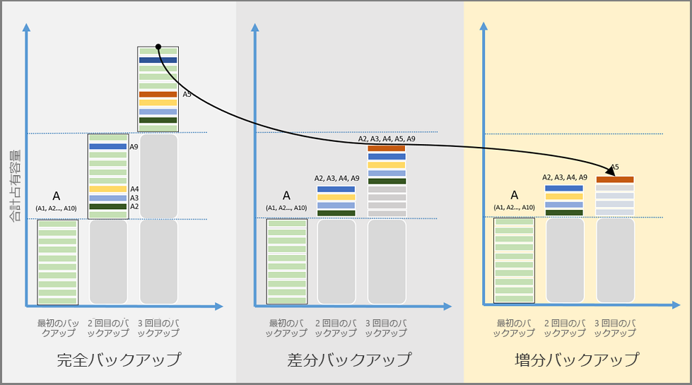

# Azure Backup の各機能の概要
Azure Backup は、Microsoft Cloud のデータのバックアップ (または保護) と復元に使用できる、Azure ベースのサービスです。 Azure Backup では、既存のオンプレミスまたはオフサイトのバックアップ ソリューションを、信頼性の高い、セキュリティで保護された、コスト競争力のあるクラウド ベースのソリューションに置き換えます。 Azure Backup には複数のコンポーネントが用意されており、これを適切なコンピューター、サーバー、またはクラウドにダウンロードしてデプロイします。 デプロイするコンポーネント (エージェント) は、何を保護するかによって決まります。 Azure の Recovery Services コンテナーにデータをバックアップするときは、すべての Azure Backup コンポーネントを使用できます (保護対象がオンプレミス データかクラウドのデータかに関係なく)。 特定のデータを保護するときに使用するコンポーネントについては、[Azure Backup コンポーネントの表](backup-introduction-to-azure-backup.md#which-azure-backup-components-should-i-use) (この記事で後述) を参照してください。

[Azure Backup の概要に関するビデオ](https://azure.microsoft.com/documentation/videos/what-is-azure-backup/)

## Azure Backup を使用する理由
従来のバックアップ ソリューションは、クラウドを、ディスクやテープなどのエンドポイント (静的なストレージ先) のように扱えるように進化してきました。 この方法は簡単ですが、制限もあります。たとえば、基盤となるクラウド プラットフォームを最大限に活用できないため、非効率的でコストの高いソリューションになってしまいます。 また、結局は間違った種類のストレージや不要なストレージに支払いが発生することで高くつくソリューションや、 必要なストレージを必要な分だけ提供できない、管理タスクに時間がかかりすぎる、などの理由で、効率性に欠けるソリューションもあります。 これに対し、Azure Backup には次の利点があります。

**ストレージ管理の自動化** - ハイブリッド環境では、多くの場合、異種混在のストレージが必要です。つまり、ストレージの一部はオンプレミスに、一部はクラウドに存在していなければなりません。 Azure Backup では、オンプレミスのストレージ デバイスを使用するためのコストはありません。 Azure Backup は、従量制課金モデルを使用して、バックアップ ストレージを自動的に割り当てて管理します。 従量制課金とは、使用したストレージについてのみ料金が発生します。 詳細については、[Azure の料金に関する記事](https://azure.microsoft.com/pricing/details/backup)をご覧ください。

**無制限のスケーリング** - Azure Backup では、Azure クラウドの基盤となる機能と無制限のスケールを使用して、高可用性を実現します。その際、保守と監視のオーベーヘッドは発生しません。 アラートを設定して、イベントに関する情報を提供することはできますが、クラウドではデータの高可用性について心配する必要はありません。

**複数のストレージ オプション** - 高可用性によってストレージ レプリケーションが実現します。 Azure Backup には、[ローカル冗長ストレージ](../storage/common/storage-redundancy-lrs.md)と [geo 冗長ストレージ](../storage/common/storage-redundancy-grs.md)の 2 種類のレプリケーションが用意されています。 必要に応じて、いずれかのバックアップ ストレージ オプションを選択します。

* ローカル冗長ストレージ (LRS) では、データセンターのストレージ スケール ユニットにデータが 3 回レプリケートされます (データのコピーが 3 つ作成されます)。 データのすべてのコピーは、同じリージョン内に存在します。 LRS は、ローカル ハードウェアの障害からデータを保護するための低コストのオプションです。

* geo 冗長ストレージ (GRS) は、既定の推奨レプリケーション オプションです。 GRS では、セカンダリ リージョン (ソース データのプライマリの場所から数百マイル離れた場所) にデータがレプリケートされます。 GRS は LRS よりもコストがかかりますが、地域的な障害が発生しても、より高いレベルのデータ持続性が確保されます。

**無制限のデータ転送** - 転送する受信データまたは送信データ量に制限がありません。 転送データに対して料金は発生しません。 ただし、Azure Import/Export サービスを使用して大量のデータをインポートする場合は、受信データに対してコストがかかります。 このコストの詳細については、「[Azure Backup でのオフライン バックアップのワークフロー](backup-azure-backup-import-export.md)」を参照してください。 送信データとは、復元操作中に Recovery Services コンテナーから転送されるデータを指します。

**データの暗号化** - データの暗号化によって、パブリック クラウドでデータを安全に送信および保存できます。 暗号化パスフレーズはローカルに保存されます。転送されたり Azure に保存されたりすることはありません。 データを復元する必要がある場合、暗号化パスフレーズ (キー) を持っているのはご本人のみです。

**アプリケーション整合性バックアップ** - アプリケーション整合性バックアップは、復旧ポイントがバックアップ コピーを復元するために必要なすべてのデータを持っていることを意味します。 Azure Backup は、アプリケーション整合性バックアップを提供することで、追加の修正なしでデータを復元できるようにします。 アプリケーション整合性データの復元により復元時間が短縮され、迅速に実行状態に戻ることができます。

**長期保存** - 短期および長期のデータ保有のために、Recovery Services コンテナーを使用することができます。 Azure では、Recovery Services コンテナーにデータを保持する時間に制限はありません。 任意の期間、コンテナーにデータを保持することができます。 Azure Backup では、保護されているインスタンスごとの復旧ポイントが 9,999 個に制限されます。 この制限によるバックアップのニーズへの影響の説明については、この記事の「[バックアップと保持](backup-introduction-to-azure-backup.md#backup-and-retention)」セクションを参照してください。

## 使用する Azure Backup コンポーネント
次の表で、各 Azure Backup コンポーネントの保護対象に関する情報を確認してください。 

| コンポーネント | メリット | 制限 | 保護対象 | バックアップの保存場所 |
| --- | --- | --- | --- | --- |
| Azure Backup (MARS) エージェント |<li>物理または仮想 Windows OS でファイルとフォルダーをバックアップ (VM はオンプレミスまたは Azure に配置できます)<li>個別のバックアップ サーバーが不要。 |<li>バックアップは 1 日に 3 回 <li>アプリケーション非対応。ファイル、フォルダー、およびボリューム レベルの復元のみ。 <li>  Linux は未サポート。 |<li>ファイル、 <li>フォルダー、 <li>システム状態 |Recovery Services コンテナー |
| System Center DPM |<li>アプリケーション対応スナップショット (VSS)<li>柔軟にバックアップを作成<li>回復の単位 (すべて)<li>Recovery Services コンテナーを使用できる<li>Hyper-V と VMware VM での Linux のサポート <li>DPM 2012 R2 を使用した VMware VM のバックアップと復元 |Oracle ワークロードをバックアップできない。|<li>ファイル、 <li>フォルダー、<li> ボリューム、 <li>VM、<li> アプリケーション、<li> ワークロード <li>システム状態 |<li>Recovery Services コンテナー、<li> ローカルに接続されたディスク、<li>  テープ (オンプレミスのみ) |
| Azure Backup Server |<li>アプリケーション対応スナップショット (VSS)<li>柔軟にバックアップを作成<li>回復の単位 (すべて)<li>Recovery Services コンテナーを使用できる<li>Hyper-V と VMware VM での Linux のサポート<li>VMware VM のバックアップと復元 <li>System Center ライセンスは不要 |<li>Oracle ワークロードをバックアップできない。<li>必ずライブ Azure サブスクリプションが必要<li>テープ バックアップには非対応 |<li>ファイル、 <li>フォルダー、<li> ボリューム、 <li>VM、<li> アプリケーション、<li> ワークロード、 <li>システム状態 |<li>Recovery Services コンテナー、<li> ローカルに接続されたディスク |
| Azure IaaS VM のバックアップ |<li>アプリケーション対応スナップショット (VSS)<li>Windows/Linux のネイティブ バックアップ<li>特定のエージェント インストールが不要<li>バックアップ インフラストラクチャを必要としないファブリック レベルのバックアップ |<li>1 日に 1 回 VM をバックアップ <li>ディスク レベルでのみ VM を復元<li>オンプレミスでバックアップできない |<li>VM、 <li>すべてのディスク (PowerShell を使用) |
Recovery Services コンテナー
 |

## 各コンポーネントのデプロイ シナリオ
| コンポーネント | Azure にデプロイできる? | オンプレミスにデプロイできる? | サポートされているターゲット ストレージ |
| --- | --- | --- | --- |
| Azure Backup (MARS) エージェント |
**はい**
 
Azure Backup エージェントは、Azure で実行されている任意の Windows Server VM にデプロイできます。
 |
**はい**
 
Backup エージェントは、任意の Windows Server VM または物理マシンにデプロイできます。
 |
Recovery Services コンテナー
 |
| System Center DPM |
**はい**

詳細については、[System Center DPM を使用して Azure のワークロードを保護する方法](backup-azure-dpm-introduction.md)に関するページをご覧ください。
 |
**はい**
 
詳細については、[自社のデータセンターのワークロードと VM を保護する方法](https://technet.microsoft.com/system-center-docs/dpm/data-protection-manager)に関するページをご覧ください。
 |
ローカルに接続されたディスク、
 
Recovery Services コンテナー、
 
テープ (オンプレミスのみ)
 |
| Azure Backup Server |
**はい**

詳細については、[Azure Backup Server を使用して Azure のワークロードを保護する方法](backup-azure-microsoft-azure-backup.md)に関するページをご覧ください。
 |
**はい**
 
詳細については、[Azure Backup Server を使用して Azure のワークロードを保護する方法](backup-azure-microsoft-azure-backup.md)に関するページをご覧ください。
 |
ローカルに接続されたディスク、
 
Recovery Services コンテナー
 |
| Azure IaaS VM のバックアップ |
**はい**

Azure のファブリックの一部

[Azure のサービスとしてのインフラストラクチャ (IaaS) 仮想マシンのバックアップ](backup-azure-vms-introduction.md)に特化しています。
 |
**いいえ**
 
System Center DPM を使用して、データセンターの仮想マシンをバックアップします。
 |
Recovery Services コンテナー
 |

## バックアップできるアプリケーションとワークロード
次の表は、Azure Backup を使用して保護できるデータとワークロードのマトリックスを示しています。 Azure Backup ソリューション列には、そのソリューションのデプロイに関するドキュメントへのリンクがあります。 

| データまたはワークロード | ソース環境 | Azure Backup ソリューション |
| --- | --- | --- |
| ファイルとフォルダー |Windows Server |
[Azure Backup エージェント](backup-configure-vault.md)、
 
[System Center DPM](backup-azure-dpm-introduction.md) (+ Azure Backup エージェント)、
 
[Azure Backup Server](backup-azure-microsoft-azure-backup.md) (Azure Backup エージェントを含む)
 |
| ファイルとフォルダー |Windows コンピューター |
[Azure Backup エージェント](backup-configure-vault.md)、
 
[System Center DPM](backup-azure-dpm-introduction.md) (+ Azure Backup エージェント)、
 
[Azure Backup Server](backup-azure-microsoft-azure-backup.md) (Azure Backup エージェントを含む)
 |
| Hyper-V 仮想マシン (Windows) |Windows Server |
[System Center DPM](backup-azure-backup-sql.md) (+ Azure Backup エージェント)、
 
[Azure Backup Server](backup-azure-microsoft-azure-backup.md) (Azure Backup エージェントを含む)
 |
| Hyper-V 仮想マシン (Linux) |Windows Server |
[System Center DPM](backup-azure-backup-sql.md) (+ Azure Backup エージェント)、
 
[Azure Backup Server](backup-azure-microsoft-azure-backup.md) (Azure Backup エージェントを含む)
 |
| VMware 仮想マシン |Windows Server |
[System Center DPM](backup-azure-backup-sql.md) (+ Azure Backup エージェント)、
 
[Azure Backup Server](backup-azure-microsoft-azure-backup.md) (Azure Backup エージェントを含む)
 |
| Microsoft SQL Server |Windows Server |
[System Center DPM](backup-azure-backup-sql.md) (+ Azure Backup エージェント)、
 
[Azure Backup Server](backup-azure-microsoft-azure-backup.md) (Azure Backup エージェントを含む)
 |
| Microsoft SharePoint |Windows Server |
[System Center DPM](backup-azure-backup-sql.md) (+ Azure Backup エージェント)、
 
[Azure Backup Server](backup-azure-microsoft-azure-backup.md) (Azure Backup エージェントを含む)
 |
| Microsoft Exchange |Windows Server |
[System Center DPM](backup-azure-backup-sql.md) (+ Azure Backup エージェント)、
 
[Azure Backup Server](backup-azure-microsoft-azure-backup.md) (Azure Backup エージェントを含む)
 |
| Azure IaaS VM (Windows) |Azure での実行 |[Azure Backup (VM 拡張機能)](backup-azure-vms-introduction.md) |
| Azure IaaS VM (Linux) |Azure での実行 |[Azure Backup (VM 拡張機能)](backup-azure-vms-introduction.md) |

## Linux サポート
次の表は、Linux 対応の Azure Backup コンポーネントを示しています。  

| コンポーネント | Linux (Azure での動作保証済み) サポート |
| --- | --- |
| Azure Backup (MARS) エージェント |なし (Windows ベースのエージェントのみ) |
| System Center DPM |<li> Hyper-V および VMWare 上の Linux Guest VM のファイル整合性バックアップ  <li> Hyper-V および VMWare Linux Guest VM の VM 復元      "*ファイル整合性バックアップは Azure VM では利用できません*"   |
| Azure Backup Server |<li>Hyper-V および VMWare 上の Linux Guest VM のファイル整合性バックアップ  <li> Hyper-V および VMWare Linux Guest VM の VM 復元    "*ファイル整合性バックアップは Azure VM では利用できません*"  |
| Azure IaaS VM のバックアップ |[事前スクリプトおよび事後スクリプト フレームワーク](backup-azure-linux-app-consistent.md)を使用するアプリケーション整合性バックアップ  [詳細なファイルの回復](backup-azure-restore-files-from-vm.md)  [すべての VM ディスクの復元](backup-azure-arm-restore-vms.md#restore-backed-up-disks)  [VM の復元](backup-azure-arm-restore-vms.md#create-a-new-vm-from-a-restore-point) |

## Azure Backup での Premium Storage VM の使用
Azure Backup で、Premium Storage VM が保護されます。 Azure Premium Storage は、入出力集中型ワークロードをサポートすることを目的としたソリッド ステート ドライブ (SSD) ベースのストレージです。 Premium Storage は、仮想マシン (VM) ワークロードに適しています。 Premium Storage の詳細については、[Premium Storage (Azure 仮想マシン ワークロード向けの高パフォーマンス ストレージ)](../virtual-machines/windows/premium-storage.md) に関する記事を参照してください。

### Premium Storage VM のバックアップ
Premium Storage VM をバックアップすると、Backup サービスによって、Premium Storage アカウントに "AzureBackup-" という名前の一時的なステージング場所が作成されます。 このステージング場所のサイズは、復旧ポイントのスナップショットのサイズと同じです。 Premium Storage アカウントに、一時的なステージング場所として使用できる十分な空き領域があることを確認してください。 詳細については、[Premium Storage の制限](../virtual-machines/windows/premium-storage.md#scalability-and-performance-targets)に関する記事をご覧ください。 バックアップ ジョブが完了したら、ステージングの場所は削除されます。 ステージングの場所に使用されるストレージの価格は、すべての [Premium Storage の価格](../virtual-machines/windows/premium-storage.md#pricing-and-billing)に準じます。

> [!NOTE]
> ステージングの場所は変更または編集できません。
>
>

### Premium Storage VM の復元
Premium Storage VM は、Premium Storage と Standard Storage のどちらかに復元することができます。 Premium Storage VM の復旧ポイントを Premium Storage に復元する方法が、一般的なプロセスです。 ただし、VM のファイルのサブセットが必要な場合は、Premium Storage VM の復旧ポイントを Standard Storage に復元する方がコスト効率が良いことがあります。

## Azure Backup によるマネージド ディスク VM の使用
Azure Backup は、マネージド ディスク VM を保護します。 マネージド ディスクにより、仮想マシンのストレージ アカウントの管理から解放され、VM プロビジョニングが大幅に簡略化されます。

### マネージド ディスク VM のバックアップ
マネージド ディスク上の VM のバックアップは、Resource Manager VM のバックアップと同じです。 Azure Portal では、仮想マシン ビューまたは Recovery Services コンテナー ビューから直接バックアップ ジョブを構成できます。 マネージド ディスクに VM をバックアップするには、マネージド ディスク上に構築された RestorePoint コレクションを使用します。 Azure Backup は、Azure Disk Encryption (ADE) を使用して暗号化されたマネージド ディスク VM のバックアップにも対応しています。

### マネージド ディスク VM の復元
Azure Backup では、完全なマネージド ディスク VM を復元するか、マネージド ディスクをストレージ アカウントに復元することができます。 マネージド ディスクは、復元処理中に Azure によって管理されます。 復元プロセスの一環として作成されたストレージ アカウントは、ご自身 (または顧客) が管理します。 管理対象の暗号化された VM を復元する場合は、復元操作を開始する前に VM のキーとシークレットが Key Vault に存在している必要があります。

## 各 Backup コンポーネントの機能
次のセクションの各表は、各 Azure Backup コンポーネントのさまざまな機能の可用性とサポートを簡単にまとめたものです。 追加のサポートや詳細情報については、それぞれの表に続く説明を参照してください。

### Storage
| Feature | Azure Backup エージェント | System Center DPM | Azure Backup Server | Azure IaaS VM のバックアップ |
| --- | --- | --- | --- | --- |
| Recovery Services コンテナー |![[はい]][green] |![はい][green] |![はい][green] |![[はい]][green] |
| Disk Storage | |![[はい]][green] |![[はい]][green] | |
| テープ ストレージ | |![[はい]][green] | | |
| 圧縮  (Recovery Services コンテナー内) |![[はい]][green] |![はい][green] |![[はい]][green] | |
| 増分バックアップ |![[はい]][green] |![はい][green] |![はい][green] |![[はい]][green] |
| ディスクの重複除去 | |![部分的][yellow] |![部分的][yellow] | | |

Recovery Services コンテナーは、すべてのコンポーネントの中で優先されるストレージ ターゲットです。 System Center DPM と Azure Backup Server には、ローカル ディスク コピーを作成するオプションもありますが、 テープ ストレージ デバイスにデータを書き込むオプションがあるのは System Center DPM のみです。

#### 圧縮
必要となるストレージ使用量を削減するために、バックアップが圧縮されます。 VM 拡張機能は、圧縮が行われない唯一のコンポーネントです。 VM 拡張機能では、すべてのバックアップ データがストレージ アカウントから、同じリージョンにある Recovery Services コンテナーにコピーされます。 データの転送時に圧縮は使用されません。 圧縮せずにデータを格納することで、使用されるストレージは若干増えますが、 その復旧ポイントが必要な場合に、復元時間が短縮されます。

#### ディスクの重複除去
System Center DPM または Azure Backup Server を [Hyper-V 仮想マシン](http://blogs.technet.com/b/dpm/archive/2015/01/06/deduplication-of-dpm-storage-reduce-dpm-storage-consumption.aspx)にデプロイすると、重複除去を利用できます。 Windows Server では、重複除去は、バックアップ ストレージとして仮想マシンに接続されている仮想ハード ディスク (VHD) 上で (ホスト レベルで) 実行されます。

> [!NOTE]
> Azure では、どの Backup コンポーネントについても重複除去を使用できません。 System Center DPM と Backup Server が Azure にデプロイされている場合は、VM に接続されているストレージ ディスクを重複除去できません。
>
>

### 増分バックアップの説明
ターゲット ストレージの種類 (ディスク、テープ、Recovery Services コンテナー) にかかわらず、すべての Azure Backup コンポーネントで増分バックアップがサポートされています。 増分バックアップは、前回のバックアップ以降に行われた変更のみを転送対象とすることで、高い保存効率と時間効率を実現します。

#### 完全バックアップ、差分バックアップ、増分バックアップの比較

バックアップ方法の種類によって、ストレージの使用量、目標復旧時間 (RTO)、およびネットワークの使量が異なります。 バックアップの総保有コスト (TCO) を抑えるには、最適なバックアップ ソリューションを選択する方法を理解する必要があります。 次の図は、完全バックアップ、差分バックアップ、および増分バックアップを比較しています。 この図のデータ ソース A は A1 ～ A10 の 10 個の記憶域ブロックで構成され、毎月バックアップが作成されます。 ブロック A2、A3、A4、および A9 は最初の月に変更され、ブロック A5 はその翌月に変更されます。

**完全バックアップ**では、各バックアップのコピーにデータ ソース全体が含まれています。 完全バックアップでは、バックアップ コピーを転送するたびに、大量のネットワーク帯域幅と記憶域が消費されます。

**差分バックアップ**によって格納されるのは、最初の完全バックアップ後に変更されたブロックだけです。このため、ネットワークおよび記憶域の消費量が少なくなります。 差分バックアップでは、変更されていないデータの冗長コピーは保持されませんが、 変更されていないデータ ブロックが以降のバックアップに転送されたうえで、格納されるため、効率的ではありません。 この例では 2 か月目に、変更されたブロック A2、A3、A4、および A9 がバックアップされます。 3 か月目は、既にバックアップ済みのブロックが再度バックアップされたうえで、変更された A5 がバックアップされます。 変更されたブロックは、次回完全バックアップが行われるまでバックアップされ続けます。

**増分バックアップ**では、前回のバックアップ以降に変更されたデータ ブロックのみが格納されるため、記憶域とネットワークで高い効率性が実現します。 増分バックアップでは、完全バックアップを定期的に実行する必要はありません。 この例では、最初の月に完全バックアップが行われた後、A2、A3、A4、および A9 が変更済みとしてマークされ、2 か月目に転送されます。 3 か月目は、変更された A5 のみがマークされ、転送されます。 データ移動が少ないためストレージおよびネットワーク リソースを節約でき、TCO が削減されます。

### セキュリティ
| Feature | Azure Backup エージェント | System Center DPM | Azure Backup Server | Azure IaaS VM のバックアップ |
| --- | --- | --- | --- | --- |
| ネットワークのセキュリティ  (対 Azure) |![[はい]][green] |![はい][green] |![はい][green] |![[はい]][green] |
| データのセキュリティ  (Azure 内) |![[はい]][green] |![はい][green] |![はい][green] |![[はい]][green] |

#### ネットワークのセキュリティ
サーバーから Recovery Services バックアップ コンテナーまでのすべてのバックアップ トラフィックは、Advanced Encryption Standard 256 を使用して暗号化されます。 バックアップ データは、セキュリティで保護された HTTPS リンク上で送信されます。 また、バックアップ データは、暗号化された形式で Recovery Services コンテナーにも格納されます。 このデータのロックを解除するパスフレーズを持っているのは、Azure のお客様のみです。 マイクロソフトは、どの時点でもバックアップ データの暗号化を解除できせん。

> [!WARNING]
> Recovery Services コンテナーを作成したら、暗号化キーにアクセスできるのはご本人だけです。 マイクロソフトには暗号化キーのコピーはありません。また、キーにアクセスすることもできません。 ユーザーがキーを紛失した場合、マイクロソフトはバックアップ データを復旧できません。
>
>

#### データのセキュリティ
Azure VM のバックアップの場合は、仮想マシン " *内* " で暗号化を設定する必要があります。 Azure Backup は Azure Disk Encryption をサポートしており、Windows 仮想マシンでは BitLocker が、Linux 仮想マシンでは **dm-crypt** が使用されます。 Azure Backup のバックエンドでは [Azure Storage Service Encryption](../storage/common/storage-service-encryption.md) が使用されており、これによって保存データが保護されます。

### ネットワーク
| Feature | Azure Backup エージェント | System Center DPM | Azure Backup Server | Azure IaaS VM のバックアップ |
| --- | --- | --- | --- | --- |
| ネットワーク圧縮  (対**バックアップ サーバー**) | |![[はい]][green] |![[はい]][green] | |
| ネットワーク圧縮  (対 **Recovery Services コンテナー**) |![[はい]][green] |![はい][green] |![[はい]][green] | |
| ネットワーク プロトコル  (対**バックアップ サーバー**) | |TCP |TCP | |
| ネットワーク プロトコル  (対 **Recovery Services コンテナー**) |HTTPS |HTTPS |HTTPS |HTTPS |

(IaaS VM 上の) VM 拡張機能はデータを Azure Storage アカウントからストレージ ネットワーク経由で直接読み取ります。したがって、このトラフィックを圧縮する必要はありません。

セカンダリ バックアップ サーバーとして System Center DPM サーバーまたは Azure Backup Server を使用する場合は、プライマリ サーバーからバックアップ サーバーに移動するデータを圧縮します。 DPM または Azure Backup Server にバックアップする前にデータを圧縮すると、帯域幅を節約できます。

#### ネットワークのスロットル
Azure Backup エージェントには、データ転送時のネットワーク帯域幅の使用方法を制御できる、ネットワーク スロットル機能が用意されています。 業務時間中に実行が必要なデータのバックアップ処理が他のインターネット トラフィックに干渉しないようにする必要がある場合などに効果を発揮します。 データ転送のスロットルはバックアップと復元のアクティビティに適用されます。

## バックアップと保持

Azure Backup には、*保護されているインスタンス*につき復旧ポイント (バックアップ コピーまたはスナップショットとも呼ばれます) が 9,999 個という制限があります。 保護されているインスタンスとは、データを Azure にバックアップするように構成されているコンピューター、サーバー (物理または仮想)、またはワークロードです。 詳細については、「[保護されているインスタンスとは](backup-introduction-to-azure-backup.md#what-is-a-protected-instance)」セクションを参照してください。 インスタンスは、データのバックアップ コピーが保存されると保護されます。 データのバックアップ コピーは、保護することです。 ソース データが失われた場合や破損した場合は、バックアップ コピーによってソース データを復元できることがあります。 次の表は、コンポーネントごとの最大バックアップ頻度を示します。 バックアップ ポリシーの構成では、復旧ポイントを使用する頻度を決定します。 たとえば、日ごとに復旧ポイントを作成すると、期限切れになるまで 27 年間復旧ポイントを保持できます。月ごとの復旧ポイントを取得すると、期限切れになるまで 833 年間復旧ポイントを保持できます。Backup サービスによって、復旧ポイントに有効期限が設定されることはありません。

|  | Azure Backup エージェント | System Center DPM | Azure Backup Server | Azure IaaS VM のバックアップ |
| --- | --- | --- | --- | --- |
| バックアップ頻度  (対 Recovery Services コンテナー) |3 バックアップ/日 |2 バックアップ/日 |2 バックアップ/日 |1 バックアップ/日 |
| バックアップ頻度  (対ディスク) |適用不可 |<li>SQL Server の場合は 15 分ごと <li>他のワークロードの場合は 1 時間ごと |<li>SQL Server の場合は 15 分ごと <li>他のワークロードの場合は 1 時間ごと
 |適用不可 |
| 保持オプション |毎日、毎週、毎月、毎年 |毎日、毎週、毎月、毎年 |毎日、毎週、毎月、毎年 |毎日、毎週、毎月、毎年 |
| 保護されているインスタンスあたりの復旧ポイントの最大数 |9999|9999|9999|9999|
| 最大保有期間 |バックアップ頻度次第 |バックアップ頻度次第 |バックアップ頻度次第 |バックアップ頻度次第 |
| ローカル ディスクの回復ポイント |適用不可 |<li>ファイル サーバーの場合 64 個、<li>アプリケーション サーバーの場合 448 個 |<li>ファイル サーバーの場合 64 個、<li>アプリケーション サーバーの場合 448 個 |適用不可 |
| テープの回復ポイント |適用不可 |無制限 |適用不可 |適用不可 |

## 保護されているインスタンスとは
保護されているインスタンスとは、Azure にバックアップするように構成されている Windows コンピューター、サーバー (物理または仮想)、または SQL データベースを総称したものです。 インスタンスは、コンピューター、サーバー、またはデータベースのバックアップ ポリシーを構成し、データのバックアップ コピーを作成すると保護されます。 その保護されているインスタンスのバックアップ データのそれ以降のコピー (復旧ポイントと呼ばれます) により、使用されるストレージの量が増加します。 保護されているインスタンスに作成できる復旧ポイントは最大 9,999 個です。 ストレージから復旧ポイントを削除すると、9,999 個の復旧ポイントの合計に対してカウントされません。
保護されているインスタンスの一般的な例には、仮想マシン、アプリケーション サーバー、データベースのほか、Windows オペレーティング システムを実行しているパーソナル コンピューターがあります。 例: 

* Hyper-V または Azure IaaS ハイパーバイザー ファブリックを実行している仮想マシン。 仮想マシンのゲスト オペレーティング システムには、Windows Server または Linux を指定できます。
* アプリケーション サーバー。アプリケーション サーバーには、Windows Server と、バックアップする必要があるデータを含むワークロードを実行している物理マシンまたは仮想マシンを指定できます。 一般的なワークロードには、Microsoft SQL Server、Microsoft Exchange Server、Microsoft SharePoint Server、Windows Server のファイル サーバー ロールがあります。 これらのワークロードをバックアップするには、System Center Data Protection Manager (DPM) または Azure Backup Server が必要です。
* Windows オペレーティング システムを実行しているパーソナル コンピューター、ワークステーション、またはノートパソコン。

## Recovery Services コンテナーとは
Recovery Services コンテナーは、バックアップ コピー、復旧ポイント、バックアップ ポリシーなどのデータを保持するために使用される、Azure のオンライン ストレージ エンティティです。 Recovery Services コンテナーを使用して、Azure サービスとオンプレミス サーバーおよびワークステーションのバックアップ データを保持することができます。 Recovery Services コンテナーでは、管理オーバーヘッドを最小限に抑えながら、バックアップ データを簡単に整理できます。 各 Azure サブスクリプション内に、Azure リージョンあたり最大 500 個の Recovery Services コンテナーを作成できます。 データの格納先を検討する場合、すべてのリージョンが同じではありません。 リージョンの組み合わせと追加のストレージに関する考慮事項については、「[geo 冗長ストレージ](../storage/common/storage-redundancy-grs.md)」を参照してください。

Azure Service Manager に基づく Backup コンテナーは、コンテナーの最初のバージョンでした。 Azure Resource Manager モデル機能が追加された Recovery Services コンテナーは、コンテナーの 2 番目のバージョンです。 機能の違いの完全な説明については、「[Recovery Services コンテナーの概要](backup-azure-recovery-services-vault-overview.md)」の記事を参照してください。 Backup コンテナーを作成することはできなくなり、既存のすべての Backup コンテナーが Recovery Services コンテナーにアップグレードされました。 Azure Portal を使用して、Recovery Services コンテナーにアップグレードされたコンテナーを管理することができます。

## Azure Backup と Azure Site Recovery はどのように違いますか
Backup と Azure Site Recovery は両方とも、データをバックアップして、そのデータを復元できるとうい点で関連していますが、 これらのサービスは、業務にビジネス継続性とディザスター リカバリーの機能を提供するために、異なる目的で使用されます。 より細かいレベルでデータの保護と復元を行うには、Azure Backup を使用します。 たとえば、ノート PC のプレゼンテーションが破損した場合は、Azure Backup を使用して、プレゼンテーションを復元します。 VM 上の構成とデータを別のデータセンターにレプリケートする場合は、Azure Site Recovery を使用します。

Azure Backup は、オンプレミスのデータとクラウドのデータを保護します。 Azure Site Recovery は、仮想マシンと物理サーバーのレプリケーション、フェールオーバー、フェールバックを調整します。 ディザスター リカバリー ソリューションでは、データの安全性と復元可能性を維持し (Backup)、" *さらに* "、障害が発生したときにワークロードの可用性を維持する (Site Recovery) 必要があるため、どちらのサービスも重要です。

バックアップと障害復旧に関する意思決定を行うにあたっては、次の概念が役立ちます。

| 概念 | 詳細 | Backup | ディザスター リカバリー (DR) |
| --- | --- | --- | --- |
| 目標復旧時点 (RPO) |復旧を行う必要がある場合に許容されるデータ損失の量です。 |バックアップ ソリューションの許容されるRPO には幅があります。 仮想マシンのバックアップの RPO は通常 1 日であるのに対し、データベースのバックアップの RPO は最低 15 分です。 |障害復旧ソリューションでは RPO が低くなります。 DR コピーは、数秒遅れまたは数分遅れのことがあります。 |
| 目標復旧時間 (RTO) |復旧または復元の完了に要する時間です。 |RPO が大きくなるほど、一般的にはバックアップ ソリューションで処理が必要なデータ量が増えるため、RTO は長くなります。 たとえば、オフサイトの場所からテープを輸送するのにかかる時間によっては、テープからのデータの復元に日単位の時間を要する場合があります。 |障害復旧ソリューションは、よりソースと同期されているため、RTO は短くなります。 必要な変更は少数です。 |
| 保持 |データを保存する必要がある期間 |運用の復旧を必要とするシナリオ (データの破損、不注意によるファイルの削除、OS の障害) では、通常、バックアップ データの保持期間は最大 30 日です。 コンプライアンスの観点から、月単位または年単位でデータを保存することが必要になる場合があります。 バックアップ データは、このような場合のアーカイブに最適です。 |障害復旧には運用復旧データのみが必要となり、実行には通常、数時間から最大で 1 日かかります。 DR ソリューションでは詳細なデータ キャプチャが使用されるため、DR データを使用する長期的な保持はお勧めできません。 |

## 次の手順
Windows Server でのデータ保護の詳細な段階的手順、または Azure での仮想マシン (VM) の保護については、次のいずれかのチュートリアルを参照してください。

* [ファイルとフォルダーのバックアップ](backup-try-azure-backup-in-10-mins.md)
* [Azure Virtual Machines のバックアップ](backup-azure-vms-first-look-arm.md)

その他のワークロードの保護の詳細については、次のいずれかの記事を参照してください。

* [Windows Server のバックアップ](backup-configure-vault.md)
* [アプリケーション ワークロードのバックアップ](backup-azure-microsoft-azure-backup.md)
* [Azure IaaS VM のバックアップ](backup-azure-arm-vms-prepare.md)

[green]: ./media/backup-introduction-to-azure-backup/green.png
[yellow]: ./media/backup-introduction-to-azure-backup/yellow.png
[red]: ./media/backup-introduction-to-azure-backup/red.png
