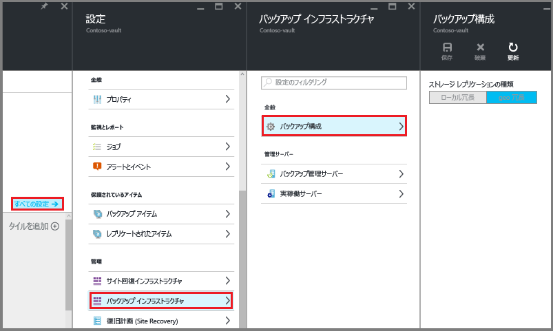

# <a name="install-azure-backup-server-on-azure-stack"></a>Azure Stack への Azure Backup Server のインストール

この記事では、Azure Backup Server を Azure Stack にインストールする方法について説明します。 Azure Backup Server を使用すると、Azure Stack で実行されている仮想マシンなどのサービスとしてのインフラストラクチャ (IaaS) のワークロードを保護できます。 Azure Backup Server を使用してワークロードを保護する利点は、すべてのワークロードの保護を単一のコンソールから管理できる点です。

> [!NOTE]
> セキュリティ機能の詳細については、[Azure Backup のセキュリティ機能のドキュメント](backup-azure-security-feature.md)を参照してください。
>

## <a name="azure-backup-server-protection-matrix"></a>Azure Backup Server の保護マトリックス
Azure Backup Server は、以下の Azure Stack 仮想マシン ワークロードを保護します。

| 保護されたデータ ソース | 保護と回復 |
| --------------------- | ----------------------- |
| Windows Server Semi Annual Channel - Datacenter/Enterprise/Standard | ボリューム、ファイル、フォルダー |
| Windows Server 2016 - Datacenter/Enterprise/Standard | ボリューム、ファイル、フォルダー |
| Windows Server 2012 R2 - Datacenter/Enterprise/Standard | ボリューム、ファイル、フォルダー |
| Windows Server 2012 - Datacenter/Entprise/Standard | ボリューム、ファイル、フォルダー |
| Windows Server 2008 R2 - Datacenter/Enterprise/Standard | ボリューム、ファイル、フォルダー |
| SQL Server 2016 | データベース |
| SQL Server 2014 | データベース |
| SQL Server 2012 SP1 | データベース |
| SharePoint 2016 | ファーム、データベース、フロントエンド、Web サーバー |
| SharePoint 2013 | ファーム、データベース、フロントエンド、Web サーバー |
| SharePoint 2010 | ファーム、データベース、フロントエンド、Web サーバー |

## <a name="prerequisites-for-the-azure-backup-server-environment"></a>Azure Backup Server 環境の前提条件

Azure Stack 環境に Azure Backup Server をインストールする際には、このセクションのレコメンデーションを参考にしてください。 Azure Backup Server インストーラーは、環境内に必要な前提条件があるかどうかをチェックしますが、インストールする前に準備することで時間を節約できます。

### <a name="determining-size-of-virtual-machine"></a>仮想マシンのサイズを決める
Azure Backup 仮想マシン上で Azure Backup Server を実行するには、サイズ A2 以上を使用します。 仮想マシン サイズを選択する場合、[Azure Stack VM サイズ計算ツール](https://www.microsoft.com/download/details.aspx?id=56832)をダウンロードすることをお勧めします。

### <a name="virtual-networks-on-azure-stack-virtual-machines"></a>Azure Stack 仮想マシン上の仮想ネットワーク
Azure Stack ワークロードで使用されるすべての仮想マシンは、同じ Azure 仮想ネットワークと Azure サブスクリプションに属している必要があります。

### <a name="azure-backup-server-vm-performance"></a>Azure Backup Server VM のパフォーマンス
他の仮想マシンと共有する場合、ストレージ アカウントのサイズと IOPS の制限は、Azure Backup Server の VM のパフォーマンスに影響を与えます。 そのため、Azure Backup Server 仮想マシンには別のストレージ アカウントを使用するようにします。 Azure Backup Server 上で実行される Azure Backup エージェントには、次のための一時記憶域が必要です。
- 自身の使用 (キャッシュ場所)、
- クラウドから復元されたデータ (ローカル ステージング領域)

### <a name="configuring-azure-backup-temporary-disk-storage"></a>Azure Backup の一時ディスク記憶域を構成する
各 Azure Stack 仮想マシンには一時的なディスク記憶域があり、ユーザーはボリューム `D:\` として利用できます。 Azure Backup が必要とするローカルのステージング領域は、`D:\` に内に配置するように構成できます。また、キャッシュ場所は `C:\` に配置できます。 このようにすると、Azure Backup Server 仮想マシンに接続されたデータ ディスクから記憶域を切り離す必要がありません。

### <a name="storing-backup-data-on-local-disk-and-in-azure"></a>ローカル ディスクと Azure にバックアップ データを保存する
Azure Backup Server は、運用の復旧のために、仮想マシンに接続された Azure ディスクにバックアップ データを保存します。 ディスクと記憶域スペースが仮想マシンに接続されると、記憶域は Azure Backup Server で管理されます。 バックアップ データ記憶域のサイズは、各 [Azure Stack 仮想マシン](../azure-stack/user/azure-stack-storage-overview.md)に接続されているディスクの数とサイズによって変わります。 Azure Stack VM の各サイズには、仮想マシンに接続できるディスクの最大数があります。 たとえば、A2 は 4 ディスクです。 A3 は 8 ディスクです。 A4 は 16 ディスクです。 ここでも、ディスクのサイズと数によってバックアップ ストレージ プール全体が決まります。

> [!IMPORTANT]
> Azure Backup Server に接続されたディスク上に、5 日間を超える運用の復旧 (バックアップ) データを保持することは推奨**されません**。
>

バックアップ データを Azure に保存すると、Azure Stack 上のバックアップ インフラストラクチャが減ります。 5 日間を超えるデータの場合は、Azure に保存するようにしてください。

Azure にバックアップ データを保存するには、Recovery Services コンテナーを作成または使用します。 Azure Backup Server ワークロードのバックアップを準備するときに、[Recovery Services コンテナーを構成](backup-azure-microsoft-azure-backup.md#create-a-recovery-services-vault)します。 構成が完了した後は、バックアップ ジョブが実行されるたびに、コンテナーに復旧ポイントが作成されます。 各 Recovery Services コンテナーは、最大 9999 個の復旧ポイントを保持します。 作成された復旧ポイントの数と保持期間に応じて、バックアップ データを長年にわたって保持することができます。 たとえば、毎月の復旧ポイントを作成して 5 年間保持することができます。
 
### <a name="scaling-deployment"></a>展開のスケーリング
展開をスケーリングするには、次の選択肢があります。
  - スケールアップ - Azure Backup Server 仮想マシンのサイズを A シリーズから D シリーズに増やし、[Azure Stack 仮想マシンの手順に従って](../azure-stack/user/azure-stack-manage-vm-disks.md)ローカル記憶域を増やします。
  - データをオフロードする - 古いデータを Azure に送信し、Azure Backup Server に接続された記憶域に最新のデータのみを保持します。
  - スケールアウト - Azure Backup Server をさらに追加してワークロードを保護します。

### <a name="net-framework"></a>.NET Framework

仮想マシンに .NET Framework 3.5 SP1 以上がインストールされている必要があります。

### <a name="joining-a-domain"></a>ドメインを参加させる

Azure Backup Server の仮想マシンは、ドメインに参加させる必要があります。 管理者特権を持つドメイン ユーザーは、仮想マシン上に Azure Backup Server をインストールする必要があります。

## <a name="using-an-iaas-vm-in-azure-stack"></a>Azure Stack で IaaS VM を使用する

Azure Backup Server のサーバーを選ぶときは、Windows Server 2012 R2 Datacenter または Windows Server 2016 Datacenter のギャラリー イメージから開始します。 推奨される仮想マシンの作成方法については、[Azure Portal で初めての Windows 仮想マシンを作成する方法](../virtual-machines/virtual-machines-windows-hero-tutorial.md?toc=%2fazure%2fvirtual-machines%2fwindows%2ftoc.json)に関する記事をご覧ください。 サーバーの仮想マシン (VM) に推奨される最小要件は A2 Standard (2 コア、3.5 GB RAM) です。

Azure Backup Server を使用したワークロードの保護には、数多くの注意点があります。 これらの注意点については、「 [Azure Virtual Machine として DPM をインストールする](https://technet.microsoft.com/library/jj852163.aspx)」の記事で説明されています。 マシンをデプロイする前に、この記事によく目を通してください。

> [!NOTE]
> Azure Backup Server は、単一目的の専用の仮想マシンで動作するように設計されています。 Azure Backup Server を次の場所にインストールすることはできません。
> - ドメイン コントローラーとして実行されているコンピューター
> - アプリケーション サーバー ロールがインストールされているコンピューター
> - Exchange Server が実行されているコンピューター
> - クラスターのノードであるコンピューター

Azure Backup Server は、常にドメインに参加させる必要があります。 Azure Backup Server を別のドメインに移動する必要がある場合は、まず Azure Backup Server をインストールし、次にそのサーバーを新しいドメインに参加させます。 Azure Backup Server をデプロイした後は、新しいドメインに移動することはできなくなります。

[!INCLUDE [backup-create-rs-vault.md](../../includes/backup-create-rs-vault.md)]

### <a name="set-storage-replication"></a>ストレージ レプリケーションの設定

Recovery Services コンテナーのストレージ レプリケーション オプションでは、geo 冗長ストレージとローカル冗長ストレージのどちらかを選択できます。 既定では、Recovery Services コンテナーは geo 冗長ストレージを使用します。 このコンテナーがプライマリ コンテナーの場合は、ストレージ オプションの設定を geo 冗長ストレージのままにします。 永続性を多少犠牲にしても低コストなバックアップが必要な場合は、ローカル冗長ストレージを選択します。 [geo 冗長](../storage/common/storage-redundancy-grs.md)ストレージ オプションと[ローカル冗長](../storage/common/storage-redundancy-lrs.md)ストレージ オプションの詳細については、[Azure Storage のレプリケーションの概要](../storage/common/storage-redundancy.md)に関する記事をご覧ください。

ストレージ レプリケーション設定を編集するには、次の手順を実行します。

1. コンテナーを選択して、コンテナーのダッシュボードと [設定] メニューを開きます。 **[設定]** メニューが開かない場合は、コンテナーのダッシュボードで **[すべての設定]** をクリックします。
2. **[設定]** メニューで、**[バックアップ インフラストラクチャ]** > **[バックアップ構成]** をクリックして、**[バックアップ構成]** メニューを開きます。 **[バックアップ構成]** メニューで、コンテナーのストレージ レプリケーション オプションを選択します。

    

## <a name="download-azure-backup-server-installer"></a>Azure Backup Server インストーラーをダウンロードする

Azure Backup Server インストーラーをダウンロードする方法は 2 つあります。 Azure Backup Server インストーラーは、[Microsoft ダウンロード センター](https://www.microsoft.com/en-us/download/details.aspx?id=55269)からダウンロードできます。 Azure Backup Server インストーラーは Recovery Services コンテナーの構成中にダウンロードすることもできます。 次の手順は、Recovery Services コンテナーの構成中に Azure Portal からインストーラーをダウンロードする方法について説明します。

1. Azure Stack 仮想マシンから、[Azure Portal 内の Azure サブスクリプションにサインイン](https://portal.azure.com/)します。
2. 左側のメニューで、**[すべてのサービス]** を選択します。

    ![メイン メニューの [すべてのサービス] オプションを選択する](./media/backup-mabs-install-azure-stack/click-all-services.png)

3. **[すべてのサービス]** ダイアログ に、「*Recovery Services*」と入力します。 入力を開始すると、リソースのリストが絞り込まれます。 **[Recovery Services コンテナー]** が表示されたら、それを選択します。

    ![[すべてのサービス] ダイアログに「Recovery Services」と入力する](./media/backup-mabs-install-azure-stack/all-services.png)

    サブスクリプションに Recovery Services コンテナーの一覧が表示されます。

4. Recovery Services コンテナーの一覧からコンテナーを選択し、そのダッシュボードを開きます。

    ![[すべてのサービス] ダイアログに「Recovery Services」と入力する](./media/backup-mabs-install-azure-stack/rs-vault-dashboard.png)

5. コンテナーの [作業の開始] メニューで、**[バックアップ]** をクリックして [作業の開始] ウィザードを開きます。

    

    バックアップ メニューが開きます。

    

6. バックアップ メニューの **[Where is your workload running]\(ワークロードはどこで実行されていますか\)** メニューで、**[オンプレミス]** を選択します。 **[What do you want to backup?]\(何をバックアップしますか?\)** ドロップダウン メニューで、Azure Backup Server を使用して保護するワークロードを選択します。 選択するワークロードがわからない場合は、**[Hyper-V 仮想マシン]** をクリックし、**[インフラストラクチャの準備]** をクリックします。

    

    **[インフラストラクチャの準備]** メニューが開きます。

7. **[インフラストラクチャの準備]** メニューで、**[ダウンロード]** をクリックして Azure Backup Server のインストール ファイルをダウンロードする Web ページを開きます。

    

    Azure Backup Server のダウンロード可能なファイルをホストする Microsoft Web ページが開きます。

8. Microsoft Azure Backup Server のダウンロード ページで、言語を選択し、**[ダウンロード]** をクリックします。

    

9. Azure Backup Server インストーラーは、8 つのファイル (インストーラーと 7 つの .bin ファイル) で構成されています。 **[ファイル名]** をオンにし、必要なすべてのファイルを選択して、**[次へ]** をクリックします。 すべてのファイルを同じフォルダーにダウンロードします。

    

    すべてのインストール ファイルのダウンロード サイズは 3 GB を超えています。 10-Mbps のダウンロード リンクでは、すべてのインストール ファイルがダウンロードされるまで最大で 60 分かかる場合があります。 ファイルは指定したダウンロード場所にダウンロードされます。

## <a name="extract-azure-backup-server-install-files"></a>Azure Backup Server のインストール ファイルを展開する

すべてのファイルを Azure Stack 仮想マシンにダウンロードした後は、ダウンロード場所に移動します。 Azure Backup Server をインストールする最初のフェーズは、ファイルを展開することです。


1. インストールを開始するには、ダウンロードされたファイルの一覧から、**MicrosoftAzureBackupserverInstaller.exe** をクリックします。

    > [!WARNING]
    > セットアップ ファイルを抽出するには、少なくとも 4 GB の空き領域が必要です。
    >

2. Azure Backup Server ウィザードで、**[次へ]** をクリックして続行します。

    

3. Azure Backup Server のファイルのパスを選択し、**[次へ]** をクリックします。

   

4. 展開場所を確認し、**[展開]** をクリックします。

   

5. ウィザードがファイルを展開し、インストール プロセスを準備します。

   

6. 展開プロセスが完了したら、**[完了]** をクリックします。 既定では、**Execute setup.exe** が選択されています。 **[完了]** をクリックすると、Setup.exe が Microsoft Azure Backup Server を指定した場所にインストールします。

   

## <a name="install-the-software-package"></a>ソフトウェア パッケージをインストールする

前の手順で、**[完了]** をクリックして展開フェーズを終了し、Azure Backup Server のセットアップ ウィザードを起動しました。


Azure Backup Server は Data Protection Manager とコードを共有します。 Azure Backup Server インストーラーに Data Protection Manager と DPM への参照が表示されます。 Azure Backup Server と Data Protection Manager の別個の製品ですが、密接に関連しています。

1. セットアップ ウィザードを起動するには、**[Microsoft Azure Backup Server]** をクリックします。

   

2. **[ようこそ]** 画面で、**[次へ]** をクリックします。

    

3. **[前提条件の確認]** 画面で **[確認]** をクリックし、Azure Backup Server のハードウェアとソフトウェアの前提条件が満たされているかどうかを確認します。

    

    お使いの環境が必要な前提条件を満たしている場合、マシンが要件を満たしていることを示すメッセージが表示されます。 **[次へ]** をクリックします。  

    

    お使いの環境が必要な前提条件を満たしていない場合、問題のある部分が示されます。 満たしていない前提条件は、DpmSetup.log にも表示されます。 前提条件のエラーを解決し、**[再確認]** を実行します。 すべての前提条件が満たされるまで、インストールを続行できません。

    

4. Microsoft Azure Backup Server には、SQL Server が必要です。 Azure Backup Server のインストール パッケージには、適切な SQL Server バイナリがバンドルされています。 自分で用意した SQL のインストールを使用することもできます。 ただし、SQL Server の新しいインスタンスの追加はインストーラーに任せることをお勧めします。 選択内容がお使いの環境で機能することを確認するには、**[確認してインストール]** をクリックします。

   > [!NOTE]
   > Azure Backup Server は、リモートの SQL Server インスタンスでは動作しません。 Azure Backup Server で使用されるインスタンスはローカルである必要があります。
   >

    

    確認後、仮想マシンに Azure Backup Server をインストールするために必要な前提条件がある場合は、**[次へ]** をクリックします。

    

    エラーが発生し、コンピューターの再起動を推奨された場合は、コンピューターを再起動してください。 マシンを再起動後、インストーラーを再起動し、**[SQL の設定]** 画面で **[再確認]** をクリックします。

5. **[インストールの設定]** で、Microsoft Azure Backup Server のファイルをインストールする場所を指定し、**[次へ]** をクリックします。

    

    Azure にバックアップするにはスクラッチ場所が必要です。 スクラッチ場所のサイズが、Azure にバックアップする予定のデータの 5% 以上であることを確認します。 ディスクを保護するために、インストールが完了した後で個別のディスクを構成する必要があります。 記憶域プールの詳細については、「 [記憶域プールおよびディスク記憶域の構成](https://technet.microsoft.com/library/hh758075.aspx)」を参照してください。

6. **[セキュリティの設定]** で、制限付きのローカル ユーザー アカウント用に強力なパスワードを指定し、**[次へ]** をクリックします。

    

7. **[Microsoft Update のオプトイン]** 画面で、*Microsoft Update* を使用するかどうかを選択し、更新プログラムを確認して **[次へ]** をクリックします。

   > [!NOTE]
   > Windows Update を Microsoft Update にリダイレクトすることをお勧めします。Microsoft Update は、Windows と Microsoft Azure Backup Server などのその他の製品のセキュリティ更新プログラムと重要な更新プログラムを提供しています。
   >

    

8. *[設定の概要]* を確認し、 **[インストール]** をクリックします。

    

    Azure Backup Server のインストールが完了すると、インストーラーはすぐに Microsoft Azure Recovery Services エージェントのインストーラーを起動します。

9. Microsoft Azure Recovery Services エージェントのインストーラーが開き、インターネット接続を確認します。 インターネット接続が利用可能な場合は、インストールを続行します。 接続がない場合は、インターネットに接続するプロキシの詳細を指定します。 プロキシ設定を指定したら、**[次へ]** をクリックします。

    

10. Microsoft Azure Recovery Services エージェントをインストールするには、**[インストール]** をクリックします。

    

    Microsoft Azure Recovery Services エージェントは Azure Backup エージェントとも呼ばれ、Azure Backup Server を Recovery Services コンテナーに構成します。 構成が完了すると、Azure Backup Server は常に同じ Recovery Services コンテナーにデータをバックアップします。

11. Microsoft Azure Recovery Services エージェントのインストールが完了したら、**[次へ]** をクリックして次のフェーズを開始し、Azure Backup Server を Recovery Services コンテナーに登録します。

    

    インストーラーが **[サーバーの登録] ウィザード**を起動します。

12. Azure サブスクリプションと Recovery Services コンテナーに切り替えます。 **[インフラストラクチャの準備]** メニューで、**[ダウンロード]** をクリックして資格情報コンテナーの資格情報をダウンロードします。 手順 2 の **[ダウンロード]** ボタンがアクティブでない場合は、**[Already downloaded or using the latest Azure Backup Server installation]\(ダウンロード済みまたは Azure Backup Server の最新インストールを使用する\)** を選択してボタンをアクティブにします。 資格情報コンテナーの資格情報は、ダウンロードを格納する場所にダウンロードします。 次の手順に必要であるため、この場所を把握しておいてください。

    

13. **[資格情報コンテナーの識別]** メニューで、**[参照]** をクリックして Recovery Services の資格情報コンテナーの資格情報を見つけます。

    

    **[資格情報コンテナーの資格情報の選択]** ダイアログで、ダウンロード場所に移動し、資格情報コンテナーの資格情報を選択して、**[開く]** をクリックします。

    資格情報へのパスは、[資格情報コンテナーの識別] メニューに表示されます。 **[次へ]** をクリックして [暗号化の設定] に進みます。

14. **[暗号化の設定]** ダイアログ ボックスで、バックアップの暗号化のパスフレーズと、そのパスフレーズを格納する場所を指定して、**[次へ]** をクリックします。

    

    自分で用意したパスフレーズを指定することも、パスフレーズ ジェネレーターを使用して作成することもできます。 パスフレーズはご自身で管理してください。Microsoft はこのパスフレーズの保存や管理を行いません。 災害に備えて、パスフレーズを利用しやすい場所に保管してください。

    **[次へ]** をクリックすると、Azure Backup Server が Recovery Services コンテナーに登録されます。 インストーラーでは引き続き SQL Server と Azure Backup Server のインストールが行われます。

    

15. インストーラーが終了すると、[状態] にすべてのソフトウェアが正常にインストールされたことが表示されます。

    

    インストールが完了すると、Azure Backup Server コンソールと Azure Backup Server の PowerShell アイコンがサーバーのデスクトップに作成されます。

## <a name="add-backup-storage"></a>Backup ストレージの追加

一次バックアップ コピーは、Azure Backup Server マシンに接続されているストレージに保持されます。 ディスクの追加の詳細については、[Modern Backup Storage の追加](https://docs.microsoft.com/en-us/system-center/dpm/add-storage?view=sc-dpm-1801)に関するページを参照してください。

> [!NOTE]
> Azure にデータを送信する場合でも、Backup ストレージを追加する必要があります。 Azure Backup Server のアーキテクチャでは、Azure Backup コンテナーにはデータの " *2 番目の* " コピーが保持され、最初の (必須の) バックアップ コピーはローカル ストレージに保持されます。
>
>

## <a name="network-connectivity"></a>ネットワーク接続

Azure Backup Server が正常に動作するためには、Azure Backup サービスに接続されている必要があります。 マシンが Azure に接続されているかどうかを確認するには、Azure Backup Server PowerShell コンソールで ```Get-DPMCloudConnection``` コマンドレットを使用します。 コマンドレットの出力が TRUE の場合、マシンは接続されていますが、それ以外の場合は接続されていません。

同時に、Azure のサブスクリプションが正常な状態である必要があります。 サブスクリプションの状態を確認および管理するには、[サブスクリプション ポータル](https://ms.portal.azure.com/#blade/Microsoft_Azure_Billing/SubscriptionsBlade)にログインします。

Azure への接続と Azure サブスクリプションの状態がわかれば、以下の表から、提供されるバックアップ/復元機能に対する影響を確認することができます。

| 接続状態 | Azure サブスクリプション | Azure へのバックアップ | ディスクへのバックアップ | Azure からの復元 | ディスクからの復元 |
| --- | --- | --- | --- | --- | --- |
| 接続中 |アクティブ |許可 |許可 |許可 |許可 |
| 接続中 |有効期限切れ |停止済み |停止済み |許可 |許可 |
| 接続中 |プロビジョニング解除済み |停止済み |停止済み |停止され、Azure の回復ポイントが削除される |停止済み |
| 切断されている期間が 15 日を越える |アクティブ |停止済み |停止済み |許可 |許可 |
| 切断されている期間が 15 日を越える |有効期限切れ |停止済み |停止済み |許可 |許可 |
| 切断されている期間が 15 日を越える |プロビジョニング解除済み |停止済み |停止済み |停止され、Azure の回復ポイントが削除される |停止済み |

### <a name="recovering-from-loss-of-connectivity"></a>接続の切断からの回復

ファイアウォールまたはプロキシにより Azure へのアクセスが妨げられている場合、ファイアウォール/プロキシのプロファイルのホワイトリストに以下のドメイン アドレスを追加します。

- `http://www.msftncsi.com/ncsi.txt`
- \*.Microsoft.com
- \*.WindowsAzure.com
- \*.microsoftonline.com
- \*.windows.net

Azure Backup Server が Azure に接続できるようになると、Azure サブスクリプションの状態に応じて実行可能な操作が決まります。 サーバーが **[接続済み]** になったら、「[ネットワーク接続](backup-mabs-install-azure-stack.md#network-connectivity)」の表を使用して実行可能な操作を確認します。

### <a name="handling-subscription-states"></a>サブスクリプションの状態の処理

Azure サブスクリプションの状態が "*有効期限切れ*" または "*プロビジョニング解除済み*" である場合は、"*アクティブ*" 状態に変更できます。 サブスクリプションの状態が "*アクティブ*" でない間は、次のようにします。

- サブスクリプションが "*プロビジョニング解除済み*" の間は、機能が失われます。 サブスクリプションを "*アクティブ*" になると、バックアップ/復元機能が戻ります。 ローカル ディスク上のバックアップ データが十分に長い間保持されていた場合は、それらのデータも取得できます。 ただし、Azure に保持されるバックアップ データは、サブスクリプションが " *プロビジョニング解除済み* " 状態になると失われ、回復できなくなります。
- サブスクリプションが "*有効期限切れ*" の間は、機能が失われます。 サブスクリプションが "*有効期限切れ*" の間は、スケジュールされたバックアップが実行されません。

## <a name="troubleshooting"></a>トラブルシューティング

Microsoft Azure Backup Server がセットアップ段階 (またはバックアップや復元) でエラーにより失敗した場合は、[エラー コードのドキュメント](https://support.microsoft.com/kb/3041338)を参照してください。
[Azure Backup 関連の FAQ](backup-azure-backup-faq.md)

## <a name="next-steps"></a>次の手順

[DPM 環境の準備](https://docs.microsoft.com/en-us/system-center/dpm/prepare-environment-for-dpm?view=sc-dpm-1801)の関する記事には、サポートされている Azure Backup Server の構成についての情報が含まれています。

次の記事を確認して、Microsoft Azure Backup Server を使用したワークロードの保護について理解を深めてください。

- [SQL Server のバックアップ](https://docs.microsoft.com/en-us/azure/backup/backup-mabs-sql-azure-stack)
- [SharePoint サーバーのバックアップ](https://docs.microsoft.com/en-us/azure/backup/backup-mabs-sharepoint-azure-stack)
- [代替サーバーのバックアップ](backup-azure-alternate-dpm-server.md)
