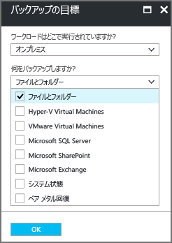
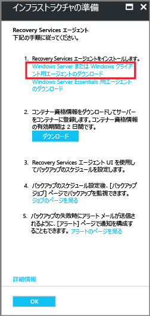

# Azure Backup MARS エージェントをインストールする

この記事では、Microsoft Azure Recovery Services (MARS) エージェントをインストールする方法について説明します。 MARS は Azure Backup エージェントとも呼ばれています。

## MARS エージェントについて

Azure Backup では、オンプレミスのマシンや Azure VM からファイル、フォルダー、システムの状態をバックアップする目的で MARS エージェントが使用されます。 これらのバックアップは、Azure の Recovery Services に格納されます。 エージェントは次のように実行できます。

* オンプレミスの Windows マシンで直接。 これらのマシンでは、Azure の Recovery Services コンテナーに直接バックアップできます。
* Azure VM 拡張機能と並行して Windows を実行する Azure VM で。 エージェントによって、VM 上で特定のファイルとフォルダーがバックアップされます。
* Microsoft Azure Backup Server (MABS) インスタンスまたは System Center Data Protection Manager (DPM) サーバーで。 このシナリオのマシンとワークロードでは、MABS または Data Protection Manager にバックアップします。 その後、MABS または Data Protection Manager では、Azure のコンテナーにバックアップする目的で MARS エージェントが使用されます。

バックアップに利用できるデータは、エージェントがインストールされている場所に依存します。

> [!NOTE]
> 通常、VM で Azure Backup 拡張機能を使用して Azure VM をバックアップします。 この手法では VM 全体がバックアップされます。 VM 上で特定のファイルやフォルダーをバックアップする場合、MARS エージェントをインストールし、拡張機能と共に使用します。 詳細については、[組み込みの Azure VM バックアップのアーキテクチャ](backup-architecture.md#architecture-built-in-azure-vm-backup)に関するページを参照してください。

## 開始する前に

* [Azure Backup で MARS エージェントを使用し、Windows マシンをバックアップする](backup-architecture.md#architecture-direct-backup-of-on-premises-windows-server-machines-or-azure-vm-files-or-folders)方法について学習します。
* セカンダリの MABS または Data Protection Manager サーバーで MARS エージェントを実行する[バックアップ アーキテクチャ](backup-architecture.md#architecture-back-up-to-dpmmabs)について学習します。
* MARS エージェントで[サポートされているものとバックアップできるもの](backup-support-matrix-mars-agent.md)を確認します。
* Azure にサーバーまたはクライアントをバックアップする必要がある場合、Azure アカウントがあることを確認します。 アカウントがない場合、[無料のアカウント](https://azure.microsoft.com/free/)を数分で作成できます。
* バックアップするマシン上でインターネット アクセスを確認します。
* MARS エージェントのインストールと構成を実行するユーザーに、保護対象のサーバーに対するローカル管理者特権があることを確認します。

[!INCLUDE [How to create a Recovery Services vault](../../includes/backup-create-rs-vault.md)]

## ストレージ レプリケーションを変更する

既定では、コンテナーには [geo 冗長ストレージ (GRS)](https://docs.microsoft.com/azure/storage/common/storage-redundancy-grs) が使用されます。

* コンテナーをプライマリ バックアップ メカニズムとする場合は、GRS を使用することをお勧めします。
* [ローカル冗長ストレージ (LRS)](https://docs.microsoft.com/azure/storage/common/storage-redundancy-lrs?toc=%2fazure%2fstorage%2fblobs%2ftoc.json) を使用し、Azure ストレージのコストを削減できます。

ストレージ レプリケーションの種類を変更にするには:

1. 新しいコンテナーで、 **[設定]** セクションから **[プロパティ]** を選択します。

1. **[プロパティ]** ページで、 **[バックアップ構成]** から **[更新]** をクリックします。

1. ストレージのレプリケーションの種類を選択し、 **[保存]** を選択します。

    

> [!NOTE]
> コンテナーを設定してバックアップ項目を格納した後で、ストレージ レプリケーションの種類を変更することはできません。 これを行う場合は、コンテナーを再作成する必要があります。
>

### インターネット アクセスを確認する

マシンのインターネットへのアクセスが制限されている場合、マシンまたはプロキシのファイアウォール設定によって次の URL と IP アドレスが許可されていることを確保してください。

* URL
  * `www\.msftncsi.com`
  * `*.Microsoft.com`
  * `*.WindowsAzure.com`
  * `*.microsoftonline.com`
  * `*.windows.net`
* IP アドレス
  * 20.190.128.0/18
  * 40.126.0.0/18

### Azure ExpressRoute を使用する

パブリック ピアリング (古い回線で使用可能) と Microsoft ピアリングを使用し、Azure ExpressRoute 経由でデータをバックアップできます。 プライベート ピアリング経由のバックアップはサポートされていません。

パブリック ピアリングを使用するには、まず次のドメインとアドレスへのアクセスを確保します。

* `http://www.msftncsi.com/ncsi.txt`
* `microsoft.com`
* `.WindowsAzure.com`
* `.microsoftonline.com`
* `.windows.net`

Microsoft ピアリングを使用するには、次のサービス、リージョン、関連するコミュニティの値を選択します。

* Azure Active Directory (12076:5060)
* Azure リージョン、Recovery Services コンテナーの場所による
* Azure Storage、Recovery Services コンテナーの場所による

詳細については、「[ExpressRoute ルーティングの要件](https://docs.microsoft.com/azure/expressroute/expressroute-routing)」を参照してください。

> [!NOTE]
> パブリック ピアリングは、新しい回線では非推奨です。

前の URL と IP アドレスではすべて、ポート 443 で HTTPS プロトコルが使用されています。

### プライベート エンドポイント

[!INCLUDE [Private Endpoints](../../includes/backup-private-endpoints.md)]

## MARS エージェントのダウンロード

バックアップするマシンにインストールできるように、MARS エージェントをダウンロードします。

いずれかのマシンにエージェントを既にインストールしている場合、最新版のエージェントを実行していることを確認します。 ポータルで最新版を見つけるか、[ダウンロード](https://aka.ms/azurebackup_agent)に直接進んでください。

1. コンテナーの **[作業の開始]** で、 **[バックアップ]** を選択します。

    ![[バックアップの目標] を開く](./media/backup-try-azure-backup-in-10-mins/open-backup-settings.png)

1. **[ワークロードはどこで実行されていますか?]** で **[オンプレミス]** を選択します。 Azure VM 上に MARS エージェントをインストールする場合でも、このオプションを選択します。
1. **[何をバックアップしますか?]** で **[ファイルとフォルダー]** を選択します。 **[システム状態]** を選択することもできます。 他にもさまざまなオプションを利用できますが、それらのオプションはセカンダリ バックアップ サーバーを実行している場合にのみサポートされます。 **[インフラストラクチャの準備]** を選択します。

    

1. **[インフラストラクチャの準備]** の **[Recovery Services エージェントのインストール]** で、MARS エージェントをダウンロードします。

    

1. ダウンロード メニューで **[保存]** を選択します。 既定では、 *MARSagentinstaller.exe* ファイルがダウンロード フォルダーに保存されます。

1. **[Already download or using the latest Recovery Services Agent]\(既にダウンロードしたか、最新の Recovery Services エージェントを使用している\)** をオンにし、コンテナー資格情報をダウンロードします。

    

1. **[保存]** を選択します。 ファイルがダウンロード フォルダーにダウンロードされます。 コンテナー資格情報ファイルを開くことはできません。

## エージェントをインストールして登録する

1. バックアップ対象のマシン上で *MARSagentinstaller.exe* ファイルを実行します。
1. MARS エージェント セットアップ ウィザードで、 **[インストールの設定]** を選択します。 そこで、エージェントをインストールする場所を選択し、キャッシュの場所を選択します。 **[次へ]** を選択します。
   * Azure Backup では、キャッシュを使用して、Azure に送信する前のデータのスナップショットを格納します。
   * キャッシュの場所には、バックアップするデータのサイズの 5% 以上に相当する空き容量が必要です。

    

1. **[プロキシの構成]** で、Windows マシン上で実行されているエージェントがインターネットに接続する方法を指定します。 **[次へ]** を選択します。

   * カスタム プロキシを使用している場合、プロキシ設定と資格情報が必要であればそれを指定します。
   * エージェントには[特定の URL](#before-you-start) へのアクセス権が必要であることを忘れないでください。

    

1. **[インストール]** で、前提条件を確認し、 **[インストール]** を選択します。
1. エージェントがインストールされたら、 **[登録処理を続行]** を選択します。
1. **[サーバーの登録ウィザード]** の **[資格情報コンテナーの識別]** で、ダウンロードした資格情報ファイルを参照し、選択します。 **[次へ]** を選択します。

    

1. **[暗号化の設定]** ページで、マシンのバックアップの暗号化と暗号化の解除に使用されるパスフレーズを指定します。

    * 安全な場所にパスフレーズを保存します。 バックアップを復元するために必要になります。
    * パスフレーズを紛失または忘れた場合、Microsoft でもバックアップ データは回復できません。

1. **[完了]** を選択します。 エージェントがインストールされ、マシンがコンテナーに登録されました。 バックアップを構成してスケジュールする準備ができました。

## 次のステップ

[Azure Backup MARS エージェントを使用して Windows マシンをバックアップする](backup-windows-with-mars-agent.md)方法を確認する
