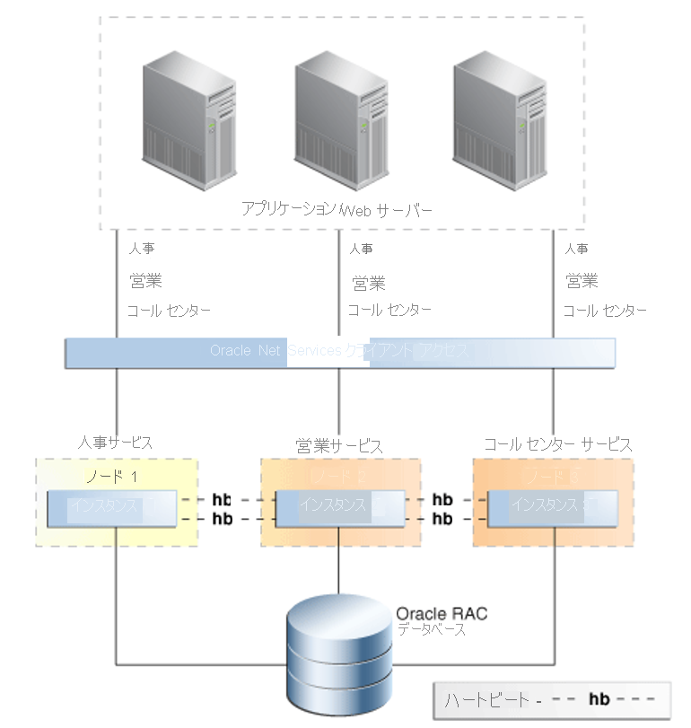

# Azure BareMetal における Oracle の高可用性機能

この記事では、Oracle が備える高可用性とディザスター リカバリーの重要な機能について見ていきます。

Oracle は、そのデータベースを実行する回復性のあるプラットフォームを構築できるよう、さまざまな機能を提供しています。 1 つの機能がすべての種類の障害に対応するわけではありませんが、複数のテクノロジを階層状に組み合わせることで、可用性の高いシステムが形成されます。 可用性を維持するためにすべての機能が必要というわけではありません。 しかし戦略を組み合わせることで、発生するさまざまな種類の障害からの保護を最大限に強化することができます。 

## Flashback Database

[Flashback Database](https://docs.oracle.com/en/database/oracle/oracle-database/21/rcmrf/FLASHBACK-DATABASE.html#GUID-584AC79A-40C5-45CA-8C63-DED3BE3A4511) 機能は、Oracle Database Enterprise Edition で提供されます。 Flashback Database は、データベースを特定の時点まで巻き戻すものです。 復元後に早送りするのではなく、現在の時点から巻き戻すため、この機能は [Recovery Manager (RMAN)](https://docs.oracle.com/en/cloud/paas/db-backup-cloud/csdbb/performing-general-restore-and-recovery-operations.html) による特定の時点への復旧とは異なります。 したがって、完了までの所要時間は、Flashback Database の方が圧倒的に短くなります。
 
この機能は、[Oracle Data Guard](https://docs.oracle.com/en/database/oracle/oracle-database/19/sbydb/preface.html#GUID-B6209E95-9DA8-4D37-9BAD-3F000C7E3590) と連携させることができます。 データベース管理者は、Flashback Database を使用して、障害が発生したデータベースを再インスタンス化し、Data Guard 構成に戻すことが可能です。その際、RMAN による完全な復元と復旧を行う必要はありません。 ディザスター リカバリー機能 (Active Data Guard によってオフロードされるあらゆるレポート機能とバックアップという利点を含む) の復元時間は、この機能によって大幅に短縮されます。
 
この機能は、スタンバイ データベースに対する、時間のかかる redo の代わりとして使用することができます。 問題が発生する前の時点まで、スタンバイ データベースをフラッシュ バックできます。
 
Oracle Database では、フラッシュバック ログが高速リカバリ領域 (FRA: Fast Recovery Area) で保持されます。 これらのログは redo のログとは区別され、FRA 内で必要となる領域もより多くなります。 既定では 24 時間分のフラッシュバック ログが保持されますが、この設定は要件に応じて変更できます。

## Oracle Real Application Clusters

[Oracle Real Application Clusters (RAC)](https://docs.oracle.com/en/database/oracle/oracle-database/19/racad/introduction-to-oracle-rac.html#GUID-5A1B02A2-A327-42DD-A1AD-20610B2A9D92) を使用すると、エンド ユーザーやアプリケーションに対して、相互に接続された複数のサーバーを 1 つのデータベース サービスのように見せることができます。 多くの障害点を取り除くこの機能は、Oracle データベースの高可用性アクティブ/アクティブ ソリューションとして認められています。

Oracle の「[高可用性の概要とベスト プラクティス](https://docs.oracle.com/en/database/oracle/oracle-database/19/haovw/ha-features.html)」から引用した次の図に示すように、アプリケーション レイヤーからは見えるのは、単一の RAC データベースです。 アプリケーションは SCAN リスナーに接続し、トラフィックは、SCAN リスナーによって特定のデータベース インスタンスに誘導されます。 複数のインスタンスからのアクセスを RAC が制御することで、別々に存在する計算ノード間のデータの一貫性が保たれます。

いずれかのインスタンスで障害が発生しても、残りすべてのインスタンスでサービスは続行されます。 このソリューションでデプロイされる各データベースは、n+1 の RAC 構成となります (n は、サービスをサポートするうえで最低限必要な処理能力)。

いずれかのインスタンスで障害が発生した場合でも、ノード間で透過的に接続をフェールオーバーできるよう、Oracle Database サービスが使用されます。 そのような障害は、計画されている場合もあれば、計画されていない場合もあります。 サービスは、Oracle RAC Fast Application Notification と連携し、インスタンスが利用不可の状態になると、生存ノードに移動されます。 サービスの移動先となるのは、サービス構成で preferred (優先) または available (利用可能) として指定されたノードです。

Oracle Database サービスには、重要な機能がもう 1 つあります。ロールに応じたサービスのみを開始する機能です。 Data Guard フェールオーバーが存在する場合に、この機能が使用されます。 Data Guard を使用してデプロイされるすべてのパターンで、データベース サービスを Data Guard ロールにリンクさせる必要があります。

たとえば、MY\_DB\_APP と MY\_DB\_AS という 2 つのサービスが作成されたとします。 MY\_DB\_APP サービスは、データベース インスタンスが PRIMARY の Data Guard ロールで起動されたときにのみ開始されます。 MY\_DB\_AS は、Data Guard ロールが PHYSICAL\_STANDBY の場合にのみ開始されます。 この構成により、アプリケーションが \_APP サービスを参照すると同時に、レポート機能 (Active Standby にオフロード可能) が \_AS サービスを参照することができます。

## Oracle データの保護

Data Guard を使用すると、データベース コピーを異なる物理ハードウェアに置くことができます。 そのハードウェアは、プライマリ データベースから地理的に遠ざけるのが理想です。 Data Guard に距離的な制限はありませんが、距離は保護のモードに影響します。 距離を増やしたことでサイト間の待ち時間が増え、それによって一部のオプション (同期レプリケーションなど) がサポートされなくなる場合があります。

Data Guard は、次の点でストレージレベルのレプリケーションよりも優れています。

- レプリケーションでデータベースが認識されるため、関連したトラフィックのみがレプリケートされます。
- ワークロードによっては一時テーブルスペースに対する高負荷の入出力が生じる場合があります。これらはスタンバイ側には不要であり、レプリケートされません。
- レプリケートされたブロックに対する検証がスタンバイ データベース側で実行されるため、プライマリ データベースの物理的な破損は、スタンバイ データベースにはレプリケートされません。
- ブロック内の論理的な破損や Lost Write 破損を防ぎます。 また、ストレージ管理者によるミスがスタンバイにレプリケートされるリスクも防止されます。

事前に決められた期間、Redo を遅らせることができるため、ユーザー エラーが直ちにスタンバイにレプリケートされることはありません。

## BareMetal スナップショット復旧

インフラストラクチャで提供されている NetApp を使用する BareMetal ストレージ ソリューションを使用することで、ボリュームのスナップショットを作成できます。 スナップショットを使用すると、ファイル システムをすばやく特定の時点に戻すことができます。 スナップショット テクノロジによって達成される目標復旧時間 (RTO) は、データベース バックアップの復元にかかる時間の数分の一です。

Oracle データベースのスナップショット機能は、Azure NetApp SnapCenter を通じて提供されます。 SnapCenter によってスナップショットを使ったバックアップが、SnapVault によってオフライン保管が、Snap Clone によってセルフサービス復元などの操作が可能となります。 詳細については、「[BareMetal インフラストラクチャ上の Oracle の SnapCenter 統合](netapp-snapcenter-integration-oracle-baremetal.md)」を参照してください。

## Recovery Manager

Recovery Manager (RMAN) は、物理データベース バックアップの作成に推奨されるユーティリティです。 RMAN はデータベース制御ファイル (一元化された復旧カタログ) と連動して、次のようなデータベースの各種コア コンポーネントを保護します。

- データベースのデータファイル
- アーカイブされた redo ログ
- データベース制御ファイル
- データベース初期化ファイル (spfile)

RMAN を使用すると、データベースのホット バックアップまたはコールド バックアップを実行できます。 これらのバックアップを使用して、スタンバイ データベースを作成したり、データベースを複製して環境をクローンしたりすることができます。 また、RMAN には、復元の検証機能が備わっています。 この機能は、バックアップ セットを読み取り、それを使用してデータベースを特定の時点に復旧できるかどうかを判断するものです。

RMAN は Oracle によって提供されているため、これによってデータベース ファイルの内部構造が読み取られます。 この機能を使用すると、バックアップや復元の操作中に、物理的および論理的な破損のチェックを実行することができます。 また、データベースのデータファイルを復旧し、個々のデータファイルとテーブルスペースを特定の時点まで復元することもできます。 これらが、ストレージ スナップショットと比べて RMAN が優れている点です。 スナップショットが使用できない場合は、RMAN バックアップが、完全なデータ損失に対する最後の砦となります。

## 次のステップ

BareMetal インフラストラクチャ上で Oracle を実行する際の保護とパフォーマンスを最適化するための選択肢と推奨事項をご確認ください。

> [!div class="nextstepaction"]
> [Oracle BareMetal インフラストラクチャ サーバーのオプション](options-considerations-high-availability.md)
