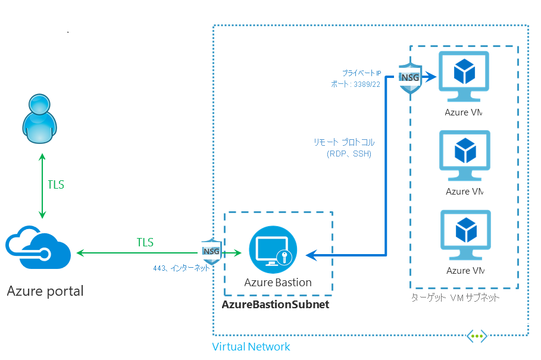

# Azure Bastion とは

Azure Bastion サービスは、お使いの仮想ネットワーク内でプロビジョニングする、新しいフル プラットフォームマネージド PaaS サービスです。 これは、Azure portal 内で直接 SSL を経由して、お使いの仮想マシンへの安全かつシームレスな RDP または SSH 接続を提供します。 Azure Bastion 経由で接続する場合、ご自分の仮想マシンにパブリック IP アドレスは必要ありません。

Bastion は、プロビジョニングされる仮想ネットワーク内のすべての VM に対して安全な RDP および SSH 接続を提供します。 Azure Bastion を使用すると、RDP または SSH を使用した安全なアクセスを提供しながら、お使いの仮想マシンが RDP または SSH ポートを外部に公開しないように保護されます。 Azure Bastion を使用して、Azure portal から直接仮想マシンに接続します。 追加のクライアント、エージェント、ソフトウェアは必要ありません。

## Architecture

Azure Bastion デプロイは、サブスクリプションやアカウント、仮想マシン単位ではなく、仮想ネットワーク単位です。 この仮想ネットワーク内で Azure Bastion サービスをプロビジョニングすると、同じ仮想ネットワーク内のすべての VM で RDP または SSH エクスペリエンスを利用できるようになります。

RDP および SSH は、Azure で実行されているワークロードに接続できる、基本的な手段の一部です。 インターネット経由で RDP または SSH ポートを公開することは望ましくなく、重大な脅威にさらされる面と見なされます。 これは、プロトコルの脆弱性が原因であることがよくあります。 この脅威にさらされる面を含めるには、境界ネットワークの公開される側に踏み台ホスト (ジャンプサーバーとも呼ばれます) をデプロイできます。 Bastion のホスト サーバーは、攻撃に耐えられるように設計および構成されています。 また、Bastion のサーバーは、踏み台の背後やネットワーク内の奥の方にあるワークロードに対する RDP および SSH 接続も提供しています。

この図は、Azure Bastion のデプロイのアーキテクチャを示しています。 この図の内容は次のとおりです。

* Azure Bastion ホストは仮想ネットワーク内にデプロイされています。
* ユーザーは任意の HTML5 ブラウザーを使用して Azure portal に接続します。
* ユーザーは、接続先の仮想マシンを選択します。
* 1 回クリックすると、ブラウザーで RDP または SSH セッションが開きます。
* Azure VM ではパブリック IP が必要ありません。

## 主要な機能

次の機能を使用できます。

* **Azure portal で直接 RDP および SSH を使用する:** シングルクリックのシームレスなエクスペリエンスを使用して、Azure portal 内で直接 RDP および SSH セッションに接続できます。
* **SSL 経由のリモート セッションと RDP または SSH のファイアウォール トラバーサル:** Azure Bastion では、ローカルのデバイスに自動的にストリーム配信される HTML5 ベースの Web クライアントを使用しているため、企業ファイアウォールを安全にトラバーサルできるようにポート 443 で SSL を介して RDP または SSH セッションに接続します。
* **Azure VM ではパブリック IP が不要:** Azure Bastion は、お使いの Azure 仮想マシンのプライベート IP を使用してその VM への RDP または SSH 接続を開きます。 仮想マシンのパブリック IP は必要ありません。
* **NSG を管理する手間はなし:** Azure Bastion は、Azure が提供するフル マネージド プラットフォーム PaaS サービスで、安全な RDP または SSH 接続を提供するよう内部で強化されています。 Azure Bastion サブネットに NSG を適用する必要はありません。 Azure Bastion はプライベート IP 経由で仮想マシンに接続するため、Azure Bastion からの RDP または SSH のみを許可するよう構成できます。 これで、お使いの仮想マシンへの安全な接続が必要になるたびに NSG を管理する手間がなくなります。
* **ポート スキャンからの保護:** お使いの仮想マシンをパブリック インターネットに公開する必要がないため、この VM は、仮想ネットワーク外部の悪意のあるユーザーによるポート スキャンから保護されます。
* **ゼロデイ攻撃から保護する。一元的な強化:** Azure Bastion は、フル プラットフォームマネージド PaaS サービスです。 これは仮想ネットワークの境界に配置されるため、その仮想ネットワーク内の各仮想マシンを強化することについて心配する必要はありません。 Azure プラットフォームは、Azure Bastion を強化して常に最新の状態にしておくことで、ゼロデイ攻撃から保護します。

## よく寄せられる質問

[!INCLUDE [Bastion FAQ](../../includes/bastion-faq-include.md)]

## 次のステップ

* [Azure Bastion ホスト リソースを作成する](bastion-create-host-portal.md)。
* Azure のその他の重要な[ネットワーク機能](../networking/networking-overview.md)について参照してください。
