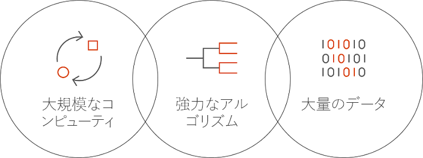

# Azure の Batch AI とは
Batch AI は、Azure 仮想マシン (GPU をサポートする VM を含む) のクラスター上で、データ サイエンティストや AI 研究者が AI およびその他の機械学習モデルをトレーニングすることを可能にする管理されたサービスです。 ジョブの要件、入力の取得元、出力の保存先を記述すれば、後の処理は Batch AI が行います。  
 
## Batch AI を使用する理由 
強力な AI アルゴリズムの開発は、計算集中型の反復的なプロセスです。 データ サイエンティストや AI 研究者が取り扱うデータ セットはますます大きくなる一方です。 彼らは、ハイパーパラメーターの調整に関するネットワーク設計を数多く試しながら、より多くのレイヤーを備えるモデルを開発しています。 これを効率的に行うには、モデルごとに複数の CPU または GPU を用意し、実験を並列に実行して、トレーニング データ、ログ、モデル出力の共有ストレージを用意する必要があります。   
 

データ サイエンティストや AI 研究者はそれぞれの分野の専門家ですが、大規模なインフラストラクチャの管理は、本来の仕事の妨げになる可能性があります。 AI を大規模に開発するには、インフラストラクチャ関連の多くのタスクが必要になります。これには、VM のクラスターのプロビジョニング、ソフトウェアとコンテナーのインストール、作業のキューへの登録、ジョブの優先順位付けとスケジューリング、障害の処理、データの分散、結果の共有、コスト管理のためのリソースのスケーリング、ツールやワークフローとの統合が含まれます。 Batch AI は、これらのタスクを処理します。 
 
## Batch AI とは 

Batch AI は、AI のトレーニングとテストに特化したリソース管理とジョブ スケジューリングを提供します。 主な機能は次のとおりです。 

* 実行時間の長いバッチ ジョブ、反復的な実験、および対話型トレーニングの実行 
* GPU または CPU を使用した VM クラスターの自動スケーリングまたは手動スケーリング 
* VM 間およびリモート アクセス用の SSH 通信の構成 
* [Microsoft Cognitive Toolkit](https://github.com/Microsoft/CNTK) (CNTK)、[TensorFlow](https://www.tensorflow.org/)、[Chainer](https://chainer.org/) などの一般的なツールキット向けに最適化された構成に基づく、ディープ ラーニングまたは機械学習フレームワークのサポート 
* 優先度ベースのジョブ キューによる、クラスターの共有と、優先度の低い VM と Azure Reservations の利用  
* Azure Files とマネージド NFS サーバーを含む柔軟なストレージ オプション 
* VM とオプションのコンテナーへのリモート ファイル共有のマウント 
* VM の障害発生時におけるジョブ状態の提供と再起動 
* Azure Storage からのストリーミングを含む、出力ログ、stdout、stderr、およびモデルへのアクセス 
* Azure [コマンド ライン インターフェイス](/cli/azure) (CLI)、各種 SDK ([Python](https://github.com/Azure/azure-sdk-for-python)、[C#](https://www.nuget.org/packages/Microsoft.Azure.Management.BatchAI/1.0.0-preview)、Java 向け)、Azure Portal での監視、Microsoft AI ツールとの統合 

Batch AI SDK は、トレーニング パイプラインを管理し、ツールと統合するためのスクリプトまたはアプリケーションの作成をサポートしています。 現在、SDK には Python、C#、Java、および REST API が用意されています。  
 

Batch AI では、Azure Resource Manager を使用してコントロールプレーンの操作 (作成、一覧表示、取得、削除) を行います。 Azure Active Directory は、認証とロールベースのアクセス制御に使用されます。  
 
## Batch AI の使用方法 

Batch AI を使用するには、"*クラスター*" と "*ジョブ*" を定義して管理します。 

 
**クラスター**は、次のような計算要件を表します。 
* 処理を実行する Azure リージョン 
* 使用する VM のファミリとサイズ。たとえば、4 つの NVIDIA K80 GPU を含む NC24 VM 
* VM の数、または自動スケールの最小数と最大数 
* VM イメージ。たとえば、Ubuntu 16.04 LTS または [Microsoft ディープ ラーニング仮想マシン](https://azuremarketplace.microsoft.com/marketplace/apps/microsoft-ads.dsvm-deep-learning)
* (たとえば、Azure Files または Batch AI によって管理される NFS サーバーから) マウントする任意のリモート ファイル共有ボリューム 
* デバッグのための対話型ログイン用に VM に構成するユーザー名と SSH キーまたはパスワード  
 

**ジョブ**は、次のことを表します。 
* 使用するクラスターとリージョン 
* ジョブに使用する VM の数 
* ジョブの開始時に渡す入力および出力ディレクトリ。 通常は、クラスターのセットアップ中にマウントされた共有ファイル システムを使用します 
* ソフトウェアまたはインストール スクリプトを実行するためのオプションのコンテナー 
* AI フレームワーク固有の構成、またはジョブを開始するためのコマンド ラインとパラメーター 
 

[Azure CLI](/cli/azure) のほか、クラスターとジョブの構成ファイルを利用して、Batch AI を使ってみましょう。 このアプローチを使用すれば、必要に応じてクラスターを迅速に作成し、ネットワーク設計またはハイパーパラメーターを試すためのジョブを実行できます。  
 

Batch AI を使用すると、複数の GPU の並列操作が容易になります。 複数の GPU にわたってジョブをスケーリングする必要がある場合、Batch AI では VM 間にセキュリティで保護されたネットワーク接続が設定されます。 InfiniBand を使用する場合は、Batch AI によってドライバーが構成され、ジョブ内のノード間で MPI が開始されます。  

## [データ管理]
Batch AI には、トレーニング スクリプト、データ、出力に関して柔軟なオプションが用意されています。
  
* 初期の実験や小さなデータセットには、**ローカル ディスク**を使用します。 このシナリオでは、SSH 経由で仮想マシンに接続してスクリプトを編集し、ログを読み取ります。 

* **Azure Files** を使用して、複数のジョブ間でトレーニング データを共有し、出力ログとモデルを単一の場所に保存します 

* **NFS サーバー**を設定して、トレーニング用の大規模なデータと VM をサポートします。 Batch AI では、Azure Storage に基づくディスクを備えた特殊なクラスター タイプの NFS サーバーを自動的に設定できます。 
 
* **並列ファイル システム**により、データと並列トレーニングのためのスケーラビリティがさらに向上します。 Batch AI は並列ファイル システムを管理しませんが、Lustre、Gluster、および BeeGFS 用のサンプルのデプロイ テンプレートが用意されています。  

## 次の手順

* [Azure CLI](quickstart-cli.md) または [Python](quickstart-python.md) を使用した最初の Batch AI トレーニング ジョブの作成を開始する。
* さまざまなフレームワークのサンプル [トレーニング レシピ](https://github.com/Azure/BatchAI)を確認する。

