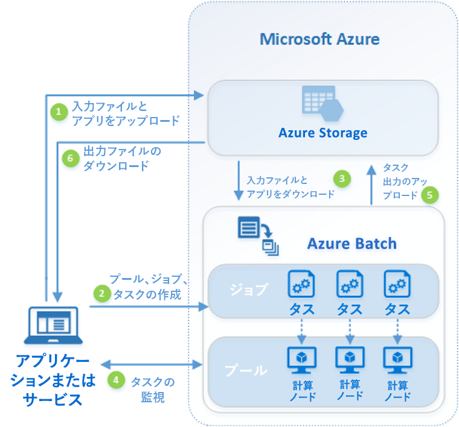

# Azure Batch とは

Azure Batch を使用すると、大規模な並列コンピューティングやハイパフォーマンス コンピューティング (HPC) のバッチ ジョブを Azure で効率的に実行することができます。 Azure Batch は、コンピューティング ノード (仮想マシン) のプールを作成および管理し、実行するアプリケーションをインストールし、ノードで実行するジョブをスケジュールします。 インストール、管理、またはスケーリングするクラスターまたはジョブ スケジューラ ソフトウェアはありません。 代わりに、[Batch API およびツール](batch-apis-tools.md)、コマンド ライン スクリプト、または Azure Portal を使用して、ジョブを構成、管理、および監視します。 

開発者は Batch をプラットフォーム サービスとして使用して、大規模な実行が必要な SaaS アプリケーションやクライアント アプリケーションを構築することができます。 たとえば、Batch で、金融サービス企業のためにモンテ カルロ リスク シミュレーションを実行するサービスや、多数の画像を処理するサービスを構築します。

Batch の使用に追加料金はかかりません。 仮想マシン、ストレージ、ネットワークなど、基になるリソースの使用した分だけをお支払いいただきます。

Batch と Azure 内の他の HPC ソリューション オプションとの比較については、[Azure でのハイ パフォーマンス コンピューティング (HPC)](https://docs.microsoft.com/azure/architecture/topics/high-performance-computing/)に関するページを参照してください。

## 並列ワークロードの実行
Batch は本質的に並列 (「驚異的並列」とも呼ばれています) なワークロードと効果的に連動します。 本質的に並列なワークロードとは、各アプリケーションを独立して実行することができ、各インスタンスが作業の一部を完了するワークロードのことです。 アプリケーションは、実行時にいくつかの共通データにアクセスする場合がありますが、アプリケーションの他のインスタンスとは通信しません。 そのため、本質的に並列なワークロードは、大規模で実行できます。可能な規模は、アプリケーションを同時に実行するために使用できるコンピューティング リソースの量によって決まります。

Batch で実行できる本質的に並列なワークロードの例を、次にいくつか示します。

* モンテカルロ シミュレーションを使用した財務リスクのモデリング
* VFX および 3D 画像のレンダリング
* 画像の分析と処理
* メディア コード変換
* 遺伝子配列の分析
* 光学式文字認識 (OCR)
* データの取り込み、処理、および ETL 操作
* ソフトウェアのテストの実行

また、Batch を使用して、[密接に結合されたワークロード](batch-mpi.md)を実行することもできます。これらのワークロードでは、アプリケーションが独立して実行されるのではなく、互いに通信する必要があります。 密接に結合されたアプリケーションは、通常、Message Passing Interface (MPI) API を使用します。 [Microsoft MPI](https://msdn.microsoft.com/library/bb524831(v=vs.85).aspx) または Intel MPI を使用して、密接に結合されたワークロードを Batch で実行できます。 専用の [HPC](../virtual-machines/linux/sizes-hpc.md) および [GPU に最適な](../virtual-machines/linux/sizes-gpu.md) VM のサイズで、アプリケーションのパフォーマンスを向上させます。

密接に結合されたワークロードのいくつかの例を次に示します。
* 有限要素の分析
* 流体力学
* マルチノード AI トレーニング

密接に結合されたジョブの多くは、Batch を使用して並列で実行できます。 たとえば、パイプを流れる液体について、パイプの幅を変化させて複数のシミュレーションを実行します。

## その他の Batch 機能

Azure Batch では、より高レベルで、ワークロード固有の機能も使用できます。
* Batch は、Autodesk Maya、3ds Max、Arnold、V-Ray などのレンダリング ツールでの大規模な[レンダリング ワークロード](batch-rendering-service.md)をサポートしています。 
* R ユーザーは、[doAzureParallel R パッケージ](https://github.com/Azure/doAzureParallel)をインストールして、Batch プールに対する R アルゴリズムの実行を容易にスケールアウトすることができます。

また、Batch ジョブを、[Azure Data Factory](../data-factory/transform-data-using-dotnet-custom-activity.md) などのツールで管理されているより大きな Azure ワークフローの一部として実行して、データを変換することができます。

## 動作のしくみ
Batch の一般的なシナリオでは、3D シーンの画像のレンダリングなどの本質的に並列な作業を、コンピューティング ノードのプール上でスケールアウトします。 このコンピューティング ノードのプールは、レンダリング ジョブに数十、数百、または数千ものコアを提供する "レンダリング ファーム" にすることができます。

次の図は一般的な Batch ワークフローの手順を示しています。クライアント アプリケーションまたはホステッド サービスが Batch を利用し、並列ワークロードを実行します。

|手順  |説明  |
|---------|---------|
|1.**入力ファイル**とそのファイルを処理する**アプリケーション**を Azure Storage アカウントにアップロードします。     |入力ファイルは、財務モデリング データやトランスコードする動画ファイルなど、アプリケーションが処理する任意のデータです。 アプリケーション ファイルには、メディア トランスコーダーなど、データを処理するスクリプトまたはアプリケーションを含めることができます。|
|2.Batch アカウント内のコンピューティング ノードの Batch **プール**、プールでワークロードを実行する**ジョブ**、およびジョブ内の**タスク**を作成します。     | プール ノードは、タスクを実行する VM です。 ノードの数とサイズ、Windows または Linux の VM イメージ、ノードがプールに参加するときにインストールするアプリケーションなど、プロパティを指定します。 [優先度の低い VM](batch-low-pri-vms.md) を使用するか、ワークロードの変化に応じてノードの数を[自動的にスケーリング](batch-automatic-scaling.md)することで、プールのコストとサイズを管理します。   ジョブにタスクを追加すると、Batch サービスは、プールのコンピューティング ノードでタスクを実行するように自動的にスケジュールします。 各タスクでアップロードしたアプリケーションが使用され、入力ファイルが処理されます。 |
|手順 3.**入力ファイル**と**アプリケーション**を Batch にダウンロードします     |各タスクは、実行前に、割り当てられているコンピューティング ノードに処理する入力データをダウンロードすることができます。 アプリケーションがまだプール ノードにインストールされていない場合、代わりにここでダウンロードできます。 Azure Storage からのダウンロードが完了すると、割り当てられているノードでタスクが実行されます。|
|4.**タスクの実行**を監視します     |タスクの実行中に、Batch にクエリを実行し、ジョブとそのタスクの進捗状況を監視します。 クライアント アプリケーションまたはサービスは、HTTPS 経由で Batch サービスと通信します。 数千のコンピューティング ノードで実行されている数千のタスクを監視している場合があるため、[Batch サービスに対して効率的にクエリを実行する](batch-efficient-list-queries.md)ようにしてください。|
|5.**タスク出力**をアップロードします     |タスクが完了すると、結果データを Azure Storage にアップロードできます。 コンピューティング ノードのファイル システムからファイルを直接取得することもできます。|
|6.**出力ファイル**をダウンロードします     |ジョブのタスクが完了したことが監視により検出された場合、クライアント アプリケーションまたはサービスで出力データをダウンロードし、さらに処理することができます。|

これは Batch の利用方法の 1 つにすぎません。このシナリオでは、機能のほんの一部のみを紹介しています。 たとえば、各コンピューティング ノードで、[複数のタスクを並列](batch-parallel-node-tasks.md)で実行できます。 または、[ジョブの準備と完了のタスク](batch-job-prep-release.md)を利用してジョブのノードを準備し、後で消去することができます。 

プール、ノード、ジョブ、タスクの詳細や、Batch アプリケーションを構築するときに使用できる多くの API 機能の詳細については、[開発者向けの Batch 機能の概要](batch-api-basics.md)に関するページを参照してください。 また、最新の [Batch サービスの更新](https://azure.microsoft.com/updates/?product=batch)も参照してください。

## 次の手順

以下のクイック スタートのいずれかに従って、実際に Azure Batch を使ってみましょう。
* [Azure CLI で最初の Batch ジョブを実行する](quick-create-cli.md)
* [Azure Portal で最初の Batch ジョブを実行する](quick-create-portal.md)
* [.NET API を使用して最初の Batch ジョブを実行する](quick-run-dotnet.md)
* [Python API を使用して最初の Batch ジョブを実行する](quick-run-python.md)

