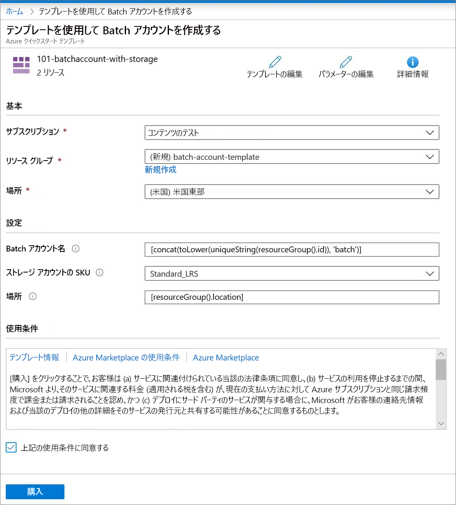

# クイック スタート:ARM テンプレートを使用して Batch アカウントを作成する

コンピューティング リソース (コンピューティング ノードのプール) や Batch ジョブを作成するには、Batch アカウントが必要です。 Azure Storage アカウントと Batch アカウントをリンクできます。これは、アプリケーションをデプロイしたり、ほとんどの実際のワークロードの入力データと出力データを格納したりする場合に役立ちます。 このクイックスタートでは、Azure Resource Manager テンプレート (ARM テンプレート) を使用し、ストレージなどの Batch アカウントを作成する方法を示します。 このクイック スタートを完了すると、Batch サービスの主要な概念を理解し、より大規模でより現実的なワークロードで Batch を試せるようになります。

[!INCLUDE [About Azure Resource Manager](../../includes/resource-manager-quickstart-introduction.md)]

環境が前提条件を満たしていて、ARM テンプレートの使用に慣れている場合は、 **[Azure へのデプロイ]** ボタンを選択します。 Azure portal でテンプレートが開きます。

## 前提条件

アクティブな Azure サブスクリプションが必要です。

- [!INCLUDE [quickstarts-free-trial-note](../../includes/quickstarts-free-trial-note.md)]

## テンプレートを確認する

このクイックスタートで使用されるテンプレートは [Azure クイックスタート テンプレート](https://azure.microsoft.com/resources/templates/101-batchaccount-with-storage/)からのものです。

:::code language="json" source="~/quickstart-templates/101-batchaccount-with-storage/azuredeploy.json":::

テンプレートでは、次の 2 つの Azure リソースが定義されています。

- [Microsoft.Storage/storageAccounts](/azure/templates/microsoft.storage/storageaccounts): ストレージ アカウントを作成します。
- [Microsoft.Batch/batchAccounts](/azure/templates/microsoft.batch/batchaccounts): Batch アカウントを作成します。

## テンプレートのデプロイ

1. Azure にサインインし、テンプレートを開くには次のイメージを選択します。 テンプレートによって、Azure Batch アカウントとストレージ アカウントが作成されます。

   

1. 次の値を選択または入力します。

   

   - **サブスクリプション**: Azure サブスクリプションを選択します。
   - **リソース グループ**: **[新規作成]** を選択し、リソース グループの一意の名前を入力し、 **[OK]** をクリックします。
   - **場所**: 場所を選択します。 たとえば **[米国中部]** です。
   - **Batch アカウント名**: 既定値をそのまま使用します。
   - **ストレージ アカウントの SKU**: ストレージ アカウントの種類を選択します。 たとえば、**Standard_LRS** です。
   - **[場所]** :リソースがリソース グループと同じ場所に配置されるように、既定値のままにします。
   - 上記の使用条件に同意する: **選択します**。

1. **[購入]** を選択します。

数分後に、Batch アカウントが正常に作成されたという通知が表示されます。

この例では、テンプレートをデプロイするために Azure portal を使用します。 Azure portal だけでなく、Azure PowerShell、Azure CLI、および REST API を使用することもできます。 他のデプロイ方法については、「[テンプレートのデプロイ](../azure-resource-manager/templates/deploy-powershell.md)」を参照してください。

## デプロイの検証

Azure portal で作成したリソース グループに移動して、デプロイを検証できます。 **[概要]** の画面で、Batch アカウントとストレージ アカウントが存在することを確認します。

## リソースをクリーンアップする

後続の[チュートリアル](./tutorial-parallel-dotnet.md)に引き続き取り組む場合は、これらのリソースをそのまま残しておくことをお勧めします。 または、不要になった場合は、[リソース グループを削除](../azure-resource-manager/management/delete-resource-group.md?tabs=azure-portal#delete-resource-group)できます。これにより、Batch アカウントと作成したストレージ アカウントも削除されます。

## 次のステップ

このクイック スタートでは、Batch アカウントとストレージ アカウントを作成しました。 Azure Batch の詳細については、Azure Batch のチュートリアルを続行してください。

> [!div class="nextstepaction"]
> [Azure Batch のチュートリアル](./tutorial-parallel-dotnet.md)
