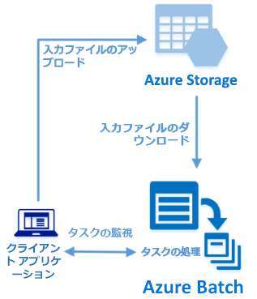

# <a name="quickstart-run-your-first-azure-batch-job-with-the-net-api"></a>クイック スタート:.NET API で最初の Azure Batch ジョブを実行する

このクイック スタートでは、Azure Batch .NET API に基づいて構築された C# アプリケーションから Azure Batch ジョブを実行します。 このアプリでは、複数の入力データ ファイルを Azure Storage にアップロードしてから、Batch コンピューティング ノード (仮想マシン) の "*プール*" を作成します。 その後、基本的なコマンドを使用してプールの各入力ファイルを処理するための "*タスク*" を実行するサンプル "*ジョブ*" を作成します。 このクイック スタートを完了すると、Batch サービスの主要な概念を理解し、より大規模でより現実的なワークロードで Batch を試せるようになります。



[!INCLUDE [quickstarts-free-trial-note.md](../../includes/quickstarts-free-trial-note.md)]

## <a name="prerequisites"></a>前提条件

* [Visual Studio 2017 以降](https://www.visualstudio.com/vs)、あるいは Linux、macOS、または Windows 用の [.NET Core 2.1](https://www.microsoft.com/net/download/dotnet-core/2.1)。 

* Batch アカウントおよびリンクされた Azure ストレージ アカウント。 これらのアカウントを作成するには、[Azure Portal](quick-create-portal.md) または [Azure CLI](quick-create-cli.md) を使用した Batch のクイック スタートを参照してください。 

## <a name="sign-in-to-azure"></a>Azure へのサインイン

Azure Portal ([https://portal.azure.com](https://portal.azure.com)) にサインインします。

[!INCLUDE [batch-common-credentials](../../includes/batch-common-credentials.md)]

## <a name="download-the-sample"></a>サンプルのダウンロード

GitHub から[サンプル アプリをダウンロードまたは複製](https://github.com/Azure-Samples/batch-dotnet-quickstart)します。 Git クライアントを使用してサンプル アプリ リポジトリを複製するには、次のコマンドを使用します。

```
git clone https://github.com/Azure-Samples/batch-dotnet-quickstart.git
```

Visual Studio ソリューション ファイル `BatchDotNetQuickstart.sln` が含まれているディレクトリに移動します。

Visual Studio でソリューション ファイルを開き、`Program.cs` 内の資格情報文字列を、お使いのアカウントに関して取得した値で更新します。 例:

```csharp
// Batch account credentials
private const string BatchAccountName = "mybatchaccount";
private const string BatchAccountKey  = "xxxxxxxxxxxxxxxxE+yXrRvJAqT9BlXwwo1CwF+SwAYOxxxxxxxxxxxxxxxx43pXi/gdiATkvbpLRl3x14pcEQ==";
private const string BatchAccountUrl  = "https://mybatchaccount.mybatchregion.batch.azure.com";

// Storage account credentials
private const string StorageAccountName = "mystorageaccount";
private const string StorageAccountKey  = "xxxxxxxxxxxxxxxxy4/xxxxxxxxxxxxxxxxfwpbIC5aAWA8wDu+AFXZB827Mt9lybZB1nUcQbQiUrkPtilK5BQ==";
```

[!INCLUDE [batch-credentials-include](../../includes/batch-credentials-include.md)]

## <a name="build-and-run-the-app"></a>アプリのビルドと実行

Batch ワークフローの動作を確認するには、Visual Studio またはコマンド ライン (`dotnet build` コマンドと `dotnet run` コマンド) でアプリケーションをビルドして実行します。 アプリケーションの実行後に、コードを確認して、アプリケーションの各部分での処理内容を学習します。 たとえば Visual Studio で次の操作を実行します。

* ソリューション エクスプローラーでソリューションを右クリックし、 **[ソリューションのビルド]** をクリックします。 

* メッセージに従って NuGet パッケージの復元を確認します。 不足しているパッケージをダウンロードする必要がある場合は、[NuGet Package Manager](https://docs.nuget.org/consume/installing-nuget) がインストールされていることを確認します。

次に、それを実行します。 サンプル アプリケーションを実行すると、コンソールの出力は次のようになります。 実行中、プールのコンピューティング ノードを開始する際に、`Monitoring all tasks for 'Completed' state, timeout in 00:30:00...` で一時停止が発生します。 タスクは、最初のコンピューティング ノードが実行中になるとすぐに、実行するためにキューに登録されます。 プール、コンピューティング ノード、ジョブ、タスクを監視するには、[Azure Portal](https://portal.azure.com) で Batch アカウントに移動します。

```
Sample start: 11/16/2018 4:02:54 PM

Container [input] created.
Uploading file taskdata0.txt to container [input]...
Uploading file taskdata1.txt to container [input]...
Uploading file taskdata2.txt to container [input]...
Creating pool [DotNetQuickstartPool]...
Creating job [DotNetQuickstartJob]...
Adding 3 tasks to job [DotNetQuickstartJob]...
Monitoring all tasks for 'Completed' state, timeout in 00:30:00...
```

タスクが完了すると、タスクごとに次のような出力が表示されます。

```
Printing task output.
Task: Task0
Node: tvm-2850684224_3-20171205t000401z
Standard out:
Batch processing began with mainframe computers and punch cards. Today it still plays a central role in business, engineering, science, and other pursuits that require running lots of automated tasks....
stderr:
...
```

既定の構成でアプリケーションを実行する場合、通常の実行時間は約 5 分間です。 最初のプールの設定に最も時間がかかります。 ジョブをもう一度実行するには、前回の実行からジョブを削除しますが、プールは削除しないでください。 構成済みのプールでは、ジョブは数秒で完了します。


## <a name="review-the-code"></a>コードの確認

このクイック スタートの .NET アプリでは、次の処理を実行します。

* 3 つの小さいテキスト ファイルを Azure ストレージ アカウントの BLOB コンテナーにアップロードします。 これらのファイルは、Batch で処理するための入力です。
* Windows Server を実行しているコンピューティング ノードのプールを作成します。
* ノードで実行するジョブと 3 つのタスクを作成します。 各タスクは、Windows のコマンド ラインを使用して入力ファイルの 1 つを処理します。 
* タスクによって返されるファイルを表示します。

詳細については、`Program.cs` ファイルと以降のセクションを参照してください。 

### <a name="preliminaries"></a>準備

ストレージ アカウントを操作するために、アプリでは .NET 用 Azure Storage クライアント ライブラリを使用します。 [CloudStorageAccount](/dotnet/api/microsoft.azure.cosmos.table.cloudstorageaccount) を使用してアカウントへの参照を作成し、それを基にして [CloudBlobClient](/dotnet/api/microsoft.azure.storage.blob.cloudblobclient) を作成します。

```csharp
CloudBlobClient blobClient = storageAccount.CreateCloudBlobClient();
```

このアプリでは、`blobClient` 参照を使用して、ストレージ アカウントにコンテナーを作成したり、そのコンテナーにデータ ファイルをアップロードしたりします。 ストレージ内のファイルは、Batch の [ResourceFile](/dotnet/api/microsoft.azure.batch.resourcefile) オブジェクトとして定義されており、Batch が後でコンピューティング ノードにダウンロードできます。

```csharp
List<string> inputFilePaths = new List<string>
{
    "taskdata0.txt",
    "taskdata1.txt",
    "taskdata2.txt"
};

List<ResourceFile> inputFiles = new List<ResourceFile>();

foreach (string filePath in inputFilePaths)
{
    inputFiles.Add(UploadFileToContainer(blobClient, inputContainerName, filePath));
}
```

このアプリは [BatchClient](/dotnet/api/microsoft.azure.batch.batchclient) オブジェクトを作成して、Batch サービスでプール、ジョブ、タスクを作成および管理します。 このサンプルの Batch クライアントでは共有キー認証を使用します。 (Batch では Azure Active Directory 認証もサポートされます)。

```csharp
BatchSharedKeyCredentials cred = new BatchSharedKeyCredentials(BatchAccountUrl, BatchAccountName, BatchAccountKey);

using (BatchClient batchClient = BatchClient.Open(cred))
...
```

### <a name="create-a-pool-of-compute-nodes"></a>コンピューティング ノードのプールの作成

Batch プールを作成するために、このアプリでは [BatchClient.PoolOperations.CreatePool](/dotnet/api/microsoft.azure.batch.pooloperations.createpool) メソッドを使用してノードの数、VM のサイズ、プールの構成を設定します。 ここで、[VirtualMachineConfiguration](/dotnet/api/microsoft.azure.batch.virtualmachineconfiguration) オブジェクトでは、[ImageReference](/dotnet/api/microsoft.azure.batch.imagereference) に、Azure Marketplace で公開されている Windows Server イメージを指定します。 Batch は、Azure Marketplace の Linux および Windows Server のさまざまなイメージだけでなく、カスタム VM イメージもサポートしています。

ノードの数 (`PoolNodeCount`) と VM のサイズ (`PoolVMSize`) は、定義済みの定数です。 このサンプルでは、既定で、サイズ *Standard_A1_v2* の 2 つのノードで構成されるプールが作成されます。 推奨されるサイズは、この簡単な例についてパフォーマンスとコストのバランスが取れています。

[Commit](/dotnet/api/microsoft.azure.batch.cloudpool.commit) メソッドは、プールを Batch サービスに送信します。

```csharp

private static VirtualMachineConfiguration CreateVirtualMachineConfiguration(ImageReference imageReference)
{
    return new VirtualMachineConfiguration(
        imageReference: imageReference,
        nodeAgentSkuId: "batch.node.windows amd64");
}

private static ImageReference CreateImageReference()
{
    return new ImageReference(
        publisher: "MicrosoftWindowsServer",
        offer: "WindowsServer",
        sku: "2016-datacenter-smalldisk",
        version: "latest");
}

private static void CreateBatchPool(BatchClient batchClient, VirtualMachineConfiguration vmConfiguration)
{
    try
    {
        CloudPool pool = batchClient.PoolOperations.CreatePool(
            poolId: PoolId,
            targetDedicatedComputeNodes: PoolNodeCount,
            virtualMachineSize: PoolVMSize,
            virtualMachineConfiguration: vmConfiguration);

        pool.Commit();
    }
...

```

### <a name="create-a-batch-job"></a>Batch ジョブの作成

Batch ジョブは、1 つ以上のタスクの論理グループです。 ジョブには、優先度やタスクの実行対象プールなど、タスクに共通する設定が含まれています。 このアプリは、[BatchClient.JobOperations.CreateJob](/dotnet/api/microsoft.azure.batch.joboperations.createjob) メソッドを使用してプールにジョブを作成します。

[Commit](/dotnet/api/microsoft.azure.batch.cloudjob.commit) メソッドは、ジョブを Batch サービスに送信します。 最初、ジョブにはタスクがありません。

```csharp
try
{
    CloudJob job = batchClient.JobOperations.CreateJob();
    job.Id = JobId;
    job.PoolInformation = new PoolInformation { PoolId = PoolId };

    job.Commit();
}
...
```

### <a name="create-tasks"></a>タスクの作成

このアプリでは、[CloudTask](/dotnet/api/microsoft.azure.batch.cloudtask) オブジェクトの一覧を作成します。 各タスクは、[CommandLine](/dotnet/api/microsoft.azure.batch.cloudtask.commandline) プロパティを使用して入力の `ResourceFile` オブジェクトを処理します。 このサンプルのコマンド ラインでは、Windows の `type` コマンドを実行して入力ファイルを表示します。 このコマンドは、デモンストレーション用の簡単な例です。 Batch を使用する場合、コマンド ラインは、アプリまたはスクリプトを指定する場所です。 Batch には、アプリやスクリプトをコンピューティング ノードにデプロイする方法が多数用意されています。

その後、このアプリは、[AddTask](/dotnet/api/microsoft.azure.batch.joboperations.addtask) メソッドを使用してジョブにタスクを追加します。これにより、タスクは、コンピューティング ノードで実行するためにキューに登録されます。

```csharp
for (int i = 0; i < inputFiles.Count; i++)
{
    string taskId = String.Format("Task{0}", i);
    string inputFilename = inputFiles[i].FilePath;
    string taskCommandLine = String.Format("cmd /c type {0}", inputFilename);

    CloudTask task = new CloudTask(taskId, taskCommandLine);
    task.ResourceFiles = new List<ResourceFile> { inputFiles[i] };
    tasks.Add(task);
}

batchClient.JobOperations.AddTask(JobId, tasks);
```

### <a name="view-task-output"></a>タスク出力の表示

このアプリは、タスクを監視してタスクが完了したことを確認するために [TaskStateMonitor](/dotnet/api/microsoft.azure.batch.taskstatemonitor) を作成します。 次に、[CloudTask.ComputeNodeInformation](/dotnet/api/microsoft.azure.batch.cloudtask.computenodeinformation) プロパティを使用して、完了した各タスクによって生成された `stdout.txt` ファイルを表示します。 タスクが正常に実行されると、タスク コマンドの出力は `stdout.txt` に書き込まれます。

```csharp
foreach (CloudTask task in completedtasks)
{
    string nodeId = String.Format(task.ComputeNodeInformation.ComputeNodeId);
    Console.WriteLine("Task: {0}", task.Id);
    Console.WriteLine("Node: {0}", nodeId);
    Console.WriteLine("Standard out:");
    Console.WriteLine(task.GetNodeFile(Constants.StandardOutFileName).ReadAsString());
}
```

## <a name="clean-up-resources"></a>リソースのクリーンアップ

アプリは自動的に、作成された入力用ストレージ コンテナーを削除し、Batch プールとジョブを削除するためのオプションを表示します。 ジョブがスケジュールされていない場合でも、ノードの実行中はプールに対して料金が発生します。 プールは不要になったら、削除してください。 プールを削除すると、ノード上のタスク出力はすべて削除されます。

リソース グループ、Batch アカウント、ストレージ アカウントは、不要になったら削除します。 Azure Portal でこれを行うには、Batch アカウントのリソース グループを選択し、 **[リソース グループの削除]** をクリックしてください。

## <a name="next-steps"></a>次の手順

このクイック スタートでは、Batch .NET API を使用して構築された小さいアプリを実行し、Batch プールと Batch ジョブを作成しました。 このジョブによってサンプル タスクが実行され、作成された出力がノードにダウンロードされました。 Batch サービスの主要な概念を理解できたので、より大規模でより現実的なワークロードを使用して Batch を試す準備が整いました。 Azure Batch の詳細を確認し、実際のアプリケーションで並列ワークロードを詳しく見てみるには、Batch .NET のチュートリアルに進んでください。


> [!div class="nextstepaction"]
> [.NET で並列ワークロードを処理する](tutorial-parallel-dotnet.md)
