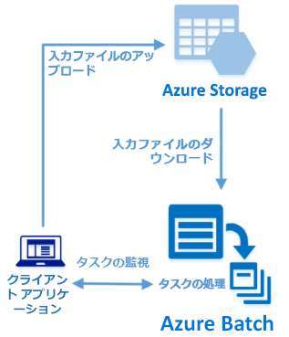

# <a name="quickstart-run-your-first-batch-job-with-the-python-api"></a>クイック スタート:Python API で最初の Batch ジョブを実行する

このクイック スタートでは、Azure Batch Python API に基づいて構築されたアプリケーションから Azure Batch ジョブを実行します。 このアプリでは、複数の入力データ ファイルを Azure Storage にアップロードしてから、Batch コンピューティング ノード (仮想マシン) の "*プール*" を作成します。 その後、基本的なコマンドを使用してプールの各入力ファイルを処理するための "*タスク*" を実行するサンプル "*ジョブ*" を作成します。 このクイック スタートを完了すると、Batch サービスの主要な概念を理解し、より大規模でより現実的なワークロードで Batch を試せるようになります。
 


[!INCLUDE [quickstarts-free-trial-note.md](../../includes/quickstarts-free-trial-note.md)]

## <a name="prerequisites"></a>前提条件

* [Python バージョン 2.7 または 3.3 以降](https://www.python.org/downloads/)

* [pip](https://pip.pypa.io/en/stable/installing/) パッケージ マネージャー

* Azure Batch アカウントおよびリンクされた Azure ストレージ アカウント。 これらのアカウントを作成するには、[Azure Portal](quick-create-portal.md) または [Azure CLI](quick-create-cli.md) を使用した Batch のクイック スタートを参照してください。 

## <a name="sign-in-to-azure"></a>Azure へのサインイン

Azure Portal ([https://portal.azure.com](https://portal.azure.com)) にサインインします。

[!INCLUDE [batch-common-credentials](../../includes/batch-common-credentials.md)]

## <a name="download-the-sample"></a>サンプルのダウンロード

GitHub から[サンプル アプリをダウンロードまたは複製](https://github.com/Azure-Samples/batch-python-quickstart)します。 Git クライアントを使用してサンプル アプリ リポジトリを複製するには、次のコマンドを使用します。

```bash
git clone https://github.com/Azure-Samples/batch-python-quickstart.git
```

Python スクリプト `python_quickstart_client.py` が含まれているディレクトリに移動します。

ご利用の Python 開発環境で、`pip` を使用して必要なパッケージをインストールします。

```bash
pip install -r requirements.txt
```

ファイル `config.py`を開きます。 Batch アカウントとストレージ アカウントの資格情報文字列を、アカウント用に取得した値で更新します。 例:

```Python
_BATCH_ACCOUNT_NAME = 'mybatchaccount'
_BATCH_ACCOUNT_KEY = 'xxxxxxxxxxxxxxxxE+yXrRvJAqT9BlXwwo1CwF+SwAYOxxxxxxxxxxxxxxxx43pXi/gdiATkvbpLRl3x14pcEQ=='
_BATCH_ACCOUNT_URL = 'https://mybatchaccount.mybatchregion.batch.azure.com'
_STORAGE_ACCOUNT_NAME = 'mystorageaccount'
_STORAGE_ACCOUNT_KEY = 'xxxxxxxxxxxxxxxxy4/xxxxxxxxxxxxxxxxfwpbIC5aAWA8wDu+AFXZB827Mt9lybZB1nUcQbQiUrkPtilK5BQ=='
```

## <a name="run-the-app"></a>アプリの実行

Batch ワークフローの動作を確認するには、スクリプトを実行します。

```bash
python python_quickstart_client.py
```

スクリプトの実行後に、コードを確認して、アプリケーションの各部分での処理内容を学習します。 

サンプル アプリケーションを実行すると、コンソールの出力は次のようになります。 実行中、プールのコンピューティング ノードを開始する際に、`Monitoring all tasks for 'Completed' state, timeout in 00:30:00...` で一時停止が発生します。 タスクは、最初のコンピューティング ノードが実行中になるとすぐに、実行するためにキューに登録されます。 Batch アカウントにプール、コンピューティング ノード、ジョブ、タスクを監視するには、[Azure Portal](https://portal.azure.com) で Batch アカウントに移動します。

```output
Sample start: 11/26/2018 4:02:54 PM

Container [input] created.
Uploading file taskdata0.txt to container [input]...
Uploading file taskdata1.txt to container [input]...
Uploading file taskdata2.txt to container [input]...
Creating pool [PythonQuickstartPool]...
Creating job [PythonQuickstartJob]...
Adding 3 tasks to job [PythonQuickstartJob]...
Monitoring all tasks for 'Completed' state, timeout in 00:30:00...
```

タスクが完了すると、タスクごとに次のような出力が表示されます。

```output
Printing task output...
Task: Task0
Node: tvm-2850684224_3-20171205t000401z
Standard out:
Batch processing began with mainframe computers and punch cards. Today it still plays a central role in business, engineering, science, and other pursuits that require running lots of automated tasks....
...
```

既定の構成でアプリケーションを実行する場合、通常の実行時間は約 3 分間です。 最初のプールの設定に最も時間がかかります。

## <a name="review-the-code"></a>コードの確認

このクイック スタートの Python アプリでは、次の処理を実行します。

* 3 つの小さいテキスト ファイルを Azure ストレージ アカウントの BLOB コンテナーにアップロードします。 これらのファイルは、Batch タスクで処理するための入力です。
* Ubuntu 18.04 LTS を実行している 2 つのコンピューティング ノードのプールを作成します。
* ノードで実行するジョブと 3 つのタスクを作成します。 各タスクは、Bash シェル コマンド ラインを使用して入力ファイルの 1 つを処理します。
* タスクによって返されるファイルを表示します。

詳細については、`python_quickstart_client.py` ファイルと以降のセクションを参照してください。

### <a name="preliminaries"></a>準備

ストレージ アカウントを操作するには、アプリで [azure-storage-blob](https://pypi.python.org/pypi/azure-storage-blob) パッケージを使用して [BlockBlobService](/python/api/azure.storage.blob.blockblobservice.blockblobservice) オブジェクトを作成します。

```python
blob_client = azureblob.BlockBlobService(
    account_name=config._STORAGE_ACCOUNT_NAME,
    account_key=config._STORAGE_ACCOUNT_KEY)
```

このアプリでは、`blob_client` 参照を使用して、ストレージ アカウントにコンテナーを作成したり、そのコンテナーにデータ ファイルをアップロードしたりします。 ストレージ内のファイルは、Batch の [ResourceFile](/python/api/azure.batch.models.resourcefile) オブジェクトとして定義されており、Batch が後でコンピューティング ノードにダウンロードできます。

```python
input_file_paths = [os.path.join(sys.path[0], 'taskdata0.txt'),
                    os.path.join(sys.path[0], 'taskdata1.txt'),
                    os.path.join(sys.path[0], 'taskdata2.txt')]

input_files = [
    upload_file_to_container(blob_client, input_container_name, file_path)
    for file_path in input_file_paths]
```

このアプリは [BatchServiceClient](/python/api/azure.batch.batchserviceclient) オブジェクトを作成して、Batch サービスでプール、ジョブ、タスクを作成および管理します。 このサンプルの Batch クライアントでは共有キー認証を使用します。 Batch では Azure Active Directory 認証もサポートされます。

```python
credentials = batch_auth.SharedKeyCredentials(config._BATCH_ACCOUNT_NAME,
                                              config._BATCH_ACCOUNT_KEY)

batch_client = batch.BatchServiceClient(
    credentials,
    batch_url=config._BATCH_ACCOUNT_URL)
```

### <a name="create-a-pool-of-compute-nodes"></a>コンピューティング ノードのプールの作成

Batch プールを作成するために、このアプリでは [PoolAddParameter](/python/api/azure.batch.models.pooladdparameter) クラスを使用して、ノードの数、VM のサイズ、プールの構成を設定します。 ここでは、[VirtualMachineConfiguration](/python/api/azure.batch.models.virtualmachineconfiguration) オブジェクトで [ImageReference](/python/api/azure.batch.models.imagereference) に、Azure Marketplace で公開されている Ubuntu Server 18.04 LTS イメージを指定します。 Batch は、Azure Marketplace の Linux および Windows Server のさまざまなイメージだけでなく、カスタム VM イメージもサポートしています。

ノードの数 (`_POOL_NODE_COUNT`) と VM のサイズ (`_POOL_VM_SIZE`) は、定義済みの定数です。 このサンプルでは、既定で、サイズ *Standard_A1_v2* の 2 つのノードで構成されるプールが作成されます。 推奨されるサイズは、この簡単な例についてパフォーマンスとコストのバランスが取れています。

[pool.add](/python/api/azure.batch.operations.pooloperations) メソッドは、プールを Batch サービスを送信します。

```python
new_pool = batch.models.PoolAddParameter(
    id=pool_id,
    virtual_machine_configuration=batchmodels.VirtualMachineConfiguration(
        image_reference=batchmodels.ImageReference(
            publisher="Canonical",
            offer="UbuntuServer",
            sku="18.04-LTS",
            version="latest"
        ),
        node_agent_sku_id="batch.node.ubuntu 18.04"),
    vm_size=config._POOL_VM_SIZE,
    target_dedicated_nodes=config._POOL_NODE_COUNT
)
batch_service_client.pool.add(new_pool)
```

### <a name="create-a-batch-job"></a>Batch ジョブの作成

Batch ジョブは、1 つ以上のタスクの論理グループです。 ジョブには、優先度やタスクの実行対象プールなど、タスクに共通する設定が含まれています。 このアプリでは、[JobAddParameter](/python/api/azure.batch.models.jobaddparameter) クラスを使用して、プールにジョブを作成します。 [job.add](/python/api/azure.batch.operations.joboperations) メソッドは、プールを Batch サービスに送信します。 最初、ジョブにはタスクがありません。

```python
job = batch.models.JobAddParameter(
    id=job_id,
    pool_info=batch.models.PoolInformation(pool_id=pool_id))
batch_service_client.job.add(job)
```

### <a name="create-tasks"></a>タスクの作成

このアプリは、[TaskAddParameter](/python/api/azure.batch.models.taskaddparameter) クラスを使用して、タスク オブジェクトの一覧を作成します。 各タスクは、`command_line` プロパティを使用して入力の `resource_files` オブジェクトを処理します。 このサンプルのコマンド ラインでは、Bash シェルの `cat` コマンドを実行してテキスト ファイルを表示します。 このコマンドは、デモンストレーション用の簡単な例です。 Batch を使用する場合、コマンド ラインは、アプリまたはスクリプトを指定する場所です。 Batch には、アプリやスクリプトをコンピューティング ノードにデプロイする方法が多数用意されています。

その後、アプリは、[task.add_collection](/python/api/azure.batch.operations.taskoperations) メソッドを使用してジョブにタスクを追加します。これにより、タスクは、コンピューティング ノードで実行するためにキューに登録されます。 

```python
tasks = list()

for idx, input_file in enumerate(input_files):
    command = "/bin/bash -c \"cat {}\"".format(input_file.file_path)
    tasks.append(batch.models.TaskAddParameter(
        id='Task{}'.format(idx),
        command_line=command,
        resource_files=[input_file]
    )
    )
batch_service_client.task.add_collection(job_id, tasks)
```

### <a name="view-task-output"></a>タスク出力の表示

アプリは、タスクの状態を監視し、タスクが完了したことを確認します。 その後、アプリには、完了した各タスクによって生成される `stdout.txt` ファイルが表示されます。 タスクが正常に実行されると、タスク コマンドの出力は `stdout.txt` に書き込まれます。

```python
tasks = batch_service_client.task.list(job_id)

for task in tasks:

    node_id = batch_service_client.task.get(job_id, task.id).node_info.node_id
    print("Task: {}".format(task.id))
    print("Node: {}".format(node_id))

    stream = batch_service_client.file.get_from_task(
        job_id, task.id, config._STANDARD_OUT_FILE_NAME)

    file_text = _read_stream_as_string(
        stream,
        encoding)
    print("Standard output:")
    print(file_text)
```

## <a name="clean-up-resources"></a>リソースのクリーンアップ

アプリは自動的に、作成された入力用ストレージ コンテナーを削除し、Batch プールとジョブを削除するためのオプションを表示します。 ジョブがスケジュールされていない場合でも、ノードの実行中はプールに対して料金が発生します。 プールは不要になったら、削除してください。 プールを削除すると、ノード上のタスク出力はすべて削除されます。 

リソース グループ、Batch アカウント、ストレージ アカウントは、不要になったら削除します。 Azure Portal でこれを行うには、Batch アカウントのリソース グループを選択し、 **[リソース グループの削除]** をクリックしてください。

## <a name="next-steps"></a>次の手順

このクイック スタートでは、Batch Python API を使用して構築された小さいアプリを実行し、Batch プールと Batch ジョブを作成しました。 このジョブによってサンプル タスクが実行され、作成された出力がノードにダウンロードされました。 Batch サービスの主要な概念を理解できたので、より大規模でより現実的なワークロードを使用して Batch を試す準備が整いました。 Azure Batch の詳細を確認し、実際のアプリケーションで並列ワークロードを詳しく見てみるには、Batch Python のチュートリアルに進んでください。

> [!div class="nextstepaction"]
> [Python を使用して並列ワークロードを処理する](tutorial-parallel-python.md)
