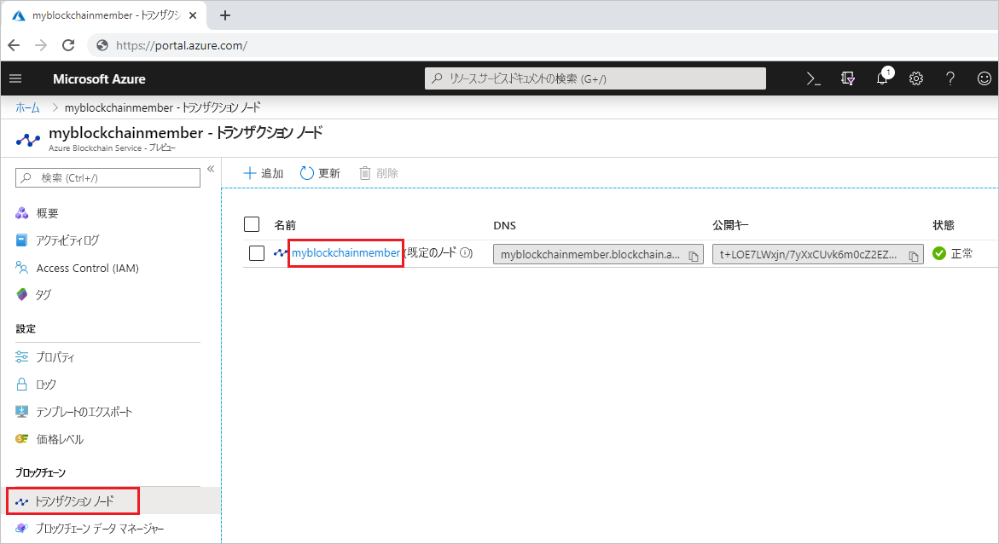
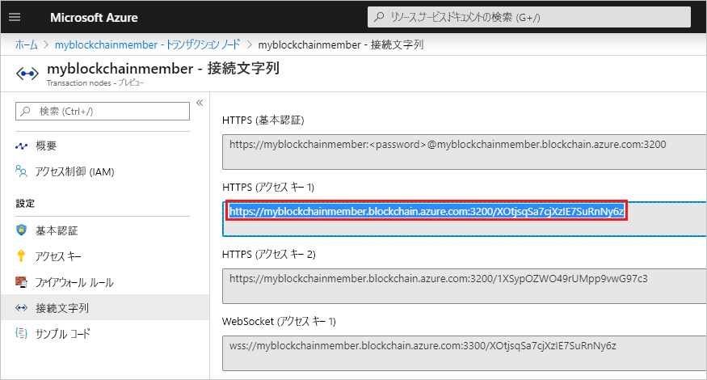

# <a name="quickstart-use-geth-to-attach-to-an-azure-blockchain-service-transaction-node"></a>クイック スタート:Geth を使用して Azure Blockchain Service のトランザクション ノードに接続する

このクイックスタートでは、Geth クライアントを使用して Azure Blockchain Service トランザクション ノード上の Geth インスタンスに接続します。 接続したら、Geth コンソールを使用して Ethereum JavaScript API を呼び出します。

[!INCLUDE [quickstarts-free-trial-note](../../../includes/quickstarts-free-trial-note.md)]

## <a name="prerequisites"></a>前提条件

* [Geth](https://github.com/ethereum/go-ethereum/wiki/geth) をインストールする
* 「[Quickstart: Azure portal を使用したブロックチェーン メンバーの作成](create-member.md)に関するページと、「[クイック スタート: Azure CLI を使用して Azure Blockchain Service ブロックチェーン メンバーを作成する](create-member-cli.md)」を完了していること

## <a name="get-geth-connection-string"></a>Geth の接続文字列を取得する

Azure Blockchain Service トランザクションノードの Geth 接続文字列は、Azure portal 内で取得できます。

1. [Azure portal](https://portal.azure.com) にサインインします。
1. Azure Blockchain Service メンバーに移動します。 **[Transaction nodes]\(トランザクション ノード\)** と既定のトランザクション ノード リンクを選択します。

    

1. **[接続文字列]** を選択します。
1. **[HTTPS (Access key 1)]\(HTTPS (アクセス キー 1)\)** の接続文字列をコピーします。 この文字列は次のセクションで必要になります。

    

## <a name="connect-to-geth"></a>Geth に接続する

1. コマンド プロンプトまたはシェルを開きます。
1. Geth attach サブコマンドを使用して、トランザクション ノード上で実行中の Geth インスタンスにアタッチします。 attach サブコマンドの引数として接続文字列を貼り付けます。 次に例を示します。

    ``` bash
    geth attach <connection string>
    ```

1. トランザクション ノードの Ethereum コンソールに接続すると、Ethereum JavaScript API を使用することができます。

    たとえば、chainId を見つけるには次の API を使用します。

    ``` bash
    admin.nodeInfo.protocols.istanbul.config.chainId
    ```

    この例では、chainId は 661 です。

    

1. コンソールから切断するには、「`exit`」と入力します。

## <a name="next-steps"></a>次のステップ

このクイックスタートでは、Geth クライアントを使用して Azure Blockchain Service トランザクション ノード上の Geth インスタンスにアタッチしました。 次は、Azure Blockchain Development Kit for Ethereum を使用してトランザクションを介したスマート コントラクト関数を作成、ビルド、デプロイ、実行するチュートリアルに挑戦してみてください。

> [!div class="nextstepaction"]
> [スマート コントラクトの作成、ビルド、Azure Blockchain Service へのデプロイ](send-transaction.md)
