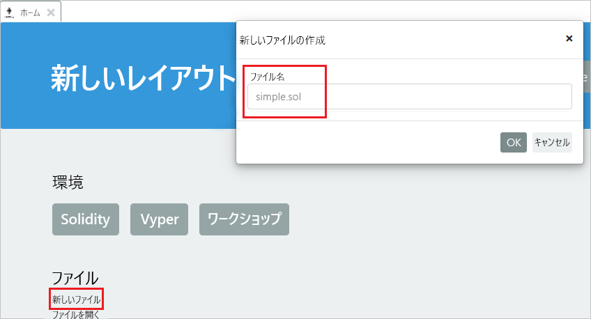

# <a name="quickstart-use-metamask-to-connect-and-deploy-a-smart-contract"></a>クイック スタート:MetaMask を使用してスマート コントラクトを接続およびデプロイする

このクイックスタートでは、MetaMask を使用して Azure Blockchain Service ネットワークに接続し、Remix を使用してスマート コントラクトをデプロイします。 Metamask は、Ether ウォレットを管理し、スマート コントラクト アクションを実行するブラウザー拡張機能です。

[!INCLUDE [quickstarts-free-trial-note](../../../includes/quickstarts-free-trial-note.md)]

## <a name="prerequisites"></a>前提条件

* [Azure Blockchain メンバーを作成する](create-member.md)
* [MetaMask ブラウザー拡張機能](https://metamask.io)をインストールする
* MetaMask [ウォレット](https://metamask.zendesk.com/hc/en-us/articles/360015488971-New-to-MetaMask-Learn-How-to-Setup-MetaMask-the-First-Time)を生成する

## <a name="get-endpoint-address"></a>エンドポイント アドレスを取得する

ブロックチェーン ネットワークに接続するには、Azure Blockchain Service エンドポイント アドレスが必要です。 エンドポイント アドレスとアクセス キーは、Azure portal で確認できます。

1. [Azure Portal](https://portal.azure.com) にサインインします。
1. Azure Blockchain Service メンバーに移動します。 **[Transaction nodes]\(トランザクション ノード\)** と既定のトランザクション ノード リンクを選択します。

    

1. **[接続文字列] > [アクセス キー]** の順に選択します。
1. **[HTTPS (Access key 1)]\(HTTPS (アクセス キー 1)\)** のエンドポイント アドレスをコピーします。 このアドレスは次のセクションで必要になります。

    

## <a name="connect-metamask"></a>MetaMask を接続する

1. MetaMask ブラウザー拡張機能を開き、サインインします。
1. ネットワーク ドロップダウンで **[Custom RPC]\(カスタム RPC\)** を選択します。

    

1. 前のセクションでコピーしたエンドポイント アドレスを **[New Network]\(新しいネットワーク\) > [New RPC URL]\(新しい RPC URL\)** に入力します。
1. **[保存]** を選択します。

    接続が成功すると、ネットワーク ドロップダウンにプライベート ネットワークが表示されます。

    

## <a name="deploy-smart-contract"></a>スマート コントラクトをデプロイする

Remix はブラウザーベースの Solidity 開発環境です。 MetaMask と Remix を併用すると、スマート コントラクトをデプロイし、それに対してアクションを実行できます。

1. ブラウザーで `https://remix.ethereum.org` にアクセスします。
1. **[実行]** を選択します。 

    MetaMask によって、**[Environment]\(環境\)** が **[Injected Web3]\(挿入された Web3\)** に、**[Account]\(アカウント\)** がお使いのネットワークに設定されます。

    ![[Run]\(実行\) タブ](./media/connect-metamask/injected-web3.png)

1. **[Create new file]\(新しいファイルの作成\)** を選択します。

    新しいファイルに `simple.sol` という名前を付けます。

    

    **[OK]** を選択します。

1. Remix エディターに次の **simple スマート コントラクト** コードを貼り付けます。

    ```solidity
    pragma solidity ^0.5.0;
             
    contract simple {
        uint balance;
                 
        constructor() public{
            balance = 0;
        }
                 
        function add(uint _num) public {
            balance += _num;
        }
                 
        function get() public view returns (uint){
            return balance;
        }
    }
    ```

    この **simple コントラクト**では、**balance** という状態変数を宣言します。 2 つの関数が定義されています。 **add** 関数によって **balance** に数値が追加されます。 **get** 関数は **balance** の値を返します。

1. コントラクトをコンパイルするには、**[Compile]\(コンパイル\) > [Start to compile]\(コンパイルの開始\)** の順に選択します。 成功すると、緑色のボックスとコントラクト名が表示されます。

    

1. コントラクトを実行するには、**[Run]\(実行\)** タブを選択します。**simple** コントラクト、**[Deploy]\(デプロイ\)** の順に選択します。

    

1. 資金が不十分でトランザクションを実行できないことを警告する MetaMask 通知が表示されます。

    パブリック ブロックチェーン ネットワークの場合、トランザクション コストを支払うには Ether が必要です。 これはコンソーシアム内のプライベート ネットワークなので、ガス料金をゼロに設定できます。

1.  **[Gas Fee]\(ガス料金\) > [Edit]\(編集\) > [Advanced]\(詳細\)** の順に選択し、**[Gas Price]\(ガス料金\)** を 0 に設定します。

    

    **[保存]** を選択します。

1. **[Confirm]\(確認\)** を選択してスマート コントラクトをブロックチェーンにデプロイします。
1. **[Deployed Contracts]\(デプロイ済みのコントラクト\)** セクションで **simple** コントラクトを展開します。

    

    コントラクトに定義されている関数にマップされる 2 つのアクション **add** および **get** があります。

1. ブロックチェーンに対して **add** トランザクションを実行するには、追加する数値を入力し、**[add]** を選択します。
1. コントラクトをデプロイしたときと同様に、資金が不十分でトランザクションを実行できないことを警告する MetaMask 通知が表示されます。

    これはコンソーシアム内のプライベート ネットワークなので、ガス料金をゼロに設定できます。

1.  **[Gas Fee]\(ガス料金\) > [Edit]\(編集\) > [Advanced]\(詳細\)** の順に選択し、**[Gas Price]\(ガス料金\)** を 0 に設定して、**[Save]\(保存\)** を選択します。
1. **[Confirm]\(確認\)** を選択して、ブロックチェーンに対してトランザクションを実行します。
1. **[get]** アクションを選択します。 これは、クエリ ノード データの呼び出しです。 トランザクションは必要ありません。
1. Remix のデバッグ ウィンドウでは、ブロックチェーンに対するトランザクションに関する詳細を確認できます。

    

    **simple** コントラクトの作成、**simple.add** のトランザクション、**simple.get** の呼び出しを確認できます。

1. また、MetaMask のトランザクション履歴も確認できます。 MetaMask ブラウザー拡張機能を開きます。
1. **[History]\(履歴\)** セクションでは、デプロイされているコントラクトとトランザクションのログを確認できます。

## <a name="next-steps"></a>次の手順

このクイックスタートでは、MetaMask ブラウザー拡張機能を使用して Azure Blockchain Service トランザクション ノードに接続し、スマート コントラクトをデプロイし、トランザクションをブロックチェーンに送信しました。 次のチュートリアルで、Truffle を使用したトランザクションのデプロイと送信を試してください。

> [!div class="nextstepaction"]
> [トランザクションを送信する](send-transaction.md)