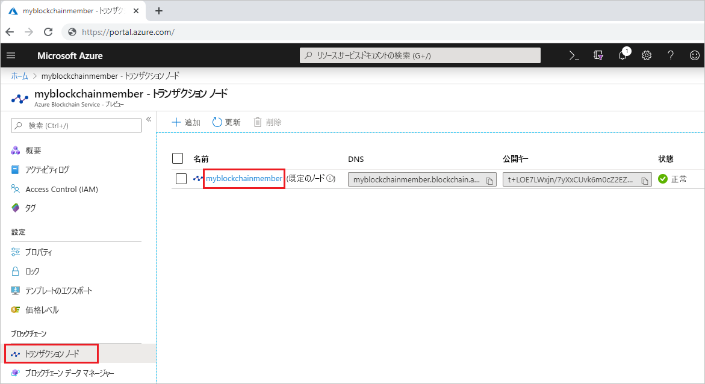
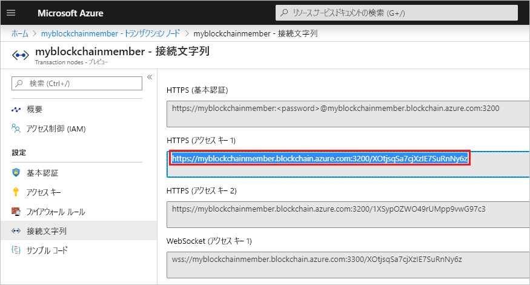
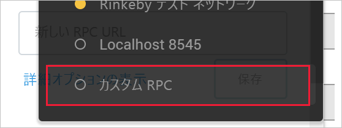
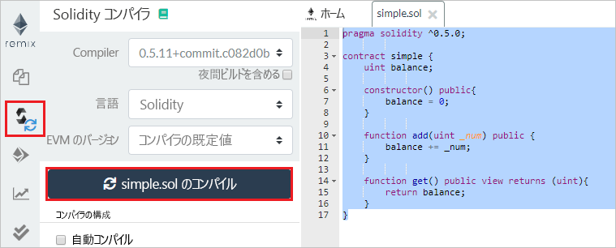
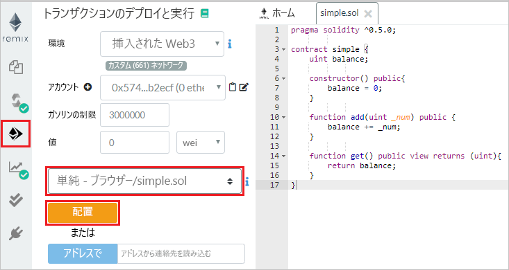
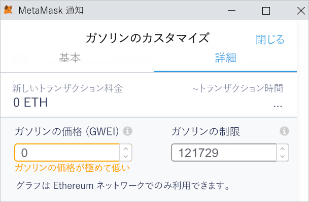
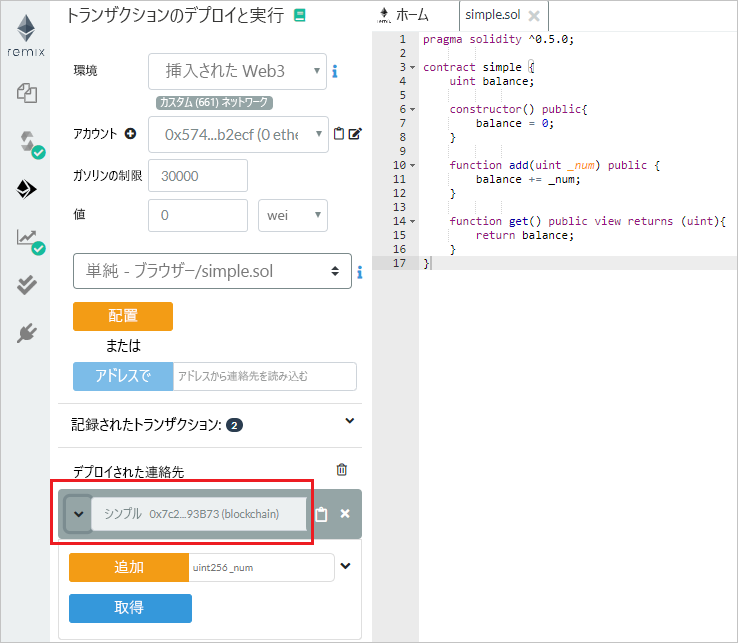
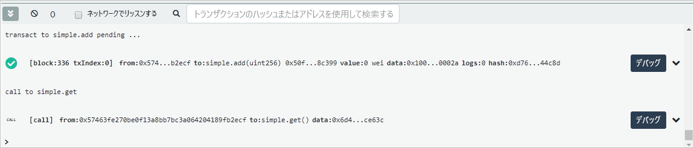

# <a name="quickstart-use-metamask-to-connect-and-deploy-a-smart-contract"></a>クイック スタート:MetaMask を使用してスマート コントラクトを接続およびデプロイする

このクイックスタートでは、MetaMask を使用して Azure Blockchain Service ネットワークに接続し、Remix を使用してスマート コントラクトをデプロイします。 Metamask は、Ether ウォレットを管理し、スマート コントラクト アクションを実行するブラウザー拡張機能です。

[!INCLUDE [quickstarts-free-trial-note](../../../includes/quickstarts-free-trial-note.md)]

## <a name="prerequisites"></a>前提条件

* 「[Quickstart: Azure portal を使用したブロックチェーン メンバーの作成](create-member.md)に関するページと、「[クイック スタート: Azure CLI を使用して Azure Blockchain Service ブロックチェーン メンバーを作成する](create-member-cli.md)」を完了していること
* [MetaMask ブラウザー拡張機能](https://metamask.io)をインストールする
* MetaMask [ウォレット](https://metamask.zendesk.com/hc/en-us/articles/360015488971-New-to-MetaMask-Learn-How-to-Setup-MetaMask-the-First-Time)を生成する

## <a name="get-endpoint-address"></a>エンドポイント アドレスを取得する

ブロックチェーン ネットワークに接続するには、Azure Blockchain Service エンドポイント アドレスが必要です。 エンドポイント アドレスとアクセス キーは、Azure portal に表示されます。

1. [Azure portal](https://portal.azure.com) にサインインします。
1. Azure Blockchain Service メンバーに移動します。
1. **[Transaction nodes]\(トランザクション ノード\)** と既定のトランザクション ノード リンクを選択します。

    

1. **[接続文字列] > [アクセス キー]** の順に選択します。
1. **[HTTPS (Access key 1)]\(HTTPS (アクセス キー 1)\)** のエンドポイント アドレスをコピーします。

    

## <a name="connect-metamask"></a>MetaMask を接続する

1. MetaMask ブラウザー拡張機能を開き、サインインします。
1. ネットワーク ドロップダウンで **[Custom RPC]\(カスタム RPC\)** を選択します。

    

1. **[新規ネットワーク] > [New RPC URL]\(新しい RPC URL\)** の順に移動して、上記でコピーしたエンドポイント アドレスを貼り付けます。
1. **[保存]** を選択します。

    接続が成功すると、[ネットワーク] ドロップダウンにプライベート ネットワークが表示されます。

    

## <a name="deploy-smart-contract"></a>スマート コントラクトをデプロイする

Remix はブラウザーベースの Solidity 開発環境です。 MetaMask と Remix を併用すると、スマート コントラクトをデプロイし、それに対してアクションを実行できます。

1. ブラウザーで `https://remix.ethereum.org` にアクセスします。
1. **[Home]\(ホーム\)** タブの **[File]\(ファイル\)** で **[New file]\(新しいファイル\)** を選択します。

    新しいファイルに `simple.sol` という名前を付けます。

    ![[ファイルの作成]](./media/connect-metamask/create-file.png)

    **[OK]** を選択します。
1. Remix エディターに次の **simple スマート コントラクト** コードを貼り付けます。

    ```solidity
    pragma solidity ^0.5.0;
             
    contract simple {
        uint balance;
                 
        constructor() public{
            balance = 0;
        }
                 
        function add(uint _num) public {
            balance += _num;
        }
                 
        function get() public view returns (uint){
            return balance;
        }
    }
    ```

    この **simple コントラクト**では、**balance** という状態変数を宣言します。 2 つの関数が定義されています。 **add** 関数によって **balance** に数値が追加されます。 **get** 関数は **balance** の値を返します。
1. コントラクトをコンパイルするには、まず Solidity コンパイラ ウィンドウを選択し、次に **[Compile simple.sol]\(simple.sol をコンパイルする\)** を選択します。

    

1. **[Deploy & Run]\(展開して実行\)** ウィンドウを選択し、 **[Environment]\(環境\)** を **[Injected Web3]\(挿入された Web3\)** に設定して、MetaMask 経由でブロックチェーン メンバーに接続します。

    ![[Run]\(実行\) タブ](./media/connect-metamask/injected-web3.png)

1. **simple** コントラクト、 **[デプロイ]** の順に選択します。

    


1. MetaMask 通知により、資金不足でトランザクションを実行できないことが警告されます。

    パブリック ブロックチェーン ネットワークの場合、トランザクション コストを支払うには Ether が必要です。 これはコンソーシアム内のプライベート ネットワークなので、ガス料金をゼロに設定できます。

1.  **[Gas Fee]\(ガス料金\) > [Edit]\(編集\) > [Advanced]\(詳細\)** の順に選択し、 **[Gas Price]\(ガス料金\)** を 0 に設定します。

    

    **[保存]** を選択します。

1. **[Confirm]\(確認\)** を選択してスマート コントラクトをブロックチェーンにデプロイします。
1. **[Deployed Contracts]\(デプロイ済みのコントラクト\)** セクションで **simple** コントラクトを展開します。

    

    2 つのアクション **add** および **get** が、コントラクトに定義されている関数にマップされます。

1. ブロックチェーンに対して **add** トランザクションを実行するには、追加する数値を入力し、 **[add]** を選択します。 Remix からガスの推定失敗メッセージ "You are sending the transaction to a private blockchain that does not require gas." (ガスを必要としないプライベート ブロックチェーンにトランザクションを送信しようとしています。) が表示される場合があります。 **[Send Transaction]\(トランザクションの送信\)** を選択して、トランザクションを強制的に実行します。
1. コントラクトをデプロイしたときと同様に、MetaMask 通知により、資金不足でトランザクションを実行できないことが警告されます。

    これはコンソーシアム内のプライベート ネットワークなので、ガス料金をゼロに設定できます。

1. **[Gas Fee]\(ガス料金\) > [Edit]\(編集\) > [Advanced]\(詳細\)** の順に選択し、 **[Gas Price]\(ガスの価格\)** を 0 に設定して、 **[Save]\(保存\)** を選択します。
1. **[Confirm]\(確認\)** を選択して、ブロックチェーンにトランザクションを送信します。
1. **[get]** アクションを選択します。 これは、クエリ ノード データの呼び出しです。 トランザクションは必要ありません。

Remix のデバッグ ウィンドウに、ブロックチェーンに対するトランザクションの詳細が表示されます。

    

    You can see the **simple** contract creation, transaction for **simple.add**, and call to **simple.get**.

MetaMask のトランザクション履歴を確認するには、MetaMask ブラウザー拡張機能を開いて、 **[History]\(履歴\)** セクションで、デプロイされたコントラクトとトランザクションのログを調べます。

## <a name="next-steps"></a>次のステップ

このクイックスタートでは、MetaMask ブラウザー拡張機能を使用して Azure Blockchain Service トランザクション ノードに接続し、スマート コントラクトをデプロイし、トランザクションをブロックチェーンに送信しました。 次のチュートリアルで、Ethereum および Truffle 用の Azure Blockchain Development Kit を使用して、トランザクションを介したスマート コントラクト関数の作成、ビルド、デプロイ、実行を試してみます。

> [!div class="nextstepaction"]
> [スマート コントラクトの作成、ビルド、Azure Blockchain Service へのデプロイ](send-transaction.md)