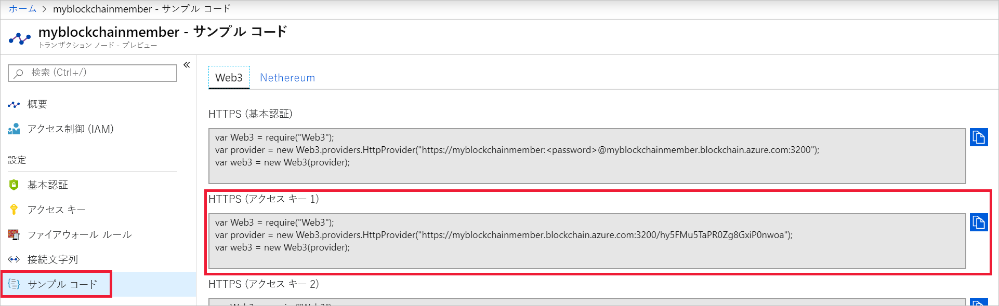

# <a name="quickstart-use-truffle-to-connect-to-an-azure-blockchain-service-network"></a>クイック スタート:Truffle を使用して Azure Blockchain Service ネットワークに接続する

Truffle は、Azure Blockchain Service ノードへの接続に使用できるブロックチェーン開発環境です。

[!INCLUDE [quickstarts-free-trial-note](../../../includes/quickstarts-free-trial-note.md)]

## <a name="prerequisites"></a>前提条件

* [Azure Blockchain メンバーを作成する](create-member.md)
* [Truffle](https://github.com/trufflesuite/truffle) をインストールする。 Truffle では、[Node.js](https://nodejs.org)、[Git](https://git-scm.com/book/en/v2/Getting-Started-Installing-Git) など、いくつかのツールがインストールされている必要があります。
* [Python 2.7.15](https://www.python.org/downloads/release/python-2715/) をインストールする。 Python は Web3 に必要です。

## <a name="create-truffle-project"></a>Truffle プロジェクトを作成する

1. Node.js コマンド プロンプトまたはシェルを開きます。
1. ディレクトリを Truffle プロジェクト ディレクトリを作成する場所に変更します。
1. プロジェクト用のディレクトリを作成し、パスを新しいディレクトリに変更します。 たとえば、次のように入力します。

    ``` bash
    mkdir truffledemo
    cd truffledemo
    ```

1. Truffle プロジェクトを初期化します。

    ``` bash
    truffle init
    ```

1. プロジェクト フォルダーに Ethereum JavaScript API web3 をインストールします。 現在、バージョン web3 バージョン 1.0.0-beta.37 が必要です。

    ``` bash
    npm install web3@1.0.0-beta.37
    ```

    インストール中に npm の警告が表示されることがあります。

1. Truffle の対話型開発コンソールを起動します。

    ``` bash
    truffle develop
    ```

    Truffle では、ローカルの開発用ブロックチェーンが作成されて、対話型コンソールが提供されます。

## <a name="connect-to-transaction-node"></a>トランザクション ノードに接続する

*Web3* を使用してトランザクション ノードに接続します。 *Web3* の接続文字列は、Azure portal から取得できます。

1. [Azure Portal](https://portal.azure.com) にサインインします。
1. Azure Blockchain Service メンバーに移動します。 **[Transaction nodes]\(トランザクション ノード\)** と既定のトランザクション ノード リンクを選択します。

    

1. **[Sample Code]\(サンプル コード\) > [Web3]\(Web3\)** を選択します。
1. **[HTTPS (Access key 1)]\(HTTPS (アクセス キー 1)\)** から JavaScript をコピーします。 Truffle の対話型開発コンソールのコードが必要です。

    

1. 前の手順の JavaScript コードを、Truffle の対話型開発コンソールに貼り付けます。 そのコードでは、Azure Blockchain Service のトランザクション ノードに接続される web3 オブジェクトが作成されます。

    出力例:

    ```bash
    truffle(develop)> var Web3 = require("Web3");
    truffle(develop)> var provider = new Web3.providers.HttpProvider("https://myblockchainmember.blockchain.azure.com:3200/hy5FMu5TaPR0Zg8GxiPwned");
    truffle(develop)> var web3 = new Web3(provider);
    ```

    **web3** オブジェクトでメソッドを呼び出して、トランザクション ノードと対話することができます。

1. **getBlockNumber** メソッドを呼び出して現在のブロック番号を返します。

    ```bash
    web3.eth.getBlockNumber();
    ```

    出力例:

    ```bash
    truffle(develop)> web3.eth.getBlockNumber();
    18567
    ```
1. Truffle 開発コンソールを終了します。

    ```bash
    .exit
    ```

## <a name="next-steps"></a>次の手順

このクイックスタートでは、Azure Blockchain Service の既定のトランザクション ノードに接続する Truffle プロジェクトを作成しました。

次のチュートリアルで、Truffle を使用したコンソーシアム ブロックチェーン ネットワークへのトランザクションの送信を試してください。

> [!div class="nextstepaction"]
> [トランザクションを送信する](send-transaction.md)