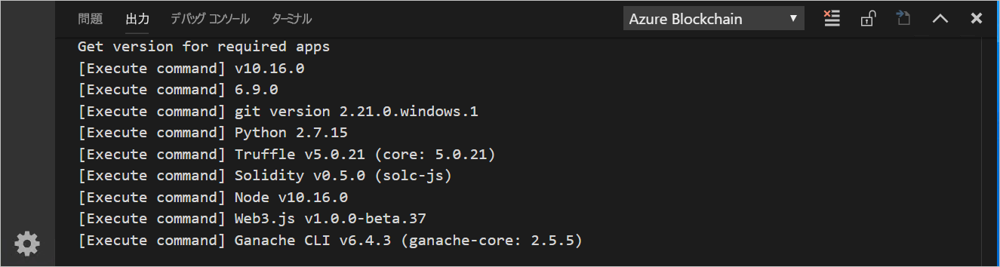
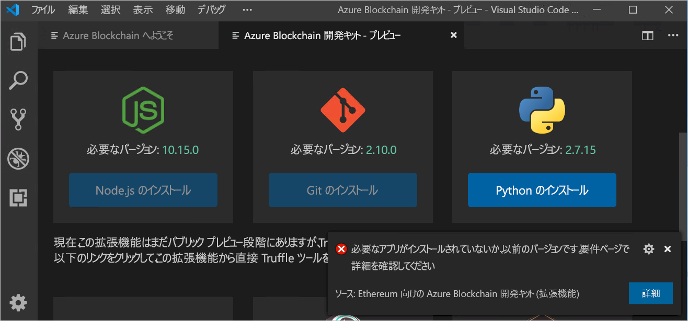
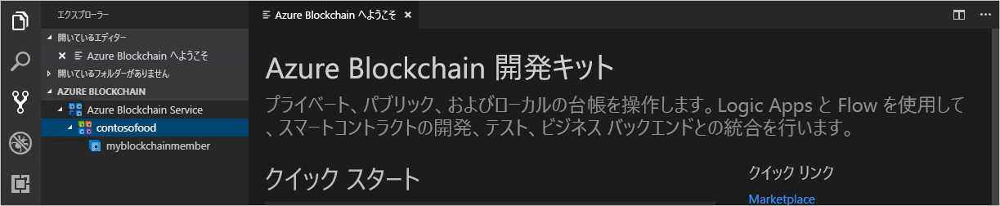

# クイック スタート:Visual Studio Code を使用して Azure Blockchain Service コンソーシアム ネットワークに接続する

このクイックスタートでは、Azure Blockchain Development Kit for Ethereum Visual Studio Code (VS Code) 拡張機能をインストールして使用し、Azure Blockchain Service 上のコンソーシアムに接続します。 Azure Blockchain 開発キットを使用すると、Ethereum ブロックチェーン台帳上のスマート コントラクトの作成、接続、ビルド、デプロイを簡単に行うことができます。

[!INCLUDE [quickstarts-free-trial-note](../../../includes/quickstarts-free-trial-note.md)]

## 前提条件

* 「[Quickstart: Azure portal を使用したブロックチェーン メンバーの作成](create-member.md)に関するページと、「[クイック スタート: Azure CLI を使用して Azure Blockchain Service ブロックチェーン メンバーを作成する](create-member-cli.md)」を完了していること
* [Visual Studio Code](https://code.visualstudio.com/Download)
* [Azure Blockchain Development Kit for Ethereum 拡張機能](https://marketplace.visualstudio.com/items?itemName=AzBlockchain.azure-blockchain)
* [Node.js 10.15.x 以降](https://nodejs.org/download)
* [Git 2.10.x 以降](https://git-scm.com)
* [Python 2.7.15](https://www.python.org/downloads/release/python-2715/)。python.exe をパスに追加します。 Azure Blockchain 開発キットでは、パス内に Python バージョン 2.7.15 が必要です。
* [Truffle 5.0.0](https://www.trufflesuite.com/docs/truffle/getting-started/installation)
* [Ganache CLI 6.0.0](https://github.com/trufflesuite/ganache-cli)

Windows では、node-gyp モジュール用にインストール済みの C++ コンパイラが必要です。 MSBuild Tools を使用できます。

* Visual Studio 2017 がインストールされている場合は、`npm config set msvs_version 2017 -g` コマンドを使用して、MSBuild Tools を使用するように npm を構成します
* Visual Studio 2019 がインストールされている場合は、npm に対して MSBuild Tools のパスを設定します。 たとえば、`npm config set msbuild_path "C:\Program Files (x86)\Microsoft Visual Studio\2019\Community\MSBuild\Current\Bin\MSBuild.exe"` のように指定します。
* それ以外の場合は、"*管理者として実行された*" 管理者特権を持つコマンド シェルで `npm install --global windows-build-tools` を使用して、スタンドアロンの VS ビルド ツールをインストールします。

node-gyp の詳細については、[GitHub の node-gyp のリポジトリ](https://github.com/node-gyp)を参照してください。

### Azure Blockchain Development Kit の環境を検証する

Azure Blockchain Development Kit では、自分の開発環境の前提条件が満たされていることが確認されます。 開発環境を検証するには:

VS Code コマンド パレットで、 **[Azure Blockchain: Show Welcome Page]\(Azure Blockchain: ウェルカム ページを表示\)** を選択します。

Azure Blockchain Development Kit によって、完了までに約 1 分かかる検証スクリプトが実行されます。 出力を表示するには、 **[ターミナル] > [新しいターミナル]** の順に選択します。 ターミナルのメニュー バーで、 **[出力]** タブを選択し、ドロップダウン リストの **[Azure Blockchain]** を選択します。 検証が成功すると、次の画像のように表示されます。

 必要なツールがない場合は、 **[Azure Blockchain Development Kit - Preview]\(Azure Blockchain 開発キット - プレビュー\)** という名前の新しいタブに、必要なツールとダウンロードするためのリンクの一覧が表示されます。

クイックスタートを続ける前に、不足している前提条件をすべてインストールします。

## コンソーシアム メンバーに接続する

Azure Blockchain Development Kit VS Code 拡張機能を使用して、コンソーシアム メンバーに接続できます。 コンソーシアムに接続したら、スマート コントラクトをコンパイル、ビルドし、Azure Blockchain Service コンソーシアム メンバーにデプロイできます。

Azure Blockchain Service コンソーシアム メンバーにアクセスできない場合は、前提条件の「[クイックスタート: Azure portal を使用したブロックチェーン メンバーの作成](create-member.md)に関するページと、「[クイック スタート: Azure CLI を使用して Azure Blockchain Service ブロックチェーン メンバーを作成する](create-member-cli.md)」を完了してください。

1. VS Code のエクスプローラー ペインで、 **[Azure Blockchain]** 拡張機能を展開します。
1. **[Connect to network]\(ネットワークに接続\)** を選択します。

   

    Azure 認証を求められた場合は、プロンプトに従って、ブラウザーを使用して認証します。
1. コマンド パレットのドロップダウンで **[Azure Blockchain Service]** を選択します。
1. Azure Blockchain Service コンソーシアム メンバーに関連付けられているサブスクリプションとリソース グループを選択します。
1. 一覧からコンソーシアムを選択します。

コンソーシアムおよびブロックチェーン メンバーは、VS Code エクスプローラーのサイド バーに一覧表示されます。

## 次の手順

このクイックスタートでは、Azure Blockchain Development Kit for Ethereum VS Code 拡張機能を使用して、Azure Blockchain Service 上のコンソーシアムに接続しました。 次は、Azure Blockchain Development Kit for Ethereum を使用してトランザクションを介したスマート コントラクト関数を作成、ビルド、デプロイ、実行するチュートリアルに挑戦してみてください。

> [!div class="nextstepaction"]
> [スマート コントラクトの作成、ビルド、Azure Blockchain Service へのデプロイ](send-transaction.md)