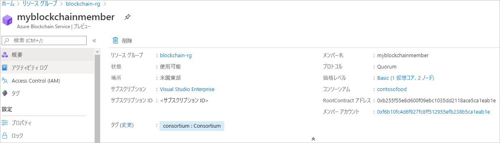

# クイック スタート:ARM テンプレートを使用して Azure Blockchain Service メンバーを作成する

このクイックスタートでは、Azure Resource Manager テンプレート (ARM テンプレート) を使用して、Azure Blockchain Service 内に新しいブロックチェーン メンバーとコンソーシアムをデプロイします。 Azure Blockchain Service メンバーは、プライベート コンソーシアム ブロックチェーン ネットワーク内のブロックチェーン ノードです。 メンバーをプロビジョニングするときは、コンソーシアム ネットワークを作成するか、またはコンソーシアム ネットワークに参加することができます。 コンソーシアム ネットワークには少なくとも 1 つのメンバーが必要です。 参加者が必要とするブロックチェーン メンバーの数は、シナリオによって異なります。 コンソーシアムの参加者は、1 つまたは複数のブロックチェーン メンバーを有するか、または他の参加者との間でメンバーを共有することができます。 コンソーシアムの詳細については、「[Azure Blockchain Service のコンソーシアム](consortium.md)」を参照してください。

[!INCLUDE [About Azure Resource Manager](../../../includes/resource-manager-quickstart-introduction.md)]

環境が前提条件を満たしていて、ARM テンプレートの使用に慣れている場合は、 **[Azure へのデプロイ]** ボタンを選択します。 Azure portal でテンプレートが開きます。

## 前提条件

Azure サブスクリプションをお持ちでない場合は、開始する前に[無料](https://azure.microsoft.com/free/)アカウントを作成してください。

## テンプレートを確認する

このクイックスタートで使用されるテンプレートは [Azure クイックスタート テンプレート](https://azure.microsoft.com/resources/templates/201-blockchain-asaservice/)からのものです。

:::code language="json" source="~/quickstart-templates/201-blockchain-asaservice/azuredeploy.json":::

テンプレート内に定義されている Azure リソース:

* [**Microsoft.Blockchain/blockchainMembers**](/azure/templates/microsoft.blockchain/blockchainmembers)

## テンプレートのデプロイ

1. Azure にサインインして、テンプレートを開くには、次のリンクを選択します。

    

1. Azure Blockchain Service のメンバーの設定を選択します。

    設定 | 説明
    --------|------------
    サブスクリプション | サービスに使用する Azure サブスクリプションを選択します。 複数のサブスクリプションをお持ちの場合は、リソースの課金対象となるサブスクリプションを選択してください。
    Resource group | 新しいリソース グループ名を作成するか、サブスクリプションの既存のリソース グループ名を選択します。
    リージョン | リソース グループを作成するリージョンを選択します。 コンソーシアムのメンバーの場所は全員同じにする必要があります。 デプロイに使用できる場所は *westeurope、eastus、southeastasia、westeurope、northeurope、westus2*、および *japaneast* です。 一部のリージョンでは、機能が利用できない場合があります。 Azure Blockchain Data Manager は、次の Azure リージョンで利用できます: 米国東部と西ヨーロッパ) で運営される基本的な Web サイトの 2 つのインスタンス。
    Blockchain メンバー名 | Azure Blockchain Service のメンバーの一意の名前を選択します。 ブロックチェーン メンバー名に使用できるのは、小文字と数字のみです。 先頭の文字は英字にする必要があります。 値の長さは 2 から 20 文字にする必要があります。
    コンソーシアム名 | 一意の名前を入力します。 コンソーシアムの詳細については、「[Azure Blockchain Service のコンソーシアム](consortium.md)」を参照してください。
    メンバー パスワード | メンバーの既定のトランザクション ノードのパスワード。 このパスワードは、ブロックチェーン メンバーの既定のトランザクション ノード パブリック エンドポイントに接続する際の基本認証に使用します。
    コンソーシアム管理アカウントのパスワード | コンソーシアム アカウントのパスワードは、メンバー用に作成される Ethereum アカウントの秘密キーの暗号化に使用されます。 これは、コンソーシアムの管理に使用されます。
    SKU レベル | 新しいサービスの価格レベル。 **Standard** と **Basic** のいずれかのレベルを選択します。 開発、テスト、概念実証には、*Basic* レベルを使用します。 運用グレードのデプロイには、*Standard* レベルを使用します。 また、Blockchain Data Manager を使用している場合や大量のプライベート トランザクションを送信する場合にも、*Standard* レベルを使用します。 メンバーの作成後に価格レベルを Basic と Standard の間で変更することはできません。
    SKU 名 | 新しいサービスのノード構成とコスト。 Basic には **B0** を使用し、Standard には **S0** を使用します。
    場所 | メンバーを作成する場所を選択します。 既定では、リソース グループの場所 `[resourceGroup().location]` が使用されます。 コンソーシアムのメンバーの場所は全員同じにする必要があります。 デプロイに使用できる場所は *westeurope、eastus、southeastasia、westeurope、northeurope、westus2*、および *japaneast* です。 一部のリージョンでは、機能が利用できない場合があります。 Azure Blockchain Data Manager は、次の Azure リージョンで利用できます: 米国東部と西ヨーロッパ) で運営される基本的な Web サイトの 2 つのインスタンス。

1. **[確認と作成]** を選択して、テンプレートを検証してデプロイします。

  テンプレートをデプロイするために、ここでは Azure portal を使用します。 Azure PowerShell、Azure CLI、および REST API を使用することもできます。 他のデプロイ方法については、「[テンプレートのデプロイ](../../azure-resource-manager/templates/deploy-powershell.md)」を参照してください。

## デプロイされているリソースを確認する

Azure portal を使用して、デプロイされた Azure Blockchain Service メンバーの詳細を表示できます。 ポータルで、Azure Blockchain Service メンバーが含まれているリソース グループにアクセスします。 作成したブロックチェーン メンバーを選択します。

## リソースをクリーンアップする

作成したブロックチェーン メンバーは、次のクイックスタートまたはチュートリアルに使用できます。 必要がなくなったら、このクイックスタートのために作成したリソース グループを削除することによって、リソースを削除できます。

リソース グループを削除するには:

1. Azure Portal で、左側のナビゲーション ウィンドウの **[リソース グループ]** に移動し、削除するリソース グループを選択します。
2. **[リソース グループの削除]** を選択します。 リソース グループ名を入力して削除を確認し、 **[削除]** を選択します。

## 次のステップ

このクイックスタートでは、Azure Blockchain Service のメンバーと新しいコンソーシアムをデプロイしました。 次は、Azure Blockchain Development Kit for Ethereum を使用して Azure Blockchain Service のメンバーに接続するクイックスタートに挑戦してみてください。

> [!div class="nextstepaction"]
> [Visual Studio Code を使用して Azure Blockchain Service に接続する](connect-vscode.md)