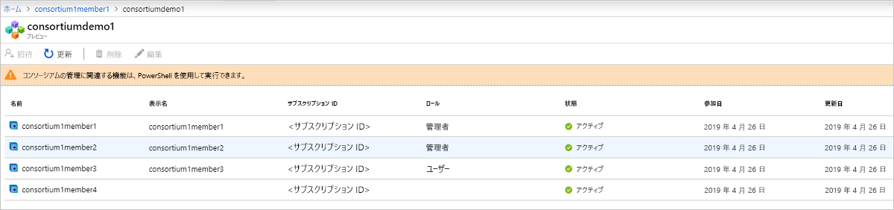

# Azure Blockchain Service とは

Azure Blockchain Service は完全に管理された台帳サービスであり、ユーザーは Azure でブロックチェーン ネットワークの拡張や操作を大規模に行うことができます。 インフラストラクチャの管理とブロックチェーン ネットワークのガバナンスの両方の制御が統一された Azure Blockchain Service では、次のような機能が提供されます。

* ネットワークの簡単なデプロイと運用
* 組み込みのコンソーシアム管理
* 使い慣れた開発ツールによるスマート コントラクトの開発

Azure Blockchain Service は、複数の台帳プロトコルをサポートするように設計されています。 現時点では、[Istanbul Byzantine Fault Tolerance (IBFT)](https://github.com/jpmorganchase/quorum/wiki/Quorum-Consensus) コンセンサス メカニズムを使用して、Ethereum [Quorum](https://www.goquorum.com/) 台帳がサポートされています。

これらの機能は、ほとんど管理を必要とせず、いずれも追加費用なしで利用することができます。 仮想マシンとインフラストラクチャの管理への時間とリソースの割り当てではなく、アプリの開発とビジネス ロジックに集中できます。 さらに、オープンソースのツールとプラットフォームを自由に選んでアプリケーションの開発を続けることができるので、新しいスキルを身に付けなくてもソリューションを提供できます。

## ネットワークのデプロイと運用

Azure Blockchain Service のデプロイは、Azure portal、Azure CLI、または Azure Blockchain 拡張機能を使用した Visual Studio Code を使って行います。 デプロイは簡単で、トランザクション ノードと検証ノードの両方、セキュリティ分離のための Azure Virtual Network、サービスによって管理されたストレージのプロビジョニングが含まれます。  さらに、新しいブロックチェーン メンバーをデプロイするときに、ユーザーはコンソーシアムの作成またはコンソーシアムへの参加も行います。  コンソーシアムを使用すると、異なる Azure サブスクリプションの複数のパーティーが、共有ブロックチェーンで相互に安全に通信できます。  この簡素化されたデプロイにより、何日もかかったブロックチェーン ネットワークのデプロイが分単位に短縮されます。

### パフォーマンス レベルとサービス レベル

Azure Blockchain Service には、次の 2 つのサービス レベルが用意されています:*Basic* と *Standard*。 各レベルでは、軽量の開発をサポートし、大規模な運用ブロックチェーンのデプロイまでワークロードをテストするための、異なるパフォーマンスと機能が提供されています。 開発、テスト、概念実証には、*Basic* レベルを使用します。 運用グレードのデプロイには、*Standard* レベルを使用します。 どちらのレベルにも、少なくとも 1 つのトランザクション ノードと、1 つの検証ノード (Basic) または 2 つの検証ノード (Standard) が含まれます。 

2 つの検証ノードの提供に加えて、*Standard* レベルではトランザクション ノードおよび検証ノードごとに 2 つの "*仮想コア*" が提供されます。一方、*Basic* レベルでは仮想コア 1 つの構成が提供されます。  トランザクション ノードおよび検証ノードごとに 2 つの仮想コアを提供することにより、1 つの仮想コアを Quorum 台帳専用に使用し、残り 1 つの仮想コアを他のインフラストラクチャ関連のサービスに使用することができ、運用環境のブロックチェーン ワークロードに最適なパフォーマンスを保証できます。 価格について詳しくは、「[Azure Blockchain Service の価格](https://azure.microsoft.com/pricing/details/blockchain-service)」をご覧ください。

### セキュリティとメンテナンス

最初のブロックチェーン メンバーをプロビジョニングした後は、追加のトランザクション ノードをメンバーに追加できます。  既定では、トランザクション ノードはファイアウォール規則によって保護されており、アクセスするための構成が必要です。  さらに、すべてのトランザクション ノードでは、TLS によって移動中のデータが暗号化されます。  トランザクション ノードに対するアクセスをセキュリティで保護する際には、ファイアウォール規則、基本認証、アクセス キー、Azure Active Directory 統合など、複数のオプションがあります。 詳しくは、[トランザクション ノードの構成](configure-transaction-nodes.md)および [Azure Active Directory アクセスの構成](configure-aad.md)に関する記事をご覧ください。

マネージド サービスである Azure Blockchain Service では、ブロックチェーン メンバーのノードが、ホスト オペレーティング システムと台帳ソフトウェア スタックの最新の更新プログラムを適用され、高可用性用に構成され (Standard レベルのみ)、従来の IaaS ブロックチェーン ノードで必要な DevOps の多くが除去されることが保証されます。  修正プログラムの適用と更新プログラムについて詳しくは、[サポートされている Azure Blockchain Service 台帳のバージョン](ledger-versions.md)に関する記事をご覧ください。

### 監視およびログ記録

さらに、Azure Blockchain Service では、ノードの CPU、メモリ、ストレージの使用状況に関する分析情報を提供する Azure Monitor サービスにより、豊富なメトリックが表示されます。  Azure Monitor ではほかにも、マイニングしたトランザクションとブロック、トランザクションのキューの深さ、アクティブな接続など、ブロックチェーン ネットワークのアクティビティに関する有益な分析情報も確認できます。  メトリックは、ブロックチェーン アプリケーションにとって重要な分析情報のビューを提供するようにカスタマイズできます。  さらに、しきい値を定義し、アラートによってユーザーがメールやテキスト メッセージの送信、ロジック アプリや Azure 関数の実行、カスタム定義 webhook の送信などのアクションをトリガーできるようにすることができます。

Azure Log Analytics により、ユーザーは、Quorum 台帳に関するログや、トランザクション ノードへの接続の試行などの他の重要な情報を表示できます。

## 組み込みのコンソーシアム管理

最初のブロックチェーン メンバーをデプロイするときに、コンソーシアムに参加するか新しいコンソーシアムを作成します。  コンソーシアムは、ガバナンスの管理と、複数パーティーのプロセスでトランザクションを実行するブロックチェーン メンバー間の接続の管理に使用される、論理グループです。  Azure Blockchain Service では、定義済みのスマート コントラクトを通じて組み込みのガバナンス コントロールが提供されます。スマート コントラクトにより、コンソーシアムのメンバーが実行できるアクションが決まります。  これらのガバナンス コントロールは、コンソーシアムの管理者が必要に応じてカスタマイズできます。 新しいコンソーシアムを作成するときは、ブロックチェーンのメンバーがコンソーシアムの既定の管理者であり、他のパーティーをコンソーシアムに参加するよう招待できます。  以前に招待された場合にのみ、コンソーシアムに参加できます。  コンソーシアムに参加すると、ブロックチェーンのメンバーは、コンソーシアムの管理者によって設定されたガバナンス コントロールの対象になります。

コンソーシアムのメンバーの追加や削除などのコンソーシアム管理アクションには、PowerShell および REST API を通じてアクセスできます。 Solidity に基づくスマート コントラクトを変更して送信するのではなく、共通インターフェイスを使用してプログラムでコンソーシアムを管理できます。 詳しくは、[コンソーシアムの管理](consortium.md)に関する記事をご覧ください。

## 使い慣れた開発ツールを使用して開発する

オープンソースの Quorum Ethereum 台帳に基づき、既存の Ethereum アプリケーションと同じ方法で、Azure Blockchain Service 用のアプリケーションを開発できます。 業界の最先端のパートナーとの協力による Azure Blockchain Development Kit Visual Studio Code 拡張機能を使用して、開発者は Truffle Suite などの使い慣れたツールでスマート コントラクトを構築できます。 Azure Blockchain Development Kit 拡張機能を使用すると、開発者は、コンソーシアムを作成するか、または既存のコンソーシアムに接続して、スマート コントラクトのビルドとデプロイのすべてを 1 つの IDE から実行できます。 Azure Blockchain Visual Studio Code 拡張機能を使用すると、コンソーシアムを作成するか、または既存のコンソーシアムに接続して、スマート コントラクトのビルドと配置のすべてを 1 つの IDE から実行できます。 詳しくは、[VS Code マーケットプレースの Azure Blockchain 開発キット](https://aka.ms/vscodebcextension)のページと [Azure Blockchain 開発キットのユーザー ガイド](https://aka.ms/vscodebcextensionwiki)を参照してください。

## ブロックチェーン データの公開

Azure Blockchain Service の Blockchain Data Manager は、Azure Blockchain Service のトランザクション データのキャプチャ、変換、Azure Event Grid トピックへの配信を行って、ブロックチェーン台帳と Azure サービスとの信頼性と拡張性に優れた統合を提供します。 Blockchain Data Manager を使用すると、オフチェーン アプリケーションとデータ ストアを統合できます。 詳細については、[Azure Blockchain Service の Blockchain Data Manager](data-manager.md) に関するページを参照してください。

## サポートとフィードバック

Azure Blockchain の最新情報については、[Azure Blockchain のブログ](https://azure.microsoft.com/blog/topics/blockchain/)をご覧ください。Azure Blockchain エンジニアリング チームからの情報やブロックチェーン サービスの内容に関する最新の情報を把握することができます。

製品に関するフィードバックや新機能のご要望をお寄せいただくには、[ブロックチェーンに関する Azure フィードバック フォーラム](https://aka.ms/blockchainuservoice)でアイデアに投票してください。

### コミュニティ サポート

Microsoft のエンジニアや Azure Blockchain コミュニティのエキスパートと交流できます。

* [Azure Blockchain Service に関する Microsoft Q&A 質問ページ](https://docs.microsoft.com/answers/topics/azure-blockchain-service.html)
* [Microsoft Tech Community](https://techcommunity.microsoft.com/t5/Blockchain/bd-p/AzureBlockchain)
* [Stack Overflow](https://stackoverflow.com/questions/tagged/AzureBlockchainService)

## 次のステップ

まず最初に、クイック スタートを試すか、以下のリソースで詳細を確認してください。
* [Azure portal を使用したブロックチェーン メンバーの作成](create-member.md)または [Azure CLI を使用したブロックチェーン メンバーの作成](create-member-cli.md)に関する記事
* コストの比較と計算ツールについては、[価格のページ](https://azure.microsoft.com/pricing/details/blockchain-service)をご覧ください。
* [Azure Blockchain Development Kit](https://github.com/Azure-Samples/blockchain-devkit) を使用して最初のアプリを作成してください
* Azure Blockchain VSCode 拡張機能の[ユーザー ガイド](https://github.com/Microsoft/vscode-azure-blockchain-ethereum/wiki)
