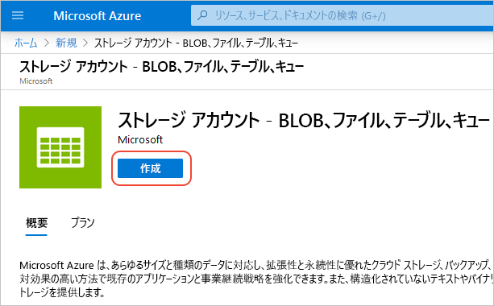
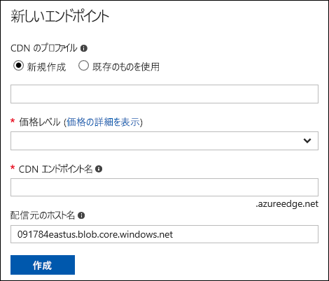
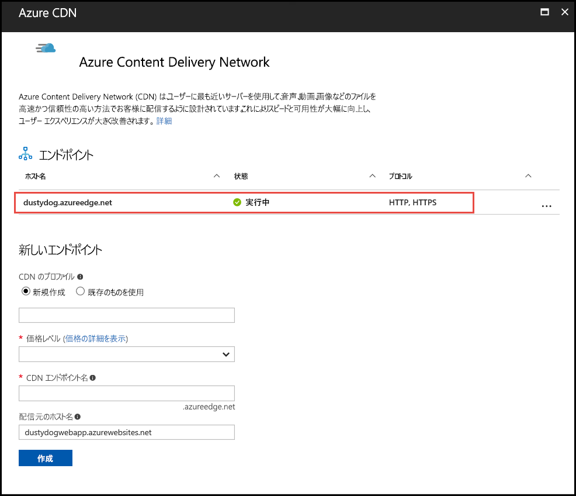
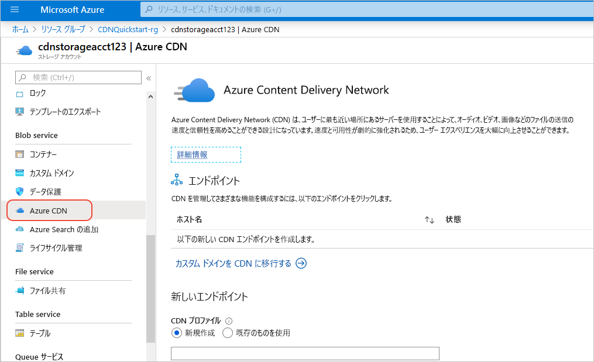

# クイック スタート: Azure ストレージ アカウントと Azure CDN との統合
このクイック スタートでは、[Azure Content Delivery Network (CDN)](cdn-overview.md) を有効にして、Azure ストレージからのコンテンツをキャッシュします。 Azure CDN では、高帯域幅コンテンツ配信用のグローバル ソリューションが開発者に提供されています。 Azure CDN は、コンピューティング インスタンスの BLOB と静的コンテンツを、米国、ヨーロッパ、アジア、オーストラリア、南アメリカの物理ノードにキャッシュできます。

[!INCLUDE [quickstarts-free-trial-note](../../includes/quickstarts-free-trial-note.md)]

## Azure Portal にログインする
Azure アカウントを使用して [Azure Portal](https://portal.azure.com) にログインします。

## ストレージ アカウントの作成
Azure サブスクリプションの新しいストレージ アカウントを作成するには、次の手順に従います。 ストレージ アカウントを使うと、Azure Storage サービスにアクセスできます。 ストレージ アカウントは、Azure Storage サービスの各コンポーネント (Blob Storage、Queue Storage、Table Storage) にアクセスするための最高レベルの名前空間を表します。 詳細については、「[Microsoft Azure Storage の概要](../storage/common/storage-introduction.md)」をご覧ください。

ストレージ アカウントを作成するには、サービス管理者または関連付けられているサブスクリプションの共同管理者である必要があります。

Azure Portal や PowerShell など、ストレージ アカウントは複数の方法で作成できます。 このクイック スタートでは、Azure portal の使用方法を示します。   

**Azure サブスクリプションのストレージ アカウントを作成するには**

1. Azure Portal の左上隅にある **[リソースの作成]** を選択します。 

    **[新規]** ウィンドウが表示されます。

2. **[ストレージ]** 、 **[ストレージ アカウント - Blob、File、Table、Queue]** の順に選択します。
    
    

    **[ストレージ アカウントの作成]** ウィンドウが表示されます。   

    ![[ストレージ アカウントの作成] ウィンドウ](./media/cdn-create-a-storage-account-with-cdn/cdn-create-new-storage-account.png)

3. **[名前]** ボックスに、サブドメインの名前を入力します。 文字数は 3 ～ 24 文字とし、アルファベット小文字と数字を使用できます。
   
    この値は、サブスクリプションの Blob リソース、Queue リソース、または Table リソースのアドレス指定に使われる URI 内のホスト名になります。 Blob Storage 内のコンテナー リソースをアドレス指定するには、次の形式の URI を使います。
   
    http:// *&lt;StorageAcountLabel&gt;* .blob.core.windows.net/ *&lt;mycontainer&gt;*

    *&lt;StorageAccountLabel&gt;* は、 **[名前]** ボックスに入力した値を示します。
   
    > [!IMPORTANT]    
    > URL ラベルは、ストレージ アカウントの URI のサブドメインになるので、Azure のすべてのホストされるサービスにおいて一意である必要があります。
   
    この値は、ポータルでストレージ アカウントの名前として、またはプログラムでこのアカウントにアクセスするときにも使用されます。
    
4. 残りの設定については、次の表で指定されている値を使用します。

    | 設定  | 値 |
    | -------- | ----- |
    | **デプロイ モデル** | 既定値を使用します。 |
    | **アカウントの種類** | 既定値を使用します。 |
    | **Location**    | ドロップダウンから **[米国中部]** を選択します。 |
    | **レプリケーション** | 既定値を使用します。 |
    | **パフォーマンス** | 既定値を使用します。 |
    | **安全な転送が必須** | 既定値を使用します。 |
    | **サブスクリプション** | ドロップダウン リストから Azure サブスクリプションを選択します。 |
    | **リソース グループ** | **[新規作成]** を選択し、リソース グループ名として「*my-resource-group-123*」と入力します。 この名前はグローバルに一意である必要があります。 既に使用している場合は、別の名前を入力するか、 **[既存のものを使用]** を選択し、ドロップダウン リストから **[my-resource-group-123]** を選択できます。  リソース グループについて詳しくは、「[Azure Resource Manager の概要](../azure-resource-manager/management/overview.md#resource-groups)」をご覧ください。| 
    | **仮想ネットワークの構成** | 既定値を使用します。 |  
    
5. ストレージ アカウントを作成後にダッシュボードに保存するには、 **[ダッシュボードにピン留め]** をオンにします。
    
6. **作成** を選択します。 ストレージ アカウントの作成は、完了までに数分かかる場合があります。

## ストレージ アカウントの Azure CDN を有効にする

ストレージ アカウントから直接、ストレージ アカウントの Azure CDN を有効にできます。 CDN エンドポイントの詳細な構成設定 ([大きなファイル ダウンロードの最適化](cdn-optimization-overview.md#large-file-download)など) を指定する場合は、代わりに [Azure CDN 拡張機能](cdn-create-new-endpoint.md)を使用して CDN プロファイルとエンドポイントを作成できます。

1. ダッシュボードでストレージ アカウントを選び、左側のウィンドウで **[Azure CDN]** を選びます。 **[Azure CDN]** ボタンがすぐに表示されない場合は、左側のウィンドウの **[検索]** ボックスに「CDN」と入力て検索します。
    
    **[Azure CDN]** ページが表示されます。

    
    
2. 次の表で指定されている必要な情報を入力して、新しいエンドポイントを作成します。

    | 設定  | 値 |
    | -------- | ----- |
    | **[CDN プロファイル]** | **[新規作成]** を選択し、プロファイル名を入力します (例: *my-cdn-profile-123*)。 この名前はグローバルに一意である必要があります。  |
    | **[価格レベル]** | ドロップダウンから **[Standard Verizon]** を選択します。 |
    | **[CDN エンドポイント名]** | エンドポイントのホスト名を入力します (例: *my-endpoint-123*)。 この名前はグローバルに一意である必要があります。 この名前は、ドメイン _&lt;エンドポイント名&gt;_ .azureedge.net でキャッシュされたリソースにアクセスする際に使用します。 |
    | **配信元のホスト名** | 既定では、新しい CDN エンドポイントは、ストレージ アカウントのホスト名を配信元サーバーとして使います。 |

3. **作成** を選択します。 作成されたエンドポイントが、エンドポイントの一覧に表示されます。

    

## その他の CDN 機能を有効にする
ストレージ アカウントの **[Azure CDN]** ページで、一覧から CDN エンドポイントを選んで、CDN エンドポイント構成ページを開きます。 このページから、[圧縮](cdn-improve-performance.md)、[クエリ文字列キャッシュ](cdn-query-string.md)、[geo フィルタリング](cdn-restrict-access-by-country.md)など、配信のその他の CDN 機能を有効にすることができます。 
    

## SAS を有効にする
プライベート ストレージ コンテナーへの制限付きアクセス権限を付与するには、Azure ストレージ アカウントの Shared Access Signature (SAS) 機能を使用できます。 SAS は、アカウント キーを公開することなく Azure Storage リソースへの制限付きアクセス権を付与する URI です。 詳細については、「[SAS を利用した Azure CDN の使用](cdn-sas-storage-support.md)」を参照してください。

## CDN コンテンツにアクセスする
CDN にキャッシュされたコンテンツにアクセスするには、ポータルで提供される CDN URL を使用します。 キャッシュされた BLOB のアドレスの形式は次のようになります。

http://<*EndpointName*\>.azureedge.net/<*myPublicContainer*\>/<*BlobName*\>

> [!NOTE]
> ストレージ アカウントへの Azure CDN アクセスを有効にすると、パブリックにアクセスできるオブジェクトが CDN POP キャッシュの対象になります。 CDN で現在キャッシュされているオブジェクトを変更する場合、キャッシュされたコンテンツの有効期限が終了した後で Azure CDN がそのコンテンツを更新するまで、Azure CDN を通して新しいコンテンツを使うことはできません。

## Azure CDN からコンテンツを削除する
Azure CDN にオブジェクトをキャッシュする必要がなくなった場合は、次のいずれかの手順を実行できます。

* コンテナーをパブリックではなくプライベートにします。 詳細については、「 [コンテナーと BLOB への匿名読み取りアクセスを管理する](../storage/blobs/storage-manage-access-to-resources.md)」を参照してください。
* Azure Portal を使って、CDN エンドポイントを無効にするか削除します。
* オブジェクトの要求に応答しなくなるように、ホストされるサービスを変更します。

Azure CDN に既にキャッシュされているオブジェクトは、オブジェクトの有効期限が切れるまで、またはエンドポイントが[消去](cdn-purge-endpoint.md)されるまで、キャッシュに残ったままとなります。 有効期限が切れると、Azure CDN は、CDN エンドポイントがまだ有効で、オブジェクトがまだ匿名アクセス可能かどうかを確認します。 そうではない場合、オブジェクトはキャッシュされなくなります。

## リソースをクリーンアップする
前の手順では、リソース グループ内に CDN プロファイルとエンドポイントを作成しました。 [次の手順](#next-steps)に進んでエンドポイントにカスタム ドメインを追加する方法について学習するには、これらのリソースを保存してください。 ただし、将来これらのリソースを使用する予定がない場合は、次の手順に従ってリソース グループを削除してリソースを削除することで、追加の料金が発生するのを避けることができます。

1. Azure Portal の左側のメニューで、 **[リソース グループ]** 、 **[my-resource-group-123]** の順に選択します。

2. **[リソース グループ]** ページで、 **[リソース グループの削除]** を選択し、テキスト ボックスに「*my-resource-group-123*」と入力し、 **[削除]** を選択します。

    このアクションにより、このクイック スタートで作成したリソース グループ、プロファイル、およびエンドポイントが削除されます。

3. ストレージ アカウントを削除するには、ダッシュボードからそのアカウントを選択し、上部のメニューから **[削除]** を選択します。

## 次のステップ
カスタム ドメインの追加および CDN エンドポイントでの HTTPS の有効化の詳細については、次のチュートリアルを参照してください。

> [!div class="nextstepaction"]
> [チュートリアル: HTTPS 経由で Azure CDN のカスタム ドメインを使用してストレージ BLOB にアクセスする](cdn-storage-custom-domain-https.md)

