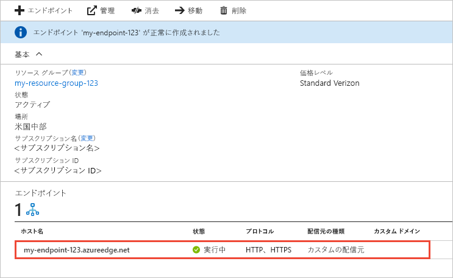

# Azure CDN エンドポイントの作成
この記事では、既存の CDN プロファイルに [Azure Content Delivery Network (CDN)](cdn-overview.md) エンドポイントを作成するためのすべての設定について説明します。 プロファイルとエンドポイントを作成すると、顧客へのコンテンツ配信を開始することができます。 プロファイルとエンドポイント作成のクイック スタートについては、「[クイック スタート: Azure CDN プロファイルとエンドポイントの作成](cdn-create-new-endpoint.md)」を参照してください。

## 前提条件
CDN エンドポイントを作成するには、1 つ以上の CDN エンドポイントを含めることができる、CDN プロファイルを少なくとも 1 つ作成する必要があります。 インターネット ドメイン、Web アプリケーション、またはその他の一部の基準別に CDN エンドポイントを整理する場合、複数のプロファイルを使用できます。 CDN の価格は CDN プロファイル レベルで適用されるので、Azure CDN の価格レベルを組み合わせたい場合は、複数の CDN プロファイルを作成する必要があります。 CDN プロファイルを作成するには、「[新しい CDN プロファイルを作成する](cdn-create-new-endpoint.md#create-a-new-cdn-profile)」を参照してください。

## Azure Portal にログインする
Azure アカウントを使用して [Azure Portal](https://portal.azure.com) にログインします。

## 新しい CDN エンドポイントの作成

1. [Azure Portal](https://portal.azure.com) で、CDN プロファイルに移動します。 これは、前の手順でダッシュボードにピン留めしている可能性があります。 そうでない場合、 **[すべてのサービス]** 、 **[CDN のプロファイル]** の順に選択して見つけることができます。 **[CDN のプロファイル]** ウィンドウで、エンドポイントの追加先となる予定のプロファイルを選択します。 
   
    CDN プロファイル ウィンドウが表示されます。

2. **[エンドポイント]** を選択します。
   
    
   
    **[エンドポイントの追加]** ページが表示されます。
   
    ![[エンドポイントの追加] ページ](./media/cdn-create-endpoint-how-to/cdn-add-endpoint-page.png)

3. **[名前]** に、新しい CDN エンドポイントの一意の名前を入力します。 この名前は、ドメイン _\<endpointname>_ .azureedge.net でキャッシュされたリソースにアクセスする際に使用します。

4. **[配信元の種類]** には、次のいずれかの配信元の種類を選択します。 
   - **[ストレージ]** : Azure Storage 用
   - **[クラウド サービス]** : Azure Cloud Services 用
   - **[Web アプリ]** : Azure Web Apps 用
   - **[カスタムの配信元]** : パブリックにアクセスできる配信元の任意の Web サーバー用 (Azure または別の場所でホストされている)

5. **[配信元のホスト名]** には、ご自分の配信元サーバーのドメインを選択または入力します。 ドロップダウンには、手順 4. で指定した種類の利用可能なすべての配信元サーバーが一覧表示されます。 配信元の種類として **[カスタムの配信元]** を選択した場合は、カスタムの配信元サーバーのドメインを入力します。
    
6. **[配信元のパス]** には、キャッシュするリソースへのパスを入力します。 手順 5. で指定したドメインでリソースのキャッシュを許可するには、この設定は空白のままにします。
    
7. **[配信元のホスト ヘッダー]** で、Azure CDN の各要求で送信するホスト ヘッダーを入力するか、既定値をそのまま使用します。
   
   > [!NOTE]
   > Azure Storage や Web Apps など、配信元の種類によっては、ホスト ヘッダーを配信元のドメインに合わせる必要があります。 ホスト ヘッダーがそのドメインと異なっていることをご利用の配信元で要求される場合以外は、既定値をそのまま使用してください。
   > 
    
8. **[プロトコル]** と **[配信元ポート]** に、配信元サーバーのリソースへのアクセスに使用するプロトコルとポートを指定します。 少なくとも 1 つのプロトコル (HTTP または HTTPS) を選択する必要があります。 HTTPS コンテンツには、CDN によって提供されたドメイン ( _\<endpointname>_ .azureedge.net) を使用してアクセスします。 
   
   > [!NOTE]
   > **[配信元のポート]** の値によって決定されるのは、エンドポイントが配信元サーバーから情報を取得するときに使用されるポートのみです。 エンドポイントそのものは、 **[配信元ポート]** の値に関係なく、エンド クライアントが既定の HTTP ポートと HTTPS ポート (80 と 443) を介してのみ利用できます。  
   > 
   > **Azure CDN from Akamai** プロファイルのエンドポイントでは、配信元ポートの TCP ポート範囲全体が許可されません。 使用できない配信元ポートの一覧については、「 [Azure CDN from Akamai Allowed Origin Ports (Azure CDN from Akamai で使用できる配信元ポート)](/previous-versions/azure/mt757337(v=azure.100))」を参照してください。  
   > 
   > Azure CDN カスタム ドメインの HTTPS サポートは、**Azure CDN from Akamai** 製品ではサポートされていません。 詳細については、[Azure CDN カスタム ドメインの HTTPS を構成する方法](cdn-custom-ssl.md)に関するページを参照してください。
    
9. **[最適化の対象]** には、エンドポイントが配信するコンテンツの種類とシナリオに最も適した最適化の種類を選択します。 詳細については、「[コンテンツ配信の種類に応じて Azure CDN を最適化する](cdn-optimization-overview.md)」を参照してください。

    プロファイルの種類に応じて、次の最適化の種類の設定がサポートされます。
    - **Azure CDN Standard from Microsoft** プロファイル:
       - [**一般的な Web 配信**](cdn-optimization-overview.md#general-web-delivery)

    - **Azure CDN Standard from Verizon** プロファイルと **Azure CDN Premium from Verizon** プロファイル:
       - [**一般的な Web 配信**](cdn-optimization-overview.md#general-web-delivery)
       - [**動的サイト アクセラレーション**](cdn-optimization-overview.md#dynamic-site-acceleration)

    - **Azure CDN Standard from Akamai** プロファイル:
       - [**一般的な Web 配信**](cdn-optimization-overview.md#general-web-delivery)
       - [**一般的なメディア ストリーミング**](cdn-optimization-overview.md#general-media-streaming)
       - [**ビデオ オン デマンド メディア ストリーミング**](cdn-optimization-overview.md#video-on-demand-media-streaming)
       - [**大きなファイルのダウンロード**](cdn-optimization-overview.md#large-file-download)
       - [**動的サイト アクセラレーション**](cdn-optimization-overview.md#dynamic-site-acceleration)

10. **[追加]** を選択して、新しいエンドポイントを作成します。
   
    エンドポイントが作成されると、プロファイルのエンドポイントの一覧に表示されます。
    
    
    
    登録内容が反映されるまでに時間がかかるため、エンドポイントはすぐには使用できません。 
    - **Azure CDN Standard from Microsoft** プロファイルの場合、通常、反映は 10 分以内で完了します。 
    - **Azure CDN Standard from Akamai** プロファイルの場合、通常、反映は 1 分以内で完了します。 
    - **Azure CDN Standard from Verizon** プロファイルおよび **Azure CDN Premium from Verizon** プロファイルの場合、通常、反映は 90 分以内で完了します。 
   
    エンドポイントの構成がポイント オブジェクト プレゼンス (POP) サーバーに反映される前に CDN のドメイン名を利用しようとすると、HTTP 404 応答状態が表示されることがあります。 エンドポイントを作成してから数時間が経過しても 404 応答状態が返される場合は、「[404 状態コードを返す Azure CDN エンドポイントのトラブルシューティング](cdn-troubleshoot-endpoint.md)」を参照してください。

## リソースをクリーンアップする
不要になったときにエンドポイントを削除するには、そのエンドポイントを選択してから、 **[削除]** を選択します。 

## 次のステップ
カスタム ドメインについて学習するには、CDN エンドポイントにカスタム ドメインを追加するためのチュートリアルに進んでください。

> [!div class="nextstepaction"]
> [カスタム ドメインの追加](cdn-map-content-to-custom-domain.md)

