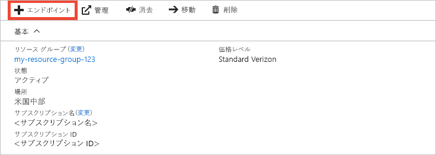
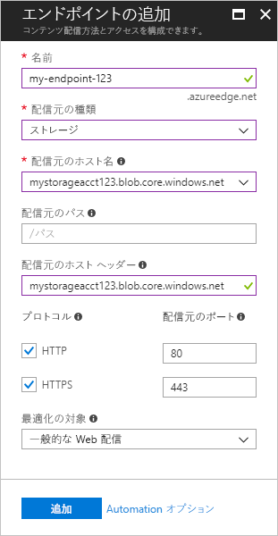

# クイック スタート:Azure CDN プロファイルとエンドポイントの作成

このクイックスタートでは、新しい CDN プロファイル (1 つまたは複数の CDN エンドポイントのコレクション) を作成することで、Azure Content Delivery Network (CDN) を有効にします。 プロファイルとエンドポイントを作成すると、顧客へのコンテンツの配信を開始することができます。

## 前提条件

- アクティブなサブスクリプションが含まれる Azure アカウント。 [無料でアカウントを作成できます](https://azure.microsoft.com/free/?ref=microsoft.com&utm_source=microsoft.com&utm_medium=docs&utm_campaign=visualstudio)。
- 配信元ホスト名として使用する *cdnstorageacct123* という名前の Azure Storage アカウント。 この要件を満たすには、[Azure ストレージ アカウントと Azure CDN との統合](cdn-create-a-storage-account-with-cdn.md)に関するページを参照してください。

## Azure portal にサインインする

Azure アカウントで [Azure Portal](https://portal.azure.com) にサインインします。

[!INCLUDE [cdn-create-profile](../../includes/cdn-create-profile.md)]

## 新しい CDN エンドポイントの作成

CDN プロファイルを作成したら、これを使用してエンドポイントを作成します。

1. Azure Portal のダッシュボードで、作成した CDN プロファイルを選択します。 見つからない場合は、プロファイルの作成先のリソース グループを開くか、ポータルの上部にある検索バーを使用してプロファイル名を入力し、検索結果から目的のプロファイルを選択します。
   
1. [CDN プロファイル] ページで **[+ エンドポイント]** を選択します。
   
    
   
    **[エンドポイントの追加]** ウィンドウが表示されます。

3. 次の設定値を入力します。

    | 設定 | 値 |
    | ------- | ----- |
    | **名前** | エンドポイントのホスト名として「*cdn-endpoint-123*」と入力します。 この名前は Azure 全体でグローバルに一意でなければなりません。この名前が既に使用されている場合は、別の名前を入力してください。 この名前は、ドメイン _&lt;エンドポイント名&gt;_ .azureedge.net でキャッシュされたリソースにアクセスする際に使用します。|
    | **配信元の種類** | **[ストレージ]** を選択します。 | 
    | **配信元のホスト名** | ご使用の Azure Storage アカウントのホスト名 (*cdnstorageacct123.blob.core.windows.net* など) をドロップダウン リストから選択します。 |
    | **配信元のパス** | 空白のままにします。 |
    | **配信元のホスト ヘッダー** | 既定値 (ストレージ アカウントのホスト名) をそのまま使用します。 |  
    | **プロトコル** | **[HTTP]** と **[HTTPS]** のオプションを既定値の選択状態のままにします。 |
    | **配信元のポート** | 既定のポート値のままにします。 | 
    | **最適化の対象** | 既定で選択される **[一般的な Web 配信]** のままにします。 |

    

3. **[追加]** を選択して、新しいエンドポイントを作成します。 エンドポイントが作成されると、プロファイルのエンドポイントの一覧に表示されます。
    
   
    
   エンドポイントが伝達されるまでの所要時間は、プロファイルの作成時に選択した価格レベルによって異なります。 通常、**Standard Akamai** で 1 分以内、**Standard Microsoft** で 10 分、**Standard Verizon** と **Premium Verizon** で最大 90 分となります。

## リソースをクリーンアップする

前の手順では、リソース グループ内に CDN プロファイルとエンドポイントを作成しました。 [次の手順](#next-steps)に進んでエンドポイントにカスタム ドメインを追加する方法について学習するには、これらのリソースを保存してください。 ただし、将来これらのリソースを使用する予定がない場合は、次の手順に従ってリソース グループを削除してリソースを削除することで、追加の料金が発生するのを避けることができます。

1. Azure portal の左側のメニューで、 **[リソース グループ]** 、 **[CDNQuickstart-rg]** の順に選択します。

2. **[リソース グループ]** ページで、 **[リソース グループの削除]** を選択し、テキスト ボックスに「*CDNQuickstart-rg*」と入力して、 **[削除]** を選択します。 このアクションにより、このクイックスタートで作成したリソース グループ、プロファイル、エンドポイントが削除されます。

## 次のステップ

> [!div class="nextstepaction"]
> [チュートリアル:サーバーの静的コンテンツへの CDN を Web アプリから使用する](cdn-add-to-web-app.md)

> [!div class="nextstepaction"]
> [チュートリアル:カスタム ドメインを Azure CDN エンドポイントに追加する](cdn-map-content-to-custom-domain.md)
