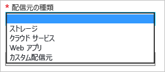

# Azure CDN の概要
この記事では、CDN プロファイルと CDN エンドポイントを新しく作成することによって Azure [Content Delivery Network (CDN)](cdn-overview.md) を有効にする方法を紹介しています。

## 新しい CDN プロファイルを作成する
CDN プロファイルは、CDN エンドポイントのコレクションです。 各プロファイルには、1 つ以上の CDN エンドポイントを含めることができます。 インターネット ドメイン、Web アプリケーション、またはその他の一部の基準別に CDN エンドポイントを整理する場合、複数のプロファイルを使用できます。

> [!NOTE]
> Azure サブスクリプションには、次のリソースに関して既定の制限が設けられています。
> - 作成できる CDN プロファイルの数
> - CDN プロファイルに作成できるエンドポイントの数 
> - エンドポイントにマッピングできるカスタム ドメインの数
>
> CDN サブスクリプションの制限については、「[CDN の制限](https://docs.microsoft.com/azure/azure-subscription-service-limits#cdn-limits)」を参照してください。
>
> CDN の価格は、CDN プロファイル レベルで適用されます。 そのため、Azure CDN の価格レベルを組み合わせて使用するには、複数の CDN プロファイルを作成する必要があります。
> 
> 

[!INCLUDE [cdn-create-profile](../../includes/cdn-create-profile.md)]

## [新しい CDN エンドポイントの作成]
**新しい CDN エンドポイントを作成するには**

1. [Azure Portal](https://portal.azure.com) で、CDN プロファイルに移動します。 これは、前の手順でダッシュボードにピン留めしている可能性があります。 そうでない場合、**[すべてのサービス]**、**[CDN のプロファイル]** の順に選択して見つけることができます。 **[CDN のプロファイル]** ウィンドウで、エンドポイントの追加先となる予定のプロファイルを選択します。 
   
    CDN プロファイル ウィンドウが表示されます。
   
    ![CDN プロファイル][cdn-profile-settings]

2. **[エンドポイント]** を選択します。
   
    ![[エンドポイントの追加] ボタン][cdn-new-endpoint-button]
   
    **[エンドポイントの追加]** ウィンドウが表示されます。
   
    ![エンドポイントの追加ウィンドウ][cdn-add-endpoint]

3. **[名前]** に、新しい CDN エンドポイントの一意の名前を入力します。 この名前は、ドメイン `<endpointname>.azureedge.net` でキャッシュされたリソースにアクセスする際に使用します。

4. **[配信元の種類]** で、配信元の種類を選択します。 Azure ストレージ アカウントの場合は **[ストレージ]** を、Azure クラウド サービスの場合は **[クラウド サービス]** を、Azure Web アプリの場合は **[Web アプリ]** を選択します。それ以外の、Azure または他の場所にホストされたパブリックにアクセス可能な Web サーバーが配信元である場合は、**[カスタムの配信元]** を選択します。
   
    

5. **[配信元のホスト名]** で、配信元のドメインを選択または入力します。 ドロップダウンに、手順 4. で指定した種類の利用可能な配信元がすべて一覧表示されます。 配信元の種類として **[カスタムの配信元]** を選択した場合は、カスタムの配信元のドメインを入力します。
    
6. **[元のパス]** に、キャッシュするリソースへのパスを入力するか、空のままにして、手順 5. で指定したドメインでのリソースをキャッシュするようにします。
    
7. **[配信元のホスト ヘッダー]** で、Azure CDN の各要求で送信するホスト ヘッダーを入力するか、既定値をそのまま使用します。
   
   > [!WARNING]
   > Azure Storage や Web Apps など、配信元の種類によっては、ホスト ヘッダーを配信元のドメインに合わせる必要があります。 ホスト ヘッダーがそのドメインと異なっていることをご利用の配信元で要求される場合以外は、既定値をそのまま使用してください。
   > 
    
8. **[プロトコル]** と **[配信元ポート]** に、配信元のリソースへのアクセスに使用するプロトコルとポートを指定します。 少なくとも 1 つのプロトコル (HTTP または HTTPS) を選択する必要があります。 HTTPS コンテンツには、CDN によって提供されたドメイン (`<endpointname>.azureedge.net`) を使用してアクセスします。 
   
   > [!NOTE]
   > **[配信元のポート]** の値によって決定されるのは、エンドポイントが配信元から情報を取得するときに使用されるポートのみです。 エンドポイントそのものは、**[配信元ポート]** の値に関係なく、エンド クライアントが既定の HTTP ポートと HTTPS ポート (80 と 443) を介してのみ利用できます。  
   > 
   > **Azure CDN from Akamai** プロファイルのエンドポイントでは、配信元ポートの TCP ポート範囲全体が許可されません。 使用できない配信元ポートの一覧については、「 [Azure CDN from Akamai Allowed Origin Ports (Azure CDN from Akamai で使用できる配信元ポート)](https://msdn.microsoft.com/library/mt757337.aspx)」を参照してください。  
   > 
   > HTTPS を使用して CDN コンテンツにアクセスする場合、次の制約があります。
   > 
   > * CDN によって提供される SSL 証明書を使用する。 サードパーティの証明書はサポートされません。
   > * Azure CDN カスタム ドメインの HTTPS 機能を利用できるのは、**Azure CDN from Verizon** 製品 (Standard と Premium) のみです。 **Azure CDN from Akamai** 製品ではサポートされていません。 詳細については、[Azure CDN カスタム ドメインの HTTPS を構成する方法](cdn-custom-ssl.md)に関するページを参照してください。
    
9. **[追加]** を選択して、新しいエンドポイントを作成します。
   
   エンドポイントが作成されると、プロファイルのエンドポイントの一覧に表示されます。
    
   ![CDN エンドポイント][cdn-endpoint-success]
    
   > [!IMPORTANT]
   > 登録内容が反映されるまでに時間がかかるため、エンドポイントはすぐには使用できません。 **Azure CDN from Akamai** プロファイルの場合、通常、反映は 1 分以内で完了します。 **Azure CDN from Verizon** プロファイルの場合、通常、反映は 90 分以内に完了しますが、もっと時間がかかる場合もあります。
    > 
    > エンドポイントの構成が POP に反映される前に CDN のドメイン名を利用しようとすると、HTTP 404 応答状態が表示されることがあります。 エンドポイントを作成してから数時間が経過しても 404 応答状態が返される場合は、「[404 状態を返す CDN エンドポイントのトラブルシューティング](cdn-troubleshoot-endpoint.md)」を参照してください。
    > 
    > 

## 関連項目
* [クエリ文字列による要求のキャッシュ動作の制御](cdn-query-string.md)
* [CDN コンテンツをカスタム ドメインにマッピングする方法](cdn-map-content-to-custom-domain.md)
* [Azure CDN エンドポイント上のアセットを事前に読み込む](cdn-preload-endpoint.md)
* [Azure CDN エンドポイントの消去](cdn-purge-endpoint.md)
* [404 状態を返す CDN エンドポイントのトラブルシューティング](cdn-troubleshoot-endpoint.md)

[cdn-profile-settings]: ./media/cdn-create-new-endpoint/cdn-profile-settings.png
[cdn-new-endpoint-button]: ./media/cdn-create-new-endpoint/cdn-new-endpoint-button.png
[cdn-add-endpoint]: ./media/cdn-create-new-endpoint/cdn-add-endpoint.png
[cdn-endpoint-success]: ./media/cdn-create-new-endpoint/cdn-endpoint-success.png
