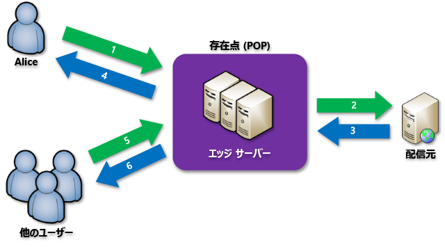

# Azure 上のコンテンツ配信ネットワークとは
コンテンツ配信ネットワーク (CDN) は、ユーザーに Web コンテンツを効率的に配信できるサーバーの分散ネットワークです。 CDN では、待ち時間を最小限に抑えるために、エンド ユーザーに近いポイントオブプレゼンス (POP) の場所のエッジ サーバーに、キャッシュされたコンテンツを格納します。 

Azure Content Delivery Network (CDN) では、世界中に戦略的に配置された物理ノードにコンテンツをキャッシュすることによって、高帯域幅コンテンツをユーザーに高速配信するためのグローバル ソリューションを開発者に提供します。 さらに、Azure CDN では、CDN POP を使って各種のネットワーク最適化を利用して、キャッシュできない動的なコンテンツも高速化できます。 たとえば、Border Gateway Protocol (BGP) をバイパスするルート最適化などがあります。

Azure CDN を使用して Web サイト資産を配信すると、次のような利点があります。

* エンド ユーザーのパフォーマンスとユーザー エクスペリエンスの向上。コンテンツの読み込みに複数のラウンドトリップか必要なアプリケーションを使用する場合は特にそうです。
* 製品発表イベントの開始時のような、瞬間的高負荷を処理しやすくする大型のスケーリング。
* ユーザー要求を分散させ、コンテンツをエッジ サーバーから直接配信することによる、配信元サーバーへのトラフィックの削減。

現在の CDN ノードの場所の一覧については、[Azure CDN の POP の場所](cdn-pop-locations.md)に関するページを参照してください。

## しくみ

1. ユーザー (Alice) は、特殊なドメイン名 ( _&lt;endpoint name&gt;_ .azureedge.net など) の URL を使用して、ファイル (資産とも呼ばれます) を要求します。 この名前には、エンドポイント ホスト名またはカスタム ドメインを指定できます。 DNS は、パフォーマンスが最も高い POP に要求をルーティングします。通常、その場所は、ユーザーに地理的に最も近い位置にある POP になります。
    
2. POP のエッジ サーバーのキャッシュにファイルがない場合、POP は配信元サーバーにあるファイルを要求します。 配信元サーバーは、Azure Web App、Azure Cloud Service、Azure ストレージ アカウント、またはパブリックにアクセスできる Web サーバーです。
   
3. 配信元サーバーは、POP のエッジ サーバーにファイルを返します。
    
4. POP のエッジ サーバーはファイルをキャッシュし、ファイルを要求元 (Alice) に返します。 HTTP ヘッダーによって指定された Time to Live (TTL) まで、ファイルは POP のエッジ サーバー上にキャッシュされたままです。 配信元サーバーで TTL を指定していなかった場合、既定の TTL は 7 日間です。
    
5. その他のユーザーは、Alice と同じ URL を使用して同じファイルを要求し、同じ POP に転送することもできます。
    
6. ファイルの TTL が期限切れになっていない場合、POP エッジ サーバーはキャッシュから直接ファイルを返します。 そのプロセスの結果、応答時間が短縮されます。

## 必要条件
Azure CDN を使用するには、少なくとも 1 つの Azure サブスクリプションを所有する必要があります。 さらに、少なくとも 1 つの CDN プロファイルを作成する必要があります。これは、CDN エンドポイントをまとめたものです。 各 CDN エンドポイントは、コンテンツ配信動作およびアクセスの特定の構成を表します。 インターネット ドメイン、Web アプリケーション、またはその他の一部の基準別に CDN エンドポイントを整理する場合、複数のプロファイルを使用できます。 [Azure CDN の価格](https://azure.microsoft.com/pricing/details/cdn/)は CDN プロファイル レベルで適用されるので、価格レベルを組み合わせたい場合は、複数の CDN プロファイルを作成する必要があります。 Azure CDN の課金の体系については、「[Azure CDN での課金について](cdn-billing.md)」を参照してください。

### 制限事項
各 Azure サブスクリプションには、次のリソースに関して既定の制限が設けられています。
 - 作成できる CDN プロファイルの数。
 - CDN プロファイルに作成できるエンドポイントの数。 
 - エンドポイントにマッピングできるカスタム ドメインの数。

CDN サブスクリプションの制限の詳細については、「[CDN の制限](https://docs.microsoft.com/azure/azure-resource-manager/management/azure-subscription-service-limits)」を参照してください。
    
## Azure CDN の機能
Azure CDN が提供する主要な機能は、次のとおりです。

- [動的サイト アクセラレーション](cdn-dynamic-site-acceleration.md)
- [CDN キャッシュ規則](cdn-caching-rules.md)
- [HTTPS カスタム ドメインのサポート](cdn-custom-ssl.md)
- [Azure Diagnostics ログ](cdn-azure-diagnostic-logs.md)
- [ファイル圧縮](cdn-improve-performance.md)
- [Geo-filtering](cdn-restrict-access-by-country.md)

各 Azure CDN 製品でサポートされる機能の完全な一覧については、「[Azure CDN 製品の機能](cdn-features.md)」をご覧ください。

## 次のステップ
- CDN の使用を開始するには、[Azure CDN プロファイルとエンドポイントの作成](cdn-create-new-endpoint.md)に関するページを参照してください。
- [Microsoft Azure Portal](https://portal.azure.com) または [PowerShell](cdn-manage-powershell.md) を使用して、CDN エンドポイントを管理します。
- [.NET](cdn-app-dev-net.md) または [Node.js](cdn-app-dev-node.md) を使用して Azure CDN を自動化する方法について学習します。
- Azure CDN の実際の動作を確認するには、[Azure CDN の動画](https://azure.microsoft.com/resources/videos/index/?services=cdn&sort=newest)をご覧ください。
- Azure CDN の最新の機能については、[Azure CDN のブログ](https://azure.microsoft.com/blog/tag/azure-cdn/)を参照してください。
