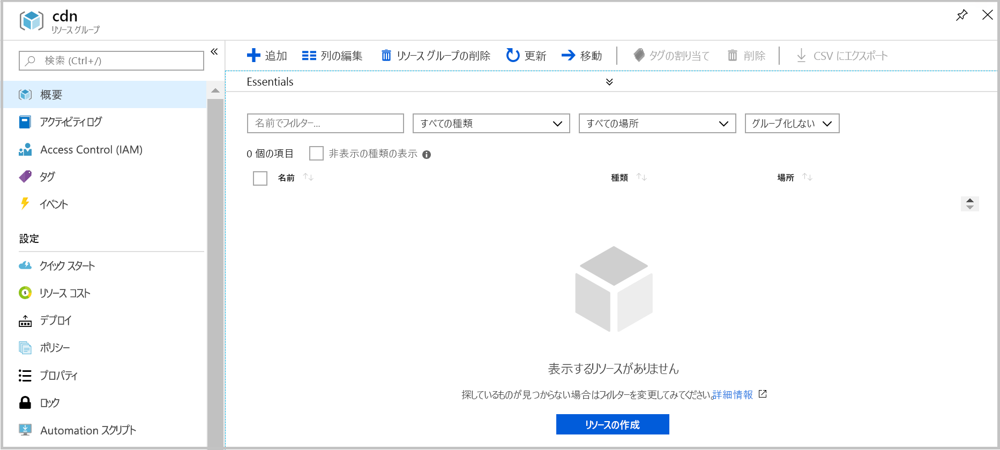

# <a name="quickstart-create-an-azure-cdn-profile-and-endpoint-using-resource-manager-template"></a>クイック スタート:Resource Manager テンプレートを使用して Azure CDN のプロファイルとエンドポイントを作成する

このクイック スタートでは、CLI を使用して Azure Resource Manager テンプレートをデプロイします。 作成したテンプレートにより、CDN プロファイルと CDN エンドポイントが Web アプリケーションに面するようにデプロイされます。
この手順を完了するには、約 10 分かかります。

[!INCLUDE [quickstarts-free-trial-note](../../includes/quickstarts-free-trial-note.md)]

## <a name="prequisites"></a>前提条件

このクイック スタートでは、配信元として使用する Web アプリケーションが必要です。 このクイック スタートで使用した Web アプリケーションの例は、 https://cdndemo.azurewebsites.net にデプロイされました。

詳細については、「[Azure で静的 HTML Web アプリを作成する](https://docs.microsoft.com/azure/app-service/app-service-web-get-started-html)」を参照してください。

## <a name="create-a-resource-group"></a>リソース グループを作成する

すべてのリソースを同じリソース グループ内にデプロイする必要があります。

選択した場所にリソース グループを作成します。 この例では、米国東部に cdn という名前のリソース グループを作成します。

```azurecli-interactive
az group create --name cdn --location eastus
```



## <a name="create-the-resource-manager-template"></a>Resource Manager テンプレートの作成

この手順では、リソースをデプロイするテンプレート ファイルを作成します。

この例では、一般的な Web サイト高速化シナリオについて説明しますが、構成可能な設定は他にも多数あります。 これらの設定は、Azure Resource Manager テンプレート参照で確認できます。 [CDN プロファイル](https://docs.microsoft.com/azure/templates/microsoft.cdn/2017-10-12/profiles)と [CDN プロファイル エンドポイント](https://docs.microsoft.com/azure/templates/microsoft.cdn/2017-10-12/profiles/endpoints)のリファレンスを参照してください。

Microsoft CDN では、コンテンツの種類のリストの変更がサポートされないことに注意してください。

このテンプレートは、**resource-manager-cdn.json** という名前で保存します。

```json
{
    "$schema": "https://schema.management.azure.com/schemas/2015-01-01/deploymentTemplate.json#",
    "contentVersion": "1.0.0.0",
    "parameters": {
        "cdnProfileSku": {
            "type": "string",
            "allowedValues": [
                "Standard_Microsoft",
                "Standard_Akamai",
                "Standard_Verizon",
                "Premium_Verizon"
            ]
        },
        "endpointOriginHostName": {
            "type": "string"
        }
    },
    "variables": {
        "profile": {
            "name": "[replace(toLower(parameters('cdnProfileSku')), '_', '-')]"
        },
        "endpoint": {
            "name": "[replace(toLower(parameters('endpointOriginHostName')), '.', '-')]",
            "originHostName": "[parameters('endpointOriginHostName')]"
        }
    },
    "resources": [
        {
            "type": "Microsoft.Cdn/profiles",
            "apiVersion": "2017-10-12",
            "location": "[resourceGroup().location]",
            "name": "[variables('profile').name]",
            "sku": {
                "name": "[parameters('cdnProfileSku')]"
            }
        },
        {
            "dependsOn": [
                "[resourceId('Microsoft.Cdn/profiles', variables('profile').name)]"
            ],
            "type": "Microsoft.Cdn/profiles/endpoints",
            "apiVersion": "2017-10-12",
            "location": "[resourceGroup().location]",
            "name": "[concat(variables('profile').name, '/', variables('endpoint').name)]",
            "properties": {
                "hostName": "[concat(variables('endpoint').name, '.azureedge.net')]",
                "originHostHeader": "[variables('endpoint').originHostName]",
                "isHttpAllowed": true,
                "isHttpsAllowed": true,
                "queryStringCachingBehavior": "IgnoreQueryString",
                "origins": [
                    {
                        "name": "[replace(variables('endpoint').originHostName, '.', '-')]",
                        "properties": {
                            "hostName": "[variables('endpoint').originHostName]",
                            "httpPort": 80,
                            "httpsPort": 443
                        }
                    }
                ],
                "contentTypesToCompress": [
                    "application/eot",
                    "application/font",
                    "application/font-sfnt",
                    "application/javascript",
                    "application/json",
                    "application/opentype",
                    "application/otf",
                    "application/pkcs7-mime",
                    "application/truetype",
                    "application/ttf",
                    "application/vnd.ms-fontobject",
                    "application/xhtml+xml",
                    "application/xml",
                    "application/xml+rss",
                    "application/x-font-opentype",
                    "application/x-font-truetype",
                    "application/x-font-ttf",
                    "application/x-httpd-cgi",
                    "application/x-javascript",
                    "application/x-mpegurl",
                    "application/x-opentype",
                    "application/x-otf",
                    "application/x-perl",
                    "application/x-ttf",
                    "font/eot",
                    "font/ttf",
                    "font/otf",
                    "font/opentype",
                    "image/svg+xml",
                    "text/css",
                    "text/csv",
                    "text/html",
                    "text/javascript",
                    "text/js",
                    "text/plain",
                    "text/richtext",
                    "text/tab-separated-values",
                    "text/xml",
                    "text/x-script",
                    "text/x-component",
                    "text/x-java-source"
                ],
                "isCompressionEnabled": true,
                "optimizationType": "GeneralWebDelivery"
            }
        }
    ],
    "outputs": {
        "cdnUrl": {
            "type": "string",
            "value": "[concat('https://', variables('endpoint').name, '.azureedge.net')]"
        }
    }
}
```

## <a name="create-the-resources"></a>リソースの作成

Azure CLI を使用してテンプレートをデプロイします。 以下の 2 つの情報を入力するように要求されます。

**cdnProfileSku** - 使用する CDN プロバイダー。 オプションは次のとおりです。

* Standard_Microsoft
* Standard_Akamai
* Standard_Verizon
* Premium_Verizon

**endpointOriginHostName** - CDN を通じてサービスが提供されるエンドポイント (cdndemo.azurewebsites.net など)。

```azurecli-interactive
az group deployment create --resource-group cdn --template-file arm-cdn.json
```


## <a name="view-the-cdn-profile"></a>CDN プロファイルの表示

```azurecli-interactive
az cdn profile list --resource-group cdn -o table
```


## <a name="view-the-cdn-endpoint-for-the-profile-standard-microsoft"></a>プロファイル standard-microsoft の CDN エンドポイントの表示

```azurecli-interactive
az cdn endpoint list --profile-name standard-microsoft --resource-group cdn -o table
```


コンテンツを表示するには、HostName を使用します。 たとえば、ブラウザーを使用して https://cdndemo-azurewebsites-net.azureedge.net にアクセスします。

## <a name="clean-up"></a>クリーンアップ

リソース グループを削除すると、リソース グループ内にデプロイされたすべてのリソースが削除されます。

```azurecli-interactive
az group delete --name cdn
```


## <a name="references"></a>References

* CDN プロファイル - [Azure Resource Manager テンプレート参照](https://docs.microsoft.com/azure/templates/microsoft.cdn/2017-10-12/profiles)に関するページ
* CDN エンドポイント - [Azure Resource Manager テンプレート参照のドキュメント](https://docs.microsoft.com/azure/templates/microsoft.cdn/2017-10-12/profiles/endpoints)

## <a name="next-steps"></a>次のステップ

カスタム ドメインを CDN エンドポイントに追加する方法については、次のチュートリアルを参照してください。

> [!div class="nextstepaction"]
> [チュートリアル:カスタム ドメインを Azure CDN エンドポイントに追加する](cdn-map-content-to-custom-domain.md)
