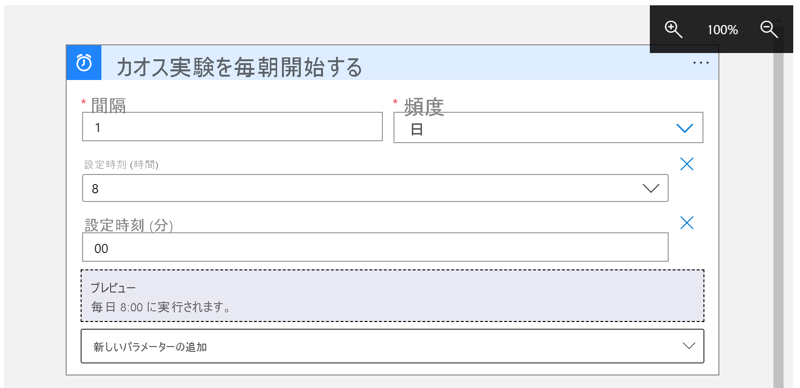
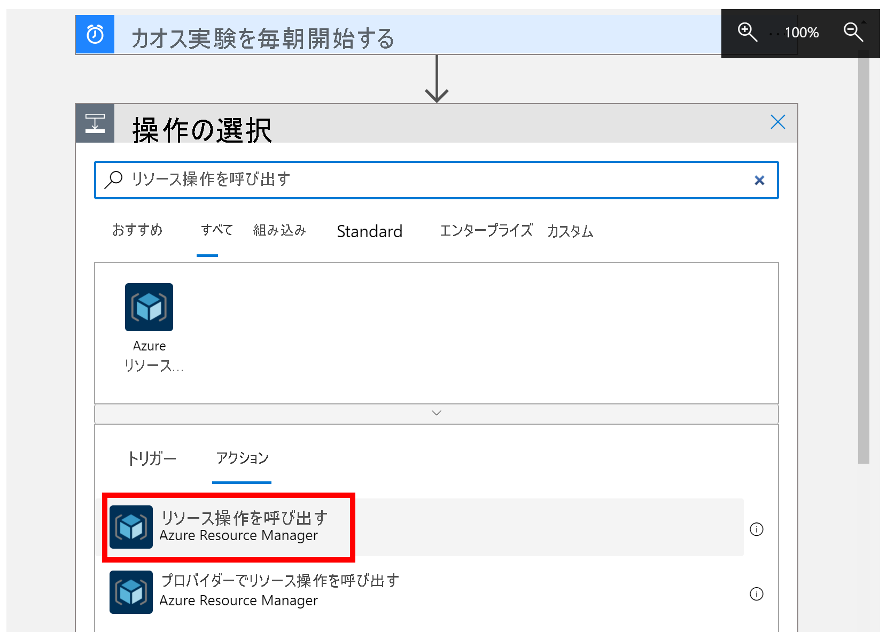
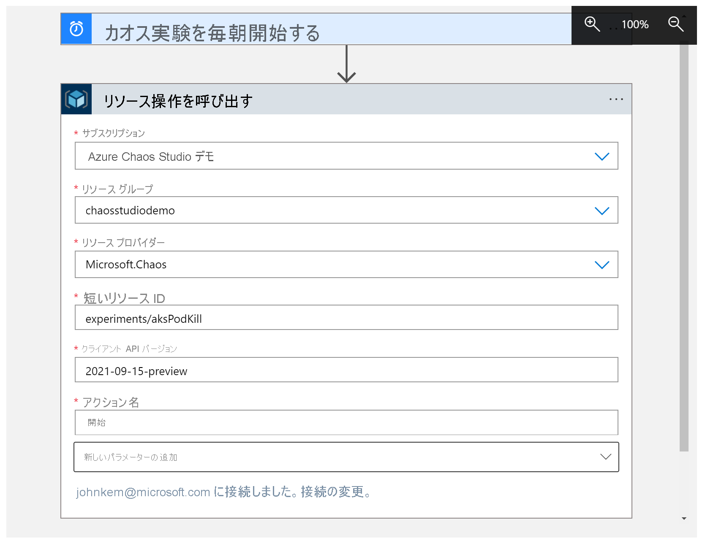

# チュートリアル: Azure Chaos Studio を使用して定期的な実験の実行をスケジュールする

Azure Chaos Studio を使用すると、アプリケーションまたはサービスの一部を意図的に失敗させるカオス実験を実行して、それらの障害に対する回復性があるかどうかを確認できます。 これらのカオス実験を定期的に実行して、アプリケーションの回復性が低下していないこと、またはコンプライアンス要件を満たしていることを確認すると役に立ちます。 このチュートリアルでは、[ロジック アプリ](../logic-apps/logic-apps-overview.md)を使用して、1 日に 1 回実行される実験をトリガーします。

このチュートリアルでは、以下の内容を学習します。

> [!div class="checklist"]
> * ロジック アプリを作成する 
> * カオス実験を 1 日に 1 回開始するようにトリガーするロジック アプリを構成する
> * ロジック アプリが正しく構成されていることをテストする

## 前提条件

- アクティブなサブスクリプションが含まれる Azure アカウント。 [無料でアカウントを作成できます](https://azure.microsoft.com/free/?WT.mc_id=A261C142F)。
- カオス実験。 [クイック スタート を使用してカオス実験を作成します](chaos-studio-quickstart-azure-portal.md)。
- カオス実験の対象となるすべてのリソースを [Chaos Studio にオンボードする](chaos-studio-targets-capabilities.md)必要があります。

## ロジック アプリを作成する
ロジック アプリは、スケジュールに基づいて実行できる自動化されたワークフローです。 このチュートリアルで使用しているロジック アプリは、繰り返しスケジュールを使用してカオス実験を開始します。

1. Azure アカウントの資格情報で [Azure Portal](https://portal.azure.com) にサインインします。 Azure ホーム ページで、 **[リソースの作成]** を選択します。

1. Azure Marketplace メニューで、 **[統合]**  >  **[ロジック アプリ]** を選択します。

   ![Azure Marketplace メニューで [統合] と [ロジック アプリ] が選択されているスクリーンショット。](images/tutorial-schedule-marketplace.png)

1. **[ロジック アプリ]** ペインで、作成するロジック アプリについて、以下に示す情報を入力します。

   

   | プロパティ | 値 | 説明 |
   |----------|-------|-------------|
   | **サブスクリプション** | <*Azure サブスクリプション名*> | Azure サブスクリプション名。 この例では、`Azure Chaos Studio Demo` を使用します。 |
   | **リソース グループ** | chaosstudiodemo | [Azure リソース グループ](../azure-resource-manager/management/overview.md)の名前。関連するリソースの整理に使用します。 この例では、`chaosstudiodemo` という名前の新しいリソース グループを作成します。 |
   | **Type** | 従量課金 | [ロジック アプリのリソースの種類](../logic-apps/single-tenant-overview-compare.md)。 **[従量課金]** に設定します。 |
   | **名前** | scheduleExperiment | ロジック アプリの名前。文字、数字、ハイフン (`-`)、アンダースコア (`_`)、かっこ (`(`、`)`)、およびピリオド (`.`) のみを含めることができます。 この例では、`scheduleExperiment` を使用します。 |
   | **場所** | 米国東部 | ロジック アプリの情報の保存先となるリージョン。 この例では、`East US` を使用します。 |
   | **Log Analytics を有効にする** | いいえ | ロジック アプリの診断ログを設定します。 **[いいえ]** に 設定します。 |

1. 完了したら、 **[確認および作成]** を選択します。 Azure によってロジック アプリに関する情報が検証されたら、 **[作成]** を選択します。

1. Azure によってアプリがデプロイされたら、 **[リソースに移動]** を選択します。

   Azure によって Logic Apps のテンプレートの選択ペインが開き、紹介動画、一般的に使用されるトリガー、およびロジック アプリのテンプレート パターンが表示されます。

## 繰り返しトリガーを追加する
次に、指定したスケジュールに基づいてワークフローが実行される繰り返し[トリガー](../logic-apps/logic-apps-overview.md#logic-app-concepts)を追加します。 すべてのロジック アプリは必ずトリガーから起動され、トリガーは、特定のイベントが発生するか、新しいデータが特定の条件を満たしたときに起動されます。

1. 動画と一般的なトリガーのセクションの下にある **[テンプレート]** セクションまでスクロールし、 **[空のロジック アプリ]** を選択します。

   ![Logic Apps のテンプレートの選択ペインで、[空のロジック アプリ] が選択されているスクリーンショット。](images/tutorial-schedule-blank.png)

1. Logic Apps デザイナーの検索ボックスに「`recurrence`」と入力し、**Recurrence** という名前のトリガーを選択します。

   ![Logic Apps デザイナーの検索ボックスに "recurrence" 検索用語が含まれ、[トリガー] 一覧で "Recurrence" トリガーが選択されているスクリーンショット。](images/tutorial-schedule-recurrence.png)

1. **[繰り返し]** シェイプの **省略記号** ( **...** ) ボタンを選択し、 **[名前の変更]** を選択します。 トリガーの名前をわかりやすく「`Start chaos experiment every morning`」に変更します。

   ![省略記号ボタンが選択され、[設定] 一覧が開き、[名前の変更] コマンドが選択されているスクリーンショット。](images/tutorial-schedule-rename.png)

1. トリガー内で、次のプロパティを以下の画面と説明に従って変更します。

   

   | プロパティ | 必須 | 値 | 説明 |
   |----------|----------|-------|-------------|
   | **間隔** | はい | 1 | チェックの間隔 (単位数)。 |
   | **頻度** | はい | 日間 | 定期実行の時間の単位。 |

1. **[間隔]** と **[頻度]** の下にある **[新しいパラメーターの追加]** ボックスの一覧を開き、次のプロパティを選択してトリガーに追加します。

   * **設定時刻 (時間)**
   * **設定時刻 (分)**

   ![[新しいパラメーターの追加] 一覧が表示され、次のプロパティが選択されているスクリーンショット:[設定曜日]、[設定時刻 (時間)]、[設定時刻 (分)]。](images/tutorial-schedule-recurrence-parameters.png)

1. 今度は、以下の図と説明に従って、プロパティの値を設定します。

   

   | プロパティ | 値 | 説明 |
   |----------|-------|-------------|
   | **設定時刻 (時間)** | 8 | この設定は、 **[頻度]** を **[週]** または **[日]** に設定した場合にのみ使用できます。 この繰り返しには、時刻 (時間) を選択します。 この例では、`8` 時に実行されます。 |
   | **設定時刻 (分)** | 00 | この設定は、 **[頻度]** を **[週]** または **[日]** に設定した場合にのみ使用できます。 この繰り返しには、時刻 (分) を選択します。 この例では、0 時に 1 回実行されます。 |

   このトリガーは、すべての平日の午前 8 時に発生します。 定期実行のスケジュールは **[プレビュー]** ボックスに表示されます。 詳細については、[タスクとワークフローのスケジュール](../connectors/connectors-native-recurrence.md)および[ワークフローのアクションとトリガー](../logic-apps/logic-apps-workflow-actions-triggers.md#recurrence-trigger)に関するページを参照してください。

1. ロジック アプリを保存します。 デザイナーのツール バーで、 **[保存]** を選択します。

## カオス実験実行アクションを追加する
トリガーが作成されたので、実験を開始する[アクション](../logic-apps/logic-apps-overview.md#logic-app-concepts)を追加します。 このチュートリアルでは、**リソース呼び出し操作** アクションを使用して実験を開始します。

1. Logic Apps デザイナーで、繰り返しトリガーの下の **[新しいステップ]** を選択します。

1. **[操作の選択]** で、「`Invoke resource operation`」と入力し、 **[アクション]** で、 **[Invoke resource operation]\(リソース呼び出し操作)\** という名前のオプションを選択します。

    

1. 実験が格納されている適切な **テナント** を設定し、 **[サインイン]** をクリックします。

1. そのテナントの Azure アカウントにサインインします。

1. 今度は、以下の図と説明に従って、アクションのプロパティの値を設定します。

   

   | プロパティ | 値 | 説明 |
   |----------|-------|-------------|
   | **サブスクリプション** | <*Azure サブスクリプション名*> | chaos 実験がデプロイされる Azure サブスクリプションの名前。 この例では、`Azure Chaos Studio Demo` を使用します。 |
   | **リソース グループ** | <*リソース グループ名*> | chaos 実験がデプロイされるリソース グループの名前。 この例では、`chaosstudiodemo` を使用します。 |
   | **リソース プロバイダー** | `Microsoft.Chaos` | Chaos Studio リソース プロバイダー。 |
   | **短いリソース ID** | `experiments/`<*Resource-group-name*> | 前に `experiments/` が付いた chaos 実験の名前 |
   | **クライアント API バージョン** | `2021-09-15-preview` | Chaos Studio REST APIバージョン。 |
   | **操作名** | `start` | Chaos Studio 実験アクションの名前。 常に `start`。 |

1. ロジック アプリを保存します。 デザイナーのツール バーで、 **[保存]** を選択します。

## ロジック アプリをテストする
次に、ロジック アプリをテストして、実験が正常に開始されることを確認します。

1. ロジック アプリ デザイナーを閉じます。

1. ロジック アプリの概要で、 **[トリガーの実行]** を選択し、 **[実行]** を 選択します。

    ![[トリガーの実行] オプションを示すスクリーンショット。](images/tutorial-schedule-run.png)

1. Azure portal でカオス実験に移動し、 **[状態]** が **[実行中]** に設定されていることを確認します。

    

## リソースをクリーンアップする

このアプリケーションを引き続き使用しない場合は、次の手順でロジック アプリを削除します。

1. ロジック アプリの概要で **[削除]** をクリックします。
1. ロジック アプリ名を入力し、 **[削除]** をクリックします。

## 次の手順

実験のスケジュールを設定したので、次の操作を実行できます。
> [!div class="nextstepaction"]
> [実験を実行および管理する](chaos-studio-run-experiment.md)
