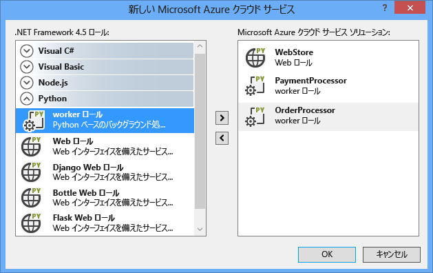
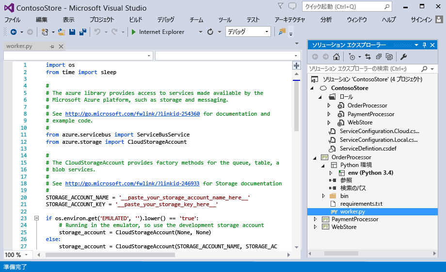
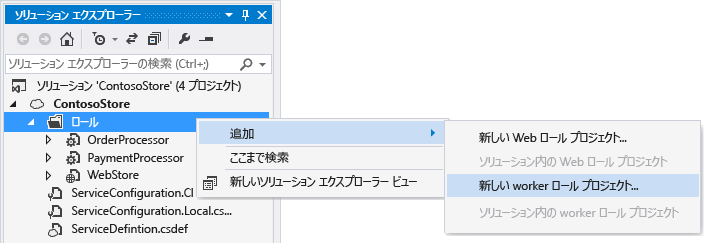
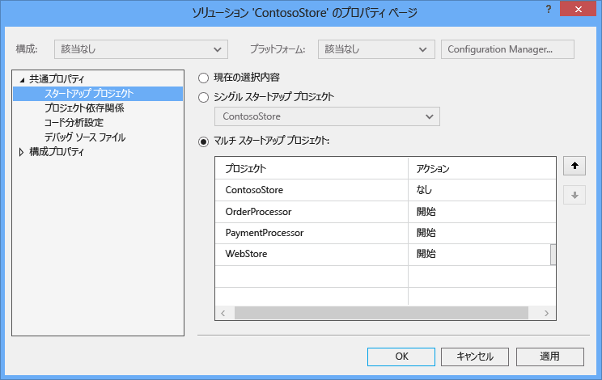
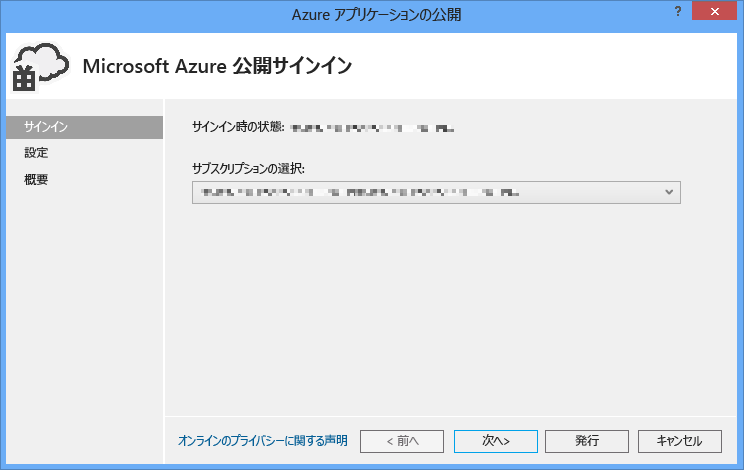
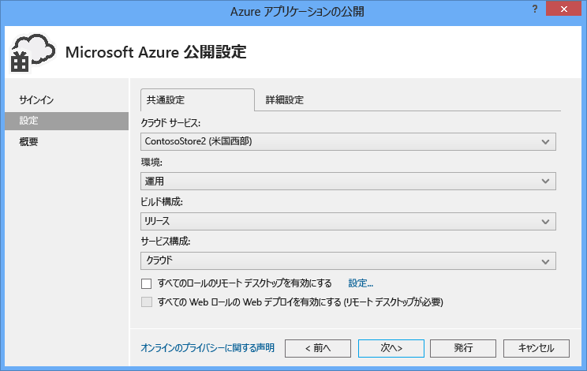
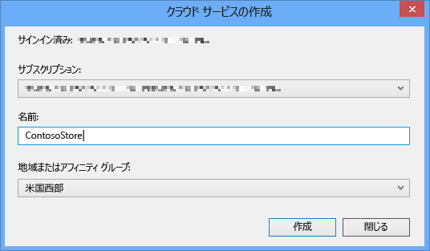
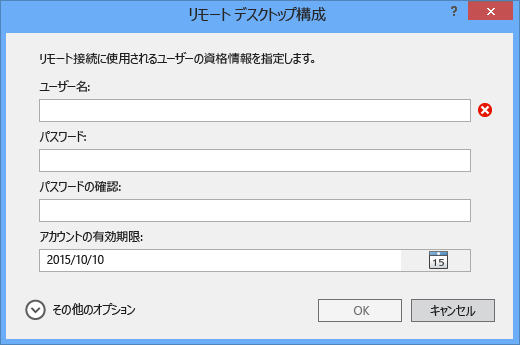
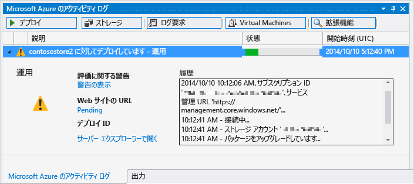

<properties
	pageTitle="Python Tools 2.1 for Visual Studio による Python Web ロールと Python worker ロール"
	description="Azure クラウド サービス (Web ロール、worker ロールを含む) を Python Tools for Visual Studio で作成する方法の概要"
	services=""
	documentationCenter="python"
	authors="huguesv"
	manager="wpickett"
	editor=""/>

<tags
	ms.service="cloud-services"
	ms.workload="tbd"
	ms.tgt_pltfrm="na"
	ms.devlang="python"
	ms.topic="get-started-article" 
	ms.date="02/09/2015"
	ms.author="huvalo"/>

# Python Tools 2.1 for Visual Studio による Python Web ロールと Python worker ロール

このガイドでは、[Python Tools for Visual Studio][] で Python Web ロールと Python worker ロールを扱う方法について概説します。

## 前提条件

 - Visual Studio 2012 または 2013
 - [Python Tools 2.1 for Visual Studio][]
 - [Azure SDK Tools for VS 2013][] または [Azure SDK Tools for VS 2012][]
 - [Python 2.7 (32 ビット)][] または [Python 3.4 (32 ビット)][]

[AZURE.INCLUDE [create-account-and-websites-note](../includes/create-account-and-websites-note.md)]

## Python Web ロールと Python worker ロールについて

Azure にはアプリケーションを実行するためのコンピューティング モデルとして、[Azure Websites][execution model-web sites]、[Azure Virtual Machines][execution model-vms]、および [Azure Cloud Services][execution model-cloud services] の 3 種類があります。これら 3 つのモデルはすべて、Python をサポートしています。クラウド サービスには、Web ロールとワーカー ロールが含まれ、*サービスとしてのプラットフォーム (PaaS)* を提供します。クラウド サービス内で、Web ロールは、フロントエンド Web アプリケーションのホスト専用のインターネット インフォメーション サービス (IIS) Web サーバーを提供します。ワーカー ロールは、ユーザーの操作や入力とは関係なく、長期間または恒久的な非同期タスクを実行できます。

詳細については、「[What is a Cloud Service? (クラウド サービスとは)]」を参照してください。

> [AZURE.NOTE]**単純な Web サイトを構築する場合** 実現するシナリオが単純な Web サイトのフロントエンドにのみ関係している場合は、軽量の Azure の Web サイトを使用することを検討してください。Web サイトの規模が増大し、要件が変化したときには、容易にクラウド サービスにアップグレードできます。Azure Websites の開発に関する記事については、<a href="/develop/python/">Python デベロッパー センター</a>を参照してください。 

## プロジェクトの作成

Visual Studio で、**[新しいプロジェクト]** ダイアログの **[Python]** から **[Azure クラウド サービス]** を選択します。

![[新しいプロジェクト] ダイアログ](./media/cloud-services-python-ptvs/new-project-cloud-service.png)

Azure クラウド サービス ウィザードでは、新規作成の対象として Web ロールまたは worker ロールを選択できます。

worker ロール テンプレートには、Azure ストレージ アカウントまたは Service Bus に接続するためのスケルトン コードが含まれています。

Web ロールまたは worker ロールは、既存のクラウド サービスにいつでも追加することができます。既存のプロジェクトをソリューションに追加するか、または新たに作成するかを選択できます。

クラウド サービスには、異なる言語で実装されたロールを含めることができます。たとえば、Django を使用して実装された Python Web ロールを、Python worker ロールや C# worker ロールと共存させることができます。ロール間のやり取りは、Service Bus キューまたはストレージ キューを使用することで簡単に行うことができます。

## ローカルで実行する

クラウド サービス プロジェクトをスタートアップ プロジェクトとして設定し、F5 キーを押した場合、ローカルの Azure エミュレーター内でクラウド サービスが実行されます。

PTVS (Python Tools for Visual Studio) はエミュレーターでの起動をサポートしていますが、デバッグ操作 (ブレークポイントなど) は機能しません。

Web ロールまたは worker ロールをデバッグするには、対象となるロール プロジェクトをスタートアップ プロジェクトに設定したうえで、デバッグするようにしてください。複数のスタートアップ プロジェクトを設定することもできます。ソリューションを右クリックし、**[スタートアップ プロジェクトの設定]** を選択します。

## Azure に発行する

クラウド サービス プロジェクトを発行するには、対象のクラウド サービス プロジェクトをソリューション内で右クリックし、**[発行]** を選択します。

[設定] ページで、発行するクラウド サービスを選択します。

そのクラウド サービスがまだない場合は、新しいクラウド サービスを作成できます。

エラーをデバッグする際の利便性を高めるために、コンピューターへのリモート デスクトップ接続を有効にすることもできます。

設定が済んだら、**[発行]** をクリックします。

出力ウィンドウにいくつかの進行状況が表示された後、[Microsoft Azure のアクティビティ ログ] ウィンドウが表示されます。

数分経過するとデプロイメントが完了し、Web ロールまたは worker ロールが Azure 上で稼働状態となります。

## 次のステップ

Python Tools for Visual Studio で Web ロールまたは worker ロールを扱う方法について、さらに詳しい情報については、次の PTVS 関連ドキュメントを参照してください。

- [クラウド サービス プロジェクト][]

Web ロールまたは worker ロールから、Azure Storage、Service Bus などの Azure サービスを使用する方法の詳細については、次のガイドを参照してください。

- [BLOB サービス][]
- [テーブル サービス][]
- [キュー サービス][]
- [Service Bus キュー][]
- [Service Bus トピック][]

<!--Link references-->

[What is a Cloud Service? (クラウド サービスとは)]: /manage/services/cloud-services/what-is-a-cloud-service/
[execution model-web sites]: fundamentals-application-models.md#WebSites
[execution model-vms]: fundamentals-application-models.md#VMachine
[execution model-cloud services]: fundamentals-application-models.md#CloudServices
[Python Developer Center]: /develop/python/

[BLOB サービス]: storage-python-how-to-use-blob-storage.md
[キュー サービス]: storage-python-how-to-use-queue-storage.md
[テーブル サービス]: storage-python-how-to-use-table-storage.md
[Service Bus キュー]: service-bus-python-how-to-use-queues.md
[Service Bus トピック]: service-bus-python-how-to-use-topics-subscriptions.md

<!--External Link references-->

[Python Tools for Visual Studio]: http://aka.ms/ptvs
[Python Tools for Visual Studio Documentation]: http://pytools.codeplex.com/documentation
[クラウド サービス プロジェクト]: http://pytools.codeplex.com/wikipage?title=Features%20Cloud%20Project

[Python Tools 2.1 for Visual Studio]: http://go.microsoft.com/fwlink/?LinkId=517189
[Azure SDK Tools for VS 2013]: http://go.microsoft.com/fwlink/?LinkId=323510
[Azure SDK Tools for VS 2012]: http://go.microsoft.com/fwlink/?LinkId=323511
[Python 2.7 (32 ビット)]: http://go.microsoft.com/fwlink/?LinkId=517190
[Python 3.4 (32 ビット)]: http://go.microsoft.com/fwlink/?LinkId=517191

<!---HONumber=July15_HO3-->