# <a name="get-started-with-azure-cloud-services-and-aspnet"></a>Azure Cloud Services と ASP.NET を使ってみる

## <a name="overview"></a>概要
このチュートリアルでは、ASP.NET MVC フロントエンドを使用する多層 .NET アプリケーションを作成して [Azure クラウド サービス](cloud-services-choose-me.md)にデプロイする方法について説明します。 このアプリケーションでは、[Azure SQL Database](http://msdn.microsoft.com/library/azure/ee336279)、[Azure Blob service](http://www.asp.net/aspnet/overview/developing-apps-with-windows-azure/building-real-world-cloud-apps-with-windows-azure/unstructured-blob-storage)、および [Azure Queue サービス](http://www.asp.net/aspnet/overview/developing-apps-with-windows-azure/building-real-world-cloud-apps-with-windows-azure/queue-centric-work-pattern)を使用します。 MSDN コード ギャラリーから、対象の [Visual Studio プロジェクトをダウンロード](http://code.msdn.microsoft.com/Simple-Azure-Cloud-Service-e01df2e4) できます。

このチュートリアルでは、アプリケーションを作成してローカルで実行する方法、アプリケーションを Azure にデプロイしてクラウドで実行する方法、アプリケーションを最初から作成する方法について説明します。 アプリケーションを最初から作成する手順から始め、必要に応じて後でアプリケーションのテストとデプロイ手順に進んでください。

## <a name="contoso-ads-application"></a>Contoso Ads アプリケーション
このアプリケーションは、広告の掲示板です。 ユーザーは、テキストを入力し、画像をアップロードして広告を作成します。 広告の一覧にはサムネイル画像が表示されます。広告を選択すると、フルサイズ画像と詳細が表示されます。

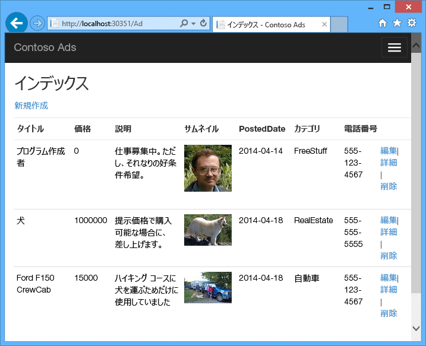

アプリケーションでは、 [キューを中心とした作業パターン](http://www.asp.net/aspnet/overview/developing-apps-with-windows-azure/building-real-world-cloud-apps-with-windows-azure/queue-centric-work-pattern) を使用して、CPU 負荷の高い縮小表示の作成をバックエンド プロセスにオフロードします。

## <a name="alternative-architecture-web-apps-and-webjobs"></a>代替アーキテクチャ: Web Apps および WebJobs
このチュートリアルでは、Azure クラウド サービスでフロントエンドとバックエンドの両方を実行する方法について説明します。 これに代わる方法として、フロントエンドを [Azure Web Apps](/azure/app-service/) で実行し、バックエンド用に [WebJobs](http://go.microsoft.com/fwlink/?LinkId=390226) 機能を使用する方法があります。 Web ジョブを使用するチュートリアルについては、「 [Get Started with the Azure WebJobs SDK (Azure Web ジョブ SDK の概要)](https://github.com/Azure/azure-webjobs-sdk/wiki)」を参照してください。 自分のシナリオに最適なサービスを選択する方法の詳細については、「 [Azure Websites、Cloud Services、および Virtual Machines の比較](../app-service/choose-web-site-cloud-service-vm.md)」を参照してください。

## <a name="what-youll-learn"></a>学習内容
* Azure SDK をインストールして、Azure 向け開発用にコンピューターを準備する方法
* ASP.NET MVC の Web ロールと worker ロールを使用して、Visual Studio クラウド サービス プロジェクトを作成する方法
* Azure ストレージ エミュレーターを使用してクラウド サービス プロジェクトをローカルでテストする方法
* Azure ストレージ アカウントを使用してクラウド プロジェクトを Azure クラウド サービスに発行し、テストする方法
* ファイルを Azure Blob service にアップロードして保存する方法
* Azure Queue サービスを使用して階層間の通信を行う方法

## <a name="prerequisites"></a>前提条件
このチュートリアルは、*Web ロール*、*worker ロール*などの用語を含む [Azure Cloud Services の基本概念](cloud-services-choose-me.md)を理解している方を対象にしています。  また、Visual Studio で [ASP.NET MVC](http://www.asp.net/mvc/tutorials/mvc-5/introduction/getting-started) または [Web フォーム](http://www.asp.net/web-forms/tutorials/aspnet-45/getting-started-with-aspnet-45-web-forms/introduction-and-overview) プロジェクトを操作する方法を理解していることも前提としています。 サンプル アプリケーションでは MVC を使用しますが、チュートリアルのほとんどは Web フォームにも当てはまります。

Azure サブスクリプションがなくてもアプリケーションをローカルに実行できますが、アプリケーションをクラウドにデプロイするには Azure サブスクリプションが必要になります。 アカウントを持っていない場合は、[MSDN サブスクライバーの特典を有効にする](https://azure.microsoft.com/pricing/member-offers/msdn-benefits-details/?WT.mc_id=A55E3C668)か、[無料試用版にサインアップ](https://azure.microsoft.com/pricing/free-trial/?WT.mc_id=A55E3C668)してください。

このチュートリアルの手順は、次のどちらの製品でも使用できます。

* Visual Studio 2013
* Visual Studio 2015
* Visual Studio 2017

これらの製品をお持ちでない場合は、Azure SDK をインストールすると Visual Studio が自動的にインストールされます。

## <a name="application-architecture"></a>アプリケーションのアーキテクチャ
このアプリでは、広告を SQL データベースに格納します。その際、テーブルを作成してデータにアクセスするために Entity Framework Code First を使用します。 それぞれの広告に対し、フルサイズ画像用とサムネイル用の 2 つの URL がデータベースに格納されます。

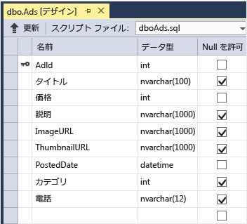

ユーザーが画像をアップロードすると、Web ロールで実行されているフロントエンドによってその画像が [Azure BLOB](http://www.asp.net/aspnet/overview/developing-apps-with-windows-azure/building-real-world-cloud-apps-with-windows-azure/unstructured-blob-storage)に格納され、広告情報がその BLOB を示す URL と共にデータベースに格納されます。 同時に、メッセージが Azure キューに書き込まれます。 worker ロールで実行されているバックエンド プロセスは、定期的にキューをポーリングして新しいメッセージの有無を確認します。 新しいメッセージが出現すると、worker ロールはその画像の縮小表示を作成し、その広告の縮小表示 URL データベース フィールドを更新します。 次の図に、アプリケーションの各パーツのやり取りを示します。

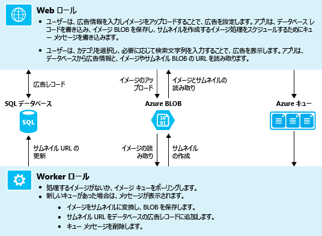

[!INCLUDE [install-sdk](../../includes/install-sdk-2017-2015-2013.md)]

## <a name="download-and-run-the-completed-solution"></a>完成したソリューションをダウンロードして実行する
1. [完成したソリューション](http://code.msdn.microsoft.com/Simple-Azure-Cloud-Service-e01df2e4)をダウンロードして解凍します。
2. Visual Studio を起動します。
3. **[ファイル]** メニューの **[プロジェクトを開く]** を選択し、ソリューションをダウンロードした場所に移動して、ソリューション ファイルを開きます。
4. Ctrl + Shift + B キーを押して、ソリューションをビルドします。

    既定では、 *.zip* ファイルに含まれていなかった NuGet パッケージのすべての内容が Visual Studio によって自動的に復元されます。 パッケージが復元されない場合は、**[ソリューションの NuGet パッケージの管理]** ダイアログ ボックスの右上にある **[復元]** ボタンをクリックしてパッケージを手動でインストールします。
5. **ソリューション エクスプローラー**で、**ContosoAdsCloudService** がスタートアップ プロジェクトとして選択されていることを確認します。
6. Visual Studio 2015 以上を使用している場合は、ContosoAdsWeb プロジェクトのアプリケーションの *Web.config* ファイルと ContosoAdsCloudService プロジェクトの *ServiceConfiguration.Local.cscfg* ファイルで SQL Server 接続文字列を変更します。 いずれの場合も、"(localdb)\v11.0" を "(localdb)\MSSQLLocalDB" に変更します。
7. Ctrl キーを押しながら F5 キーを押してアプリケーションを実行します。

    クラウド サービス プロジェクトをローカルで実行すると、Visual Studio によって Azure "*コンピューティング エミュレーター*" と Azure "*ストレージ エミュレーター*" が自動的に起動されます。 コンピューティング エミュレーターは、コンピューターのリソースを使用して、Web ロール環境と worker ロール環境をシミュレートします。 ストレージ エミュレーターは、 [SQL Server Express LocalDB](http://msdn.microsoft.com/library/hh510202.aspx) を使用して、Azure クラウド ストレージをシミュレートします。

    クラウド サービス プロジェクトを初めて実行するときは、エミュレーターが起動されるまで 1 分程度かかります。 エミュレーターの起動が完了すると、既定のブラウザーが開き、アプリケーションのホーム ページが表示されます。

    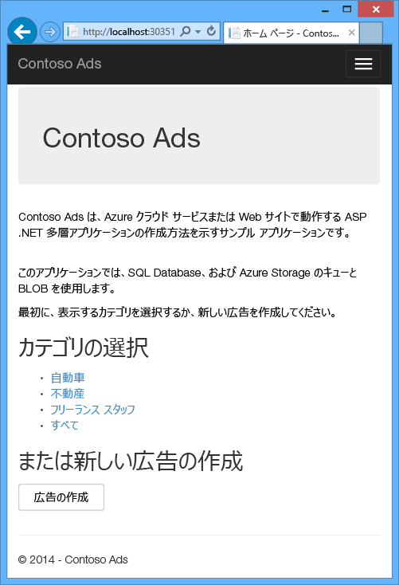
8. **[Create an Ad (広告を作成)]** をクリックします。
9. 何らかのテスト データを入力し、アップロードする画像 ( *.jpg* ) を選択したら、 **[Create]** をクリックします。

    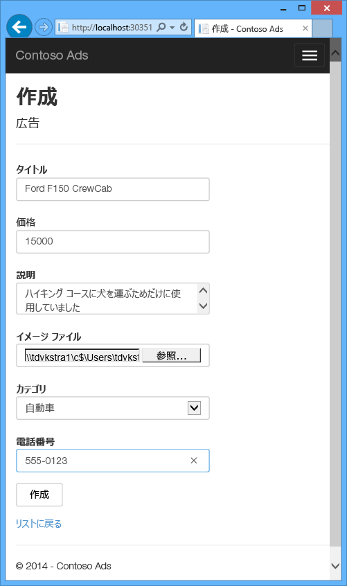

    [Index] ページが表示されますが、新しい広告の処理が完了していないため、縮小表示はまだ表示されません。
10. しばらく待ってから [Index] ページを更新すると、縮小表示が表示されます。

     
11. 広告に対応する **[Details]** をクリックすると、フルサイズの画像が表示されます。

     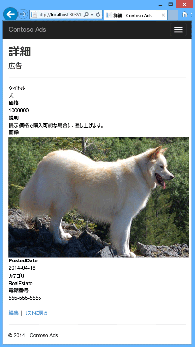

これまで、クラウドへの接続なしで、アプリケーションを完全にローカル コンピューター上で実行してきました。 ストレージ エミュレーターは、キュー データと BLOB データを SQL Server Express LocalDB データベースに格納します。アプリケーションは、広告データを別の LocalDB データベースに格納します。 Web アプリが初めてアクセスしようとしたとき、広告データベースが Entity Framework Code First によって自動的に作成されました。

次のセクションでは、クラウドで実行されたときにキュー、BLOB、およびアプリケーション データベース用に Azure クラウド リソースを使用するソリューションを構成します。 必要であれば、ローカルでの実行を継続しながらクラウド ストレージとデータベース リソースを使用することもできます。 後で方法を説明しますが、これは接続文字列を設定するだけで済みます。

## <a name="deploy-the-application-to-azure"></a>Azure にアプリケーションを展開する
アプリケーションをクラウドで実行するには、次の手順を実行します。

* Azure クラウド サービスを作成します。
* Azure SQL データベースを作成します。
* Azure ストレージ アカウントを作成します。
* Azure で実行されたときに Azure SQL データベースを使用するためのソリューションを構成します。
* Azure で実行されたときに Azure ストレージ アカウントを使用するためのソリューションを構成します。
* プロジェクトを Azure クラウド サービスにデプロイします。

### <a name="create-an-azure-cloud-service"></a>Azure クラウド サービスの作成
Azure クラウド サービスは、アプリケーションの実行環境です。

1. ブラウザーで、[Azure Portal](https://portal.azure.com) を開きます。
2. **[リソースの作成]、[Compute]、[クラウド サービス]** の順にクリックします。

3. [DNS 名] 入力ボックスに、クラウド サービスの URL プレフィックスを入力します。

    この URL は一意である必要があります。  選択したプレフィックスが既に使用されている場合は、エラー メッセージが表示されます。
4. 新しいリソース グループをサービスに指定します。 **[新規作成]** をクリックし、[リソース グループ] 入力ボックスに名前を入力します (例: CS_contososadsRG)。

5. アプリケーションをデプロイするリージョンを選択します。

    このフィールドは、クラウド サービスがホストされるデータセンターを指定します。 運用アプリケーションの場合は、顧客に最も近いリージョンを選択してください。 このチュートリアルでは、自分に最も近いリージョンを選択してください。
5. **Create** をクリックしてください。

    次の画像では、クラウド サービスは CSvccontosoads.cloudapp.net という URL で作成されます。

    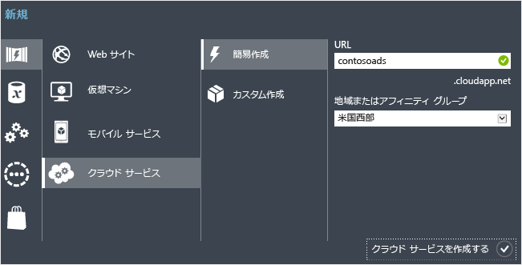

### <a name="create-an-azure-sql-database"></a>Azure SQL データベースの作成
アプリをクラウドで実行すると、クラウドベースのデータベースがアプリによって使用されます。

1. [Azure Portal](https://portal.azure.com) で、**[リソースの作成]、[Databases]、[SQL Database]** の順にクリックします。
2. **[データベース名]** ボックスに「 *contosoads*」と入力します。
3. **[リソース グループ]** で **[既存のものを使用]** をクリックし、クラウド サービスに使用しているリソース グループを選択します。
4. 次の図にある、**[サーバー] の [必要な設定の構成]** をクリックし、**[新しいサーバーの作成]** をクリックします。

    

    または、サブスクリプションに既にサーバーが設定されている場合は、ドロップダウン リストからそのサーバーを選択します。
5. **[サーバー名]** ボックスに「*csvccontosodbserver*」と入力します。

6. 管理者の**ログイン名**と**パスワード**を入力します。

    **[新しいサーバーの作成]** を選択した場合、ここで既存の名前とパスワードを入力することはしません。 後でデータベースへのアクセス時に使用する、現在定義中の新しい名前とパスワードを入力します。 以前に作成したサーバーを選択した場合は、既に作成されている管理ユーザー アカウントのパスワードを入力します。
7. **[場所]** で、クラウド サービスに選択したのと同じ場所を選択します。

    クラウド サービスとデータベースが異なるデータ センター (異なるリージョン) にあると、遅延時間が長くなり、データ センター外の帯域幅に対して課金されることになります。 データ センター内の帯域幅は無料です。
8. **[Azure サービスにサーバーへのアクセスを許可する]** チェック ボックスをオンにします。
9. 新しいサーバーについて **[選択]** をクリックします。

    
10. **Create** をクリックしてください。

### <a name="create-an-azure-storage-account"></a>Azure のストレージ アカウントの作成
Azure ストレージ アカウントは、キューおよび BLOB データをクラウドに格納するためのリソースを提供します。

現実のアプリケーションでは、通常、アプリケーション データとログ データ、テスト データと運用データに別個のアカウントを作成します。 このチュートリアルでは、アカウントを 1 つだけ使用します。

1. [Azure Portal](https://portal.azure.com) で、**[リソースの作成]、[Storage]、[ストレージ アカウント - Blob、File、Table、Queue]** の順にクリックします。
2. **[名前]** ボックスに、URL プレフィックスを入力します。

    このプレフィックスに、このボックスの下に表示されているテキストを連結したものが、ストレージ アカウントに固有の URL になります。 入力したプレフィックスが既に他のユーザーによって使用されている場合は、別のプレフィックスを選択する必要があります。
3. **[デプロイ モデル]** を *[クラシック]* に設定します。

4. **[レプリケーション]** ボックスの一覧で、**[ローカル冗長ストレージ (LRS)]** を選択します。

    geo レプリケーションをストレージ アカウントに対して有効にすると、格納されたコンテンツがセカンダリ データセンターにレプリケートされ、プライマリ ロケーションで重大な障害が発生した場合のフェールオーバーが有効になります。 Geo レプリケーションには追加費用が発生する場合があります。 また、テストおよび開発アカウントの場合は、一般的に Geo レプリケーションに対する課金は避けたいと考えるでしょう。 詳細については、「 [ストレージ アカウントの作成、管理、削除](../storage/common/storage-create-storage-account.md)」を参照してください。

5. **[リソース グループ]** で **[既存のものを使用]** をクリックし、クラウド サービスに使用しているリソース グループを選択します。
6. **[場所]** ボックスの一覧で、クラウド サービスに選択したのと同じリージョンを選択します。

    クラウド サービスとストレージ アカウントが異なるデータ センター (異なるリージョン) にあると、遅延時間が長くなり、データ センター外の帯域幅に対して課金されることになります。 データ センター内の帯域幅は無料です。

    Azure アフィニティ グループには、データ センター内のリソース間の距離を最短にする機能が備わっており、それにより遅延時間を短縮できます。 このチュートリアルでは、アフィニティ グループを使用しません。 詳細については、 [Azure でアフィニティ グループを作成する方法に関するページ](https://msdn.microsoft.com/library/azure/gg715317.aspx)を参照してください。
7. **Create** をクリックしてください。

    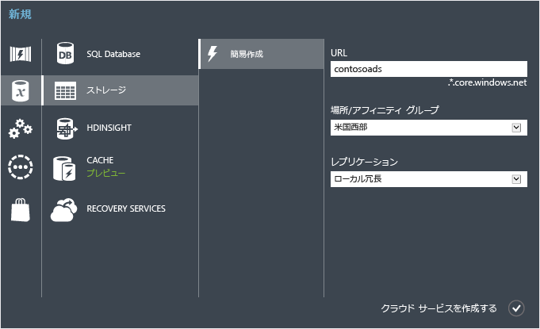

    次の画像では、ストレージ アカウントは `csvccontosoads.core.windows.net`という URL で作成されます。

### <a name="configure-the-solution-to-use-your-azure-sql-database-when-it-runs-in-azure"></a>Azure で実行されたときに Azure SQL データベースを使用するためのソリューションの設定
Web プロジェクトと worker ロール プロジェクトはそれぞれ独自のデータベース接続文字列を持ち、アプリが Azure で実行されたときにそれぞれが Azure SQL データベースを指し示す必要があります。

Web ロールと worker ロールのクラウド サービス環境設定には、 [Web.config の変換](http://www.asp.net/mvc/tutorials/deployment/visual-studio-web-deployment/web-config-transformations) を使用します。

> [!NOTE]
> このセクションと次のセクションでは、資格情報をプロジェクト ファイルに格納します。 [機密データは、パブリックなソース コード リポジトリに格納しないでください](http://www.asp.net/aspnet/overview/developing-apps-with-windows-azure/building-real-world-cloud-apps-with-windows-azure/source-control#secrets)。
>
>

1. ContosoAdsWeb プロジェクトで、アプリケーションの *Web.config* ファイルの *Web.Release.config* 変換ファイルを開き、`<connectionStrings>` 要素が含まれているコメント ブロックを削除した後、次のコードをその場所に貼り付けます。

    ```xml
    <connectionStrings>
        <add name="ContosoAdsContext" connectionString="{connectionstring}"
        providerName="System.Data.SqlClient" xdt:Transform="SetAttributes" xdt:Locator="Match(name)"/>
    </connectionStrings>
    ```

    ファイルは編集できるように開いたままにしておきます。
2. [Azure Portal](https://portal.azure.com) で、左側のウィンドウの **[SQL データベース]** をクリックし、このチュートリアル用に作成したデータベースをクリックしてから、**[接続文字列の表示]** をクリックします。

    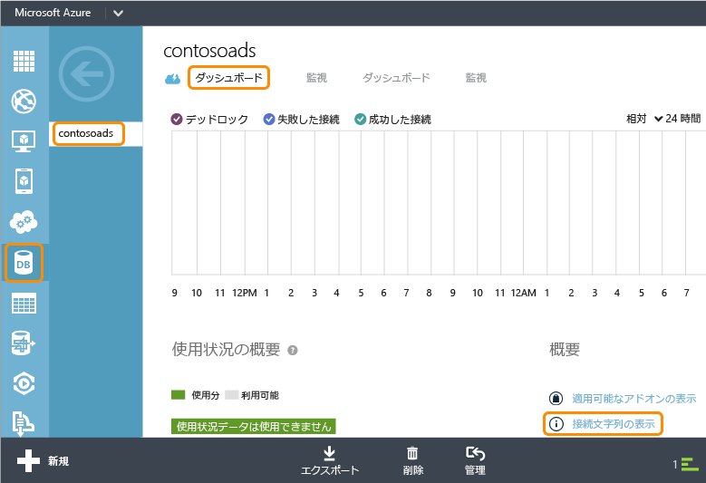

    接続文字列と、パスワードのプレースホルダーがポータルに表示されます。

    
3. *Web.Release.config* 変換ファイルで `{connectionstring}` を削除し、Azure Portal からコピーした ADO.NET 接続文字列をその場所に貼り付けます。
4. *Web.Release.config* 変換ファイルに貼り付けた接続文字列内の `{your_password_here}` を、新しい SQL データベース用に作成したパスワードで置き換えます。
5. ファイルを保存します。  
6. 以降の worker ロール プロジェクトを構成するための手順で使用する接続文字列を選択してコピーします (引用符は除きます)。
7. **ソリューション エクスプローラー**で、該当するクラウド サービス プロジェクトの **[ロール]** の下の **[ContosoAdsWorker]** を右クリックし、**[プロパティ]** をクリックします。

    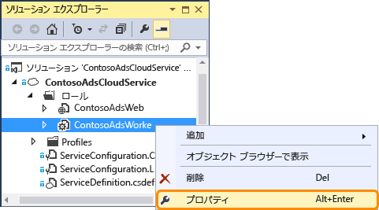
8. **[設定]** タブをクリックします。
9. **[サービス構成]** を **[クラウド]** に変更します。
10. `ContosoAdsDbConnectionString` 設定の **[値]** フィールドを選択し、このチュートリアルの前のセクションでコピーした接続文字列を貼り付けます。

     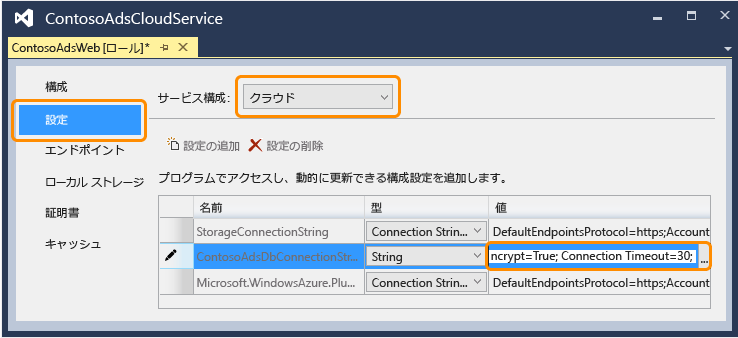
11. 変更を保存します。  

### <a name="configure-the-solution-to-use-your-azure-storage-account-when-it-runs-in-azure"></a>Azure で実行されたときに Azure ストレージ アカウントを使用するためのソリューションの設定
Web ロール プロジェクトと worker ロール プロジェクトの Azure ストレージ アカウント接続文字列は、クラウド サービス プロジェクトの環境設定に保存されます。 それぞれのプロジェクトには、アプリケーションがローカルに実行されたときに使用される設定とクラウドで実行されたときに使用される設定が別々にあります。 ここでは、Web ロール プロジェクトと worker ロール プロジェクトの両方のクラウド環境設定を更新します。

1. **ソリューション エクスプローラー**で、**[ContosoAdsCloudService]** プロジェクトの **[ロール]** の下にある **[ContosoAdsWeb]** を右クリックし、**[プロパティ]** をクリックします。

    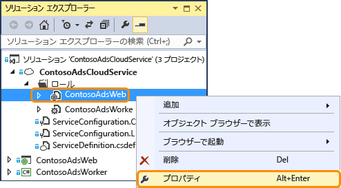
2. **[設定]** タブをクリックします。**[サービス構成]** ボックスの一覧の **[クラウド]** を選択します。

    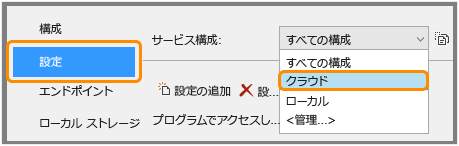
3. **StorageConnectionString** エントリを選択すると、行の右端に省略記号 **[...]** ボタンが表示されます。 省略記号ボタンをクリックして、 **[ストレージ アカウント接続文字列の作成]** ダイアログ ボックスを開きます。

    ![[接続文字列の作成] ボックスを開く](./media/cloud-services-dotnet-get-started/opencscreate.png)
4. **[ストレージ接続文字列の作成]** ダイアログ ボックスで、**[サブスクリプション]** オプションをクリックします。前に作成したストレージ アカウントを選択し、**[OK]** をクリックします。 まだログインしていない場合は、Azure アカウントの資格情報を入力するよう求められます。

    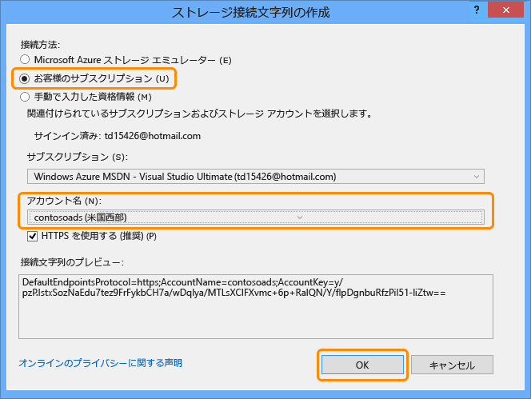
5. 変更を保存します。
6. `StorageConnectionString` 接続文字列の場合と同じ手順を使用して、`Microsoft.WindowsAzure.Plugins.Diagnostics.ConnectionString` 接続文字列を設定します。

    この接続文字列は、ログに使用されます。
7. **ContosoAdsWeb** ロールの場合と同じ手順に従って、**ContosoAdsWorker** ロールの両方の接続文字列を設定します。 このとき、**[サービス構成]** を **[クラウド]** に設定するのを忘れないでください。

Visual Studio UI を使用して構成したロールの環境設定は、ContosoAdsCloudService プロジェクトの次のファイルに格納されます。

* *ServiceDefinition.csdef* - 設定名を定義します。
* *ServiceConfiguration.Cloud.cscfg* - アプリがクラウドで実行されるときに値を提供します。
* *ServiceConfiguration.Local.cscfg* - アプリがローカルで実行されるときに値を提供します。

たとえば、ServiceDefinition.csdef には、次の定義が含まれます。

```xml
<ConfigurationSettings>
    <Setting name="StorageConnectionString" />
    <Setting name="ContosoAdsDbConnectionString" />
</ConfigurationSettings>
```

*ServiceConfiguration.Cloud.cscfg* ファイルには、Visual Studio でこれらの設定に入力した値が含まれます。

```xml
<Role name="ContosoAdsWorker">
    <Instances count="1" />
    <ConfigurationSettings>
        <Setting name="StorageConnectionString" value="{yourconnectionstring}" />
        <Setting name="ContosoAdsDbConnectionString" value="{yourconnectionstring}" />
        <!-- other settings not shown -->

    </ConfigurationSettings>
    <!-- other settings not shown -->

</Role>
```

`<Instances>` 設定は、Azure で worker ロール コードが実行される仮想マシンの数を指定します。 「 [次のステップ](#next-steps) 」セクションに、クラウド サービスのスケールアウトに関する情報へのリンクが含まれています。

### <a name="deploy-the-project-to-azure"></a>Azure にプロジェクトをデプロイする
1. **ソリューション エクスプローラー**で、**[ContosoAdsCloudService]** クラウド プロジェクトを右クリックし、**[発行]** をクリックします。

   ![[発行] メニュー](./media/cloud-services-dotnet-get-started/pubmenu.png)
2. **Azure アプリケーションの発行**ウィザードの **[サインイン]** 手順で、**[次へ]** をクリックします。

    ![[サインイン] 手順](./media/cloud-services-dotnet-get-started/pubsignin.png)
3. ウィザードの **[設定]** 手順で、**[次へ]** をクリックします。

    ![[設定] 手順](./media/cloud-services-dotnet-get-started/pubsettings.png)

    **[詳細設定]** タブの既定の設定はこのチュートリアルではそのまま使用します。 [詳細設定] タブの詳細については、「 [Microsoft Azure アプリケーションの発行ウィザード](https://docs.microsoft.com/azure/vs-azure-tools-publish-azure-application-wizard)」を参照してください。
4. **[概要]** 手順で、**[発行]** をクリックします。

    ![[概要] 手順](./media/cloud-services-dotnet-get-started/pubsummary.png)

   **[Azure のアクティビティ ログ]** ウィンドウが Visual Studio で開きます。
5. 右矢印のアイコンをクリックしてデプロイの詳細を展開します。

    デプロイが完了するまで 5 分程度かかる場合があります。

    ![[Azure のアクティビティ ログ] ウィンドウ](./media/cloud-services-dotnet-get-started/waal.png)
6. デプロイが完了したら、 **Web アプリの URL** をクリックしてアプリケーションを起動します。
7. この段階で、アプリケーションをローカルで実行したときと同様に、広告を作成、表示、編集して、アプリをテストできます。

> [!NOTE]
> テストが終了したら、クラウド サービスを削除または停止します。 クラウド サービスを使用していない場合でも仮想マシンのリソースが予約されるため、課金が発生します。 またクラウド サービスを実行したままにしておくと、その URL を見つけた他のユーザーが広告を作成したり表示したりする可能性があります。 [Azure Portal](https://portal.azure.com) で、クラウド サービスの **[概要]** タブに移動し、ページの上部にある **[削除]** ボタンをクリックします。 一時的に他のユーザーがこのサイトにアクセスできないようにするには、代わりに **[停止]** をクリックします。 この場合は、課金が継続されます。 同様の手順で、不要になった SQL データベースとストレージ アカウントを削除できます。
>
>

## <a name="create-the-application-from-scratch"></a>アプリケーションを最初から作成する
[完成版のアプリケーション](http://code.msdn.microsoft.com/Simple-Azure-Cloud-Service-e01df2e4)をまだダウンロードしていない場合は今すぐダウンロードしてください。 以降の操作では、ダウンロードしたプロジェクトから新しいプロジェクトにファイルをコピーします。

Contoso Ads アプリケーションを作成するには、次の手順を実行します。

* クラウド サービスの Visual Studio ソリューションを作成します。
* NuGet パッケージを更新して追加します。
* プロジェクト参照を設定します。
* 接続文字列を構成します。
* コード ファイルを追加します。

ソリューションを作成したら、クラウド サービス プロジェクト、Azure BLOB、およびキューに一意のコードを見ていきます。

### <a name="create-a-cloud-service-visual-studio-solution"></a>クラウド サービス Visual Studio ソリューションの作成
1. Visual Studio で、 **新しいプロジェクト** from the **[新しいプロジェクト]** を選択します。
2. **[新しいプロジェクト]** ダイアログ ボックスの左側のウィンドウで、**[Visual C#]** を展開し、**[クラウド]** テンプレート、**[Azure クラウド サービス]** テンプレートの順に選択します。
3. プロジェクトおよびソリューションに ContosoAdsCloudService という名前を付けて **[OK]** をクリックします。

    ![[新しいプロジェクト]](./media/cloud-services-dotnet-get-started/newproject.png)
4. **[新しい Azure クラウド サービス]** ダイアログ ボックスで、Web ロールと worker ロールを追加します。 Web ロールに ContosoAdsWeb という名前を付け、worker ロールに ContosoAdsWorker という名前を付けます (右側のウィンドウの鉛筆アイコンを使用して、ロールの既定の名前を変更します)。

    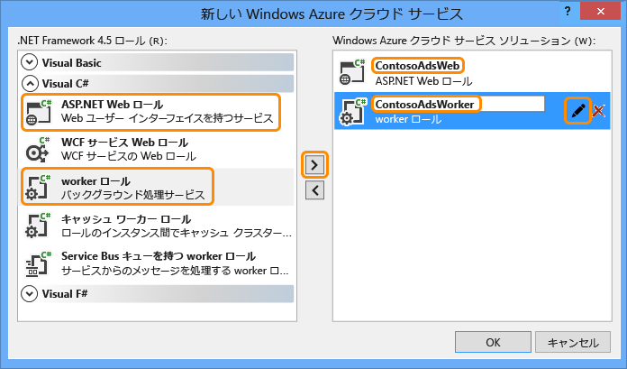
5. Web ロールの **[新しい ASP.NET プロジェクト]** ダイアログ ボックスで、MVC テンプレートを選択し、次に **[認証の変更]** をクリックします。

    ![[認証の変更]](./media/cloud-services-dotnet-get-started/chgauth.png)
6. **[認証の変更]** ダイアログ ボックスで、**[認証なし]** をクリックし、次に **[OK]** をクリックします。

    ![[認証なし]](./media/cloud-services-dotnet-get-started/noauth.png)
7. **[新しい ASP.NET プロジェクト]** ダイアログで **[OK]** をクリックします。
8. **ソリューション エクスプローラー**で (プロジェクトのソリューション以外の) ソリューションを右クリックし、**[追加] > [新しいプロジェクト]** の順に選択します。
9. **[新しいプロジェクトの追加]** ダイアログ ボックスで、左側のウィンドウの **[Visual C#]** の下の **[Windows]** を選択し、**[クラス ライブラリ]** テンプレートをクリックします。  
10. プロジェクトに *ContosoAdsCommon*という名前を付けて **[OK]** をクリックします。

    Web ロール プロジェクトと worker ロール プロジェクトの両方から Entity Framework のコンテキストとデータ モデルを参照する必要があります。 代わりの方法として、Entity Framework に関連するクラスを Web ロール プロジェクトで定義し、worker ロール プロジェクトからそのプロジェクトを参照することもできます。 ただしその代替方法では、worker ロール プロジェクトに、必要としない Web アセンブリへの参照が含まれることになります。

### <a name="update-and-add-nuget-packages"></a>NuGet パッケージの更新および追加
1. ソリューションの **[NuGet パッケージの管理]** ダイアログ ボックスを開きます。
2. ウィンドウの上部にある **[更新プログラム]** を選択します。
3. *WindowsAzure.Storage* パッケージを探し、一覧にある場合はそれを選択します。さらに、更新する Web プロジェクトと worker プロジェクトを選択し、**[更新]** をクリックします。

    ストレージ クライアント ライブラリは Visual Studio プロジェクト テンプレートよりも頻繁に更新されるため、新しく作成したプロジェクトのバージョンの更新が必要になることがよくあります。
4. ウィンドウの上部にある **[参照]** を選択します。
5. *EntityFramework* NuGet パッケージを見つけて、3 つのプロジェクトすべてにインストールします。
6. *Microsoft.WindowsAzure.ConfigurationManager* NuGet パッケージを見つけ、worker ロール プロジェクトにインストールします。

### <a name="set-project-references"></a>プロジェクト参照の設定
1. ContosoAdsWeb プロジェクトで、ContosoAdsCommon プロジェクトの参照を設定します。 ContosoAdsWeb プロジェクトを右クリックし、**[参照]**  -  **[参照の追加]** の順にクリックします。 **[参照マネージャー]** ダイアログ ボックスで、左側のウィンドウの **[ソリューション] > [プロジェクト]** の順に選択し、**[ContosoAdsCommon]** を選択して **[OK]** をクリックします。
2. ContosoAdsWorker プロジェクトで、ContosAdsCommon プロジェクトの参照を設定します。

    ContosoAdsCommon は、Entity Framework データ モデルおよびコンテキスト クラスを含みます。これらは、フロントエンドとバックエンドの両方で使用されます。
3. ContosoAdsWorker プロジェクトで、`System.Drawing` プロジェクトの参照を設定します。

    このアセンブリは、画像を縮小表示に変換するためにバックエンドで使用されます。

### <a name="configure-connection-strings"></a>接続文字列の構成
このセクションでは、Azure Storage と SQL 接続文字列をローカルでのテスト用に構成します。 チュートリアルの前半で紹介したデプロイ手順では、アプリケーションをクラウドで実行する場合の接続文字列の設定方法について説明しました。

1. ContosoAdsWeb プロジェクトで、アプリケーションの Web.config ファイルを開き、`connectionStrings` 要素を `configSections` 要素の後に挿入します。

    ```xml
    <connectionStrings>
        <add name="ContosoAdsContext" connectionString="Data Source=(localdb)\v11.0; Initial Catalog=ContosoAds; Integrated Security=True; MultipleActiveResultSets=True;" providerName="System.Data.SqlClient" />
    </connectionStrings>
    ```

    Visual Studio 2015 以上を使用している場合は、"v11.0" を "MSSQLLocalDB" に置き換えます。
2. 変更を保存します。
3. ContosoAdsCloudService プロジェクトで、**[ロール]** の下の [ContosoAdsWeb] を右クリックし、**[プロパティ]** をクリックします。

    
4. **[ContosAdsWeb [ロール]]** プロパティ ウィンドウで、**[設定]** タブをクリックし、**[設定の追加]** をクリックします。

    **[サービス構成]** は **[すべての構成]** のままにしておきます。
5. *StorageConnectionString* という名前の設定を追加します。 **[種類]** を *[接続文字列]* に設定し、**[値]** を *UseDevelopmentStorage=true* に設定します。

    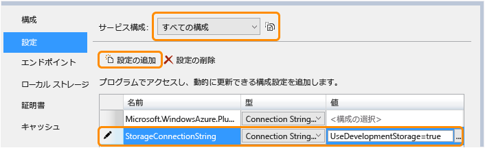
6. 変更を保存します。
7. 同じ手順を実行して、ストレージの接続文字列を ContosoAdsWorker ロール プロパティに追加します。
8. **[ContosoAdsWorker [Role]]** プロパティ ウィンドウで、もう 1 つ接続文字列を追加します。

   * 名前: ContosoAdsDbConnectionString
   * 型: 文字列
   * 値: Web ロール プロジェクトに使用したのと同じ接続文字列を貼り付けます(次の例は Visual Studio 2013 用です。 (次の例は Visual Studio 2013 用です。 Visual Studio 2015 以降を使用していて、この例をコピーする場合は、忘れずにデータ ソースを変更してください)。

       ```
       Data Source=(localdb)\v11.0; Initial Catalog=ContosoAds; Integrated Security=True; MultipleActiveResultSets=True;
       ```

### <a name="add-code-files"></a>コード ファイルの追加
このセクションでは、ダウンロードしたソリューションから新しいソリューションにコード ファイルをコピーします。 以降のセクションでは、このコードの重要な部分について説明します。

プロジェクトまたはフォルダーにファイルを追加するには、プロジェクトまたはフォルダーを右クリックし、 **[追加]** - **[既存の項目]** にデプロイする方法について説明します。 目的のファイルを選択してから **[追加]** をクリックします。 既存のファイルを置き換えるかどうかをたずねるメッセージが表示されたら、 **[はい]** をクリックします。

1. ContosoAdsCommon プロジェクトで、*Class1.cs* ファイルを削除します。その場所に、ダウンロードしたプロジェクトから *Ad.cs* ファイルと *ContosoAdscontext.cs* ファイルを追加します。
2. ContosoAdsWeb プロジェクトで、ダウンロードしたプロジェクトから次のファイルを追加します。

   * *Global.asax.cs*。  
   * *Views\Shared* フォルダー: *\_Layout.cshtml*。
   * *Views\Home* フォルダー: *Index.cshtml*。
   * *Controllers* フォルダー: *AdController.cs*。
   * *Views\Ad* フォルダー (最初にフォルダーを作成): 5 つの *.cshtml* ファイル。
3. ContosoAdsWorker プロジェクトで、ダウンロードしたプロジェクトから *WorkerRole.cs* を追加します。

この段階で、チュートリアルの前の説明で示した手順に従ってアプリケーションをビルドして実行できます。アプリは、ローカル データベースおよびストレージ エミュレーター リソースを使用します。

以降のセクションでは、Azure 環境、BLOB、およびキューの操作に関連するコードについて説明します。 このチュートリアルでは、スキャフォールディングを使用した MVC コントローラーおよびビューの作成方法、SQL Server データベースで動作する Entity Framework コードの作成方法、ASP.NET 4.5 での非同期プログラミングの基礎については説明していません。 これらのトピックについては、次のリソースを参照してください。

* [ASP.NET MVC 5 の概要](http://www.asp.net/mvc/tutorials/mvc-5/introduction/getting-started)
* [MVC 5 を使用する Entity Framework 6 Code First の概要](http://www.asp.net/mvc/tutorials/getting-started-with-ef-using-mvc)
* [.NET 4.5 での非同期プログラミングの概要](http://www.asp.net/aspnet/overview/developing-apps-with-windows-azure/building-real-world-cloud-apps-with-windows-azure/web-development-best-practices#async)

### <a name="contosoadscommon---adcs"></a>ContosoAdsCommon - Ad.cs
Ad.cs ファイルは、広告カテゴリの enum と広告情報の POCO エンティティ クラスを定義します。

```csharp
public enum Category
{
    Cars,
    [Display(Name="Real Estate")]
    RealEstate,
    [Display(Name = "Free Stuff")]
    FreeStuff
}

public class Ad
{
    public int AdId { get; set; }

    [StringLength(100)]
    public string Title { get; set; }

    public int Price { get; set; }

    [StringLength(1000)]
    [DataType(DataType.MultilineText)]
    public string Description { get; set; }

    [StringLength(1000)]
    [DisplayName("Full-size Image")]
    public string ImageURL { get; set; }

    [StringLength(1000)]
    [DisplayName("Thumbnail")]
    public string ThumbnailURL { get; set; }

    [DataType(DataType.Date)]
    [DisplayFormat(DataFormatString = "{0:yyyy-MM-dd}", ApplyFormatInEditMode = true)]
    public DateTime PostedDate { get; set; }

    public Category? Category { get; set; }
    [StringLength(12)]
    public string Phone { get; set; }
}
```

### <a name="contosoadscommon---contosoadscontextcs"></a>ContosoAdsCommon - ContosoAdsContext.cs
ContosoAdsContext クラスは、Entity Framework によって SQL データベースに格納される DbSet コレクションで Ad クラスを使用することを指定します。

```csharp
public class ContosoAdsContext : DbContext
{
    public ContosoAdsContext() : base("name=ContosoAdsContext")
    {
    }
    public ContosoAdsContext(string connString)
        : base(connString)
    {
    }
    public System.Data.Entity.DbSet<Ad> Ads { get; set; }
}
```

このクラスには 2 つのコンストラクターがあります。 1 つ目のコンストラクターは Web プロジェクトによって使用され、Web.config ファイルに格納される接続文字列の名前を指定します。 2 つ目のコンストラクターにより、Web.config ファイルがないため worker ロール プロジェクトによって使用される実際の接続文字列を渡すことができます。 この接続文字列がどこに格納されるかについては既に説明しました。後のセクションで、DbContext クラスを初期化するときに接続文字列がどのように取得されるかについて説明します。

### <a name="contosoadsweb---globalasaxcs"></a>ContosoAdsWeb - Global.asax.cs
`Application_Start` メソッドから呼び出されるコードにより、*images* BLOB コンテナーと *images* キューが存在しない場合はこれらが作成されます。 これにより、新しいストレージ アカウントの使用を開始するたびに、または新しいコンピューターでストレージ エミュレーターの使用を開始するたびに、必要な BLOB コンテナーとキューが自動的に作成されます。

次に、 *.cscfg* ファイルからのストレージ接続文字列を使用してストレージ アカウントへのアクセスが取得されます。

```csharp
var storageAccount = CloudStorageAccount.Parse
    (RoleEnvironment.GetConfigurationSettingValue("StorageConnectionString"));
```

次に、 *images* BLOB コンテナーの参照が取得され、コンテナーがまだ存在していない場合はこれが作成され、新しいコンテナーのアクセス許可が設定されます。 既定では、新しいコンテナーは、ストレージ アカウント資格情報を持つクライアントのみに BLOB へのアクセスを許可します。 Web サイトで画像 BLOB を指し示す URL を使用して画像を表示できるようにするには、BLOB をパブリックに設定する必要があります。

```csharp
var blobClient = storageAccount.CreateCloudBlobClient();
var imagesBlobContainer = blobClient.GetContainerReference("images");
if (imagesBlobContainer.CreateIfNotExists())
{
    imagesBlobContainer.SetPermissions(
        new BlobContainerPermissions
        {
            PublicAccess =BlobContainerPublicAccessType.Blob
        });
}
```

似たようなコードを使用して、 *images* キューの参照を取得し、新しいキューを作成できます。 この場合、アクセス許可の変更は必要ありません。

```csharp
CloudQueueClient queueClient = storageAccount.CreateCloudQueueClient();
var imagesQueue = queueClient.GetQueueReference("images");
imagesQueue.CreateIfNotExists();
```

### <a name="contosoadsweb---layoutcshtml"></a>ContosoAdsWeb - \_Layout.cshtml
*_Layout.cshtml* ファイルは、アプリ名をヘッダーとフッターに設定し、"Ads" メニュー エントリを作成します。

### <a name="contosoadsweb---viewshomeindexcshtml"></a>ContosoAdsWeb - Views\Home\Index.cshtml
*Views\Home\Index.cshtml* ファイルは、ホーム ページにカテゴリ リンクを表示します。 リンクは、querystring 変数の `Category` enum の整数値を Ads Index ページに渡します。

```razor
<li>@Html.ActionLink("Cars", "Index", "Ad", new { category = (int)Category.Cars }, null)</li>
<li>@Html.ActionLink("Real estate", "Index", "Ad", new { category = (int)Category.RealEstate }, null)</li>
<li>@Html.ActionLink("Free stuff", "Index", "Ad", new { category = (int)Category.FreeStuff }, null)</li>
<li>@Html.ActionLink("All", "Index", "Ad", null, null)</li>
```

### <a name="contosoadsweb---adcontrollercs"></a>ContosoAdsWeb - AdController.cs
*AdController.cs* ファイル内では、コンストラクターによって `InitializeStorage` メソッドが呼び出され、BLOB とキューを操作するための API を提供する Azure Storage クライアント ライブラリ オブジェクトが作成されます。

次に、*Global.asax.cs* と同様に、*images* BLOB コンテナーへの参照が取得されます。 この処理中に、Web アプリに適した既定の [再試行ポリシー](http://www.asp.net/aspnet/overview/developing-apps-with-windows-azure/building-real-world-cloud-apps-with-windows-azure/transient-fault-handling) が設定されます。 既定の指数関数的バックオフ再試行ポリシーでは、一時的な障害に対する反復的再試行操作によって Web アプリが 1 分以上停止する可能性があります。 ここでは、再試行ごとに 3 秒待機し、再試行の回数を 3 回までとする再試行ポリシーを指定しています。

```csharp
var blobClient = storageAccount.CreateCloudBlobClient();
blobClient.DefaultRequestOptions.RetryPolicy = new LinearRetry(TimeSpan.FromSeconds(3), 3);
imagesBlobContainer = blobClient.GetContainerReference("images");
```

似たようなコードを使用して、 *images* キューの参照を取得できます。

```csharp
CloudQueueClient queueClient = storageAccount.CreateCloudQueueClient();
queueClient.DefaultRequestOptions.RetryPolicy = new LinearRetry(TimeSpan.FromSeconds(3), 3);
imagesQueue = queueClient.GetQueueReference("images");
```

コントローラー コードのほとんどは、DbContext クラスを使用した Entity Framework データ モデルの操作に典型的なものです。 ただし、ファイルをアップロードして Blob Storage に保存する HttpPost `Create` メソッドは例外です。 モデル バインダーは、このメソッドに [HttpPostedFileBase](http://msdn.microsoft.com/library/system.web.httppostedfilebase.aspx) オブジェクトを提供します。

```csharp
[HttpPost]
[ValidateAntiForgeryToken]
public async Task<ActionResult> Create(
    [Bind(Include = "Title,Price,Description,Category,Phone")] Ad ad,
    HttpPostedFileBase imageFile)
```

ユーザーがアップロードするファイルを選択すると、ファイルがアップロードされて BLOB に保存されます。さらに、Ad データベース レコードが更新され、その BLOB を示す URL が反映されます。

```csharp
if (imageFile != null && imageFile.ContentLength != 0)
{
    blob = await UploadAndSaveBlobAsync(imageFile);
    ad.ImageURL = blob.Uri.ToString();
}
```

アップロード操作を実行するコードは `UploadAndSaveBlobAsync` メソッドに含まれています。 このコードでは、BLOB の GUID 名が作成され、ファイルがアップロードおよび保存され、保存された BLOB への参照が返されます。

```csharp
private async Task<CloudBlockBlob> UploadAndSaveBlobAsync(HttpPostedFileBase imageFile)
{
    string blobName = Guid.NewGuid().ToString() + Path.GetExtension(imageFile.FileName);
    CloudBlockBlob imageBlob = imagesBlobContainer.GetBlockBlobReference(blobName);
    using (var fileStream = imageFile.InputStream)
    {
        await imageBlob.UploadFromStreamAsync(fileStream);
    }
    return imageBlob;
}
```

HttpPost `Create` メソッドは、BLOB をアップロードしてデータベースを更新した後、画像を縮小表示に変換する準備が整ったことをバックエンド プロセスに通知するキュー メッセージを作成します。

```csharp
string queueMessageString = ad.AdId.ToString();
var queueMessage = new CloudQueueMessage(queueMessageString);
await queue.AddMessageAsync(queueMessage);
```

HttpPost `Edit` メソッドのコードも似ていますが、ユーザーが新しい画像ファイルを選択した場合に既に存在している BLOB を削除する必要がある点が異なります。

```csharp
if (imageFile != null && imageFile.ContentLength != 0)
{
    await DeleteAdBlobsAsync(ad);
    imageBlob = await UploadAndSaveBlobAsync(imageFile);
    ad.ImageURL = imageBlob.Uri.ToString();
}
```

次の例で示すのは、広告が削除されたときに BLOB を削除するコードです。

```csharp
private async Task DeleteAdBlobsAsync(Ad ad)
{
    if (!string.IsNullOrWhiteSpace(ad.ImageURL))
    {
        Uri blobUri = new Uri(ad.ImageURL);
        await DeleteAdBlobAsync(blobUri);
    }
    if (!string.IsNullOrWhiteSpace(ad.ThumbnailURL))
    {
        Uri blobUri = new Uri(ad.ThumbnailURL);
        await DeleteAdBlobAsync(blobUri);
    }
}
private static async Task DeleteAdBlobAsync(Uri blobUri)
{
    string blobName = blobUri.Segments[blobUri.Segments.Length - 1];
    CloudBlockBlob blobToDelete = imagesBlobContainer.GetBlockBlobReference(blobName);
    await blobToDelete.DeleteAsync();
}
```

### <a name="contosoadsweb---viewsadindexcshtml-and-detailscshtml"></a>ContosoAdsWeb - Views\Ad\Index.cshtml および Details.cshtml
*Index.cshtml* ファイルは、縮小表示を他の広告データと共に表示します。

```razor

```

*Details.cshtml* ファイルは、フルサイズの画像を表示します。

```razor

```

### <a name="contosoadsweb---viewsadcreatecshtml-and-editcshtml"></a>ContosoAdsWeb - Views\Ad\Create.cshtml および Edit.cshtml
*Create.cshtml* ファイルと *Edit.cshtml* ファイルは、フォームのエンコードを指定してコントローラーが `HttpPostedFileBase` オブジェクトを取得できるようにします。

```razor
@using (Html.BeginForm("Create", "Ad", FormMethod.Post, new { enctype = "multipart/form-data" }))
```

`<input>` 要素は、ファイル選択ダイアログを表示するようにブラウザーに指示します。

```razor
<input type="file" name="imageFile" accept="image/*" class="form-control fileupload" />
```

### <a name="contosoadsworker---workerrolecs---onstart-method"></a>ContosoAdsWorker - WorkerRole.cs - OnStart メソッド
Azure worker ロール環境は、worker ロールの起動時に `WorkerRole` クラスの `OnStart` メソッドを呼び出し、`OnStart` メソッドの終了時に `Run` メソッドを呼び出します。

`OnStart` メソッドは、 *.cscfg* ファイルからデータベース接続文字列を取得して Entity Framework の DbContext クラスに渡します。 既定で SQLClient プロバイダーが使用されるため、プロバイダーを指定する必要はありません。

```csharp
var dbConnString = CloudConfigurationManager.GetSetting("ContosoAdsDbConnectionString");
db = new ContosoAdsContext(dbConnString);
```

次に、ストレージ アカウントへの参照が取得され、BLOB コンテナーとキューが存在しない場合はこれらが作成されます。 この操作を行うためのコードは、Web ロールの `Application_Start` メソッドで示したコードに似ています。

### <a name="contosoadsworker---workerrolecs---run-method"></a>ContosoAdsWorker - WorkerRole.cs - Run メソッド
`Run` メソッドは、`OnStart` メソッドが初期化操作を終了するときに呼び出されます。 このメソッドは、新しいキュー メッセージを監視する無限ループを実行して、キュー メッセージが到着したときにそれを処理します。

```csharp
public override void Run()
{
    CloudQueueMessage msg = null;

    while (true)
    {
        try
        {
            msg = this.imagesQueue.GetMessage();
            if (msg != null)
            {
                ProcessQueueMessage(msg);
            }
            else
            {
                System.Threading.Thread.Sleep(1000);
            }
        }
        catch (StorageException e)
        {
            if (msg != null && msg.DequeueCount > 5)
            {
                this.imagesQueue.DeleteMessage(msg);
            }
            System.Threading.Thread.Sleep(5000);
        }
    }
}
```

ループの各イテレーションの後でキュー メッセージが見つからなかった場合、プログラムは 1 秒間スリープ状態になります。 これにより、worker ロールによって過剰な CPU 時間およびストレージ トランザクション コストが発生しないようにしています。 Microsoft Customer Advisory Team では、ある開発者に関する話を紹介しています。この開発者は、この処理を組み込むのを忘れて運用環境にデプロイし、休暇に出かけてしまったのです。 開発者が休暇から戻ると、その不注意によって休暇分を超える損失が生じていました。

ときには、キュー メッセージの内容が原因で処理エラーが生じることがあります。 このようなメッセージは *有害メッセージ*と呼ばれ、エラーをログに記録してループを再開するだけでは、このメッセージを処理する試みが際限なく繰り返されることになります。  そこで、catch ブロックに if ステートメントを含めて、アプリが現在のメッセージを処理しようと試みた回数を調べ、その回数が 5 回を超えた場合はメッセージをキューから削除するようにしています。

`ProcessQueueMessage` は、キュー メッセージが見つかったときに呼び出されます。

```csharp
private void ProcessQueueMessage(CloudQueueMessage msg)
{
    var adId = int.Parse(msg.AsString);
    Ad ad = db.Ads.Find(adId);
    if (ad == null)
    {
        throw new Exception(String.Format("AdId {0} not found, can't create thumbnail", adId.ToString()));
    }

    CloudBlockBlob inputBlob = this.imagesBlobContainer.GetBlockBlobReference(ad.ImageURL);

    string thumbnailName = Path.GetFileNameWithoutExtension(inputBlob.Name) + "thumb.jpg";
    CloudBlockBlob outputBlob = this.imagesBlobContainer.GetBlockBlobReference(thumbnailName);

    using (Stream input = inputBlob.OpenRead())
    using (Stream output = outputBlob.OpenWrite())
    {
        ConvertImageToThumbnailJPG(input, output);
        outputBlob.Properties.ContentType = "image/jpeg";
    }

    ad.ThumbnailURL = outputBlob.Uri.ToString();
    db.SaveChanges();

    this.imagesQueue.DeleteMessage(msg);
}
```

このコードには、データベースを読み取って画像の URL を取得する操作、画像を縮小表示に変換する操作、縮小表示を BLOB に保存する操作、縮小表示 BLOB の URL を反映するようにデータベースを更新する操作、およびキュー メッセージを削除する操作が含まれています。

> [!NOTE]
> `ConvertImageToThumbnailJPG` メソッドのコードでは、簡略化のために System.Drawing 名前空間のクラスを使用しています。 ただし、この名前空間のクラスは Windows フォーム用に設計されています。 これらのクラスは、Windows または ASP.NET サービスでの使用に関してサポートされていません。 イメージの処理オプションの詳細については、[イメージの動的生成](http://www.hanselman.com/blog/BackToBasicsDynamicImageGenerationASPNETControllersRoutingIHttpHandlersAndRunAllManagedModulesForAllRequests.aspx)と[イメージのサイズ変更の詳細](http://www.hanselminutes.com/313/deep-inside-image-resizing-and-scaling-with-aspnet-and-iis-with-imageresizingnet-author-na)に関する各ページを参照してください。
>
>

## <a name="troubleshooting"></a>トラブルシューティング
このチュートリアルの手順に従って作業しているときに発生する可能性のある一般的なエラーとその解決方法について説明します。

### <a name="serviceruntimeroleenvironmentexception"></a>ServiceRuntime.RoleEnvironmentException
`RoleEnvironment` オブジェクトは、アプリケーションを Azure で実行したときまたは Azure コンピューティング エミュレーターを使用してローカルで実行したときに Azure によって提供されます。  アプリケーションをローカルで実行しているときにこのエラーが発生した場合は、ContosoAdsCloudService プロジェクトがスタートアップ プロジェクトとして設定されていることを確認してください。 こうすることで、Azure コンピューティング エミュレーターを使用して実行するようにプロジェクトが設定されます。

アプリケーションが Azure RoleEnvironment を使用する目的の 1 つに、*.cscfg* ファイルに格納されている接続文字列値を取得することがあります。したがって、この例外の別の原因として、接続文字列が見つからないことが考えられます。 ContosoAdsWeb プロジェクトのクラウド構成とローカル構成の両方に対して StorageConnectionString 設定が作成されていること、および ContosoAdsWorker プロジェクトの両方の構成に対して両方の接続文字列が作成されていることを確認してください。 ソリューション全体を対象に StorageConnectionString の "**すべて検索**" を実行すると、6 つのファイルに 9 件見つかります。

### <a name="cannot-override-to-port-xxx-new-port-below-minimum-allowed-value-8080-for-protocol-http"></a>ポート xxx にオーバーライドできません。 新しいポートが http プロトコルで許容されている最小値 8080 を下回っています
Web プロジェクトで使用するポート番号を変更してください。 ContosoAdsWeb プロジェクトを右クリックし、 **[プロパティ]** をクリックします。 **[Web]** タブで、**[プロジェクトの URL]** 設定のポート番号を変更します。

ほかに考えられるこの問題の解決方法については、次のセクションを参照してください。

### <a name="other-errors-when-running-locally"></a>ローカルで実行しているときに発生するその他のエラー
既定では、新しいクラウド サービス プロジェクトは、Azure コンピューティング エミュレーター Express を使用して Azure 環境をシミュレートします。 これはフル装備のコンピューティング エミュレーターの軽量バージョンです。フル装備のエミュレーターは、Express バージョンが動作しない特定の条件でも動作します。  

フル装備のエミュレーターを使用するようにプロジェクトを変更するには、ContosoAdsCloudService プロジェクトを右クリックし、 **[プロパティ]** をクリックします。 **[プロパティ]** ウィンドウで、**[Web]** タブをクリックし、**[Full Emulator を使用する]** をクリックします。

フル装備のエミュレーターを使用してアプリケーションを実行するには、管理者特権で Visual Studio を開く必要があります。

## <a name="next-steps"></a>次の手順
Contoso Ads アプリケーションは、入門用のチュートリアルという目的から意図的にシンプルに作られています。 たとえば、このアプリケーションには、[依存関係の挿入](http://www.asp.net/mvc/tutorials/hands-on-labs/aspnet-mvc-4-dependency-injection)や[作業パターンのリポジトリと単位](http://www.asp.net/mvc/tutorials/getting-started-with-ef-using-mvc/advanced-entity-framework-scenarios-for-an-mvc-web-application#repo)が実装されていません。さらに、[ログのためのインターフェイス](http://www.asp.net/aspnet/overview/developing-apps-with-windows-azure/building-real-world-cloud-apps-with-windows-azure/monitoring-and-telemetry#log)、データ モデルの変更を管理するための [EF Code First Migrations](http://www.asp.net/mvc/tutorials/getting-started-with-ef-using-mvc/migrations-and-deployment-with-the-entity-framework-in-an-asp-net-mvc-application)、一時的なネットワーク エラーを管理するための [EF 接続の回復性](http://www.asp.net/mvc/tutorials/getting-started-with-ef-using-mvc/connection-resiliency-and-command-interception-with-the-entity-framework-in-an-asp-net-mvc-application)なども省略されています。

以下に、より現実的なコーディング手法を示すいくつかのクラウド サービス サンプル アプリケーションを、やさしいものから順に示します。

* [PhluffyFotos](http://code.msdn.microsoft.com/PhluffyFotos-Sample-7ecffd31)。 概念は Contoso Ads に似ていますが、より多くの機能とより現実的なコーディング手法が実装されています。
* [Azure Cloud Service Multi-Tier Application with Tables, Queues, and Blobs (テーブル、キュー、BLOB を使用する Azure クラウド サービス多層アプリケーション)](http://code.msdn.microsoft.com/windowsazure/Windows-Azure-Multi-Tier-eadceb36)。 Azure Storage のテーブル、BLOB、キューが紹介されています。 Azure SDK for .NET の以前のバージョンに基づいているため、現在のバージョンで作業するには一部変更する必要があります。

クラウド向けの開発については、「 [Azure を使用した実際のクラウド アプリケーションの作成](http://www.asp.net/aspnet/overview/developing-apps-with-windows-azure/building-real-world-cloud-apps-with-windows-azure/introduction)」をご覧ください。

Azure Storage に関するベスト プラクティスおよびパターンを紹介するビデオについては、「 [Microsoft Azure Storage - What's New, Best Practices and Patterns (Microsoft Azure Storage - 新機能、ベスト プラクティス、パターン)](http://channel9.msdn.com/Events/Build/2014/3-628)」を参照してください。

詳細については、次のリソースを参照してください。

* [Azure Cloud Services パート 1: 概要](http://justazure.com/microsoft-azure-cloud-services-part-1-introduction/)
* [Cloud Services の管理方法](cloud-services-how-to-manage-portal.md)
* [Azure Storage](https://docs.microsoft.com/azure/storage/)
* [クラウド サービス プロバイダーの選び方](https://azure.microsoft.com/overview/choosing-a-cloud-service-provider/)
