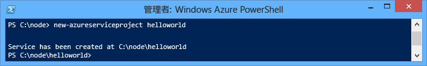
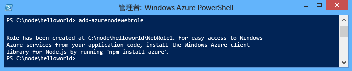
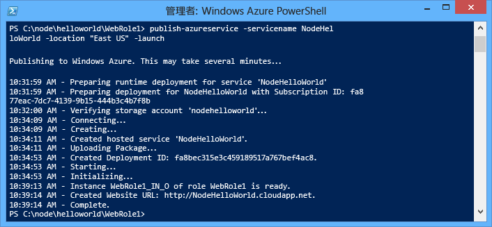
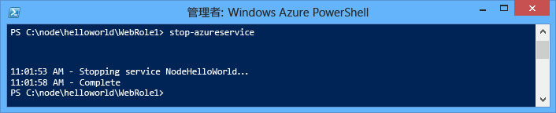
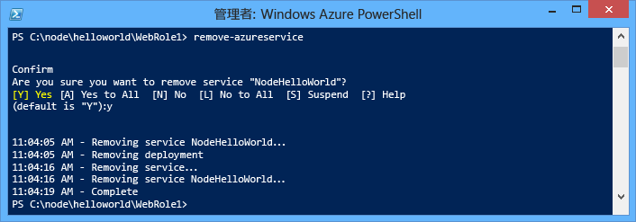

<properties
	pageTitle="Node.js 概要ガイド | Microsoft Azure"
	description="簡単な Node.js Web アプリケーションを作成して、Azure のクラウド サービスにデプロイする方法について説明します。"
	services="cloud-services"
	documentationCenter="nodejs"
	authors="rmcmurray"
	manager="wpickett"
	editor=""/>

<tags
	ms.service="cloud-services"
	ms.workload="tbd"
	ms.tgt_pltfrm="na" 
	ms.devlang="nodejs"
	ms.topic="hero-article"
	ms.date="01/09/2016"
	ms.author="robmcm"/>

# Node.js アプリケーションの構築と Azure クラウド サービスへのデプロイ

> [AZURE.SELECTOR]
- [Node.js](cloud-services-nodejs-develop-deploy-app.md)
- [.NET](cloud-services-dotnet-get-started.md)

このガイドでは、Azure のクラウド サービスで実行される簡単な Node.js アプリケーションを作成します。Cloud Services は、Azure のスケーラブルなクラウド アプリケーションの構成要素です。クラウド サービスによって、アプリケーションのフロントエンド コンポーネントとバックエンド コンポーネントの分離および独立した管理とスケールアウトを実現できます。Cloud Services は、各ロールを信頼性の高い方法でホストするための堅牢な専用仮想マシンを提供します。

Cloud Services の詳細と Azure の Web サイトおよび仮想マシンとの違いについては、[Azure Websites、Cloud Services、および Virtual Machines の比較](../choose-web-site-cloud-service-vm.md)に関するページを参照してください。

>[AZURE.TIP]単純な Web サイトを構築する場合 シナリオが、単純な Web サイトのフロントエンドにのみ関係している場合は、<a href="../app-service-web/web-sites-nodejs-develop-deploy-mac.md">軽量の Web アプリを使用することを検討してください。</a> Web アプリの規模が増大し、要件が変化したときには、容易にクラウド サービスにアップグレードできます。

このチュートリアルでは、Web ロールでホストされる単純な Web アプリケーションを作成します。コンピューティング エミュレーターを使用してアプリケーションをローケルでテストし、PowerShell コマンド ライン ツールを使用してアプリケーションをデプロイします。

このアプリケーションは簡単な "hello world" アプリケーションです。

## 前提条件

> [AZURE.NOTE]このチュートリアルは、Windows 上の Azure PowerShell を使用します。

- [Azure Powershell](../install-configure-powershell.md) のインストールおよび構成。
- [Azure SDK for .NET 2.7](http://www.microsoft.com/ja-JP/download/details.aspx?id=48178) のダウンロードとインストール。インストールのセットアップ時に、次のいずれかを選択します。
    - MicrosoftAzureAuthoringTools
    - MicrosoftAzureComputeEmulator

## Azure クラウド サービス プロジェクトの作成

新しい Azure クラウド サービス プロジェクトおよび基本的な Node.js スキャフォールディングを作成するには、次のタスクを実行します。

1. **Azure PowerShell** を管理者として実行します。(**[スタート] メニュー**または**スタート画面**で、**Azure PowerShell** を検索します。)

2.  サブスクリプションに [PowerShell を接続します](powershell-install-configure.md#how-to-connect-to-your-subscription)。
3.  次の PowerShell コマンドレットを入力してプロジェクトを作成します。

        New-AzureServiceProject helloworld

	

	**New-AzureServiceProject** コマンドレットは、クラウド サービスに Node.js アプリケーションを発行するための基本的な構造を生成します。これには、Azure への発行に必要な構成ファイルが含まれています。また、このコマンドレットにより、作業ディレクトリがこのサービス用のディレクトリに変更されます。

	このコマンドレットによって作成されるファイルは、次のとおりです。

	-   **ServiceConfiguration.Cloud.cscfg**、**ServiceConfiguration.Local.cscfg** および **ServiceDefinition.csdef**: アプリケーションの発行に必要な Azure 固有のファイルです。詳細については、「[Overview of Creating a Hosted Service for Azure (Azure 対応のホステッド サービスの作成の概要)][]」を参照してください。

	-   **deploymentSettings.json**: Azure PowerShell デプロイ コマンドレットによって使用されるローカル設定が格納されます。

4.  次のコマンドを入力して、新しい Web ロールを追加します。

        Add-AzureNodeWebRole

	

	**Add-azurenodewebrole** コマンドレットは、基本的な Node.js アプリケーションを作成します。**.csfg** ファイルおよび **.csdef** ファイルも変更され、新しいロールの構成エントリが追加されます。

	> [AZURE.NOTE]ロール名を指定しない場合は、既定の名前が使用されます。名前は、`Add-AzureNodeWebRole MyRole` のように、最初のコマンドレットのパラメーターとして指定できます。

Node.js アプリは **server.js** ファイルで定義されます。このファイルは Web ロール用のディレクトリ (既定では **WebRole1**) に配置されます。次にコードを示します。

	var http = require('http');
	var port = process.env.port || 1337;
	http.createServer(function (req, res) {
	    res.writeHead(200, { 'Content-Type': 'text/plain' });
	    res.end('Hello World\n');
	}).listen(port);

このコードは、クラウド環境に割り当てられたポート番号を使用する点を除いて、基本的に [nodejs.org][] Web サイトの "Hello World" サンプルと同じです。

## Azure にアプリケーションをデプロイする

	[AZURE.INCLUDE [create-account-note](../../includes/create-account-note.md)]

### Azure 発行設定のダウンロード

アプリケーションを Azure にデプロイするには、まず Azure サブスクリプションの発行設定をダウンロードする必要があります。

1.  次の Azure PowerShell コマンドレットを実行します。

        Get-AzurePublishSettingsFile

	ブラウザーで、発行設定のダウンロード ページが表示されます。Microsoft アカウントによるログインを求められる場合があります。その場合は、Azure サブスクリプションに関連付けられたアカウントを使用します。

	ダウンロードしたプロファイルを、簡単にアクセスできるファイルの保存場所に保存します。

2.  次のコマンドレットを実行して、ダウンロードした発行プロファイルをインポートします。

        Import-AzurePublishSettingsFile [path to file]

	> [AZURE.NOTE]発行設定をインポートしたら、ダウンロードした .publishSettings ファイルには他のユーザーがアカウントにアクセスできる情報が含まれているので、削除することを検討してください。

### アプリケーションの発行

発行するには、次のコマンドを実行します。

  	$ServiceName = "NodeHelloWorld" + $(Get-Date -Format ('ddhhmm'))   
	Publish-AzureServiceProject -ServiceName $ServiceName  -Location "East US" -Launch

- **- ServiceName** は、このデプロイに使用する名前を指定します。必ず一意の名前を使用してください。一意でない場合は発行が失敗します。**Get-Date** コマンドは、名前を一意にする日付/時刻文字列を追加します。

- **-Location** は、アプリケーションがホストされるデータ センターを指定します。使用可能なデータ センターの一覧を表示するには、**Get-azurelocation** コマンドレットを使用してください。

- **-Launch** は、デプロイの完了後に、ブラウザー ウィンドウの起動とホストされるサービスへの移動を行います。

発行が成功すると、次のような応答が表示されます。

> [AZURE.NOTE]初めてアプリケーションを発行する場合、アプリケーションがデプロイされ、利用可能になるまでに数分かかることがあります。

デプロイが完了すると、ブラウザー ウィンドウが開き、クラウド サービスに移動します。

これで、アプリケーションが Azure 上で実行されました。

**Publish-AzureServiceProject** コマンドレットによって行われる処理は次のとおりです。

1.  デプロイするためのパッケージを作成します。このパッケージには、アプリケーション フォルダー内のすべてのファイルが含まれます。

2.  **ストレージ アカウント**が存在しない場合は、新たに作成します。Azure ストレージ アカウントは、デプロイ中にアプリケーション パッケージを格納するために使用されます。デプロイが完了したら、ストレージ アカウントを削除してかまいません。

3.  **クラウド サービス**が存在しない場合は、新たに作成します。**クラウド サービス**は、Azure に展開したアプリケーションがホストされるコンテナーです。詳細については、「[Overview of Creating a Hosted Service for Azure (Azure 対応のホステッド サービスの作成の概要)][]」を参照してください。

4.  デプロイ パッケージを Azure に発行します。

## アプリケーションの停止と削除

アプリケーションをデプロイした後、余分なコストを回避するためにアプリケーションを無効にすることができます。Azure では、消費されたサーバー時間の 1 時間単位の料金が Web ロール インスタンスに課金されます。インスタンスが実行されていない場合や停止状態の場合でも、アプリケーションをデプロイした直後からサーバー時間が消費されます。

1.  Windows PowerShell ウィンドウで次のコマンドレットを実行し、前のセクションで作成したサービスのデプロイを停止します。

        Stop-AzureService

	サービスの停止には、数分間かかる場合があります。サービスが停止すると、停止したことを知らせるメッセージが表示されます。

	

2.  サービスを削除するには、次のコマンドレットを呼び出します。

        Remove-AzureService

	確認を求めるメッセージが表示されたら、「**Y**」と入力して、サービスを削除します。

	サービスの削除には、数分間かかる場合があります。サービスが削除されると、削除されたことを知らせるメッセージが表示されます。

	

	> [AZURE.NOTE]サービスを削除しても、サービスが最初に発行されたときに作成されたストレージ アカウントは削除されず、使用したストレージに対して引き続き課金されます。ストレージ アカウントの削除の詳細については、「[Azure サブスクリプションからストレージ アカウントを削除する方法](http://msdn.microsoft.com/library/windowsazure/hh531562.aspx)」を参照してください。

## 次のステップ

詳細については、[Node.js デベロッパー センター](/develop/nodejs/)を参照してください。

[The Windows Start menu with the Azure SDK Node.js entry expanded]: ./media/cloud-services-nodejs-develop-deploy-app/azure-powershell-menu.png
[mkdir]: ./media/cloud-services-nodejs-develop-deploy-app/getting-started-6.png
[nodejs.org]: http://nodejs.org/
[A directory listing of the helloworld folder.]: ./media/cloud-services-nodejs-develop-deploy-app/getting-started-7.png
[Overview of Creating a Hosted Service for Azure (Azure 対応のホステッド サービスの作成の概要)]: http://msdn.microsoft.com/library/windowsazure/jj155995.aspx
[A directory listing of the WebRole1 folder]: ./media/cloud-services-nodejs-develop-deploy-app/getting-started-8.png
[The menu displayed when right-clicking the Azure emulator from the task bar.]: ./media/cloud-services-nodejs-develop-deploy-app/getting-started-11.png
[A browser window displaying http://www.windowsazure.com/ with the Free Trial link highlighted]: ./media/cloud-services-nodejs-develop-deploy-app/getting-started-12.png
[A browser window displaying the liveID sign in page]: ./media/cloud-services-nodejs-develop-deploy-app/getting-started-13.png
[Internet Explorer displaying the save as dialog for the publishSettings file.]: ./media/cloud-services-nodejs-develop-deploy-app/getting-started-14.png

[The full status output of the Publish-AzureService command]: ./media/cloud-services-nodejs-develop-deploy-app/node20.png
[How to Delete a Storage Account from an Azure Subscription]: https://www.windowsazure.com/manage/services/storage/how-to-manage-a-storage-account/
[powershell-menu]: ./media/cloud-services-nodejs-develop-deploy-app/azure-powershell-start.png
 

<!---HONumber=AcomDC_0114_2016-->