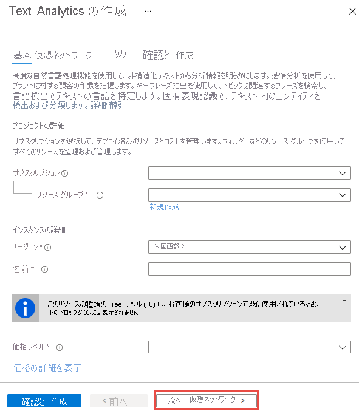

# Azure portal を使用して Cognitive Services アカウントを作成する

このクイックスタートでは、Azure Cognitive Services にサインアップし、単一サービスまたはマルチサービス サブスクリプションを持つアカウントを作成する方法を学習します。 これらのサービスは Azure [リソース](https://docs.microsoft.com/azure/azure-resource-manager/resource-group-portal)によって表され、Azure Cognitive Services APIs の中の 1 つまたは多くの API に接続できます。

## 前提条件

* 有効な Azure サブスクリプション。 無料で[アカウントを作成](https://azure.microsoft.com/free/)できます。

[!INCLUDE [cognitive-services-subscription-types](../../includes/cognitive-services-subscription-types.md)]

## 新しい Azure Cognitive Services リソースを作成する

リソースを作成する前に、Azure リソース グループを用意する必要があります。 すべての Cognitive Services アカウント (およびそれに関連付けられている Azure リソース) は、Azure リソース グループに属している必要があります。 アカウントを作成するときに、新しいリソース グループを作成するか、既存のものを使用するかを選択できます。 この記事では、新しいリソース グループを作成する方法を示します。

1. [Azure portal](https://portal.azure.com) にサインインし、 **[+リソースの作成]** をクリックします。

    

2. 使用できる Cognitive Services は次の方法で確認できます。
    * 検索バーを使用して、サブスクライブするサービスの名前を入力します。
        * マルチサービス サブスクリプションのリソースを作成するには、検索バーに「**Cognitive Services**」と入力し、**Cognitive Services** リソースを選択します。

        

    * 使用できるすべての Cognitive Services を表示するには、**Azure Marketplace** の **[AI + 機械学習]** を選択します。 関心があるサービスが表示されない場合は、 **[すべて表示]** をクリックし、**Cognitive Services** までスクロールします。 Cognitive Services APIs のカタログ全体を表示するには、 **[詳細]** をクリックします。
    
        

3. **[作成]** ページで、次の情報を指定します。

    > [!IMPORTANT]
    > Azure Cognitive Services を呼び出すときに必要になることがあるので、Azure の場所は記憶しておいてください。

    |    |    |
    |--|--|
    | **Name** | Cognitive Sservices リソースのわかりやすい名前。 わかりやすい名前を使用することをお勧します (*MyCognitiveServicesAccount* など)。 |
    | **サブスクリプション** | 使用できる Azure サブスクリプションのいずれかを選択します。 |
    | **Location** | Cognitive Services インスタンスの場所。 別の場所を選択すると待機時間が生じる可能性がありますが、リソースのランタイムの可用性には影響しません。 |
    | **[価格レベル]** | Cognitive Services アカウントのコストは、選択しているオプションと使用量によって異なります。 詳細については、「[API の価格の詳細](https://azure.microsoft.com/pricing/details/cognitive-services/)」をご覧ください。
    | **リソース グループ** | Cognitive Services リソースを含む [Azure リソース グループ](https://docs.microsoft.com/azure/architecture/cloud-adoption/governance/resource-consistency/azure-resource-access#what-is-an-azure-resource-group)。 新しいグループを作成することも、既存のグループに追加することもできます。 |

    

## サブスクリプションのキーを取得する

リソースを作成した後、Azure ダッシュ ボードにピン留めした場合は、そこからアクセスできます。 それ以外の場合は、 **[リソース グループ]** 内で検索できます。 リソースを選択した後は、 **[リソース管理]** の **[キー]** を選択してキーを取得できます。

[!INCLUDE [cognitive-services-environment-variables](../../includes/cognitive-services-environment-variables.md)]

## リソースのクリーンアップ

Cognitive Services サブスクリプションをクリーンアップして削除したい場合は、リソースまたはリソース グループを削除することができます。 リソース グループを削除すると、そのリソース グループに関連付けられている他のリソースも削除されます。

Azure Portal を使用してリソース グループを削除するには:

1. Azure Portal で左側のメニューを展開してサービスのメニューを開き、 **[リソース グループ]** を選択して、リソース グループの一覧を表示します。
2. 削除するリソース グループを見つけて、一覧の右側にある [詳細] ボタン (...) を右クリックします。
3. **[リソース グループの削除]** を選択し、確認します。

## 関連項目

* [Azure Cognitive Services に対する要求の認証](authentication.md)
* [Azure Cognitive Services とは](Welcome.md)
* [自然言語のサポート](language-support.md)
* [Docker コンテナーのサポート](cognitive-services-container-support.md)
