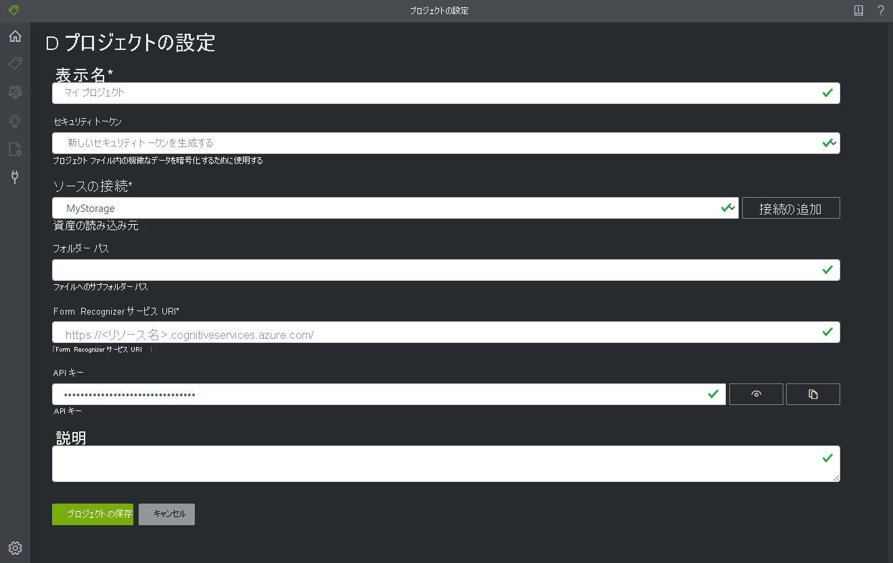

# <a name="train-a-form-recognizer-model-with-labels-using-the-sample-labeling-tool"></a>サンプル ラベル付けツールを使用したラベルによる Form Recognizer モデルのトレーニング

このクイックスタートでは、Form Recognizer REST API とサンプル ラベル付けツールを使用して、手動でラベル付けされたデータを使ってカスタム モデルをトレーニングします。 この機能の詳細については、概要に関するページの「[ラベルを使用したトレーニング](../overview.md#train-with-labels)」を参照してください。

Azure サブスクリプションをお持ちでない場合は、開始する前に [無料アカウント](https://azure.microsoft.com/free/?WT.mc_id=A261C142F) を作成してください。

## <a name="prerequisites"></a>前提条件

このクイック スタートを完了するには、以下が必要です。
- アクセスが制限された Form Recognizer プレビューへのアクセス。 プレビューへのアクセスを取得するには、[Form Recognizer アクセス要求フォーム](https://aka.ms/FormRecognizerRequestAccess)に記入して送信します。 Form Recognizer リソースを作成するためのリンクが記載されたメールが届きます。
- Form Recognizer のサンプル ラベル付けツールへのアクセス。 アクセスできるようにするには、[Form Recognizer ラベル付けツール要求フォーム](https://aka.ms/LabelToolRequestAccess)に記入して送信します。 資格情報を取得してプライベート コンテナー レジストリにアクセスする手順が記載されたメールが届きます。 
- 同じ種類の少なくとも 6 つのフォームのセット。 このデータを使用して、モデルのトレーニングとフォームのテストを行います。 このクイックスタートでは、[サンプル データ セット](https://go.microsoft.com/fwlink/?linkid=2090451)を使用できます。 Azure Storage アカウントの BLOB ストレージ コンテナーのルートにトレーニング ファイルをアップロードします。

## <a name="set-up-the-sample-labeling-tool"></a>サンプル ラベル付けツールを設定する

サンプル ラベル付けツールを実行するには、Docker エンジンを使用します。 次の手順に従って、Docker コンテナーを設定します。 Docker やコンテナーの基礎に関する入門情報については、「[Docker overview](https://docs.docker.com/engine/docker-overview/)」(Docker の概要) を参照してください。
1. まず、ホスト コンピューターに Docker をインストールします。 ホスト コンピューターには、ローカル コンピューター ([Windows](https://docs.docker.com/docker-for-windows/)、[MacOS](https://docs.docker.com/docker-for-mac/)、または [Linux](https://docs.docker.com/install/)) を使用できます。 あるいは、[Azure Kubernetes Service](https://docs.microsoft.com/azure/aks/index)、[Azure Container Instances](https://docs.microsoft.com/azure/container-instances/index)、または [Azure Stack にデプロイされている](https://docs.microsoft.com/azure-stack/user/azure-stack-solution-template-kubernetes-deploy?view=azs-1910) Kubernetes クラスターなど、Azure 内の Docker ホスティング サービスを使用することもできます。 ホスト コンピューターは、次のハードウェア要件を満たしている必要があります。

    | コンテナー | 最小値 | 推奨|
    |:--|:--|:--|
    |サンプル ラベル付けツール|2 コア、4 GB メモリ|4 コア、8 GB メモリ|
    
1. 次に、[Azure コマンド ライン インターフェイス (CLI)](https://docs.microsoft.com/cli/azure/install-azure-cli?view=azure-cli-latest) が必要です。 まだインストールしていない場合は、お使いのマシンにインストールします。
1. 次に、コマンド プロンプトで下のコマンドを入力します。 `<username>` と `<password>` の値は、"Form Recognizer へようこそ" メールに記載されています。
    ```
    docker login containerpreview.azurecr.io -u <username> -p <password>
    ```
1. `docker pull` コマンドを使用して、サンプル ラベル付けツールのコンテナーを取得します。
    ```
    docker pull containerpreview.azurecr.io/microsoft/cognitive-services-form-recognizer-custom-supervised-labeltool:latest
    ```
1. これで、`docker run` を使用してコンテナーを実行する準備が整いました。
    ```
    docker run -it -p 3000:80 containerpreview.azurecr.io/microsoft/cognitive-services-form-recognizer-custom-supervised-labeltool eula=accept
    ```

   このコマンドを実行すると、Web ブラウザーからサンプル ラベル付けツールを使用できるようになります。 [http://localhost:3000](http://localhost:3000) に移動します。

> [!NOTE]
> Form Recognizer REST API を使用して、ドキュメントにラベルを付けたり、モデルをトレーニングしたりすることもできます。 REST API を使用してトレーニングおよび分析を行うには、[REST API と Python によるラベルを使用したトレーニング](./python-labeled-data.md)に関するページを参照してください。

## <a name="set-up-input-data"></a>入力データを設定する

まず、すべてのトレーニング ドキュメントが同じ形式であることを確認します。 複数の形式のフォームがある場合は、共通する形式に基づいてサブフォルダーに分類します。 トレーニング時には、API に対してサブフォルダーを指定する必要があります。

### <a name="configure-cross-domain-resource-sharing-cors"></a>クロスドメイン リソース共有 (CORS) を構成する

ストレージ アカウントで CORS を有効にします。 Azure portal で自分のストレージ アカウントを選択し、左側のペインで **[CORS]** タブをクリックします。 一番下の行に、次の値を入力します。 その後、上部にある **[保存]** をクリックします。

* [許可されたドメイン] = * 
* [許可されたメソッド] = \[すべて選択\]
* [許可されたヘッダー] = *
* [公開されるヘッダー] = * 
* [最長有効期間] = 200

> [!div class="mx-imgBorder"]
> 

## <a name="connect-to-the-sample-labeling-tool"></a>サンプル ラベル付けツールに接続する

サンプル ラベル付けツールは、ソース (元のフォームがある場所) とターゲット (作成されたラベルと出力データがエクスポートされる場所) に接続します。

接続は、複数のプロジェクトにまたがって設定および共有できます。 拡張可能なプロバイダー モデルが使用されるため、新しいソースまたはターゲット プロバイダーを簡単に追加できます。

新しい接続を作成するには、左側のナビゲーション バーにある**新しい接続** (プラグ) アイコンをクリックします。

フィールドに次の値を入力します。

* **[表示名]** - 接続の表示名。
* **[説明]** - プロジェクトの説明。
* **[SAS URL]** - Azure Blob Storage コンテナーの Shared Access Signature (SAS) URL。 SAS URL を取得するには、Microsoft Azure Storage Explorer を開き、ご利用のコンテナーを右クリックし、 **[共有アクセス署名の取得]** を選択します。 有効期限を、サービスの使用を終了する時刻を設定します。 アクセス許可の **[読み取り]** 、 **[書き込み]** 、 **[削除]** 、および **[表示]** チェック ボックスがオンになっていることを確認し、 **[作成]** をクリックします。 次に、その値を **URL** セクションにコピーします。 それは次の書式になります`https://<storage account>.blob.core.windows.net/<container name>?<SAS value>`。


## <a name="create-a-new-project"></a>新しいプロジェクトを作成する

サンプル ラベル付けツールでは、プロジェクトに構成と設定が保存されます。 新しいプロジェクトを作成し、フィールドに次の値を入力します。

* **[表示名]** - プロジェクトの表示名
* **[セキュリティ トークン]** - 一部のプロジェクト設定には、API キーや他の共有シークレットなどの機密性の高い値を含めることができます。 各プロジェクトでは、機密性の高いプロジェクト設定の暗号化または暗号化解除に使用できるセキュリティ トークンが生成されます。 セキュリティ トークンは、左側のナビゲーション バーの下部にある歯車アイコンをクリックすると、[アプリケーション設定] に表示されます。
* **[基になる接続]** - このプロジェクトに使用する、前の手順で作成した Azure Blob Storage 接続。
* **[フォルダー パス]** (省略可能) - ソース フォームが BLOB コンテナー上のフォルダーに配置されている場合は、ここにフォルダー名を指定します。
* **[Form Recognizer Service Uri]\(Form Recognizer サービスの URI\)** - Form Recognizer のエンドポイント URL。
* **[API キー]** - Form Recognizer のサブスクリプション キー。
* **[説明]** (省略可能) - プロジェクトの説明



## <a name="label-your-forms"></a>フォームにラベルを付ける

プロジェクトを作成するか開くと、メインのタグ エディター ウィンドウが開きます。 このタグ エディターは、次の 3 つの部分で構成されます。

* サイズ変更可能なプレビュー ペイン。基になる接続にあるフォームのスクロール可能な一覧が表示されます。
* メインのエディター ペイン。ここで、タグを適用できます。
* タグ エディター ペイン。ここで、タグの変更、ロック、並べ替え、削除を行うことができます。 

### <a name="identify-text-elements"></a>テキスト要素を識別する

左側のペインにある **[Run OCR on all files]\(すべてのファイルに対して OCR を実行\)** をクリックして、各ドキュメントのテキスト レイアウト情報を取得します。 ラベル付けツールによって、各テキスト要素の周囲に境界ボックスが描画されます。

### <a name="apply-labels-to-text"></a>ラベルをテキストに適用する

次に、ラベルを作成し、モデルに認識させるテキスト要素に適用します。

1. 最初に、タグ エディター ペインを使用して、識別するタグ (ラベル) を作成します。
1. メインのエディターで、クリックしたままドラッグすることで、強調表示されたテキスト要素から 1 つまたは複数の単語を選択します。

    > [!NOTE]
    > 現在、複数のページにまたがるテキストを選択することはできません。
1. 適用するタグをクリックするか、対応するキーボード キーを押します。 選択した各テキスト要素には 1 つのタグのみを適用できます。各タグは 1 ページにつき 1 回のみ適用できます。

    > [!TIP]
    > 数字キーは、最初の 10 個のタグのホットキーとして割り当てられます。 タグの順序は、タグ エディター ペインの上矢印と下矢印のアイコンを使用して変更できます。

上記の手順に従って 5 つのフォームにラベルを付けてから、次の手順に進みます。


## <a name="train-a-custom-model"></a>カスタム モデルをトレーニングする

左側のペインでトレーニング アイコン (列車車両) をクリックして、[トレーニング] ページを開きます。 次に、 **[トレーニング]** ボタンをクリックして、モデルのトレーニングを開始します。 トレーニング プロセスが完了すると、次の情報が表示されます。

* **[モデル ID]** - 作成およびトレーニングされたモデルの ID。 トレーニングの呼び出しごとに、独自の ID を持つ新しいモデルが作成されます。 この文字列を安全な場所にコピーしてください。REST API を使用して予測呼び出しを行う場合に必要になります。
* **[Average Accuracy]\(平均精度\)** - モデルの平均精度。 追加のフォームにラベルを付け、再度トレーニングを行って新しいモデルを作成することにより、モデルの精度を向上させることができます。 最初は 5 つのフォームにラベルを付け、必要に応じてフォームの数を増やすことをお勧めします。
* タグの一覧と、タグごとの予測精度。


トレーニングが完了したら、 **[Average Accuracy]\(平均精度\)** の値を確認します。 低い場合は、入力ドキュメントをさらに追加して、上記の手順を繰り返す必要があります。 既にラベルを付けたドキュメントは、プロジェクトのインデックスに残ります。

> [!TIP]
> REST API 呼び出しを使用してトレーニング プロセスを実行することもできます。 これを行う方法については、[Python によるラベルを使用したトレーニング](./python-labeled-data.md)に関するページを参照してください。

## <a name="analyze-a-form"></a>フォームを分析する

左側の予測 (四角形) アイコンをクリックして、モデルをテストします。 トレーニング プロセスで使用しなかったフォーム ドキュメントをアップロードします。 次に、右側にある **[予測]** ボタンをクリックして、フォームのキーと値の予測を取得します。 このツールでは、境界ボックスにタグが適用され、各タグの信頼度がレポートされます。

> [!TIP]
> REST 呼び出しを使用して Analyze API を実行することもできます。 これを行う方法については、[Python によるラベルを使用したトレーニング](./python-labeled-data.md)に関するページを参照してください。

## <a name="improve-results"></a>結果を改善する

レポートされる精度によっては、モデルを改善するために、さらにトレーニングを行う必要が生じる場合があります。 予測が完了したら、適用されている各タグの信頼度の値を確認します。 トレーニングの平均精度値が高くても信頼度スコアが低い (または結果が不正確である) 場合は、予測に使用されたファイルをトレーニング セットに追加してラベルを付け、再度トレーニングを行う必要があります。

分析対象のドキュメントがトレーニングで使用されているドキュメントと異なる場合、レポートされる平均精度、信頼度スコア、および実際の精度に一貫性がなくなる可能性があります。 ドキュメントには、人間が見た場合に似ていても AI モデルにとっては異なって見えるものがあることに留意してください。 たとえば、2 つのバリエーションがあるフォームの種類を使ってトレーニングするとします。ここでは、トレーニング セットはバリエーション A 20%、バリエーション B 80% で構成されています。この場合、予測の際にバリエーション A のドキュメントの信頼度スコアが低くなる可能性があります。

## <a name="save-a-project-and-resume-later"></a>プロジェクトを保存して後で再開する

プロジェクトを時を改めて再開したり、別のブラウザーで再開したりするには、プロジェクトのセキュリティ トークンを保存し、後で再入力する必要があります。 

### <a name="get-project-credentials"></a>プロジェクトの資格情報を取得する
プロジェクトの設定ページ (スライダー アイコン) に移動し、セキュリティ トークンの名前を書き留めます。 次に、アプリケーション設定 (歯車アイコン) に移動します。ここには、現在のブラウザー インスタンスのセキュリティ トークンがすべて表示されます。 プロジェクトのセキュリティ トークンを検索し、その名前とキー値を安全な場所にコピーします。

### <a name="restore-project-credentials"></a>プロジェクトの資格情報を復元する
プロジェクトを再開する場合は、まず、同じ Blob Storage コンテナーへの接続を作成する必要があります。 これを行うには、前述の手順に従います。 次に、アプリケーション設定ページ (歯車アイコン) に移動し、プロジェクトのセキュリティ トークンがそこにあるかどうかを確認します。 ない場合は、新しいセキュリティ トークンを追加し、前の手順で保存したトークン名とキーをコピーします。 その後、[設定の保存] をクリックします。 

### <a name="resume-a-project"></a>プロジェクトを再開する
最後に、メイン ページ (家のアイコン) に移動し、[Open Cloud Project]\(クラウド プロジェクトを開く\) をクリックします。 その後、Blob Storage 接続を選択し、プロジェクトの *.vott* ファイルを選択します。 これにはセキュリティ トークンが含まれているため、アプリケーションによってプロジェクトの設定がすべて読み込まれます。

## <a name="next-steps"></a>次のステップ

このクイックスタートでは、Form Recognizer のサンプル ラベル付けツールを使用し、手動でラベル付けされたデータを使ってモデルをトレーニングする方法について説明しました。 ラベル付けツールを独自のアプリケーションに統合する場合は、ラベル付けされたデータのトレーニングを処理する REST API を使用します。

> [!div class="nextstepaction"]
> [Python でラベルを使用してトレーニングする](./python-labeled-data.md)
