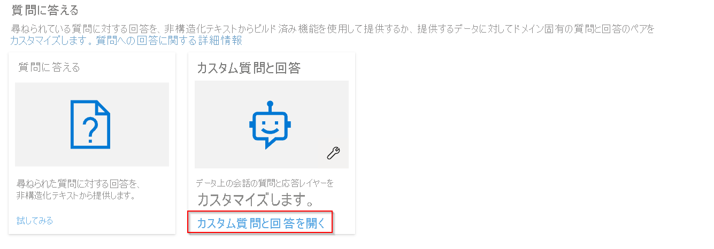
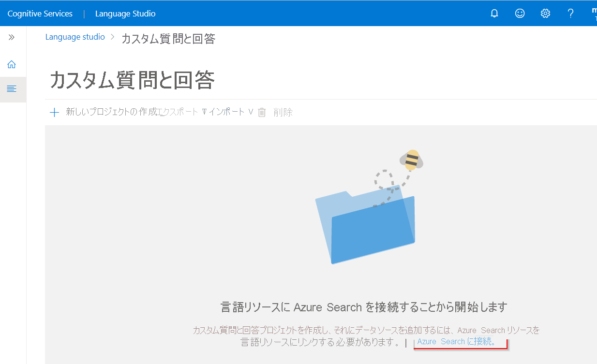
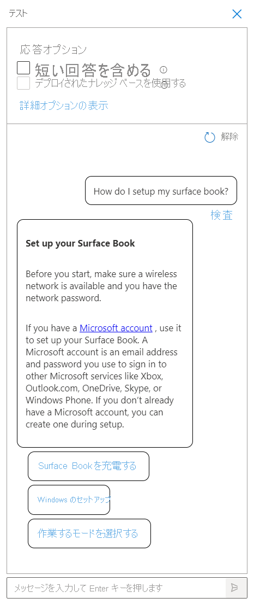
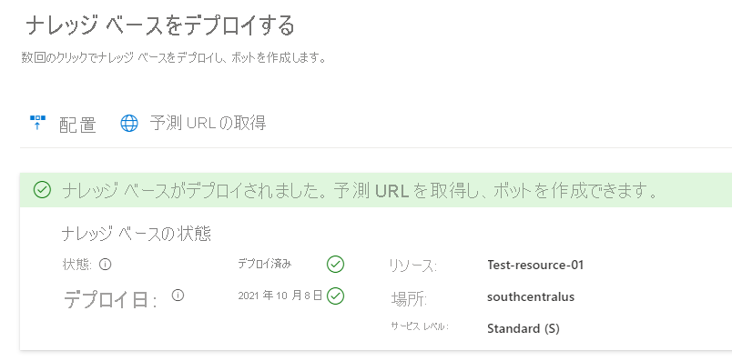

# カスタムの質問と回答プロジェクトを作成、テスト、デプロイする

FAQ や製品マニュアルなど、独自のコンテンツから質問と回答プロジェクトを作成できます。 この記事には、製品マニュアルから、質問に回答する質問と回答プロジェクトを作成する例が含まれています。

## 前提条件

> [!div class="checklist"]
> * Azure サブスクリプションをお持ちでない場合は、開始する前に [無料アカウント](https://azure.microsoft.com/free/cognitive-services/) を作成してください。
> * カスタム質問と回答機能が有効になった[言語リソース](https://aka.ms/create-language-resource)。

## 最初の質問と回答プロジェクトを作成する

1. Azure 資格情報を使用して [Language Studio](https://language.azure.com/) にサインインします。

2. **[Answer questions]\(質問に回答する\)** セクションまで下にスクロールし、 **[Open custom question answering]\(カスタム質問と回答を開く\)** を選択します。

    > [!div class="mx-imgBorder"]
    > 

3. リソースがまだ Azure Search に接続されていない場合は、 **[Connect to Azure Search]\(Azure Search に接続する\)** を選択します。 これにより、新しいブラウザー タブが開き、Azure portal 内のリソースの **[機能]** ペインが表示されます。

    > [!div class="mx-imgBorder"]
    > 

4. **[Enable custom question answering]\(カスタム質問と回答を有効にする\)** を選択し、リンク先の Azure Search リソースを選択して、 **[適用]** を選択します。

    > [!div class="mx-imgBorder"]
    > 

5. Language Studio タブに戻ります。リソースへの変更を登録するには、このページを最新の情報に更新する必要がある場合があります。 **[新しいプロジェクトの作成]** を選択します。

6. **[I want to set the language for all projects created in this resource]\(このリソースで作成されるすべてのプロジェクトの言語を設定する\)** オプションを選択し、 **[English]\(英語\)** を選択し、 **[次へ]** を選択します。

7. プロジェクト名には「**Sample-project**」、説明には「**My first question answering project**」(最初の質問と回答プロジェクト) と入力し、既定の回答は、 **[No answer found]\(答えが見つかりません\)** のままにしておきます。

8. 選択内容を確認し、 **[Create project]\(プロジェクトの作成\)** を選択します。

9. **[Manage sources]\(ソースの管理\)** ページから、 **[Add source]\(ソースの追加\)**  >  **[URL]** を選択します。

10. **[Add url]\(URL の追加\)** を選択し、次の値を入力し、 **[Add all]\(すべて追加\)** を選択します。

    |URL の名前|URL の値|
    |--------|---------|
    |Surface Book ユーザー ガイド |https://download.microsoft.com/download/7/B/1/7B10C82E-F520-4080-8516-5CF0D803EEE0/surface-book-user-guide-EN.pdf |

    抽出プロセスでは、ドキュメントを読み取って質問と回答を識別します。これにはしばらくかかります。 質問と回答では、基になるコンテンツが構造化されているか非構造化されているかが判断されます。

    ソースを正常に追加したら、ソース コンテンツを編集して、カスタム質問と回答セットを追加できます。

## プロジェクトをテストする

1. ソースへのリンクを選択すると、ナレッジ ベースの編集ページが開きます。

2. メニュー バーから **[テスト]** を選択し、「**How do I setup my surface book?** 」(Surface Book を設定するにはどうすればいいですか?) という質問を入力します。 ソース URL から自動的に識別されて抽出された質問と回答のペアに基づいて、回答が生成されます。

    > [!div class="mx-imgBorder"]
    > 

    **[include short answer response]\(短い回答を含める\)** チェック ボックスをオンにすると、質問をしたときにテスト ペインに回答パッセージと共に、正確な回答も表示されます (ある場合)。

3.  **[Inspect]\(検査\)**   を選択して、応答を詳細に確認します。 [テスト] ウィンドウは、プロジェクトをデプロイする前にプロジェクトに対する変更をテストするために使用されます。

    > [!div class="mx-imgBorder"]
    > 

    **[Inspect]\(検査\)** インターフェイスから、この応答が質問に回答する信頼レベルを確認し、特定の質問と回答の応答ペアを直接編集できます。

## プロジェクトのデプロイ

1. ナレッジ ベースのデプロイ アイコンを選択して、ナレッジ ベースのデプロイ メニューを入力します。

    > [!div class="mx-imgBorder"]
    > 

    プロジェクトをデプロイすると、プロジェクトのコンテンツが `test` インデックスから Azure Search の `prod` インデックスに移動します。

2. **[デプロイ]** を選択し、プロンプトが表示されたら、もう一度 **[デプロイ]** を選択します。

    > [!div class="mx-imgBorder"]
    > ""

    これで、プロジェクトが正常にデプロイされました。 エンドポイントを使用して、独自のカスタム アプリケーションで質問に回答したり、ボットで回答したりできます。

## リソースをクリーンアップする

カスタム質問と回答のテストを継続しない場合は、関連付けられたリソースを削除できます。

## 次のステップ

> [!div class="nextstepaction"]
> [メタデータによる質問の追加](../../../qnamaker/quickstarts/add-question-metadata-portal.md)
