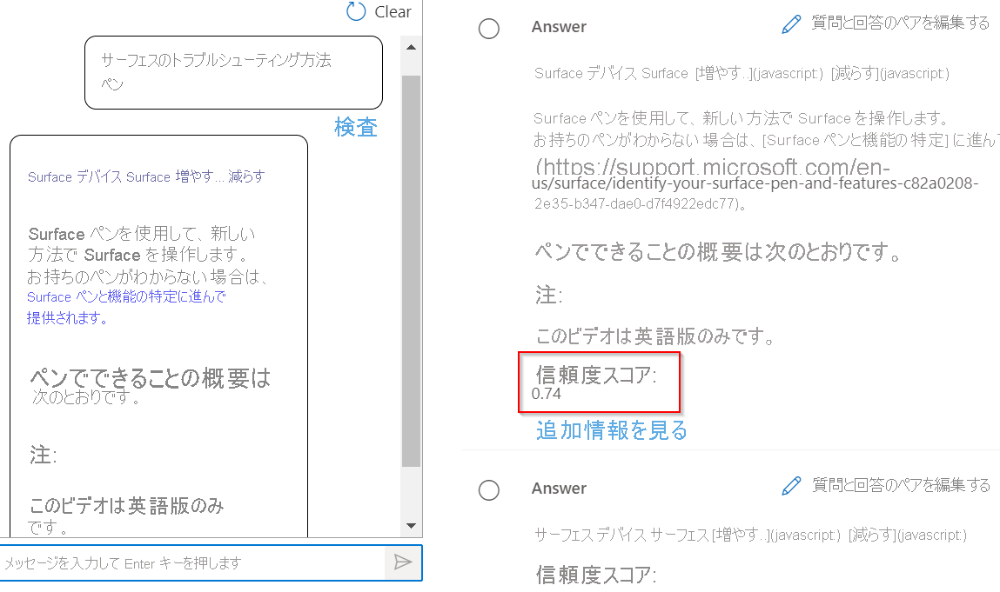
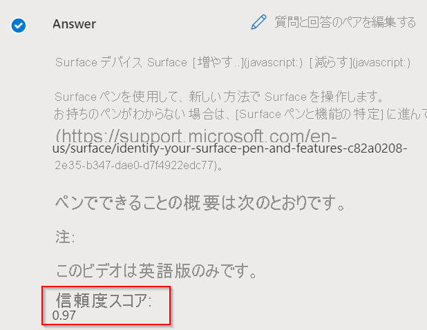

# <a name="improve-quality-of-response-with-synonyms"></a>同意語で応答の品質を向上させる

このチュートリアルでは、以下の内容を学習します。

> [!div class="checklist"]
> * 同意語を追加して応答の質を高める
> * [Test]\(テスト\) ペインの [inspect]\(検査\) オプションで、応答の質を評価する

このチュートリアルでは、同意語を使用することで応答の品質を向上させる方法について説明します。 ユーザーが単語の代替形式、同意語、または頭字語を使用すると、問い合わせに対して正確な応答を取られないものとします。 そこで彼らは、[Authoring API](/rest/api/cognitiveservices-qnamaker/QnAMaker4.0/Alterations) でキーワードの同意語を追加して応答の質を高めることにする、というわけです。

## <a name="add-synonyms-using-authoring-api"></a>Authoring API で同意語を追加する

次の単語とその変化を追加して、結果を改善します。

|Word | 変化|
|--------------|--------------------------------|
| fix problems (問題を解決する) | `troubleshoot`, `trouble-shoot`|
| whiteboard (ホワイトボード)   | `white-board`, `white board`   |
| Bluetooth    | `blue-tooth`, `blue tooth`     |

```json
{
    "synonyms": [
        {
            "alterations": [
                "fix problems",
                "troubleshoot",
                "trouble-shoot",
                ]
        },
        {
            "alterations": [
                "whiteboard",
                "white-board",
                "white board"
            ]
        },
        {
            "alterations": [
                "bluetooth",
                "blue-tooth",
                "blue tooth"
            ]
        }
    ]
}

```

“Fix problems with Surface Pen” (Surface Pen の問題を修正する) に対する質問と回答のペアを、Fix の同意語 troubleshoot を使用して作成したクエリへの応答と比較します。

## <a name="response-before-addition-of-synonym"></a>同意語を追加する前の応答

> [!div class="mx-imgBorder"]
> [  ]( ../media/adding-synonyms/score.png#lightbox)

## <a name="response-after-addition-of-synonym"></a>同意語を追加した後の応答

> [!div class="mx-imgBorder"]
> [  ]( ../media/adding-synonyms/score-improvement.png#lightbox)

このように、同意語として `troubleshoot` が追加されていないときは、"How to troubleshoot your surface pen" (Surface ペンのトラブルシューティング方法) という問い合わせに対して信頼度の低い応答が返されました。 一方、"fix problems" (問題を解決する) の同意語として `troubleshoot` を追加した後では、問い合わせに対して高い信頼度スコアの正しい応答を受け取りました。 これらの同意語を追加すると、結果の妥当性が向上し、その結果ユーザー エクスペリエンスも向上しました。

> [!NOTE]
> 同意語は大文字と小文字を区別されません。 また、同意語としてストップ ワードを追加した場合も、同意語が意図したとおりに機能しないことがあります。 ストップ ワードの一覧は、[ストップ ワードの一覧](https://github.com/Azure-Samples/azure-search-sample-data/blob/master/STOPWORDS.md)に関するページで確認できます。
> たとえば、Information Technology (情報技術) の略語である **IT** を追加すると、システムで Information Technology を認識できなくなる場合があります。**IT** はストップ ワードなので、クエリを処理するときにフィルターにかけられるからです。

## <a name="next-steps"></a>次のステップ

> [!div class="nextstepaction"]
> [複数の言語のナレッジ ベースを作成する](multiple-languages.md)
