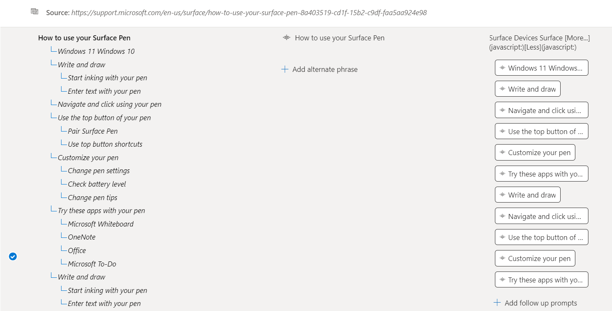
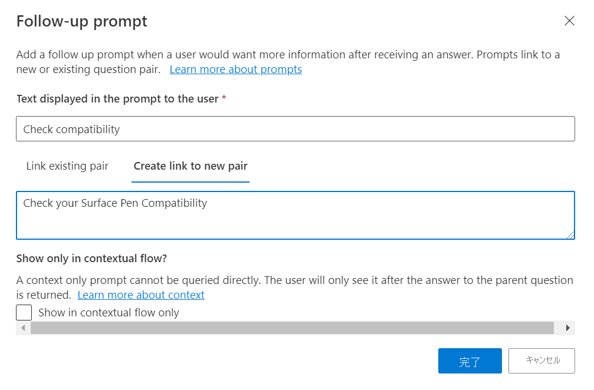
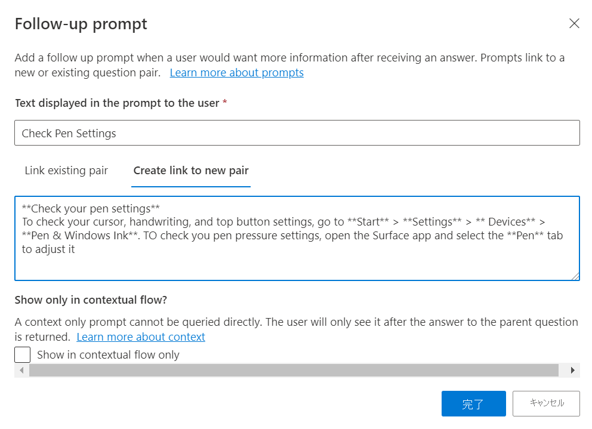
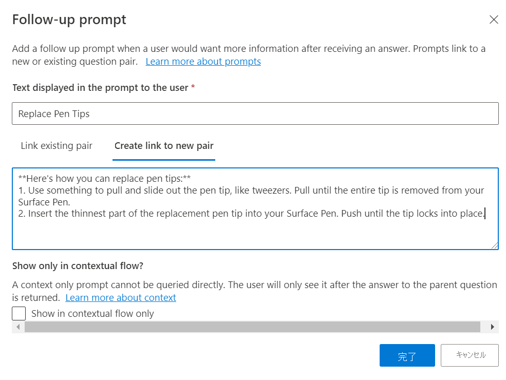
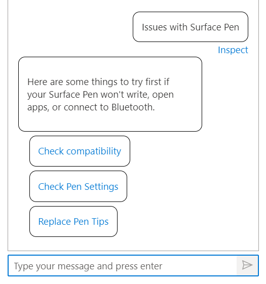

# ガイド付きの会話にマルチターン プロンプトを追加する

このチュートリアルでは、以下の内容を学習します。

> [!div class="checklist"]
> * 既存のプロジェクトに新しい質問応答ペアを追加する
> * フォローアップ プロンプトを追加してガイド付き会話を作成する
> * マルチターン プロンプトをテストする

## 前提条件

 このチュートリアルでは、[Surface ペンの FAQ](https://support.microsoft.com/surface/how-to-use-your-surface-pen-8a403519-cd1f-15b2-c9df-faa5aa924e98) を使用してナレッジ ベースを作成します。

まだ質問応答プロジェクトを作成したことがない場合は、[概要](../how-to/create-test-deploy.md)の記事から始めることをお勧めします。このプロセスの手順が説明されています。

## 質問応答ペアのコンテキストを確認する

この例では、ユーザーが Surface ペン製品に関する詳細情報、特に、Surface ペンのトラブルシューティング方法を質問しているのに、正しい回答が得られていない場合を想定しましょう。 そこで、追加のシナリオをサポートするためのプロンプトを追加し、ユーザーにマルチターン プロンプトを使用して正しい回答を案内します。

質問応答ペアに関連付けられたマルチターン プロンプトを表示するには、 **[列の表示]**  >  **[コンテキスト]** を選びます。 これは、Language Studio の質問応答インターフェイスの **[Edit knowledge base]\(ナレッジ ベースの編集\)** ページの既定で既に有効になっています。

> [!div class="mx-imgBorder"]
> [ ![コンテキストが赤で強調表示された [列の表示] UI のスクリーンショット]( ../media/guided-conversations/context.png) ]( ../media/guided-conversations/context.png#lightbox)

これにより、QnA ペアにリンクされたすべてのフォローアップ プロンプトのコンテキスト ツリーが表示されます。 

> [!div class="mx-imgBorder"]
> 

## フォローアップ プロンプトを使用して質問ペアを追加する

Surface ペンに関する問題をユーザーが解決できるように、次の方法でフォローアップ プロンプトを追加します。

- 2 つのフォローアップ プロンプトが含まれる新しい質問ペアを追加する
- 新しく追加されたプロンプトのいずれかにフォローアップ プロンプトを追加する

1. **[Check compatibility]\(互換性のチェック\)** と **[Check Pen Settings]\(ペン設定のチェック\)** の 2 つのフォローアップ プロンプトが含まれる新しい QnA ペアを追加します。エディターを使用して、 **[Add question pair]\(質問ペアの追加\)** をクリックして、フォローアップ プロンプトが含まれる新しい QnA ペアを追加します

    > [!div class="mx-imgBorder"]
    > ![UI の [Add question pair]\(質問ペアの追加\) が赤いボックスで強調表示されているスクリーンショット]( ../media/guided-conversations/add-question.png)
    
    次に示すように、**編集用** の新しい行が作成され、質問応答ペアを入力できます。
    
    |フィールド|値|
    |-----|----|
    |疑問がある場合 | Surface に関する問題を解決する |
    |応答とプロンプト | Surface ペンで入力できない、アプリを開けない、Bluetooth に接続できない場合に最初に試すことを次に示します。|
    
2. 次に、 **[Add follow-up prompts]\(フォローアップ プロンプトの追加\)** を選んで、新しく作成された質問ペアにフォローアップ プロンプトを追加します。 次のようにプロンプトの詳細を入力します。
    
    > [!div class="mx-imgBorder"]
    > [ ![UI の [フォローアップ プロンプトの追加] が強調表示されているスクリーンショット]( ../media/guided-conversations/add-prompts.png) ]( ../media/guided-conversations/add-prompts.png#lightbox)
    
    プロンプトの "表示テキスト" として「**互換性チェック**」と入力して、QnA とリンクさせます。 このプロンプトへのリンクに使用できる関連する QnA ペアがないため、"Surface ペンの互換性チェック" を検索するときに、 **[Create link to new pair]\(新しいペアへのリンクの作成\)** をクリックし、 **[完了]** を選んで新しい質問ペアを作成します。 続けて、 **[変更の保存]** を選択します。
    
    > [!div class="mx-imgBorder"]
    > 
    
3. 同様に、ユーザーが Surface ペンのトラブルシューティングを行い、質問ペアを追加できるように、もう 1 つのプロンプトである **[Check Pen Settings]\(ペン設定のチェック\)** を追加します。
    
    > [!div class="mx-imgBorder"]
    > 

4. 新しく作成されたプロンプトに別のフォローアップ プロンプトを追加します。 ここでは、前に作成したプロンプト "ペン設定のチェック" のフォローアップ プロンプトとして "ペン先の交換" を追加します。

    > [!div class="mx-imgBorder"]
    > 
    
5. 最後に、変更を保存し、 **[テスト]** ペインでこれらのプロンプトをテストします。
    
    > [!div class="mx-imgBorder"]
    > 
    
    **Surface ペンのイシュー** に関するユーザー クエリの場合、システムが回答を返し、新しく追加されたプロンプトをユーザーに提示します。 次にユーザーが **[ペン設定のチェック]** プロンプトのいずれかを選択すると、関連する回答が別のプロンプト **[ペン先の交換]** とともにユーザーに返されます。これを選択すると、ユーザーに詳細情報が表示されます。 そのため、マルチターンはユーザーに必要な回答を提供するために使用されます。
    
    > [!div class="mx-imgBorder"]
    > 

## 次のステップ

> [!div class="nextstepaction"]
> [アクティブ ラーニングを使用してナレッジ ベースを強化する](active-learning.md)
