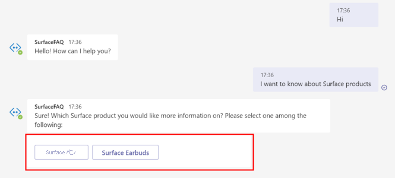
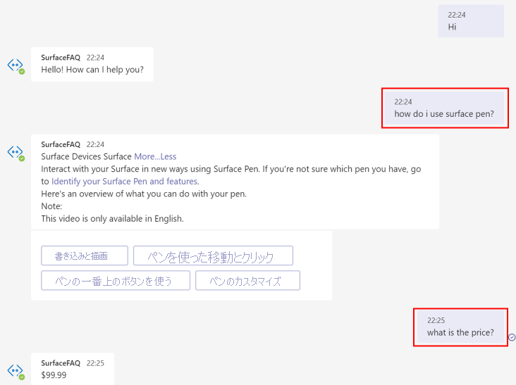
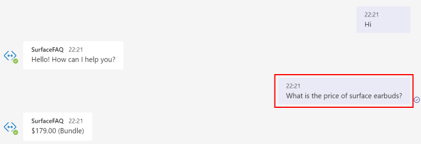

# <a name="add-multiple-categories-to-your-faq-bot"></a>FAQ ボットに複数のカテゴリを追加する

このチュートリアルでは、以下の内容を学習します。

> [!div class="checklist"]
> * プロジェクトを作成し、メタデータを使用して質問応答ペアにタグを付けてカテゴリを区別できるようにする
> * ドメインごとに個別のプロジェクトを作成する
> * ドメインごとに個別の言語リソースを作成する

FAQ ボットを構築するときに、複数のドメインにまたがるクエリに対応する必要があるユース ケースが発生する場合があります。 Microsoft のマーケティング チームが、複数の Surface 製品に関するユーザーの一般的な質問に回答するカスタマー サポート ボットを構築しようとしているものとします。 わかりやすくするため、ここでは、[Surface ペン](https://support.microsoft.com/surface/how-to-use-your-surface-pen-8a403519-cd1f-15b2-c9df-faa5aa924e98)と [Surface Earbuds](https://support.microsoft.com/surface/use-surface-earbuds-aea108c3-9344-0f11-e5f5-6fc9f57b21f9) の 2 つの FAQ URL を使用してプロジェクトを作成します。

## <a name="create-project-with-domain-specific-metadata"></a>ドメイン固有のメタデータを使用してプロジェクトを作成する

コンテンツ作成者は、ドキュメントを使用して質問応答ペアを抽出することや、カスタム質問応答ペアをプロジェクトとナレッジ ベースに追加することができます。 これらの質問応答を特定のドメインまたはカテゴリにグループ化するには、メタデータを追加します。

Surface 製品についてのボットの場合、次の手順のようにして、両方の製品の種類に関する質問に答えるボットを作成できます。

1. **[ソースの追加]**  >  **[URL]** を選び、次の各 URL を追加したら **[すべて追加]** を選んで、次の FAQ の URL をソースとして追加します。
   
   [Surface ペンの FAQ](https://support.microsoft.com/surface/how-to-use-your-surface-pen-8a403519-cd1f-15b2-c9df-faa5aa924e98)<br>[Surface Earbuds の FAQ](https://support.microsoft.com/surface/use-surface-earbuds-aea108c3-9344-0f11-e5f5-6fc9f57b21f9)

    >[!div class="mx-imgBorder"]
    >[![[URL の追加] UI のスクリーンショット。](../media/multiple-domains/add-url.png)](../media/multiple-domains/add-url.png#lightbox)

2. このナレッジ ベースには 2 つの製品に関する質問応答ペアが含まれています。これらを区別して、特定の製品に関する質問応答から回答を検索できるようにします。 これを実現するには、質問応答ペアのメタデータ フィールドを更新します。

   次の例を見るとわかるように、キーが **product** で、値が **surface_pen** または **surface_earbuds** であるメタデータを、該当するすべての場所に追加しています。 この例を拡張して、複数の製品についてのデータを抽出し、製品ごとに異なる値を追加することができます。

   >[!div class="mx-imgBorder"]
   >[](../media/multiple-domains/product-metadata.png#lightbox)

4. 次に、システムによる検索を特定の製品についての応答に制限するため、質問応答 REST API のフィルターとして、その製品を渡す必要があります。

    REST API の予測 URL は、[Deploy knowledge base]\(ナレッジ ベースのデプロイ\) ペインから取得できます。

   >[!div class="mx-imgBorder"]
   >[![予測 URL が表示された [Deploy knowledge base]\(ナレッジ ベースのデプロイ\) ページのスクリーンショット。](../media/multiple-domains/prediction-url.png)](../media/multiple-domains/prediction-url.png#lightbox)

    API 呼び出しの JSON 本文で、メタデータ *product* の値として *surface_pen* を渡しています。 そのため、システムでは、QnA ペアの中から同じメタデータを持つ応答のみが検索されます。

    ```json
        {
          "question": "What is the price?",
          "top": 3
        },
        "answerSpanRequest": {
          "enable": true,
          "confidenceScoreThreshold": 0.3,
          "topAnswersWithSpan": 1
        },
        "filters": {
          "metadataFilter": {
            "metadata": [
              {
                "key": "product",
                "value": "surface_pen"
              }
            ]
          }
        }
    ```

    ユーザー入力に基づいてメタデータの値を取得するには、次のような方法があります。 

    * ボット クライアントを介して、ユーザーからの入力として明示的にドメインを取得します。 たとえば、次に示すように、会話を始めるときに、製品カテゴリをユーザーからの入力として取得できます。

      

    * ボットのコンテキストに基づいて、ドメインを暗黙的に識別します。 たとえば、前の質問が特定の Surface 製品についてのものであった場合、クライアントでコンテキストとしてそれを保存できます。 ユーザーが次の質問で製品を指定しない場合は、ボットのコンテキストをメタデータとして GenerateAnswer API に渡すことができます。

      

    * ユーザーの質問からエンティティを抽出して、メタデータ フィルターに使用するドメインを識別します。 エンティティの抽出には、[固有表現認識 (NER)](../../named-entity-recognition/overview.md) や[会話言語理解](../../conversational-language-understanding/overview.md)などの他の Cognitive Services を使用することができます。

      

### <a name="how-large-can-our-projects-be"></a>プロジェクトのサイズはどのくらいですか。

1 つのプロジェクトまたはナレッジ ベースに追加できる質問応答ペア数は最大 50,000 個です。 データが 50,000 質問応答ペアを超える場合は、ナレッジ ベースの分割を検討する必要があります。

## <a name="create-a-separate-project-for-each-domain"></a>ドメインごとに個別のプロジェクトを作成する

また、ドメインごとに異なるプロジェクトまたはナレッジ ベースを作成し、プロジェクトを個別に管理することもできます。 すべての API では、ナレッジ ベースを更新したり、ユーザーの質問に対する回答をフェッチしたりするために、ユーザーはプロジェクト ID を渡す必要があります。  

ユーザーの質問をサービスが受け取るときに、関連するナレッジ ベースから応答をフェッチするため、表示されている REST API エンドポイントで `projectName` を渡す必要があります。 URL は **[Deploy knowledge base]\(ナレッジ ベースのデプロイ\)** ページの **[Get prediction URL]\(予測 URL の取得\)** で確認できます。

`https://southcentralus.api.cognitive.microsoft.com/language/:query-knowledgebases?projectName=Test-Project-English&api-version=2021-10-01&deploymentName=production`

## <a name="create-a-separate-language-resource-for-each-domain"></a>ドメインごとに個別の言語リソースを作成する

Microsoft のマーケティング チームが、Surface 製品と Xbox 製品に関するユーザーの質問に回答するカスタマー サポート ボットを構築しようとしているものとします。 Surface と Xbox のナレッジ ベースにアクセスするために、個別のチームを割り当てる予定です。 この場合は、Surface 用と Xbox 用に 2 つの質問と回答リソースを作成する必要があります。 ただし、同じリソースにアクセスするユーザーに対して個別のロールを定義できます。
