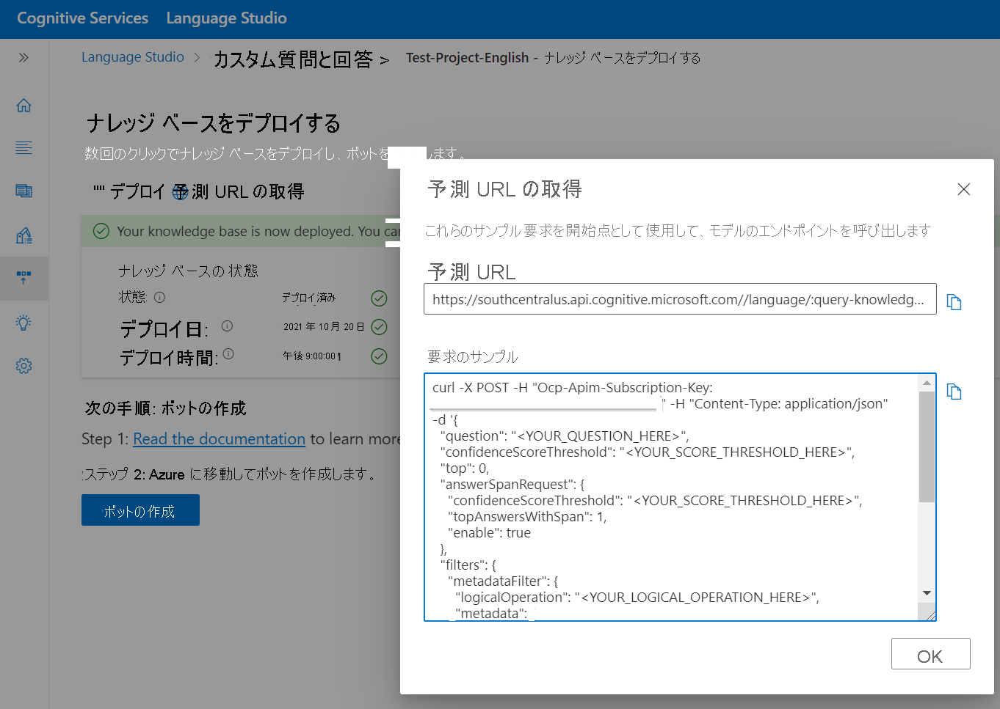

# プロジェクトを複数の言語で作成する

このチュートリアルでは、以下の内容を学習します。

<!-- green checkmark -->
> [!div class="checklist"]
> * 英語をサポートするプロジェクトを作成する
> * ドイツ語をサポートするプロジェクトを作成する

このチュートリアルでは、複数の言語でプロジェクトとナレッジ ベースを作成するプロセスについて説明します。 [Surface ペンの FAQ](https://support.microsoft.com/surface/how-to-use-your-surface-pen-8a403519-cd1f-15b2-c9df-faa5aa924e98) の URL を使用して、ドイツ語と英語のプロジェクトを作ります。 次に、プロジェクトをデプロイし、質問と回答 REST API を使用して、目的の言語で FAQ に対してクエリを実行し、回答を取得します。

## ドイツ語のプロジェクトを作成する

複数の言語でプロジェクトを作成するには、言語リソースに関連付けられている最初のプロジェクトの作成時に、複数の言語設定を行う必要があります。

> [!div class="mx-imgBorder"]
> [ ![[I want to select the language when I create a project in this resource]\(このリソースでプロジェクトを作成するときに言語を選択する\) が選択されたプロジェクトの作成のための UI のスクリーンショット。]( ../media/multiple-languages/multiple-languages.png) ](../media/multiple-languages/multiple-languages.png#lightbox)

1. [[Language Studio]](https://aka.ms/languageStudio) ホーム ページで、カスタムの質問と回答を開きます。 **[Create new project]\(新しいプロジェクトの作成\)**  >  **[I want to select the language when I create a project in this resource]\(このリソースでプロジェクトを作成するときに言語を選択する\)**  >  **[Next]\(次へ\)** を選びます。

2. 基本情報の入力ページに入力し、 **[Next]\(次へ\)**  >  **[Create project]\(プロジェクトの作成\)** を選びます。

    |設定| 値|
    |---|----|
    |名前 | プロジェクトの一意の名前|
    |説明 | プロジェクトを識別するための一意の説明 |
    |[Source language]\(ソース言語\) | このチュートリアルでは、[German]\(ドイツ語\) を選びます |
    |[Default answer]\(既定の回答\) | 回答が返されない場合の既定の回答 |

    > [!div class="mx-imgBorder"]
    > 

3. **[Add source]\(ソースの追加\)**  >  **[URLs]\(URL\)**  >  **[Add url]\(URL の追加\)**  >  **[Add all]\(すべて追加\)** 。

    |設定| 値 |
    |----|------|
    | URL の名前 | Surface ペン ドイツ語 |
    | URL | https://support.microsoft.com/de-de/surface/how-to-use-your-surface-pen-8a403519-cd1f-15b2-c9df-faa5aa924e98 |
    | ファイル構造の分類 | 自動検出 |
    
    質問と回答では、ドキュメントを読み取り、ソース URL から質問と回答のペアを抽出して、ドイツ語のプロジェクトとナレッジ ベースを作成します。 ソースへのリンクを選ぶと、ナレッジ ベース ページが開き、ここで内容を編集できます。
    
    > [!div class="mx-imgBorder"]
    > 
    
## 英語でプロジェクトを作成する

ここでは前の手順を繰り返しますが、今回は英語を選び、ソースとして英語の URL を指定します。

1. [[Language Studio]](https://aka.ms/languageStudio) で、質問と回答のページを開き、 **[Create new project]\(新しいプロジェクトの作成\)** を選びます。

2. 基本情報の入力ページに入力し、 **[Next]\(次へ\)**  >  **[Create project]\(プロジェクトの作成\)** を選びます。

    |設定| 値|
    |---|----|
    |名前 | プロジェクトの一意の名前|
    |説明 | プロジェクトを識別するための一意の説明 |
    |[Source language]\(ソース言語\) | このチュートリアルでは、[English]\(英語\) を選びます。 |
    |[Default answer]\(既定の回答\) | 回答が返されない場合の既定の回答 |

3. **[Add source]\(ソースの追加\)**  >  **[URLs]\(URL\)**  >  **[Add url]\(URL の追加\)**  >  **[Add all]\(すべて追加\)** 。

    |設定| 値 |
    |-----|-----|
    | URL の名前 | Surface ペン ドイツ語 |
    | URL | https://support.microsoft.com/en-us/surface/how-to-use-your-surface-pen-8a403519-cd1f-15b2-c9df-faa5aa924e98 |
    | ファイル構造の分類 | 自動検出 |

## ナレッジ ベースをデプロイしてクエリを実行する

これで、2 つのプロジェクトとナレッジ ベースをデプロイし、質問と回答の REST API を使用して目的の言語でクエリを実行する準備ができました。 プロジェクトがデプロイされると、ナレッジ ベースに対してクエリを実行するための詳細を示す、次のページが表示されます。

> [!div class="mx-imgBorder"]
> 

受信ユーザー クエリの言語は [Language Detection API](../../language-detection/how-to/call-api.md) で検出できます。ユーザーは、検出された言語に応じて適切なエンドポイントとナレッジ ベースを呼び出すことができます。
