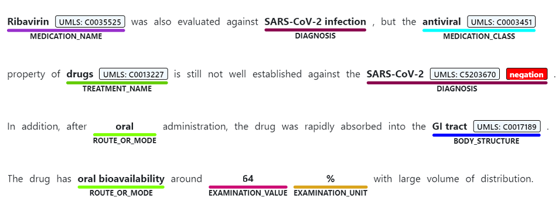
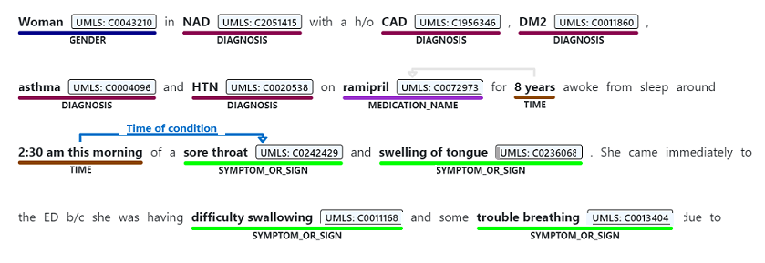
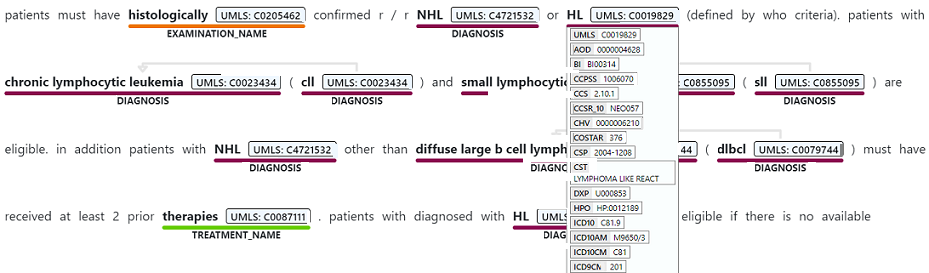
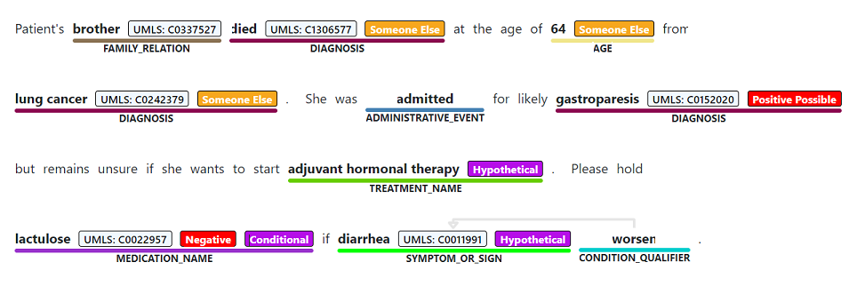

# [名前付きエンティティの認識](#tab/ner)

固有表現認識では、非構造化テキストに記載されている語句が検出され、それを診断、薬剤名、症状や兆候、年齢など、1 つまたは複数のセマンティックの種類に関連付けることができます。

> [!div class="mx-imgBorder"]
> 

# [関係抽出](#tab/relation-extraction)

関係抽出により、テキスト内で言及されている概念間の意味のある関係が識別されます。 たとえば、"条件の時間" の関係は、条件名を時刻に関連付けるか、省略形と完全な説明の間に関連付けることによって検出されます。  

> [!div class="mx-imgBorder"]
> 

# [Entity Linking](#tab/entity-linking)

エンティティ リンク設定では、テキストで言及されている名前付きエンティティを、統一医療言語システム (UMLS) などの定義済み概念データベースにある概念に関連付けることによって、エンティティが明確にされます。 また、医療の概念には、追加の正規化の形式として、優先する名前が割り当てられます。

> [!div class="mx-imgBorder"]
> 

Text Analytics for Health では、統一医療言語システム ([UMLS](https://www.nlm.nih.gov/research/umls/sourcereleasedocs/index.html)) メタシソーラス知識ソースにある保健衛生と生物医学のボキャブラリへのリンクがサポートされています。

# [アサーションの検出](#tab/assertion-detection) 

医療コンテンツの意味は、否定、または条件付きアサーションなどの修飾子によって大きな影響を受け、これが誤って伝わると重大な影響を及ぼす可能性があります。 Text Analytics for Health では、テキスト内のエンティティに対するアサーションの検出の 3 つのカテゴリがサポートされます。 

* 確実性
* 条件付き
* 関連付け

> [!div class="mx-imgBorder"]
> 

---
