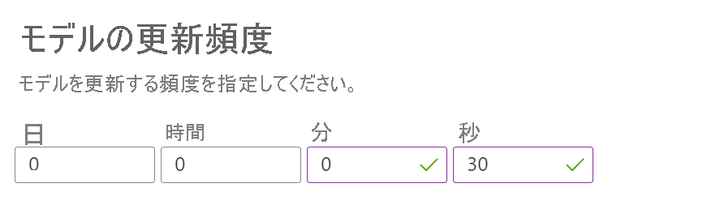

# <a name="quickstart-personalize-content-using-c"></a>クイック スタート:C# を使用してコンテンツをパーソナライズする 

Personalizer サービスを使用するこの C# クイック スタートでパーソナライズしたコンテンツを表示します。

このサンプルは、C# 用の Personalizer クライアント ライブラリを使用して次のアクションを実行する方法を示します。 

 * パーソナル化のアクション一覧をランク付けする。
 * 指定されたイベントのユーザー選択に基づいて上位にランク付けされたアクションに割り当てる報酬を報告します。

Personalizer を使い始めるには、次の手順が必要です。

1. SDK を参照する 
1. ユーザーに表示するアクションをランク付けするコードを書く
1. ループをトレーニングするための報酬を送信するコードを書く

## <a name="prerequisites"></a>前提条件

* サブスクリプション キーとエンドポイント サービスの URL を取得するには、[Personalizer サービス](how-to-settings.md)が必要です。 
* [Visual Studio 2015 または 2017](https://visualstudio.microsoft.com/downloads/)。
* [Microsoft.Azure.CognitiveServices.Personalizer](https://go.microsoft.com/fwlink/?linkid=2092272) SDK NuGet パッケージ。 インストールの手順は、以降で説明しています。

## <a name="change-the-model-update-frequency"></a>モデルの更新頻度を変更する

Azure portal の Personalizer リソースで、 **[モデルの更新頻度]** を 10 秒に変更します。 これでサービスが迅速にトレーニングされるようになり、繰り返しのたびに上位のアクションが変化する様子を確認できます。

Personalizer Loop を初めてインスタンス化したときには、トレーニング元となる Reward API 呼び出しがないため、モデルは存在しません。 Rank 呼び出しは、各項目に対して等しい確率を返します。 それでも、アプリケーションは、RewardActionId の出力を使用して、常にコンテンツをランク付けする必要があります。



## <a name="creating-a-new-console-app-and-referencing-the-personalizer-sdk"></a>新しいコンソール アプリケーションの作成と Personalizer SDK の参照 

<!--
Get the latest code as a Visual Studio solution from [GitHub] (add link).
-->

1. Visual Studio で、新しい Visual C# コンソール アプリを作成します。
1. Personalizer クライアント ライブラリの NuGet パッケージをインストールします。 メニューで、 **[ツール]** を選択し、 **[Nuget パッケージ マネージャー]** を選択し、次に **[ソリューションの NuGet パッケージの管理]** を選択します。
1. **[プレリリースを含める]** をオンにします。
1. **[参照]** タブを選択し、 **[検索]** ボックスに「`Microsoft.Azure.CognitiveServices.Personalizer`」と入力します。
1. **Microsoft.Azure.CognitiveServices.Personalizer** が表示されたら選択します。
1. 自分のプロジェクト名の横のチェックボックスを選択し、 **[インストール]** を選択します。

## <a name="add-the-code-and-put-in-your-personalizer-and-azure-keys"></a>コードを追加して Personalizer キーと Azure キーを指定する

1. Program.cs を次のコードに置き換えます。 
1. `serviceKey` 値を、有効な Personalizer サブスクリプション キーに置き換えます。
1. `serviceEndpoint` を自分のサービス エンドポイントに置き換えます。 例: `https://westus2.api.cognitive.microsoft.com/`。
1. プログラムを実行します。

## <a name="add-code-to-rank-the-actions-you-want-to-show-to-your-users"></a>ユーザーに表示するアクションをランク付けするコードを追加する

次の C# コードは、ユーザー情報である _features と、コンテンツに関する情報である _actions_ を、SDK を使用して Personalizer に渡すための完全な一覧です。 Personalizer は上位にランクされたアクションを返してユーザーに表示します。  

```csharp
using Microsoft.Azure.CognitiveServices.Personalizer;
using Microsoft.Azure.CognitiveServices.Personalizer.Models;
using System;
using System.Collections.Generic;
using System.Linq;

namespace PersonalizerExample
{
    class Program
    {
        // The key specific to your personalizer service instance; e.g. "0123456789abcdef0123456789ABCDEF"
        private const string ApiKey = "";

        // The endpoint specific to your personalizer service instance; e.g. https://westus2.api.cognitive.microsoft.com/
        private const string ServiceEndpoint = "";

        static void Main(string[] args)
        {
            int iteration = 1;
            bool runLoop = true;

            // Get the actions list to choose from personalizer with their features.
            IList<RankableAction> actions = GetActions();

            // Initialize Personalizer client.
            PersonalizerClient client = InitializePersonalizerClient(ServiceEndpoint);

            do
            {
                Console.WriteLine("\nIteration: " + iteration++);

                // Get context information from the user.
                string timeOfDayFeature = GetUsersTimeOfDay();
                string tasteFeature = GetUsersTastePreference();

                // Create current context from user specified data.
                IList<object> currentContext = new List<object>() {
                    new { time = timeOfDayFeature },
                    new { taste = tasteFeature }
                };

                // Exclude an action for personalizer ranking. This action will be held at its current position.
                IList<string> excludeActions = new List<string> { "juice" };

                // Generate an ID to associate with the request.
                string eventId = Guid.NewGuid().ToString();

                // Rank the actions
                var request = new RankRequest(actions, currentContext, excludeActions, eventId);
                RankResponse response = client.Rank(request);

                Console.WriteLine("\nPersonalizer service thinks you would like to have: " + response.RewardActionId + ". Is this correct? (y/n)");

                float reward = 0.0f;
                string answer = GetKey();

                if (answer == "Y")
                {
                    reward = 1;
                    Console.WriteLine("\nGreat! Enjoy your food.");
                }
                else if (answer == "N")
                {
                    reward = 0;
                    Console.WriteLine("\nYou didn't like the recommended food choice.");
                }
                else
                {
                    Console.WriteLine("\nEntered choice is invalid. Service assumes that you didn't like the recommended food choice.");
                }

                Console.WriteLine("\nPersonalizer service ranked the actions with the probabilities as below:");
                foreach (var rankedResponse in response.Ranking)
                {
                    Console.WriteLine(rankedResponse.Id + " " + rankedResponse.Probability);
                }

                // Send the reward for the action based on user response.
                client.Reward(response.EventId, new RewardRequest(reward));

                Console.WriteLine("\nPress q to break, any other key to continue:");
                runLoop = !(GetKey() == "Q");

            } while (runLoop);
        }

        /// <summary>
        /// Initializes the personalizer client.
        /// </summary>
        /// <param name="url">Azure endpoint</param>
        /// <returns>Personalizer client instance</returns>
        static PersonalizerClient InitializePersonalizerClient(string url)
        {
            PersonalizerClient client = new PersonalizerClient(
                new ApiKeyServiceClientCredentials(ApiKey)) {Endpoint = url};

            return client;
        }

        /// <summary>
        /// Get users time of the day context.
        /// </summary>
        /// <returns>Time of day feature selected by the user.</returns>
        static string GetUsersTimeOfDay()
        {
            string[] timeOfDayFeatures = new string[] { "morning", "afternoon", "evening", "night" };

            Console.WriteLine("\nWhat time of day is it (enter number)? 1. morning 2. afternoon 3. evening 4. night");
            if (!int.TryParse(GetKey(), out int timeIndex) || timeIndex < 1 || timeIndex > timeOfDayFeatures.Length)
            {
                Console.WriteLine("\nEntered value is invalid. Setting feature value to " + timeOfDayFeatures[0] + ".");
                timeIndex = 1;
            }

            return timeOfDayFeatures[timeIndex - 1];
        }

        /// <summary>
        /// Gets user food preference.
        /// </summary>
        /// <returns>Food taste feature selected by the user.</returns>
        static string GetUsersTastePreference()
        {
            string[] tasteFeatures = new string[] { "salty", "sweet" };

            Console.WriteLine("\nWhat type of food would you prefer (enter number)? 1. salty 2. sweet");
            if (!int.TryParse(GetKey(), out int tasteIndex) || tasteIndex < 1 || tasteIndex > tasteFeatures.Length)
            {
                Console.WriteLine("\nEntered value is invalid. Setting feature value to " + tasteFeatures[0] + ".");
                tasteIndex = 1;
            }

            return tasteFeatures[tasteIndex - 1];
        }

        /// <summary>
        /// Creates personalizer actions feature list.
        /// </summary>
        /// <returns>List of actions for personalizer.</returns>
        static IList<RankableAction> GetActions()
        {
            IList<RankableAction> actions = new List<RankableAction>
            {
                new RankableAction
                {
                    Id = "pasta",
                    Features =
                    new List<object>() { new { taste = "salty", spiceLevel = "medium" }, new { nutritionLevel = 5, cuisine = "italian" } }
                },

                new RankableAction
                {
                    Id = "ice cream",
                    Features =
                    new List<object>() { new { taste = "sweet", spiceLevel = "none" }, new { nutritionalLevel = 2 } }
                },

                new RankableAction
                {
                    Id = "juice",
                    Features =
                    new List<object>() { new { taste = "sweet", spiceLevel = "none" }, new { nutritionLevel = 5 }, new { drink = true } }
                },

                new RankableAction
                {
                    Id = "salad",
                    Features =
                    new List<object>() { new { taste = "salty", spiceLevel = "low" }, new { nutritionLevel = 8 } }
                }
            };

            return actions;
        }

        private static string GetKey()
        {
            return Console.ReadKey().Key.ToString().Last().ToString().ToUpper();
        }
    }
}
```

## <a name="run-the-program"></a>プログラムの実行

プログラムをビルドして実行します。 クイック スタート プログラムは、フィーチャーと呼ばれるユーザー設定を収集するためにいくつかの質問をしてから、最上位のアクションを提供します。


## <a name="clean-up-resources"></a>リソースのクリーンアップ
このクイック スタートで作成したファイルは、完了後、すべて削除してください。 

## <a name="next-steps"></a>次の手順

[Personalizer のしくみ](how-personalizer-works.md)


