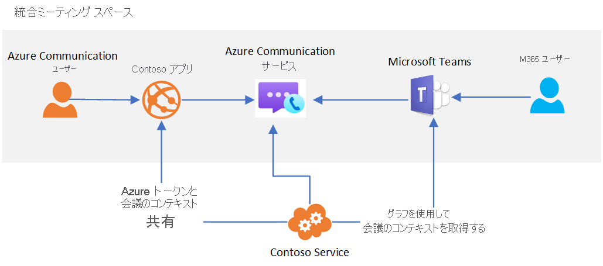

# Teams の相互運用性

> [!IMPORTANT]
> [チームのテナント相互運用性](../concepts/teams-interop.md)を有効または無効にするには、[このフォーム](https://forms.office.com/Pages/ResponsePage.aspx?id=v4j5cvGGr0GRqy180BHbR21ouQM6BHtHiripswZoZsdURDQ5SUNQTElKR0VZU0VUU1hMOTBBMVhESS4u)を完成させてください。

Azure Communication Services を使用すると、Microsoft Teams と対話するカスタム会議エクスペリエンスを作成できます。 Communication Services ソリューションのユーザーは、音声、ビデオ、チャット、画面共有を通じて、Teams の参加者と対話することができます。

Teams の相互運用性によって、ユーザーと Teams の会議とをつなぐカスタムのアプリケーションを作成することができます。 カスタム アプリケーションのユーザーがこの機能を利用するために Azure Active Directory の ID や Teams のライセンスを所有している必要はありません。 これは、(Teams を使い慣れている) 従業員と (カスタム アプリケーションのエクスペリエンスを利用する) 外部ユーザーとを 1 つのシームレスな会議エクスペリエンスに参加させる手段として理想的です。 次に例を示します。

1. 従業員が Teams を使用して会議の予約をする 
1. カスタム アプリケーションを通じて外部ユーザーと会議の詳細を共有する。
   * **Graph API を使用する**: カスタム Communication Services アプリケーションで Microsoft Graph API を使用して、共有する会議の詳細にアクセスします。 
   * **その他のオプションを使用する**: たとえば、Microsoft Teams の予定表から会議のリンクをコピーすることができます。
1. 外部ユーザーがカスタム アプリケーションを使用し、(Communication Services の通話クライアント ライブラリとチャット クライアント ライブラリを通じて) Teams の会議に参加する

このユースケースのアーキテクチャは、おおよそ次のようになります。 

Teams の会議に備わっている特定の機能 (挙手、集合モード、ブレイクアウト ルームなど) は Teams ユーザーしか利用できませんが、オーディオ、ビデオ、チャット、画面共有という会議の主要な機能には、カスタム アプリケーションからアクセスできます。 通話中に、ミーティングへのチャットはカスタム アプリケーション ユーザーにアクセスできるようになります。 参加する前に、または呼び出しを終了した後にメッセージを送受信することはできません。 

Communication Services ユーザーが Teams の会議に参加すると、通話クライアント ライブラリを通じて指定された表示名が Teams のユーザーに表示されます。 その他の点では、Communication Services ユーザーと Teams の匿名ユーザーが同様に扱われます。  カスタム アプリケーションでは、Teams の会議を保護するためにユーザー認証などのセキュリティ対策について考慮する必要があります。 匿名ユーザーを会議に参加させることによって生じるセキュリティへの影響に留意し、[Teams のセキュリティ ガイド](/microsoftteams/teams-security-guide#addressing-threats-to-teams-meetings)を利用して、匿名ユーザーに提供する機能を構成してください。

Communication Services のチームの相互運用機能は、現在プライベート プレビュー段階です。 一般提供の段階では、Communication Services のユーザーは "外部アクセス ユーザー" と同様に扱われます。 外部アクセスの詳細については、「[Microsoft Teams で組織外のユーザーと電話、チャット、共同作業を行う](/microsoftteams/communicate-with-users-from-other-organizations)」を参照してください。

予定されている Teams の会議に Communication Services ユーザーが参加できるのは、匿名での参加が[会議の設定](/microsoftteams/meeting-settings-in-teams)で有効にされている場合に限られます。

## Government Clouds (GCC) のチーム
現時点では、Azure Communication Services の相互運用性は、[Microsoft 365 government clouds (GCC)](/MicrosoftTeams/plan-for-government-gcc) を使用するチーム デプロイとは互換性がありません。 

## 次の手順

> [!div class="nextstepaction"]
> [通話アプリを Teams の会議に参加させる](../quickstarts/voice-video-calling/get-started-teams-interop.md)