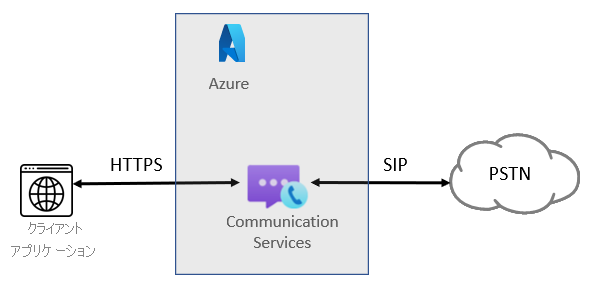
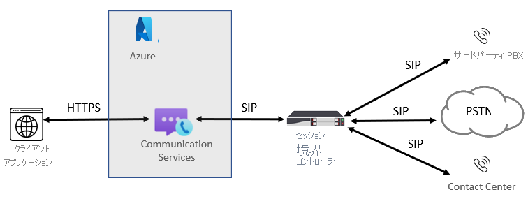

# テレフォニーの概念

[!INCLUDE [Public Preview Notice](../../includes/public-preview-include-phone-numbers.md)]

[!INCLUDE [Regional Availability Notice](../../includes/regional-availability-include.md)]

Azure Communication Services の Calling SDK を使用すると、アプリケーションにテレフォニーと PSTN を追加することができます。 このページには、テレフォニーの主な概念と機能がまとめられています。 具体的な SDK の言語と機能の詳細については、[通話ライブラリ](../../quickstarts/voice-video-calling/calling-client-samples.md)に関するページを参照してください。

## テレフォニーの概要
ユーザーが従来の電話番号を使用して対話すると、通話は常に PSTN (公衆交換電話網) 音声通話によって行われます。 PSTN 通話を発信および受信するには、Azure Communication Services リソースにテレフォニー機能を追加する必要があります。 この場合、信号とメディアでは、ユーザーを接続するために、IP ベースおよび PSTN ベースのテクノロジが組み合わされて使用されます。 PSTN ネットワークに接続する手段として、Communication Services には 2 とおりの方法が用意されています。Azure Cloud Calling と SIP インターフェイスです。

### Azure Cloud Calling

アプリまたはサービスに PSTN 接続を追加する簡単な方法として、この場合は、Microsoft が電気通信プロバイダーになります。 番号は Microsoft から直接購入できます。 Azure Cloud Calling は、Communication Services のためのオールインクラウドのテレフォニー ソリューションです。 きわめてシンプルな方法で、公衆交換電話網 (PSTN) に ACS を接続して世界中の固定電話や携帯電話への通話を実現することができます。 この方法では、次の図に示すように Microsoft が PSTN 通信事業者としての役割を果たします。

次の項目が該当する場合は、Azure Cloud Calling が最適なソリューションです。
- 自分のリージョンで Azure Cloud Calling が提供されている。
- 現在の PSTN 通信事業者にこだわる必要がない。
- Microsoft が管理する PSTN アクセスを利用したい。

このオプションでは、
- Microsoft から直接番号を取得し、世界中に電話をかけることができます。
- Azure Cloud Calling は Azure Communication Services の外で稼動しているため、オンプレミス環境のデプロイやメンテナンスは必要ありません。
- 注:サードパーティの PBX やアナログ デバイスなど、セッション ボーダー コントローラー (SBC) でサポートされるサードパーティのテレフォニー機器との相互運用性を確保するために、必要であれば、サポートされている SBC を SIP インターフェイス経由で接続することもできます。

この方法を選択する場合は、Azure Communication Services への接続が中断されないようにする必要があります。

### SIP インターフェイス

この方法を選択すると、従来のオンプレミス テレフォニーと任意の通信事業者を Azure Communication Services に接続することができます。 お住まいの国または地域で Azure Cloud Calling が提供されていなくても、これにより、ACS アプリケーションから PSTN 通話機能を利用することができます。 

次の項目に 1 つでも該当すれば、SIP インターフェイスが適切なソリューションです。

- ACS を PSTN 通話機能と共に使用したい。
- 現在の PSTN 通信事業者を引き続き使用する必要がある。
- ルーティングを混在させて、Azure Cloud Calling を経由する通話と通信事業者を経由する通話を使い分けたい。
- サードパーティの PBX や装置 (コール システムやアナログ デバイスなど) との相互運用性を確保する必要がある。

このオプションでは、

- オンプレミスのソフトウェアを追加しなくても、自分が所有するサポート対象の SBC を Azure Communication Services に接続することができます。
- 事実上すべてのテレフォニー通信事業者を ACS で使用することができます。
- この方法の構成と管理は、ご自身で行うことができるほか、通信事業者やパートナーが行うこともできます (対応の可否については、通信事業者またはパートナーにお問い合わせください)。
- テレフォニー機器 (サードパーティの PBX、アナログ デバイスなど) と ACS の相互運用性をご自身で構成できます。

この方法を選択する場合は、次のことが必要になります。

- Azure との中断のない接続。
- サポートされている SBC のデプロイとメンテナンス。
- サードパーティ通信事業者との契約 (サードパーティの PBX、アナログ デバイスなど、その他テレフォニー機器への接続を Communication Services を利用しているユーザーに提供するオプションとしてデプロイされている場合を除く)。

## 次の手順

### 概念説明のドキュメント

- [Azure Communication Services での電話番号の種類](./plan-solution.md)
- [SIP インターフェイスのプラン](./sip-interface-infrastructure.md)
- [料金](../pricing.md)

### クイックスタート

- [電話番号を取得する](../../quickstarts/telephony-sms/get-phone-number.md)
- [電話の呼び出し](../../quickstarts/voice-video-calling/pstn-call.md)
