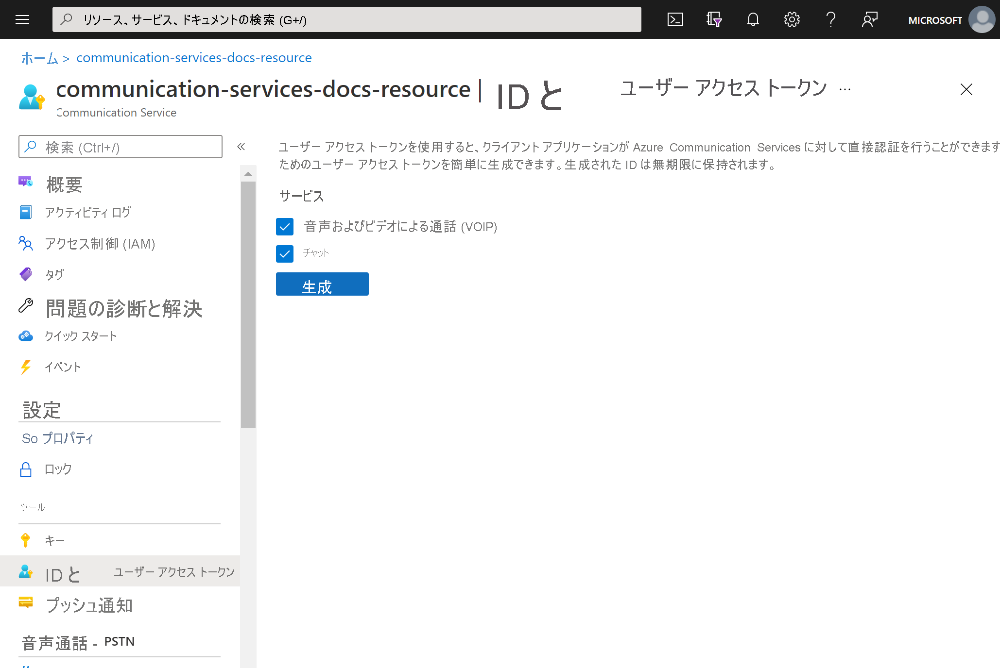
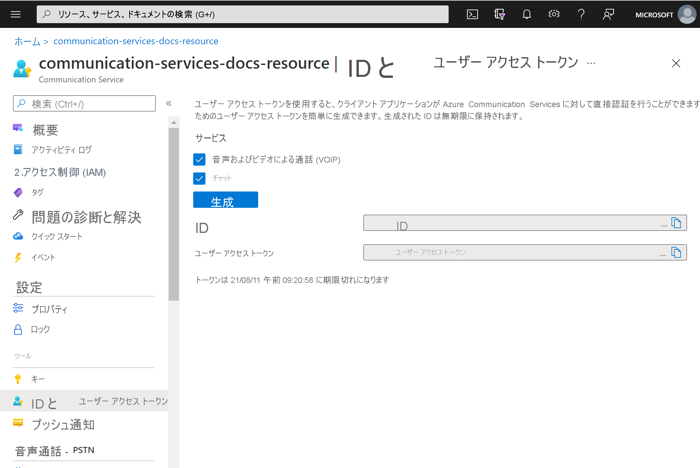

# <a name="quickstart-quickly-create-azure-communication-services-access-tokens-for-testing"></a>クイック スタート - テスト用の Azure Communication Services アクセス トークン をすばやく作成する

[Azure portal ](https://portal.azure.com) のCommunication Services 拡張機能では、Communication Services の ID とアクセス トークン生成できます。 これにより、認証サービスの作成を省略し、サンプル アプリと簡単な開発シナリオを簡単にテストできるようになります。 この機能は小規模な検証とテストを目的とします。実稼働シナリオでは使用できません。 実稼働コードについては、[アクセス トークンの作成に関するクイックスタート](../access-tokens.md)を参照してください。

このツールは、単純なユーザー エクスペリエンスで ```Identity SDK``` の動作を示します。 このツールを使用して作成されたトークンと ID は、 ```Identity SDK``` を使用して作成された場合と同じ動作と規則に従います。  例えば、アクセス トークンの有効時間は 24 時間です。

## <a name="prerequisites"></a>前提条件

- [Azure Communication Services のリソース](../create-communication-resource.md)。

## <a name="create-the-access-tokens"></a>アクセス トークンの作成

[Azure portal](https://portal.azure.com) で、Communication Services リソース内で **ID とユーザーアクセス トークン** のブレードまで移動します。 

アクセス トークンのスコープを選択します。 なし、1 つ、または複数を選択できます。 **[生成]** をクリックします。



ID と、対応するユーザー アクセス トークンが生成されます。 これらの文字列をコピーし、[サンプル アプリ](../../samples/overview.md)やそのほかのテスト シナリオで使用できます。



## <a name="next-steps"></a>次のステップ


次のことも実行できます。

 - [認証について学習する](../../concepts/authentication.md)
 - [クライアントとサーバーのアーキテクチャについて学習する](../../concepts/client-and-server-architecture.md)
