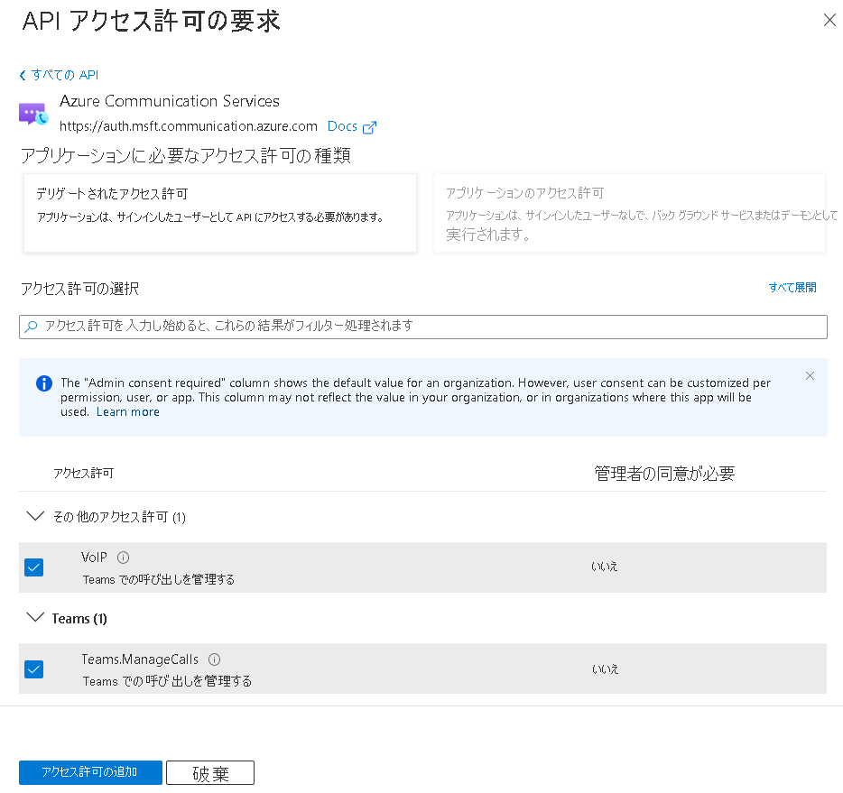

# <a name="quickstart-set-up-and-manage-teams-access-tokens"></a>クイックスタート: Teams アクセス トークンを設定して管理する

> [!IMPORTANT]
> この機能はプレビューでのみご利用いただけます。 カスタム Teams エンドポイント エクスペリエンスを有効または無効にするには、[このフォームを完成させて送信してください](https://forms.office.com/r/B8p5KqCH19)。

このクイックスタートでは、Microsoft Authentication Library (MSAL) を使用して、Azure Active Directory (Azure AD) ユーザー トークンを取得することにより、Microsoft 365 ユーザーを認証する .NET コンソール アプリケーションを構築します。 次に、Azure Communication Services Identity SDK を使用して、そのトークンを Teams アクセス トークンと交換します。 その後、Teams アクセス トークンを Communication Services Calling SDK で使用して、カスタム Teams エンドポイントを構築できます。

> [!NOTE]
> 交換の要求はシークレットを使用して署名されるため、運用環境では、この交換メカニズムをバックエンド サービスに実装することをお勧めします。

## <a name="prerequisites"></a>前提条件
- アクティブなサブスクリプションが含まれる Azure アカウント。 [無料でアカウントを作成できます](https://azure.microsoft.com/free/?WT.mc_id=A261C142F)。
- アクティブな Azure Communication Services リソースと接続文字列。 詳細については、[Azure Communication Services リソースの作成](./create-communication-resource.md)に関するページを参照してください。
- [このフォームを完成させて送信する](https://forms.office.com/r/B8p5KqCH19)ことで、カスタムの Teams エンドポイント エクスペリエンスを有効にします。
- Azure Active Directory インスタンスと、Teams ライセンスを持つユーザー。

## <a name="introduction"></a>はじめに

Teams ID は Azure Active Directory のテナントにバインドされます。 このアプリケーションは、同じまたは別のテナントのユーザーが使用できます。 このクイックスタートでは、複数のアクター (架空の企業である Contoso および Fabrikam のユーザー、開発者、管理者) を含むマルチテナントのユース ケースについて説明します。 このユース ケースでは、Contoso は Fabrikam のためにサービスとしてのソフトウェア (SaaS) ソリューションを構築している企業です。 

以降のセクションでは、管理者、開発者、およびユーザー向けの手順について説明します。 この図は、マルチテナントのユース ケースを示しています。 単一テナントで作業する場合は、単一テナントで Contoso と Fabrikam のすべての手順を行います。

## <a name="administrator-actions"></a>管理者のアクション

管理者ロールには Azure AD での拡張アクセス許可があります。 このロールのメンバーは、リソースを設定し、Azure portal から情報を読み取ることができます。 次の図では、管理者によって実行される必要があるすべてのアクションを確認できます。


1. Contoso の管理者は、Azure Active Directory で既存の "*アプリケーション*" を作成または選択します。 プロパティ *[Supported account types]\(サポートされているアカウントの種類\)* は、さまざまなテナントのユーザーがアプリケーションに対して認証できるかどうかを定義します。 プロパティ *[リダイレクト URI]* は、Contoso "*サーバー*" に成功した認証要求をリダイレクトします。
1. Contoso の管理者は、Communication Services VoIP アクセス許可を使用してアプリケーションのマニフェストを拡張します。 
1. Contoso の管理者は、アプリケーションのパブリック クライアント フローを許可します。
1. Contoso の管理者は、必要に応じて更新できます。
1. Contoso の管理者は、[このフォームを完成させて送信する](https://forms.office.com/r/B8p5KqCH19)ことで、エクスペリエンスを有効にします。
1. Contoso の管理者は、既存の Communication Services を選択するか作成します。これは交換要求の認証に使用されます。 Azure AD ユーザー トークンは Teams アクセス トークンと交換されます。 詳細については、「[Communication Services のリソースを作成して管理する](./create-communication-resource.md)」を参照してください。
1. Fabrikam の管理者は、Fabrikam テナントの Communication Services 用に新しいサービス プリンシパルを設定します。 この手順は、アプリケーションが見つからない場合に必要です。
1. Fabrikam の管理者は、Communication Services VoIP または `Teams.ManageCalls` のアクセス許可を Contoso アプリケーションに付与します。 この手順は、Contoso アプリケーションが検証されていない場合にのみ必要です。 

### <a name="step-1-create-an-azure-ad-application-registration-or-select-an-azure-ad-application"></a>手順 1: Azure AD アプリケーションの登録を作成するか Azure AD アプリケーションを選択する 

ユーザーは、Azure Communication Services VoIP アクセス許可を持つ Azure AD アプリケーションに対して認証される必要があります。 このクイックスタートで使用する既存のアプリケーションがない場合は、新しいアプリケーション登録を作成できます。 

次のアプリケーション設定がエクスペリエンスに影響します。
- プロパティ *[Supported account types]\(サポートされているアカウントの種類\)* は、アプリケーションがシングル テナント ([この組織のディレクトリ内のアカウントのみ]) であるか、マルチテナント ([任意の組織のディレクトリ内のアカウント]) であるかを定義します。 このシナリオでは、マルチテナントを使用できます。
- *[リダイレクト URI]* は、認証後に認証要求がリダイレクトされる URI を定義します。 このシナリオでは、 **[パブリック クライアント/ネイティブ (モバイルとデスクトップ)]** を使用して、URI として「 **`http://localhost`** 」を入力できます。

詳細については、[Microsoft ID プラットフォームにアプリケーションを登録する](../../active-directory/develop/quickstart-register-app.md#register-an-application)方法に関するページを参照してください。 

アプリケーションが登録されると、概要に識別子が表示されます。 この識別子 ("*アプリケーション (クライアント) ID*") は以降の手順で使用されます。

### <a name="step-2-allow-public-client-flows"></a>手順 2: パブリック クライアント フローを許可する

ご利用のアプリケーションの **[認証]** ペインには、 *[パブリック クライアント/ネイティブ (モバイルとデスクトップ)]* に構成されたプラットフォームが *localhost* を指すリダイレクト URI と共に表示されます。 このペインの下部に、 *[パブリック クライアント フローを許可する]* のトグル コントロールがあります。このクイックスタートでは、 **[はい]** に設定する必要があります。

### <a name="step-3-optional-update-the-publisher-domain"></a>手順 3: (省略可能) パブリッシャー ドメインを更新する 
**[ブランド化]** ペインで、アプリケーションのパブリッシャー ドメインを更新することができます。 これは、アプリケーションが Azure によって検証済みとしてマークされるマルチテナント アプリケーションの場合に便利です。 詳細については、「[アプリケーションのパブリッシャー ドメインを構成する](../../active-directory/develop/howto-configure-publisher-domain.md)」を参照してください。

### <a name="step-4-add-the-communication-services-permissions-in-the-application"></a>手順 4: アプリケーションで Communication Services のアクセス許可を追加する

- Azure portal で AAD アプリに移動し、 **[API のアクセス許可]** を選択します。
- **[アクセス許可の追加]** を選択します。
- **[アクセス許可の追加]** メニューで、 **[Azure Communication Services]** を選択します
- 必要なアクセス許可である **[VoIP]** または **[Teams.ManageCalls]** あるいはその両方を選択し、 **[アクセス許可の追加]** をクリックします。



### <a name="step-5-create-or-select-a-communication-services-resource"></a>手順 5: Communication Services リソースを作成または選択する

Communication Services リソースは、Azure AD ユーザー トークンを Teams アクセス トークンと交換するためのすべての要求を認証するために使用されます。 この交換をトリガーするには、Communication Services Identity SDK を使用し、アクセス キーで認証するか、Azure のロールベースのアクセス制御 (RBAC) を使用します。 アクセス キーは、Azure portal で取得するか、 **[アクセス制御 (IAM)]** ペインで Azure RBAC を構成することで取得できます。

新しい Communication Services リソースを作成する場合は、「[Communication Services のリソースを作成して管理する](./create-communication-resource.md)」を参照してください。

### <a name="step-6-set-up-a-communication-services-service-principal"></a>手順 6: Communication Services のサービス プリンシパルを設定する

Fabrikam テナントでカスタム Teams エンドポイント エクスペリエンスを有効にするには、Fabrikam Azure AD の管理者が、アプリケーション ID *1fd5118e-2576-4263-8130-9503064c837a* を使用して Azure Communication Services という名前のサービス プリンシパルを設定する必要があります。 Azure Active Directory の **[エンタープライズ アプリケーション]** ペインにこのアプリケーションが表示されない場合は、手動で追加する必要があります。

Fabrikam Azure AD の管理者は、PowerShell を使用して Azure テナントに接続します。 

> [!NOTE]
> 次のコマンドの [Tenant_ID] を実際のテナントの ID に置き換えます。これは、Azure portal の Azure AD インスタンスの [概要] ページにあります。

```azurepowershell
Connect-AzureAD -TenantId "[Tenant_ID]"
```

"コマンドが見つかりません" というエラーが表示される場合は、AzureAD モジュールが PowerShell にインストールされていません。 PowerShell を閉じ、管理者として再度開きます。 これで次のコマンドを実行して、AzureAD パッケージをインストールできるようになります。

```azurepowershell
Install-Module AzureAD
```

Azure portal に接続して認証したら、次のコマンドを実行して、Communication Services のサービス プリンシパルを設定します。 

> [!NOTE]
> パラメーター AppId は、ファースト パーティ アプリケーション Communication Services を指します。 この値は変更しないでください。

```azurepowershell
New-AzureADServicePrincipal -AppId "1fd5118e-2576-4263-8130-9503064c837a"
```

### <a name="step-7-provide-administrator-consent"></a>手順 7: 管理者の同意を提供する

Contoso アプリケーションが検証されていない場合、Azure AD 管理者は、Azure Communication Services VoIP の Contoso アプリケーションにアクセス許可を付与する必要があります。 Fabrikam の Azure AD 管理者は、一意の URL を使用して同意を提供します。 

管理者の同意 URL を作成するために、Fabrikam の Azure AD 管理者は次のことを行います。

1. URL *https://login.microsoftonline.com/{Tenant_ID}/adminconsent?client_id={Application_ID}* で、管理者は {Tenant_ID} を Fabrikam テナント ID に置き換え、{Application_ID} を Contoso アプリケーション ID に置き換えます。
1. 管理者が組織を代表してログインし、アクセス許可を付与します。

同意が得られた場合は、Contoso アプリケーションのサービス プリンシパルが Fabrikam テナント内に作成されます。 Fabrikam の管理者は、次の手順に従って Azure AD で同意を確認できます。

1. Azure Portal に管理者としてサインインします。
1. [Azure Active Directory] に移動します。
1. **[エンタープライズ アプリケーション]** ペインで、 **[アプリケーションの種類]** フィルターを **[すべてのアプリケーション]** に設定します。
1. アプリケーションをフィルター処理するためのフィールドに、Contoso アプリケーションの名前を入力します。
1. **[適用]** を選択します。
1. 必要な名前を使用してサービス プリンシパルを選択します。 
1. **[アクセス許可]** ペインに移動します。

Communication Services VoIP アクセス許可の状態が *[{Directory_name} に付与されました]* になっていることがわかります。

## <a name="developer-actions"></a>開発者の操作

Contoso の開発者は、ユーザーを認証するために "*クライアント アプリケーション*" を設定する必要があります。 次に開発者は、リダイレクト後に Azure AD ユーザー トークンを処理するために、バックエンド "*サーバー*" にエンドポイントを作成する必要があります。 Azure AD ユーザー トークンが受信されると、Teams アクセス トークンと交換され、"*クライアント アプリケーション*" に返されます。 

開発者の必要なアクションを次の図に示します。


1. Contoso の開発者は、Communication Services VoIP アクセス許可のために管理者によって以前に作成されたアプリケーションに対してユーザーを認証するように MSAL ライブラリを構成します。
1. Contoso の開発者は、Communication Services Identity SDK を初期化し、その SDK を使用して、受信する Azure AD ユーザー トークンを Teams アクセス トークンと交換します。 その後、Teams アクセス トークンが "*クライアント アプリケーション*" に返されます。

Microsoft Authentication Library を使用すると、開発者は Microsoft ID プラットフォーム エンドポイントから Azure AD ユーザー トークンを取得して、ユーザーを認証し、セキュリティで保護された Web API にアクセスすることができます。 これは、Communication Services へのセキュリティで保護されたアクセスを提供するために使用できます。 MSAL では、.NET、JavaScript、Java、Python、Android、iOS などの、さまざまなアプリケーション アーキテクチャとプラットフォームがサポートされています。

パブリック ドキュメントでの環境の設定の詳細については、[Microsoft Authentication Library の概要](../../active-directory/develop/msal-overview.md)に関するページを参照してください。

> [!NOTE]
> 以降のセクションでは、コンソール アプリケーションで Azure AD アクセス トークンを Teams アクセス トークンと交換する方法について説明します。

::: zone pivot="programming-language-csharp"
[!INCLUDE [.NET](./includes/manage-teams-identity-net.md)]
::: zone-end

::: zone pivot="programming-language-javascript"
[!INCLUDE [JavaScript](./includes/manage-teams-identity-js.md)]
::: zone-end

::: zone pivot="programming-language-python"
[!INCLUDE [Python](./includes/manage-teams-identity-python.md)]
::: zone-end

::: zone pivot="programming-language-java"
[!INCLUDE [Java](./includes/manage-teams-identity-java.md)]
::: zone-end


## <a name="user-actions"></a>ユーザー操作

ユーザーは、Contoso アプリケーションの Fabrikam ユーザーを表します。 ユーザー エクスペリエンスを次の図に示します。


1. Fabrikam のユーザーは、Contoso "*クライアント アプリケーション*" を使用して認証するように求められます。
1. Contoso "*クライアント アプリケーション*" では MSAL ライブラリを使用して、Communication Services VoIP アクセス許可を持つ Contoso アプリケーションの Fabrikam の Azure AD テナントに対してユーザーを認証します。 
1. 認証は、MSAL と Contoso アプリケーションのプロパティ "*リダイレクト URI*" で定義されているように、"*サーバー*" にリダイレクトされます。
1. Contoso "*サーバー*" では、Communication Services Identity SDK を使用して Azure AD ユーザー トークンが Teams アクセス トークンに交換され、Teams アクセス トークンが "*クライアント アプリケーション*" に返されます。

"*クライアント アプリケーション*" で有効な Teams アクセス トークンを使用すると、開発者は Communication Services Calling SDK を統合し、カスタム Teams エンドポイントを構築できます。

## <a name="next-steps"></a>次のステップ

このクイック スタートでは、次の方法について説明しました。

> [!div class="checklist"]
> * Azure AD でアプリケーションを作成して構成する。
> * MSAL ライブラリを使用して Azure AD ユーザー トークンを発行する。
> * Communication Services Identity SDK を使用して、Azure ADユーザー トークンを Teams アクセス トークンに交換する。

次の概念について学習します。

- [カスタム Teams エンドポイント](../concepts/teams-endpoint.md)
- [Teams の相互運用性](../concepts/teams-interop.md)
