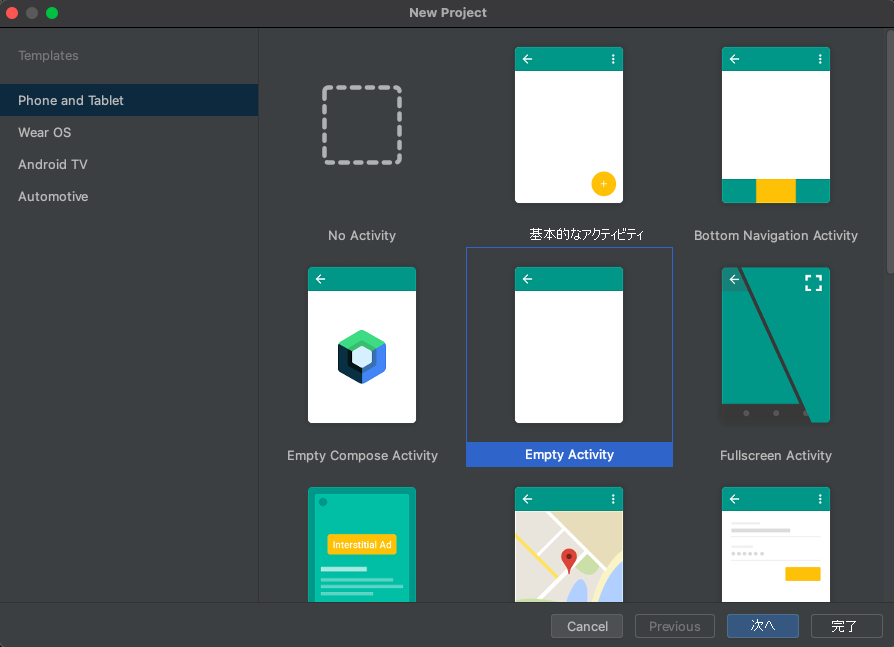

## <a name="prerequisites"></a>前提条件

- アクティブなサブスクリプションが含まれる Azure アカウント。 [無料でアカウントを作成できます](https://azure.microsoft.com/free/?WT.mc_id=A261C142F)。
- [Android Studio](https://developer.android.com/studio) を実行している OS。
- デプロイ済みの Communication Services リソース。 [Communication Services リソースを作成します](../../../create-communication-resource.md)。
- Azure Communication Services トークン。 [例](../../../identity/quick-create-identity.md)を参照してください 

## <a name="setting-up"></a>設定

### <a name="creating-an-android-app-with-an-empty-activity"></a>空のアクティビティを使用した Android アプリの作成

Android Studio で、新しいプロジェクトを作成し、`Empty Activity` を選択します。



`Next` ボタンをクリックし、プロジェクトに `UILibraryQuickStart` という名前を付け、言語を `Java/Kotlin` に設定して、[Minimum SDK]\(最小 SDK\) に "API 23: Android 6.0 (Marshmallow)" 以上を選択します。

![Android Studio で [Finish]\(完了\) ボタンが選択されていることを示すスクリーンショット。](../../media/composite-android-new-project-finish.png)

[`Finish`] をクリックします。

## <a name="maven-repository-credentials"></a>Maven リポジトリ資格情報

- `read:packages` スコープが選択されている個人用アクセス トークン (PAT) を指定する必要があります。
- その PAT で `SSO enabled` が必要な場合があります。
- また、GitHub ユーザーが https://github.com/Azure/communication-preview にアクセスできることも確認します。
- 個人用アクセス トークンは、 https://github.com/settings/tokens から生成できます。

## <a name="install-the-packages"></a>パッケージのインストール

アプリ レベル (**アプリ フォルダー**) の `build.gradle` で、次の行を dependencies セクションおよび android セクションに追加します。

```groovy
android {
    ...
    packagingOptions {
        pickFirst  'META-INF/*'
    }
    ...
}
```

```groovy
dependencies {
    ...
    implementation 'com.azure.android:azure-communication-ui:1.0.0-alpha.2'
    ...
}
```

プロジェクト設定レベル (**アプリ フォルダー**) の `settings.gradle` で、次の行をリポジトリに追加します。

```groovy
dependencyResolutionManagement {
    repositoriesMode.set(RepositoriesMode.FAIL_ON_PROJECT_REPOS)
    repositories {
        ...
        maven {
            url "https://pkgs.dev.azure.com/MicrosoftDeviceSDK/DuoSDK-Public/_packaging/Duo-SDK-Feed/maven/v1"
        }
        maven {
            name='github'
            url = 'https://maven.pkg.github.com/Azure/communication-preview'
            credentials {
                username '<your GitHub user name>'
                password '<your personal access token>'
            }
        }
        ...
    }
}
```
プロジェクトを Gradle のファイルと同期する (Android Studio -> [File]\(ファイル\) -> [Sync Project with Gradle Files]\(プロジェクトを Gradle ファイルと同期\))

## <a name="add-a-button-to-the-activity_main"></a>activity_main へのボタンの追加

レイアウト ファイル (`app/src/main/res/layout/activity_main.xml`) にアクセスします。 ここでは、複合を開始するボタンを作成するために、次のコードを追加します。

```xml
<?xml version="1.0" encoding="utf-8"?>
<androidx.constraintlayout.widget.ConstraintLayout xmlns:android="http://schemas.android.com/apk/res/android"
    xmlns:app="http://schemas.android.com/apk/res-auto"
    xmlns:tools="http://schemas.android.com/tools"
    android:layout_width="match_parent"
    android:layout_height="match_parent"
    tools:context=".MainActivity">

    <Button
        android:id="@+id/startButton"
        android:layout_width="wrap_content"
        android:layout_height="wrap_content"
        android:text="Launch"
        app:layout_constraintBottom_toBottomOf="parent"
        app:layout_constraintLeft_toLeftOf="parent"
        app:layout_constraintRight_toRightOf="parent"
        app:layout_constraintTop_toTopOf="parent" />

</androidx.constraintlayout.widget.ConstraintLayout>
```

## <a name="initialize-composite"></a>複合の初期化 

`MainActivity` にアクセスします。 ここに次のコードを追加して、通話用の複合コンポーネントを初期化します。 `"GROUP_CALL_ID"` を通話のグループ ID で、`"DISPLAY_NAME"` を自分の名前で、`"<USER_ACCESS_TOKEN>"` を トークンでそれぞれ置き換えます。

#### <a name="kotlin"></a>[Kotlin](#tab/kotlin)

```kotlin
package com.example.uilibraryquickstart

import androidx.appcompat.app.AppCompatActivity
import android.os.Bundle
import android.widget.Button
import com.azure.android.communication.common.CommunicationTokenCredential
import com.azure.android.communication.common.CommunicationTokenRefreshOptions
import com.azure.android.communication.ui.CallCompositeBuilder
import com.azure.android.communication.ui.CallComposite
import com.azure.android.communication.ui.GroupCallOptions
import java.util.UUID

class MainActivity : AppCompatActivity() {
    override fun onCreate(savedInstanceState: Bundle?) {
        super.onCreate(savedInstanceState)
        setContentView(R.layout.activity_main)
        
        val startButton: Button = findViewById(R.id.startButton)
        startButton.setOnClickListener { l -> startCallComposite() }
    }

    private fun startCallComposite() {
        val communicationTokenRefreshOptions = CommunicationTokenRefreshOptions({ fetchToken() }, true)
        val communicationTokenCredential = CommunicationTokenCredential(communicationTokenRefreshOptions)
        val options = GroupCallOptions(
            this,
            communicationTokenCredential,
            UUID.fromString("GROUP_CALL_ID"),
            "DISPLAY_NAME",
        )

        val callComposite: CallComposite = CallCompositeBuilder().build()
        callComposite.launch(options)
    }

    private fun fetchToken(): String? {
        return "USER_ACCESS_TOKEN"
    }
}
```

#### <a name="java"></a>[Java](#tab/java)

```java
package com.example.uilibraryquickstart;

import androidx.appcompat.app.AppCompatActivity;
import android.os.Bundle;
import android.widget.Button;
import com.azure.android.communication.common.CommunicationTokenCredential;
import com.azure.android.communication.common.CommunicationTokenRefreshOptions;
import com.azure.android.communication.ui.CallCompositeBuilder;
import com.azure.android.communication.ui.CallComposite;
import com.azure.android.communication.ui.GroupCallOptions;
import java.util.UUID;

public class MainActivity extends AppCompatActivity {

    @Override
    protected void onCreate(Bundle savedInstanceState) {
        super.onCreate(savedInstanceState);
        setContentView(R.layout.activity_main);

        Button startButton = findViewById(R.id.startButton);

        startButton.setOnClickListener(l -> {
            startCallComposite();
        });
    }

    private void startCallComposite() {
        CallComposite callComposite = new CallCompositeBuilder().build();

        CommunicationTokenRefreshOptions communicationTokenRefreshOptions =
                new CommunicationTokenRefreshOptions(this::fetchToken, true);
        CommunicationTokenCredential communicationTokenCredential = new CommunicationTokenCredential(communicationTokenRefreshOptions);

        GroupCallOptions options = new GroupCallOptions(this,
                communicationTokenCredential,
                UUID.fromString("GROUP_CALL_ID"),
                "DISPLAY_NAME");

        callComposite.launch(options);
    }

    private String fetchToken() {
        return "USER_ACCESS_TOKEN";
    }
}
```

-----
## <a name="run-the-code"></a>コードの実行

Android Studio からアプリケーションをビルドして起動します。

- [`Launch`] をクリックします。
- オーディオのアクセス許可に同意し、デバイス、マイク、およびビデオの設定を選択します。
- [`Join Call`] をクリックします。

## <a name="sample-application-code-can-be-found-here"></a>サンプル アプリケーション コードは[こちら](https://github.com/Azure-Samples/communication-services-android-quickstarts/tree/ui-library-quickstart/ui-library-quick-start)にあります


## <a name="object-model"></a>オブジェクト モデル

Azure Communication Services Android UI が備える主な機能のいくつかは、次のクラスとインターフェイスにより処理されます。

| 名前                                                               | 説明                                                                                  |
| ------------------------------------------------------------------ | -------------------------------------------------------------------------------------------- |
| [CallComposite](#create-call-composite)                            | 参加者ギャラリーとコントロールを使用して、通話エクスペリエンスを提供する複合コンポーネント。    |
| [CallCompositeBuilder](#create-call-composite)                     | オプションを使用して CallComposite を構築するビルダー。                                                 |
| [GroupCallOptions](#group-call)                                    | グループ通話を開始するために CallComposite 起動に渡されます。                                          |
| [TeamsMeetingOptions](#teams-meeting)                              | Teams 会議に参加するために CallComposite 起動に渡されます。                                |
| [ThemeConfiguration](#apply-theme-configuration)                   | 複合のプライマリ色を変更するために、CallCompositeBuilder でオプションとして挿入されます。           |

## <a name="ui-library-functionality"></a>UI ライブラリの機能

### <a name="create-call-composite"></a>通話複合の作成

`startCallComposite` 関数内の `CallCompositeBuilder` インスタンスと `CallComposite` インスタンスを初期化します。

#### <a name="kotlin"></a>[Kotlin](#tab/kotlin)

```kotlin
val callComposite: CallComposite = CallCompositeBuilder().build()
```
#### <a name="java"></a>[Java](#tab/java)

```java
CallComposite callComposite = new CallCompositeBuilder().build();
```

-----
### <a name="setup-authentication"></a>認証の設定

`startCallComposite` 関数内の `CommunicationTokenCredential` インスタンスを初期化します。 `"<USER_ACCESS_TOKEN>"` を実際のトークンに置き換えます。

#### <a name="kotlin"></a>[Kotlin](#tab/kotlin)

```kotlin
val callComposite: CallComposite = CallCompositeBuilder().build()

val communicationTokenRefreshOptions = CommunicationTokenRefreshOptions(this::fetchToken, true)

val communicationTokenCredential = CommunicationTokenCredential(communicationTokenRefreshOptions)
```

#### <a name="java"></a>[Java](#tab/java)

```java
CallComposite callComposite = new CallCompositeBuilder().build();

CommunicationTokenRefreshOptions communicationTokenRefreshOptions =
                new CommunicationTokenRefreshOptions(this::fetchToken, true);

CommunicationTokenCredential communicationTokenCredential = new CommunicationTokenCredential(communicationTokenRefreshOptions);

```

まだトークンを入手していない場合は、[ユーザー アクセス トークン](../../../identity/quick-create-identity.md)に関するドキュメントを参照してください。

-----
### <a name="setup-group-call-or-teams-meeting-options"></a>グループ通話または Teams 会議オプションの設定

設定する通話または会議の種類に応じて、適切なオプション オブジェクトを使用します。

### <a name="group-call"></a>グループ通話

`startCallComposite` 関数内の `GroupCallOptions` インスタンスを初期化します。

`"GROUP_CALL_ID"` を通話のグループ ID に置き換えます。

`"DISPLAY_NAME"` をユーザー名で置き換えます。

#### <a name="kotlin"></a>[Kotlin](#tab/kotlin)

```kotlin
val options = GroupCallOptions(
            this,
            communicationTokenCredential,
            UUID.fromString("GROUP_CALL_ID"),
            "DISPLAY_NAME",
        )
```

#### <a name="java"></a>[Java](#tab/java)

```java
GroupCallOptions options = new GroupCallOptions(
    this,
    communicationTokenCredential,
    UUID.fromString("GROUP_CALL_ID"),
    "DISPLAY_NAME"
);
```
-----
### <a name="teams-meeting"></a>Teams 会議

`startCallComposite` 関数内の `TeamsMeetingOptions` インスタンスを初期化します。
`"TEAMS_MEETING_LINK"` を通話のグループ ID に置き換えます。

`"DISPLAY_NAME"` をユーザー名で置き換えます。

#### <a name="kotlin"></a>[Kotlin](#tab/kotlin)

```kotlin
val options = TeamsMeetingOptions(
            this,
            communicationTokenCredential,
            "TEAMS_MEETING_LINK",
            "DISPLAY_NAME",
        )
```

#### <a name="java"></a>[Java](#tab/java)

```java
TeamsMeetingOptions options = new TeamsMeetingOptions(
    this,
    communicationTokenCredential,
    "TEAMS_MEETING_LINK",
    "DISPLAY_NAME"
);
```

-----
### <a name="get-a-microsoft-teams-meeting-link"></a>Microsoft Teams 会議のリンクを取得する

Microsoft Teams 会議のリンクは、Graph API を使用して取得できます。 このプロセスについては、[Graph のドキュメント](/graph/api/onlinemeeting-createorget?preserve-view=true&tabs=http&view=graph-rest-beta)で詳しく説明されています。

Communication Services 通話 SDK は、Microsoft Teams 会議のフル リンクを受け入れます。 このリンクは、`onlineMeeting` リソースの一部として返され、[`joinWebUrl` プロパティ](/graph/api/resources/onlinemeeting?preserve-view=true&view=graph-rest-beta)からアクセスできます。必要な会議情報は、Teams 会議の招待自体に含まれる **[会議に参加]** の URL から取得することもできます。

### <a name="launch"></a>Launch

`startCallComposite` 関数内の `CallComposite` インスタンスの `launch` を呼び出します。

#### <a name="kotlin"></a>[Kotlin](#tab/kotlin)

```kotlin
callComposite.launch(options)
```

#### <a name="java"></a>[Java](#tab/java)

```java
callComposite.launch(options);
```

-----

### <a name="subscribe-to-events-from-callcomposite"></a>`CallComposite` からイベントをサブスクライブします

イベントを受信するには、`CallCompositeBuilder` にハンドラーを挿入します。

#### <a name="kotlin"></a>[Kotlin](#tab/kotlin)

```kotlin
val callComposite: CallComposite =
            CallCompositeBuilder()
                .onException { 
                    //...
                }
                .build()
```

#### <a name="java"></a>[Java](#tab/java)

```java
CallComposite callComposite =
                new CallCompositeBuilder()
                        .onException(eventArgs -> {
                            //...
                        })
                        .build();
```

-----

### <a name="apply-theme-configuration"></a>テーマ構成の適用

複合のプライマリ色を変更するには、`AzureCommunicationUI.Theme.Calling` を親テーマとして考慮することによって、`src/main/res/values/themes.xml` および `src/main/res/values-night/themes.xml` で新しいテーマ スタイルを作成します。 テーマを適用するには、`CallCompositeBuilder` にテーマ ID を挿入します。

```xml
<style name="MyCompany.CallComposite" parent="AzureCommunicationUI.Theme.Calling">
    <item name="azure_communication_ui_calling_primary_color">@color/purple_500</item>
</style>
```

#### <a name="kotlin"></a>[Kotlin](#tab/kotlin)

```kotlin
import com.azure.android.communication.ui.configuration.ThemeConfiguration

val callComposite: CallComposite =
        CallCompositeBuilder()
            .theme(ThemeConfiguration(R.style.MyCompany_CallComposite))
            .build()
```

#### <a name="java"></a>[Java](#tab/java)

```java
import com.azure.android.communication.ui.configuration.ThemeConfiguration;

CallComposite callComposite = 
    new CallCompositeBuilder()
        .theme(new ThemeConfiguration(R.style.MyCompany_CallComposite))
        .build();
```
