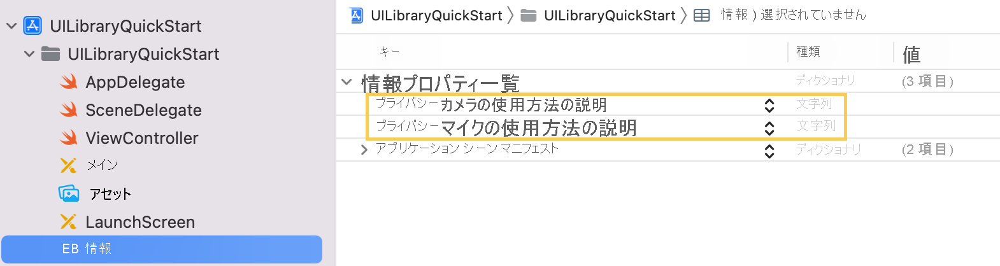
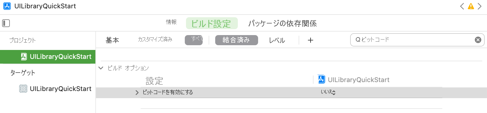

## <a name="prerequisites"></a>前提条件

- アクティブなサブスクリプションが含まれる Azure アカウント。 [無料でアカウントを作成できます](https://azure.microsoft.com/free/?WT.mc_id=A261C142F)。
- [Xcode](https://go.microsoft.com/fwLink/p/?LinkID=266532) を実行しており、有効な開発者証明書がキーチェーンにインストールされている Mac。 依存関係をフェッチするには、[CocoaPods](https://cocoapods.org/) もインストールする必要があります。
- デプロイ済みの Communication Services リソース。 [Communication Services リソースを作成します](../../../create-communication-resource.md)。
- Azure Communication Services トークン。 [例を参照してください。](../../../identity/quick-create-identity.md)

## <a name="setting-up"></a>設定

### <a name="creating-the-xcode-project"></a>Xcode プロジェクトを作成する

Xcode で、新しい iOS プロジェクトを作成し、 **[App]\(アプリ\)** テンプレートを選択します。 ここでは、UIKit のストーリーボードを使用します。 このクイックスタートでは、テストは作成しません。 **[Include Tests]\(テストを含める\)** チェック ボックスはオフにしてかまいません。


プロジェクトに `UILibraryQuickStart` という名前を付け、`Interface` ドロップダウンの下の `Storyboard` を選びます。


### <a name="install-the-package-and-dependencies-with-cocoapods"></a>CocoaPods でパッケージと依存関係をインストールする

1. `pod init` を実行して、プロジェクトのルートディレクトリに Podfile を作成します。
2. Podfile に次を追加します。

```
source 'https://github.com/CocoaPods/Specs.git'
source 'https://github.com/Azure/AzurePrivatePodspecs.git'

platform :ios, '13.0'

target 'UILibraryQuickStart' do
    use_frameworks!
    pod 'AzureCommunicationUI', '1.0.0-alpha.1'
end
```

3. `pod install --repo-update` を実行します。 (このプロセスには 10 分から 15 分かかります)。
4. 生成された `.xcworkspace` を Xcode で開きます。

### <a name="request-access-to-the-microphone-camera-etc"></a>マイク、カメラなどへのアクセスを要求する

デバイスのハードウェアにアクセスするには、アプリの情報プロパティ リストを更新します。 関連付けられた値を `string` に設定します。これは、ユーザーに対してアクセスを求めるためにシステムによって使用されるダイアログに追加されます。

プロジェクト ツリーの `Info.plist` のエントリを右クリックし、 **[Open As]\(形式を指定して開く\)**  >  **[Source Code]\(ソース コード\)** の順に選択します。 最上位の `<dict>` セクションに以下の行を追加してから、ファイルを保存します。

```xml
<key>NSCameraUsageDescription</key>
<string></string>
<key>NSMicrophoneUsageDescription</key>
<string></string>
```

アクセス許可の要求が正しく追加されていることを確認するには、`Info.plist` を **[Open As]\(形式を指定して開く\)**  >  **[プロパティ リスト]** として表示します。次の情報が表示されるはずです。



### <a name="turn-off-bitcode"></a>`Bitcode` をオフにする
プロジェクトの [`Build Settings`]\(ビルド設定\) で [`Enable Bitcode`]\(ビットコードの有効化\) オプションを [`No`]\(いいえ\) に設定します。 この設定を見つけるには、フィルターを [`Basic`]\(基本\) から [`All`]\(すべて\) に変更します。右側の検索バーを使用してもかまいません。



## <a name="initialize-composite"></a>複合の初期化

'ViewController' にアクセスします。 ここに次のコードを追加して、通話用の複合コンポーネントを初期化します。 `<GROUP_CALL_ID>` を呼び出しグループ ID に置き換えるか、`UUID()` に置き換えて生成します。 また、`<DISPLAY_NAME>` を自分の名前で、`<USER_ACCESS_TOKEN>` を使用するトークンでそれぞれ置き換えます。

```swift
import UIKit
import AzureCommunicationCalling
import CallingComposite

class ViewController: UIViewController {

    private var callComposite: CallComposite?

    override func viewDidLoad() {
        super.viewDidLoad()

        let button = UIButton(frame: CGRect(x: 100, y: 100, width: 200, height: 50))
        button.contentEdgeInsets = UIEdgeInsets(top: 10.0, left: 20.0, bottom: 10.0, right: 20.0)
        button.layer.cornerRadius = 10
        button.backgroundColor = .systemBlue
        button.setTitle("Start Experience", for: .normal)
        button.addTarget(self, action: #selector(startCallComposite), for: .touchUpInside)

        button.translatesAutoresizingMaskIntoConstraints = false
        self.view.addSubview(button)
        button.centerXAnchor.constraint(equalTo: view.centerXAnchor).isActive = true
        button.centerYAnchor.constraint(equalTo: view.centerYAnchor).isActive = true
    }

    @objc private func startCallComposite() {
        let callCompositeOptions = CallCompositeOptions()

        callComposite = CallComposite(withOptions: callCompositeOptions)

        let communicationTokenCredential = try! CommunicationTokenCredential(token: "<USER_ACCESS_TOKEN>")

        let options = GroupCallOptions(communicationTokenCredential: communicationTokenCredential,
                                       displayName: "<DISPLAY_NAME>",
                                       groupId: UUID(uuidString: "<GROUP_CALL_ID>")!)
        callComposite?.launch(with: options)
    }
}
```

## <a name="run-the-code"></a>コードの実行

iOS シミュレーターでアプリをビルドして実行するには、 **[製品]**  >  **[実行]** の順に選択するか、(&#8984;-R) キーボード ショートカットを使用します。

1) `Start Experience` をタップします。
2) オーディオのアクセス許可に同意し、デバイス、マイク、およびビデオの設定を選択します。
3) `Start Call` をタップします。


## <a name="sample-application-code-can-be-found-here"></a>サンプル アプリケーション コードは[こちら](https://github.com/Azure-Samples/communication-services-ios-quickstarts/tree/ui-library-quickstart)にあります

## <a name="object-model"></a>オブジェクト モデル

Azure Communication Services UI クライアント ライブラリが備える主な機能のいくつかは、次のクラスとインターフェイスにより処理されます。

| 名前                                                                        | 説明                                                                                  |
| --------------------------------------------------------------------------- | -------------------------------------------------------------------------------------------- |
| [CallComposite](#create-call-composite) | 複合は、参加者ギャラリーとコントロールを使用して、通話エクスペリエンスを提供します。 |
| [CallCompositeOptions](#create-call-composite) | テーマの構成やイベント ハンドラーなどのオプションが含まれます。 |
| [CallCompositeEventsHandler](#subscribe-to-events-from-callcomposite) | 複合からイベントを受け取ることができます。 |
| [GroupCallOptions](#group-call) | グループ通話に参加するためのオプション (groupId など)。 |
| [TeamsMeetingOptions](#teams-meeting) | 会議リンクなど、Teams 会議に参加するためのオプション。 |
| [ThemeConfiguration](#apply-theme-configuration) | テーマをカスタマイズできます。 |

## <a name="ui-library-functionality"></a>UI ライブラリの機能

### <a name="create-call-composite"></a>通話複合の作成

`startCallComposite` 関数内の `CallCompositeOptions` インスタンスと `CallComposite` インスタンスを初期化します。

```swift
@objc private func startCallComposite() {
    let callCompositeOptions = CallCompositeOptions()

    callComposite = CallComposite(withOptions: callCompositeOptions)
}
```

### <a name="setup-authentication"></a>認証の設定

`startCallComposite` 関数内の `CommunicationTokenCredential` インスタンスを初期化します。 `<USER_ACCESS_TOKEN>` を実際のトークンに置き換えます。

```swift
let communicationTokenCredential = try! CommunicationTokenCredential(token: "<USER_ACCESS_TOKEN>")
```

まだトークンを入手していない場合は、[ユーザー アクセス トークン](../../../identity/quick-create-identity.md)に関するドキュメントを参照してください。

### <a name="setup-group-call-or-teams-meeting-options"></a>グループ通話または Teams 会議オプションの設定

設定する通話または会議の種類に応じて、適切なオプション オブジェクトを使用します。

#### <a name="group-call"></a>グループ通話

`startCallComposite` 関数内の `GroupCallOptions` インスタンスを初期化します。 `<GROUP_CALL_ID>` を通話のグループ ID で、`<DISPLAY_NAME>` を自分の名前でそれぞれ置き換えます。

```swift
// let uuid = UUID() to create a new call
let uuid = UUID(uuidString: "<GROUP_CALL_ID>")!
let options = GroupCallOptions(communicationTokenCredential: communicationTokenCredential,
                               displayName: "<DISPLAY_NAME>",
                               groupId: uuid)
```

#### <a name="teams-meeting"></a>Teams 会議

`startCallComposite` 関数内の `TeamsMeetingOptions` インスタンスを初期化します。 `<TEAMS_MEETING_LINK>` を通話のグループ ID で、`<DISPLAY_NAME>` を自分の名前でそれぞれ置き換えます。

```swift
let options = TeamsMeetingOptions(communicationTokenCredential: communicationTokenCredential,
                                  displayName: "<DISPLAY_NAME>",
                                  meetingLink: "<TEAMS_MEETING_LINK>")
```

#### <a name="get-a-microsoft-teams-meeting-link"></a>Microsoft Teams 会議のリンクを取得する

Microsoft Teams 会議のリンクは、Graph API を使用して取得できます。 このプロセスについては、[Graph のドキュメント](/graph/api/onlinemeeting-createorget?tabs=http&view=graph-rest-beta&preserve-view=true)で詳しく説明されています。
Communication Services 通話 SDK は、Microsoft Teams 会議のフル リンクを受け入れます。 このリンクは、`onlineMeeting` リソースの一部として返され、[`joinWebUrl` プロパティ](/graph/api/resources/onlinemeeting?view=graph-rest-beta&preserve-view=true)からアクセスできます。必要な会議情報は、Teams 会議の招待自体に含まれる **[会議に参加]** の URL から取得することもできます。

### <a name="launch"></a>Launch

`startCallComposite` 関数内の `CallComposite` インスタンスの `launch` を呼び出します。

```swift
callComposite?.launch(with: options)
```

### <a name="subscribe-to-events-from-callcomposite"></a>`CallComposite` からイベントをサブスクライブする

イベントを操作するために `CallCompositeEventsHandler` からクロージャを実装し、実装を `CallCompositeOptions` に渡すことができます。 例として、複合がエラーで終了した場合のイベントがあります。

```swift
let handler = CallCompositeEventsHandler(didFail: { error in
            print("didFail with error:\(error)")
        })
```

```swift
let callCompositeOptions = CallCompositeOptions(callCompositeEventsHandler: handler)
```

### <a name="apply-theme-configuration"></a>テーマ構成の適用

テーマをカスタマイズするには、ThemeConfiguration プロトコルを実装するカスタム テーマ構成を作成します。 次に、その新しいクラスのインスタンスを CallCompositeOptions に追加します。

```swift
class CustomThemeConfiguration: ThemeConfiguration {
   var primaryColor: UIColor {
       return UIColor.red
   }
}
```

```swift
let callCompositeOptions = CallCompositeOptions(themeConfiguration: CustomThemeConfiguration())
```
