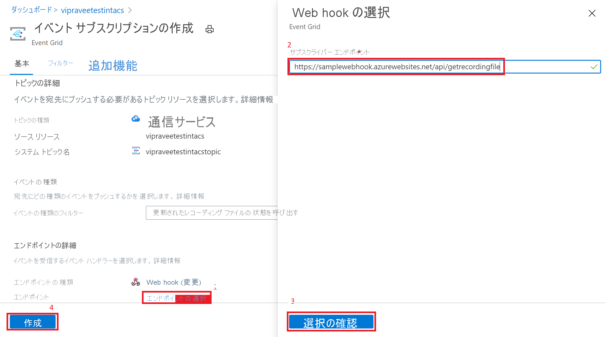

# <a name="record-and-download-calls-with-event-grid"></a>Event Grid を使用した通話の記録とダウンロード

[!INCLUDE [Private Preview Notice](../../includes/private-preview-include.md)]

Azure Event Grid を使用して Azure Communication Services の通話を記録することにより、Communication Services の使用を開始します。

## <a name="prerequisites"></a>前提条件
- アクティブなサブスクリプションが含まれる Azure アカウント。 [無料でアカウントを作成できます](https://azure.microsoft.com/free/?WT.mc_id=A261C142F)。
- アクティブな Communication Services リソース。 [Communication Services リソースを作成します](../create-communication-resource.md?pivots=platform-azp&tabs=windows)。
- [`Microsoft.Azure.EventGrid`](https://www.nuget.org/packages/Microsoft.Azure.EventGrid/) NuGet パッケージ。

## <a name="create-a-webhook-and-subscribe-to-the-recording-events"></a>Webhook を作成し、記録イベントにサブスクライブする
通話記録とメディア ファイルのダウンロードを容易にするために、*Webhook* と "*イベント*" を使用します。 

まず、Webhook を作成します。 Communication Services リソースは、`recording` イベントがトリガーされたときに Event Grid を使用してこの Webhook に通知を行い、記録されたメディアをダウンロードする準備ができたときも再び Webhook に通知を行います。

独自のカスタム Webhook を作成することで、これらのイベント通知を受け取ることができます。 この Webhook をイベント サービスに正常にサブスクライブするには、Webhook が検証コードを使用して受信メッセージに応答することが重要です。

```csharp
[HttpPost]
public async Task<ActionResult> PostAsync([FromBody] object request)
  {
   //Deserializing the request 
    var eventGridEvent = JsonConvert.DeserializeObject<EventGridEvent[]>(request.ToString())
        .FirstOrDefault();
    var data = eventGridEvent.Data as JObject;

    // Validate whether EventType is of "Microsoft.EventGrid.SubscriptionValidationEvent"
    if (string.Equals(eventGridEvent.EventType, EventTypes.EventGridSubscriptionValidationEvent, StringComparison.OrdinalIgnoreCase))
   {
        var eventData = data.ToObject<SubscriptionValidationEventData>();
        var responseData = new SubscriptionValidationResponseData
        {
            ValidationResponse = eventData.ValidationCode
        };
        if (responseData.ValidationResponse != null)
        {
            return Ok(responseData);
        }
    }

    // Implement your logic here.
    ...
    ...
  }
```

上記のコードは、`Microsoft.Azure.EventGrid` NuGet パッケージに依存しています。 Event Grid エンドポイントの検証の詳細については、[エンドポイントの検証に関するドキュメント](../../../event-grid/receive-events.md#endpoint-validation)を参照してください

次に、この Webhook を `recording` イベントにサブスクライブします。

1. Azure Communication Services リソースの [`Events`] ブレードを選択します。
2. 次に示すように、[`Event Subscription`] を選択します。

3. イベント サブスクリプションを構成し、[`Event Type`] として [`Call Recording File Status Update`] を選択します。 [`Endpoint type`] として [`Webhook`] を選択します。
![[イベント サブスクリプションの作成]](./media/call-recording/image2-create-event-subscription.png)
4. Webhook の URL を [`Subscriber Endpoint`] に入力します。


これで、Communication Services リソースが通話の記録に使用されるたびに、Webhook に通知されるようになります。

## <a name="notification-schema"></a>通知スキーマ
記録をダウンロードできるようになると、次のイベント スキーマを使用して Communication Services リソースから通知が送信されます。 記録のドキュメント ID は、各 `recordingChunk` の `documentId` フィールドからフェッチできます。

```json
{
    "id": string, // Unique guid for event
    "topic": string, // Azure Communication Services resource id
    "subject": string, // /recording/call/{call-id}
    "data": {
        "recordingStorageInfo": {
            "recordingChunks": [
                {
                    "documentId": string, // Document id for retrieving from AMS storage
                    "index": int, // Index providing ordering for this chunk in the entire recording
                    "endReason": string, // Reason for chunk ending: "SessionEnded", "ChunkMaximumSizeExceeded”, etc.
                }
            ]
        },
        "recordingStartTime": string, // ISO 8601 date time for the start of the recording
        "recordingDurationMs": int, // Duration of recording in milliseconds
        "sessionEndReason": string // Reason for call ending: "CallEnded", "InitiatorLeft”, etc.
    },
    "eventType": string, // "Microsoft.Communication.RecordingFileStatusUpdated"
    "dataVersion": string, // "1.0"
    "metadataVersion": string, // "1"
    "eventTime": string // ISO 8601 date time for when the event was created
}

```

## <a name="download-the-recorded-media-files"></a>記録されたメディア ファイルをダウンロードする

ダウンロードするファイルのドキュメント ID を取得したら、次の Azure Communication Services API シリーズを呼び出し、HMAC 認証を使用して、記録されたメディアとメタデータをダウンロードします。

記録ファイルの最大サイズは 1.5 GB です。 このファイル サイズを超えると、記録されたメディアがレコーダーによって自動的に複数のファイルに分割されます。

クライアントは、1 つの要求ですべてのメディア ファイルをダウンロードできる必要があります。 問題が発生した場合、クライアントは範囲ヘッダーを使用して再試行を行い、既にダウンロードされているセグメントを再ダウンロードしないようにすることができます。

記録されたメディアをダウンロードするには: 
- メソッド: `GET` 
- URL: https://contoso.communication.azure.com/recording/download/{documentId}?api-version=2021-04-15-preview1

記録されたメディア メタデータをダウンロードするには: 
- メソッド: `GET` 
- URL: https://contoso.communication.azure.com/recording/download/{documentId}/metadata?api-version=2021-04-15-preview1


### <a name="authentication"></a>認証
記録されたメディアとメタデータをダウンロードするには、HMAC 認証を使用して、Azure Communication Services API シリーズに対する要求を認証します。

`HttpClient` を作成し、次に示す `HmacAuthenticationUtils` を使用して必要なヘッダーを追加します。

```csharp
  var client = new HttpClient();

  // Set Http Method
  var method = HttpMethod.Get;
  StringContent content = null;

  // Build request
  var request = new HttpRequestMessage
  {
      Method = method, // Http GET method
      RequestUri = new Uri(<Download_Recording_Url>), // Download recording Url
      Content = content // content if required for POST methods
  };

  // Question: Why do we need to pass String.Empty to CreateContentHash() method?
  // Answer: In HMAC authentication, the hash of the content is one of the parameters used to generate the HMAC token.
  // In our case our recording download APIs are GET methods and do not have any content/body to be passed in the request. 
  // However in this case we still need the SHA256 hash for the empty content and hence we pass an empty string. 


  string serializedPayload = string.Empty;

  // Hash the content of the request.
  var contentHashed = HmacAuthenticationUtils.CreateContentHash(serializedPayload);

  // Add HMAC headers.
  HmacAuthenticationUtils.AddHmacHeaders(request, contentHashed, accessKey, method);

  // Make a request to the Azure Communication Services APIs mentioned above
  var response = await client.SendAsync(request).ConfigureAwait(false);
```

#### <a name="hmacauthenticationutils"></a>HmacAuthenticationUtils 
次のユーティリティを使用して、HMAC ワークフローを管理できます。

**コンテンツ ハッシュを作成する**

```csharp
public static string CreateContentHash(string content)
{
    var alg = SHA256.Create();

    using (var memoryStream = new MemoryStream())
    using (var contentHashStream = new CryptoStream(memoryStream, alg, CryptoStreamMode.Write))
    {
        using (var swEncrypt = new StreamWriter(contentHashStream))
        {
            if (content != null)
            {
                swEncrypt.Write(content);
            }
        }
    }

    return Convert.ToBase64String(alg.Hash);
}
```

**HMAC ヘッダーを追加する**

```csharp
public static void AddHmacHeaders(HttpRequestMessage requestMessage, string contentHash, string accessKey)
{
    var utcNowString = DateTimeOffset.UtcNow.ToString("r", CultureInfo.InvariantCulture);
    var uri = requestMessage.RequestUri;
    var host = uri.Authority;
    var pathAndQuery = uri.PathAndQuery;

    var stringToSign = $"{requestMessage.Method}\n{pathAndQuery}\n{utcNowString};{host};{contentHash}";
    var hmac = new HMACSHA256(Convert.FromBase64String(accessKey));
    var hash = hmac.ComputeHash(Encoding.ASCII.GetBytes(stringToSign));
    var signature = Convert.ToBase64String(hash);
    var authorization = $"HMAC-SHA256 SignedHeaders=date;host;x-ms-content-sha256&Signature={signature}";

    requestMessage.Headers.Add("x-ms-content-sha256", contentHash);
    requestMessage.Headers.Add("Date", utcNowString);
    requestMessage.Headers.Add("Authorization", authorization);
}
```

## <a name="clean-up-resources"></a>リソースをクリーンアップする
Communication Services サブスクリプションをクリーンアップして解除する場合は、リソースまたはリソース グループを削除できます。 リソース グループを削除すると、それに関連付けられている他のリソースも削除されます。 詳細については、[リソースのクリーンアップ](../create-communication-resource.md?pivots=platform-azp&tabs=windows#clean-up-resources)に関する記事を参照してください。


## <a name="next-steps"></a>次の手順
詳細については、次の記事を参照してください。

- Microsoft の [Web 通話のサンプル](../../samples/web-calling-sample.md)を確認する
- [Calling SDK の機能](./getting-started-with-calling.md?pivots=platform-web)について確認する
- [通話のしくみ](../../concepts/voice-video-calling/about-call-types.md)の詳細について確認する