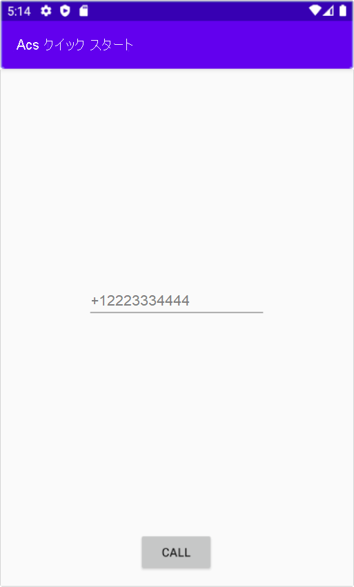

[!INCLUDE [Emergency Calling Notice](../../../includes/emergency-calling-notice-include.md)]
## <a name="prerequisites"></a>前提条件

- アクティブなサブスクリプションが含まれる Azure アカウント。 [無料でアカウントを作成できます](https://azure.microsoft.com/free/?WT.mc_id=A261C142F)。 
- デプロイ済みの Communication Services リソース。 [Communication Services のリソースを作成する](../../create-communication-resource.md)。
- Communication Services リソースで取得した電話番号。 [電話番号の取得方法](../../telephony-sms/get-phone-number.md)。
- 通話クライアントを有効にするための `User Access Token`。 [`User Access Token` を取得する方法](../../access-tokens.md)についての詳細
- [アプリケーションへの通話の追加の概要](../getting-started-with-calling.md)に関するクイックスタートを完了します

### <a name="prerequisite-check"></a>前提条件のチェック

- Communication Services リソースに関連付けられている電話番号を表示するには、[Azure portal](https://portal.azure.com/) にサインインし、Communication Services リソースを見つけて、左側のナビゲーション ペインから **[電話番号]** タブを開きます。

## <a name="setting-up"></a>設定

### <a name="add-pstn-functionality-to-your-app"></a>PSTN 機能をアプリに追加する

**MainActivity.java** を編集してアプリに `PhoneNumber` 型を追加します。


```java
import com.azure.android.communication.common.PhoneNumberIdentifier;
```

<!--
> [!TBD]
> Namespace based on input from Komivi Agbakpem. But it does not correlates with other use namespaces in Calling Quickstart. E.g: "com.azure.communication.calling.CommunicationUserIdentifier" or "com.azure.communication.common.client.CommunicationTokenCredential". Double-chek this.
-->

## <a name="start-a-call-to-phone"></a>電話の呼び出しを開始する

Communication Services リソース内から取得した電話番号を指定してください。 通話を開始する際に使用します。

> [!WARNING]
> 電話番号は、E.164 国際標準形式になっている必要があります (例: +12223334444)。

`startCall()` イベント ハンドラーで通話を処理するように **MainActivity.java** を編集します。

```java
    private void startCall() {
        EditText calleePhoneView = findViewById(R.id.callee_id);
        String calleePhone = calleePhoneView.getText().toString();
        PhoneNumberIdentifier callerPhone = new PhoneNumberIdentifier("+12223334444");
        StartCallOptions options = new StartCallOptions();
        options.setAlternateCallerId(callerPhone);
        options.setVideoOptions(new VideoOptions(null));
        call = agent.startCall(
                getApplicationContext(),
                new PhoneNumberIdentifier[] {new PhoneNumberIdentifier(calleePhone)},
                options);
    }
```

## <a name="launch-the-app-and-call-the-echo-bot"></a>アプリを起動してエコー ボットを呼び出す

ツール バーの [Run App]\(アプリの実行\) ボタン (Shift + F10) を使用してアプリを起動できるようになりました。 追加されたテキスト フィールドに電話番号を入力し、 **[Call]\(通話\)** ボタンをクリックすることによって、電話を呼び出すことができます。
> [!WARNING]
> 電話番号は、E.164 国際標準形式になっている必要があります (例: +12223334444)。


