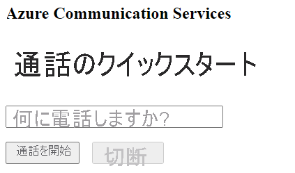

[!INCLUDE [Emergency Calling Notice](../../../includes/emergency-calling-notice-include.md)]
## <a name="prerequisites"></a>前提条件

- アクティブなサブスクリプションが含まれる Azure アカウント。 [無料でアカウントを作成できます](https://azure.microsoft.com/free/?WT.mc_id=A261C142F)。 
- デプロイ済みの Communication Services リソース。 [Communication Services のリソースを作成する](../../create-communication-resource.md)。
- Communication Services リソースで取得した電話番号。 [電話番号の取得方法](../../telephony-sms/get-phone-number.md)。
- 通話クライアントを有効にするための `User Access Token`。 [`User Access Token` を取得する方法](../../access-tokens.md)についての詳細
- [アプリケーションへの通話の追加の概要](../getting-started-with-calling.md)に関するクイックスタートを完了します

### <a name="prerequisite-check"></a>前提条件のチェック

- Communication Services リソースに関連付けられている電話番号を表示するには、[Azure portal](https://portal.azure.com/) にサインインし、Communication Services リソースを見つけて、左側のナビゲーション ペインから **[電話番号]** タブを開きます。
- アプリの作成と実行には、JavaScript 用の Azure Communication Services 通話クライアント ライブラリを使用できます。

```console
npx webpack-dev-server --entry ./client.js --output bundle.js
```

## <a name="setting-up"></a>設定

### <a name="add-pstn-functionality-to-your-app"></a>PSTN 機能をアプリに追加する

電話のダイヤル操作を行うためのコントロールをレイアウトに追加して拡張します。

**index.html** の `<body />` セクションの最後 (`<script />` タグの前) に次のコードを追加します。

```html
<input 
  id="callee-phone-input"
  type="text"
  placeholder="Phone number you would like to dial"
  style="margin-bottom:1em; width: 230px;"
/>
<div>
  <button id="call-phone-button" type="button">
    Start Phone Call
  </button>
  &nbsp;
  <button id="hang-up-phone-button" type="button" disabled="true">
    Hang Up Phone Call
  </button>
</div>
```

テレフォニー機能でアプリケーション ロジックを拡張します。

次のコードを **client.js** に追加します。

```javascript
const calleePhoneInput = document.getElementById("callee-phone-input");
const callPhoneButton = document.getElementById("call-phone-button");
const hangUpPhoneButton = document.getElementById("hang-up-phone-button");
```

## <a name="start-a-call-to-phone"></a>電話の呼び出しを開始する

Communication Services リソースで取得した電話番号を指定してください。通話を開始する際に使用します。
> [!WARNING]
> 電話番号は、E.164 国際標準形式になっている必要があります (例: +12223334444)。

`callPhoneButton` がクリックされたときに、指定した電話番号の呼び出しを開始するイベント ハンドラーを追加します。


```javascript
callPhoneButton.addEventListener("click", () => {
  // start a call to phone
  const phoneToCall = calleePhoneInput.value;
  call = callAgent.call(
    [{phoneNumber: phoneToCall}], { alternateCallerId: {phoneNumber: '+18336528005'}
  });

  // toggle button states
  hangUpPhoneButton.disabled = false;
  callPhoneButton.disabled = true;
});
```

## <a name="end-a-call-to-phone"></a>通話を終了する

`hangUpPhoneButton` がクリックされたときに現在の通話を終了するイベント リスナーを追加します。

```javascript
hangUpPhoneButton.addEventListener("click", () => {
  // end the current call
  call.hangUp({
    forEveryone: true
  });

  // toggle button states
  hangUpPhoneButton.disabled = true;
  callPhoneButton.disabled = false;
});
```

`forEveryone` プロパティは、すべての通話参加者の通話を終了します。

## <a name="run-the-code"></a>コードの実行

アプリをビルドして実行するには、`webpack-dev-server` を使用します。 次のコマンドを実行して、ローカルの Web サーバーにアプリケーション ホストをバンドルします。


```console
npx webpack-dev-server --entry ./client.js --output bundle.js
```

ブラウザーを開き、`http://localhost:8080/` に移動します。 次のように表示されます。




追加したテキスト フィールドに電話番号を入力し、 **[Start Phone Call]\(通話を開始\)** ボタンをクリックすることによって、実際の電話番号を呼び出すことができます。

> [!WARNING]
> 電話番号は、E.164 国際標準形式になっている必要があります (例: +12223334444)。
