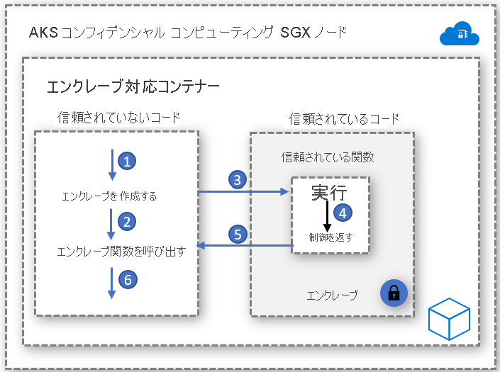

# エンクレーブ対応コンテナー

エンクレーブは、データとコード実行の機密性を確保する保護されたメモリ領域です。 ハードウェアによって保護された信頼できる実行環境 (Trusted Execution Environment: TEE) のインスタンスとなります。 AKS 上のコンフィデンシャル コンピューティング ノードは、[Intel Software Guard Extensions (SGX)](https://software.intel.com/sgx) を使用して、そのノード内のコンテナー アプリケーション間に、隔離されたエンクレーブ環境を作成します。

Intel SGX 仮想マシンと同様、エンクレーブで実行するように開発されたコンテナー アプリケーションには、次の 2 つのコンポーネントがあります。

- 信頼されていないコンポーネント ("ホスト" と呼ばれます)
- 信頼されたコンポーネント ("エンクレーブ" と呼ばれます)

エンクレーブ対応コンテナー アプリケーションのアーキテクチャにより、エンクレーブ内のコード フットプリントを小さく保ちながら、最大限に実装を制御することができます。 エンクレーブ内で実行されるコードを最小限に抑えることで、攻撃面が小さくなるという効果があります。   

## 実現の鍵

### Enclave SDK を開く
Open Enclave SDK は、ハードウェアベースの Trusted Execution Environment を利用した C (または C++) アプリケーションを開発するための、ハードウェアに依存しないオープンソース ライブラリです。 現在の実装では、Intel SGX のサポートに加え、[Arm TrustZone の OP-TEE OS](https://optee.readthedocs.io/en/latest/general/about.html) のプレビュー サポートが提供されています。

Open Enclave ベースのコンテナー アプリケーション開発の基礎については、[こちら](https://github.com/openenclave/openenclave/tree/master/docs/GettingStartedDocs)を参照してください。

### Intel SGX SDK
Intel は、Linux と Windows の両方のコンテナー ワークロードについて、SGX アプリケーションを作成するためのソフトウェア開発キットを整備しています。 現在、AKS コンフィデンシャル コンピューティング ノードでは、Windows コンテナーはサポートされません。

Intel SGX ベースのアプリケーション開発の基礎については、[こちら](https://software.intel.com/content/www/us/en/develop/topics/software-guard-extensions/sdk.html)を参照してください。

### Confidential Consortium Framework (CCF)
Confidential Consortium Framework (CCF) は、マルチパーティーのコンピューティングとデータを視野に、安全で可用性とパフォーマンスに優れた新たな境地のアプリケーションを作成するためのオープンソース フレームワークです。 CCF は、企業が掲げる主要な要件を満たす、高スケールな機密のネットワークを実現し、コンソーシアム ベースのブロックチェーンやマルチパーティー コンピューティング テクノロジの運用と企業による導入を促進する手立てとなります。

Azure コンフィデンシャル コンピューティングと CCF を使った開発の基礎については、[こちら](https://github.com/Microsoft/CCF)を参照してください。

### 機密推論 ONNX Runtime

オープン ソースのエンクレーブベース ONNX ランタイムは、クライアントと推論サービスとの間に安全なチャネルを確立し、要求と応答がどちらも、安全なエンクレーブの外に出られないようにするものです。 

このソリューションにより、ML トレーニング済みの既存のモデルを取り入れ、機密性を保った状態で実行する一方、構成証明と検証を通じてクライアントとサーバーとの間の信頼を確保することができます。 

ONNX Runtime への ML モデルのリフトアンドシフトの概要については、[こちら](https://aka.ms/confidentialinference)を参照してください。

### Edgeless RT

Edgeless RT は、Open Enclave SDK をベースに作成されたオープンソース プロジェクトです。 Go や新たな C++ 機能のサポートが追加されています。 [こちら](https://github.com/edgelesssys/edgelessrt)から、使い慣れた VS Code 環境を使用して、機密性を確保した簡単な Go アプリケーションを体験してみましょう。 AKS における Edgeless アプリケーションについては、[こちら](https://github.com/edgelesssys/edgelessrt/blob/master/docs/ERTAzureAKSDeployment.md)の手順に従ってください。

## コンテナー ベースのサンプル実装

[AKS におけるエンクレーブ対応コンテナーの Azure サンプル](https://github.com/Azure-Samples/confidential-computing/tree/main/containersamples)

<!-- LINKS - external -->
[Azure Attestation](../attestation/overview.md)

<!-- LINKS - internal -->
[DC 仮想マシン](./virtual-machine-solutions.md)
の[機密コンテナー](./confidential-containers.md)