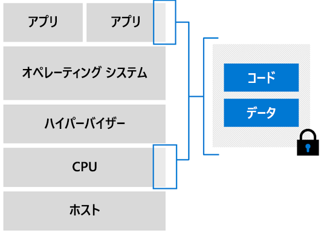

# Azure におけるコンフィデンシャル コンピューティング

Azure Confidential Computing を使用すると、機密データがクラウドで処理されている間も、そのデータを隔離することができます。 多くの業界で、そのデータを保護するために、コンフィデンシャル コンピューティングが使用されています。 以下は、そうしたワークロードの例です。

- 財務データをセキュリティで保護する
- 患者の情報を保護する
- 機密情報に対して機械学習処理を実行する
- 複数ソースからの暗号化されたデータ セットに対してアルゴリズムを実行する

## 概要

> [!VIDEO https://www.youtube.com/embed/rT6zMOoLEqI]

Microsoft は、お客様のクラウド データをセキュリティで保護することの重要性を認識しています。 お客様からの不安の声も届いています。 機密性の高いワークロードをクラウドに移すにあたってお客様が抱く可能性のある疑問を何点かだけ挙げてみます。 

- 暗号化されていないデータに Microsoft がアクセスできないことを確かめるには、どうすればよいか。
- 自社内の特権管理者からのセキュリティ上の脅威を防ぐにはどうすればよいか。
- 機密性の高い顧客データにサードパーティがアクセスできないようにするために、他にどのような方法があるか。

Microsoft Azure なら、攻撃面を最小限に抑え、より強固なデータ保護を実現するのに役立ちます。 Azure には、クライアント側暗号化やサーバー側暗号化などのモデルを使用して[**保存データ**](../security/fundamentals/encryption-atrest.md)を保護するさまざまなツールが既に用意されています。 さらに、TLS や HTTPS といった安全なプロトコルを通じて、[**転送中のデータ**](../security/fundamentals/data-encryption-best-practices.md#protect-data-in-transit)を暗号化するメカニズムも備わっています。 このページで紹介するのは、第 3 のデータ暗号化、つまり**使用中のデータ**の暗号化です。

## コンフィデンシャル コンピューティングの概要

コンフィデンシャル コンピューティングは、コンフィデンシャル コンピューティングを定義し、その導入を促進することに特化した団体である [Confidential Computing Consortium](https://confidentialcomputing.io/) (CCC) によって定義された業界用語です。 CCC は、ハードウェアベースの信頼できる実行環境 (TEE) で計算を実行することによる使用中のデータの保護として、コンフィデンシャル コンピューティングを定義しています。

TEE は、承認されたコードのみが実行されるよう強制する環境です。 TEE 内のデータを、その環境外のコードで読み取ったり改ざんしたりすることはできません。

### エンクレーブ

エンクレーブは、ハードウェアのプロセッサやメモリの、セキュリティで保護された部分です。 デバッガーを使用しても、エンクレーブ内のデータやコードを表示することはできません。 信頼されていないコードがエンクレーブ メモリの内容を変更しようとすると、環境が無効になって操作が拒否されます。

アプリケーションの開発時には、[ソフトウェア ツール](#oe-sdk)を使用して、エンクレーブ内に一部のコードとデータを隠蔽することができます。 信頼された環境の外からはだれもコードとデータを表示したり変更したりできないよう、これらのツールによって保護されます。 

基本的に、エンクレーブはブラック ボックスと考えてください。 暗号化されたコードとデータは、箱の中に置くことになります。 箱の外からは何も見えません。 データを取り出す際は、まずデータの暗号化を解除するためのキーをエンクレーブに与えます。その後データは処理され、再び暗号化したうえで、エンクレーブから取り出されます。

### 構成証明

信頼された環境が本当に安全であるかを検証しなければなりません。 この検証が構成証明のプロセスです。 

証明書利用者は、構成証明を通じて、ソフトウェアが (1) エンクレーブで実行されていること、また (2) エンクレーブが最新かつ安全であることについて、より強い確信を得ることができます。 たとえばエンクレーブは、基になるハードウェアに対し、エンクレーブが確かにそのプラットフォーム上に存在することの証明を含んだ資格情報を生成するよう要求します。 そのレポートを別のエンクレーブに渡し、そこで、レポートが同じプラットフォーム上で生成されたことを確認できます。

構成証明は、システムのソフトウェアや半導体に適合した安全な構成証明サービスを使用して実装する必要があります。 [Intel の構成証明サービスとプロビジョニング サービス](https://software.intel.com/sgx/attestation-services)は、Azure Confidential Computing 仮想マシンに適合しています。

## クラウドベースのコンフィデンシャル コンピューティングに Azure を使用する

Azure Confidential Computing を使用すると、コンフィデンシャル コンピューティングの機能を仮想環境で活用することができます。 安全なハードウェア上で、ツール、ソフトウェア、クラウド インフラストラクチャを使用してビルドを行うことができます。 

### Virtual Machines

Azure は、仮想環境でコンフィデンシャル コンピューティングを提供する初めてのクラウド プロバイダーです。 Microsoft は、ハードウェアとアプリケーションの間の抽象化レイヤーとしての機能を果たす仮想マシンを開発してきました。 必要に応じて冗長性と可用性を確保しつつ、ワークロードを大規模に実行することができます。  

#### Intel SGX 対応の仮想マシン

Azure Confidential Computing の仮想マシンでは、CPU ハードウェアの一部が、アプリケーション内の一部のコードとデータ用に予約されています。 この制限された領域がエンクレーブです。 

Azure Confidential Computing インフラストラクチャは現在、特殊な SKU の仮想マシン (VM) で構成されています。 これらの VM は、Software Guard Extension (Intel SGX) を搭載した Intel プロセッサ上で動作します。 [Intel SGX](https://intel.com/sgx) は、コンフィデンシャル コンピューティングの核となる保護機能の強化を実現するコンポーネントです。 

現在 Azure では、ハードウェアベースのエンクレーブ作成用に、Intel SGX テクノロジを基盤とする [DCsv2 シリーズ](https://docs.microsoft.com/azure/virtual-machines/dcv2-series)を提供しています。 DCsv2 シリーズの VM で動作するセキュア エンクレーブベースのアプリケーションを構築すれば、アプリケーションのデータとコードをその使用中に保護することができます。 

ハードウェアベースの信頼できるエンクレーブを使用した Azure Confidential Computing 仮想マシンのデプロイについて、[詳しい情報](virtual-machine-solutions.md)をご覧いただけます。

## アプリケーション開発

エンクレーブおよび隔離された環境の利点を活用するには、コンフィデンシャル コンピューティングをサポートするツールを使用する必要があります。 エンクレーブ アプリケーション開発をサポートするさまざまなツールが存在します。 たとえば、次のオープンソース フレームワークを使用できます。 

- [Open Enclave Software Development Kit (SDK)](https://github.com/openenclave/openenclave)
- [Confidential Consortium Framework (CCF)](https://github.com/Microsoft/CCF)

### 概要

エンクレーブを使用して構築されたアプリケーションは、次の 2 つの観点からパーティション分割されます。
1. "信頼されていない" コンポーネント (ホスト)
1. "信頼された" コンポーネント (エンクレーブ)

**ホスト**は、エンクレーブ アプリケーションが実行されている、信頼されていない環境です。 ホストで展開されているエンクレーブ コードには、ホストからアクセスすることはできません。 

**エンクレーブ**は、アプリケーション コード、およびキャッシュされたそのデータおよびメモリが実行される場所です。 シークレットと機密データを常に保護された状態にするために、安全な計算はエンクレーブ内で実行する必要があります。 

アプリケーションの設計時に、アプリケーションのどの部分をエンクレーブで実行する必要があるかを特定して、決定することが重要です。 信頼されたコンポーネントに配置したコードは、アプリケーションの他の部分から隔離されます。 エンクレーブが初期化されてコードがメモリに読み込まれた後は、信頼されていない環境から、そのコードを読み取ったり、変更したりすることはできなくなります。 

### Open Enclave Software Development Kit (OE SDK) 

エンクレーブ内で実行されるコードを記述するには、ご利用のプロバイダーによってサポートされているライブラリまたはフレームワークを使用します。 [Open Enclave SDK](https://github.com/openenclave/openenclave) (OE SDK) は、コンフィデンシャル コンピューティングに対応したさまざまなハードウェアに対する抽象化を可能にするオープンソースの SDK です。 

OE SDK は、あらゆる CSP のハードウェアに対する単一の抽象化レイヤーとして構築されています。 Azure Confidential Computing 仮想マシン上で OE SDK を使用して、エンクレーブ上にアプリケーションを作成、実行することができます。

## 次のステップ

DCsv2 シリーズの仮想マシンをデプロイし、そこに OE SDK をインストールします。

> [!div class="nextstepaction"]
> [Azure Marketplace でコンフィデンシャル コンピューティング VM をデプロイする](quick-create-marketplace.md)