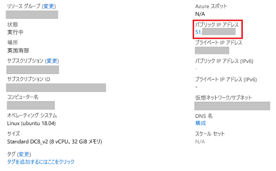

# <a name="quickstart-deploy-an-azure-confidential-computing-vm-in-the-marketplace"></a>クイック スタート:Marketplace で Azure Confidential Computing VM をデプロイする

Intel SGX を使用した仮想マシン (VM) を Azure Marketplace から作成して、Azure Confidential Computing を体験してみましょう。 さらに、Open Enclave Software Development Kit (SDK) をインストールして開発環境をセットアップします。 

このチュートリアルは、コンフィデンシャル コンピューティング仮想マシンのデプロイをすぐに始めたい方にお勧めします。 これらの VM は特殊なハードウェア上で実行されます。意図したとおりに実行するためには特定の構成を入力する必要があります。 このクイックスタートで説明されているマーケットプレース オファリングを使用すれば、ユーザー入力が少なくて済み、デプロイの難易度が下がります。

よりカスタマイズされた構成でのコンフィデンシャル コンピューティング仮想マシンのデプロイに関心がある方は、[Azure portal で Confidential Compute 仮想マシンをデプロイする手順](quick-create-portal.md)に従ってください。

## <a name="prerequisites"></a>前提条件

Azure サブスクリプションをお持ちでない場合は、始める前に[アカウントを作成](https://azure.microsoft.com/pricing/purchase-options/pay-as-you-go/)してください。

> [!NOTE]
> 無料試用版アカウントでは、このチュートリアルで使用されている仮想マシンを利用できません。 従量課金制サブスクリプションにアップグレードしてください。

## <a name="sign-in-to-azure"></a>Azure へのサインイン

1. [Azure portal](https://portal.azure.com/) にサインインします。

1. 上部の検索バーに「**Azure confidential computing**」と入力します。

1. **[Marketplace]** セクションで **[Azure confidential computing (Virtual Machine)]** を選択します。 

    ![[Marketplace] の選択](media/quick-create-marketplace/portal-search-marketplace.png)    

1. Azure Confidential Computing デプロイのランディング ページで、 **[作成]** を選択します。
 

## <a name="configure-your-virtual-machine"></a>仮想マシンを構成する

1. **[基本]** タブで、**サブスクリプション**と**リソース グループ**を選択します。 このテンプレートからリソース グループに仮想マシンをデプロイするには、リソース グループが空であることが必要です。

1. 次の値を入力または選択します。

   * **[リージョン]** :適切な Azure リージョンを選択します。

        > [!NOTE]
        > コンフィデンシャル コンピューティング仮想マシンを実行できるのは、特定のリージョンにある特殊なハードウェアのみです。 DCsv2 シリーズ VM が利用できる最新のリージョンについては、[リージョン別の提供状況](https://azure.microsoft.com/global-infrastructure/services/?products=virtual-machines)に関するページを参照してください。
    
    * **イメージを選択する**: イメージを選択します。 このチュートリアルに沿って作業を行いたい場合は、Ubuntu 18.04 (Gen 2) を選択してください。 それ以外の場合は、以降の手順で適宜、対応する指示に従ってください。 

    * **[仮想マシン名]** に、新しい VM の名前を入力します。

    * **[認証の種類]** : Linux VM を作成する場合は、 **[SSH 公開キー]** を選択します。 

         > [!NOTE]
         > 認証には、SSH 公開キーまたはパスワードを使用する選択肢があります。 安全性が高いのは SSH です。 SSH キーを生成する方法の手順については、[Azure の Linux VM と Mac for Linux VM に SSH キーを作成する方法](https://docs.microsoft.com/azure/virtual-machines/virtual-machines-linux-mac-create-ssh-keys)に関するページを参照してください。

    * **[ユーザー名]** : VM の管理者名を入力します。

    * **[SSH 公開キー]** : 該当する場合は、RSA 公開キーを入力します。
    
    * **パスワード**:該当する場合は、認証のパスワードを入力します。
 
1. ページの下部にある **[次へ: 仮想マシンの設定]** ボタンを選択します。

    > [!IMPORTANT]
    > ページが更新されるのを待ちます。 "Confidential Computing DCsv2-series VMs are available in a limited number of regions. (Confidential Computing DCsv2 シリーズ VM は限られたリージョンでのみご利用いただけます)" というメッセージが表示されるのは、正しい状態では "*ありません*"。 このメッセージが表示される場合は、前のページに戻って、利用可能な DCsv2 シリーズ リージョンを選択してください。

1. **[サイズの変更]** で、コンフィデンシャル コンピューティング機能を備えた VM をサイズ セレクターで選択します。 

    > [!TIP]
    > **DC1s_v2**、**DC2s_v2**、**DC4s_V2**、**DC8_v2** の各サイズが表示されます。 現在、コンフィデンシャル コンピューティングがサポートされているのは、これらの仮想マシン サイズのみです。 [詳細については、こちらを参照してください](virtual-machine-solutions.md)。

1. **[OS ディスクの種類]** で、ディスクの種類を選択します。

1. **[仮想ネットワーク]** で、新しいリソースを作成するか、既存のリソースを選択します。

1. **[サブネット]** で、新しいリソースを作成するか、既存のリソースを選択します。

1. **[パブリック受信ポートを選択]** で、**SSH (Linux) または RDP (Windows)** を選択します。 このクイックスタートでは、VM に接続し、Open Enclave SDK の構成を行うために、この手順が必要となります。 

1. **[ブート診断]** は、このクイックスタートでは無効のままにします。 

1. **[Review + create]\(レビュー + 作成\)** を選択します。

1. **[確認および作成]** ウィンドウで、 **[作成]** を選択します。

> [!NOTE]
> Linux VM をデプロイした方は、次のセクションに進んで、引き続きこのチュートリアルの作業を行ってください。 Windows VM をデプロイした方は、[こちらの手順に従って Windows VM に接続](../virtual-machines/windows/connect-logon.md)し、[Windows に OE SDK をインストール](https://github.com/openenclave/openenclave/blob/master/docs/GettingStartedDocs/install_oe_sdk-Windows.md)してください。


## <a name="connect-to-the-linux-vm"></a>Linux VM に接続する

BASH シェルを既に使用している場合、**ssh** コマンドを使用して Azure VM に接続します。 次のコマンドの VM ユーザー名と IP アドレスを置き換えて、Linux VM に接続します。

```bash
ssh azureadmin@40.55.55.555
```

ご利用の VM のパブリック IP アドレスは、Azure portal から、仮想マシンの [概要] セクションにアクセスして確認できます。



Windows を使用していて BASH シェルがない場合は PuTTY などの SSH クライアントをインストールします。

1. [PuTTY をダウンロードしてインストールします](https://www.chiark.greenend.org.uk/~sgtatham/putty/download.html)。

1. PuTTY を実行します。

1. PuTTY の構成画面で、VM のパブリック IP アドレスを入力します。

1. **[Open]\(開く\)** を選択し、プロンプトでユーザー名とパスワードを入力します。

Linux VM への接続の詳細については、[ポータルを使用して Azure に Linux VM を作成する方法](../virtual-machines/linux/quick-create-portal.md)に関するページを参照してください。

> [!NOTE]
> サーバーのホストキーがレジストリにキャッシュされていないことを示す PuTTY のセキュリティ アラートが表示された場合は、次のオプションから選択します。 このホストを信頼する場合は、 **[Yes]\(はい\)** を選択して PuTTy のキャッシュにキーを追加し、接続を続行します。 キーをキャッシュに追加せずに接続を 1 回だけ実行する場合は、 **[No]\(いいえ\)** を選択します。 このホストを信頼しない場合は、 **[Cancel]\(キャンセル\)** を選択して接続を破棄します。

## <a name="install-the-open-enclave-sdk-oe-sdk"></a>Open Enclave SDK (OE SDK) をインストールする <a id="Install"></a>

Ubuntu 18.04 LTS Gen 2 イメージが実行されている DCsv2 シリーズ仮想マシンに対し、手順に従って [OE SDK](https://github.com/openenclave/openenclave) をインストールします。 

仮想マシンが Ubuntu 16.04 LTS Gen 2 で実行されている場合は、[Ubuntu 16.04 のインストール手順](https://github.com/openenclave/openenclave/blob/master/docs/GettingStartedDocs/install_oe_sdk-Ubuntu_16.04.md)に従う必要があります。 

#### <a name="1-configure-the-intel-and-microsoft-apt-repositories"></a>1.Intel と Microsoft APT のリポジトリを構成する

```bash
echo 'deb [arch=amd64] https://download.01.org/intel-sgx/sgx_repo/ubuntu bionic main' | sudo tee /etc/apt/sources.list.d/intel-sgx.list
wget -qO - https://download.01.org/intel-sgx/sgx_repo/ubuntu/intel-sgx-deb.key | sudo apt-key add -

echo "deb http://apt.llvm.org/bionic/ llvm-toolchain-bionic-7 main" | sudo tee /etc/apt/sources.list.d/llvm-toolchain-bionic-7.list
wget -qO - https://apt.llvm.org/llvm-snapshot.gpg.key | sudo apt-key add -

echo "deb [arch=amd64] https://packages.microsoft.com/ubuntu/18.04/prod bionic main" | sudo tee /etc/apt/sources.list.d/msprod.list
wget -qO - https://packages.microsoft.com/keys/microsoft.asc | sudo apt-key add -
```

#### <a name="2-install-the-intel-sgx-dcap-driver"></a>2.Intel SGX DCAP ドライバーをインストールする

```bash
sudo apt update
sudo apt -y install dkms
wget https://download.01.org/intel-sgx/sgx-dcap/1.4/linux/distro/ubuntuServer18.04/sgx_linux_x64_driver_1.21.bin -O sgx_linux_x64_driver.bin
chmod +x sgx_linux_x64_driver.bin
sudo ./sgx_linux_x64_driver.bin
```

> [!WARNING]
> [Intel の SGX サイト](https://01.org/intel-software-guard-extensions/downloads)から入手できる最新の Intel SGX DCAP ドライバーを使用してください。

#### <a name="3-install-the-intel-and-open-enclave-packages-and-dependencies"></a>3.Intel と Open Enclave のパッケージと依存関係をインストールする

```bash
sudo apt -y install clang-7 libssl-dev gdb libsgx-enclave-common libsgx-enclave-common-dev libprotobuf10 libsgx-dcap-ql libsgx-dcap-ql-dev az-dcap-client open-enclave
```

> [!NOTE] 
> Azure でリモート構成証明を実行するために必要な [az-dcap-client](https://github.com/microsoft/azure-dcap-client) パッケージも、この手順でインストールします。

#### <a name="4-verify-the-open-enclave-sdk-install"></a>4.**Open Enclave SDK のインストールを確認する**

インストールした SDK の確認と使用については、GitHub で [Open Enclave SDK の使用](https://github.com/openenclave/openenclave/blob/master/docs/GettingStartedDocs/Linux_using_oe_sdk.md)に関するページを参照してください。

## <a name="clean-up-resources"></a>リソースをクリーンアップする

必要がなくなったら、リソース グループ、仮想マシン、およびすべての関連リソースを削除できます。 

仮想マシンのリソース グループを選択し、 **[削除]** をクリックします。 リソース グループの名前を確認してリソースの削除を終了します。

## <a name="next-steps"></a>次のステップ

このクイックスタートでは、コンフィデンシャル コンピューティング仮想マシンをデプロイし、Open Enclave SDK をインストールしました。 Azure におけるコンフィデンシャル コンピューティング仮想マシンの詳細については、「[仮想マシン上のソリューション](virtual-machine-solutions.md)」を参照してください。 

Windows VM をデプロイした場合は、GitHub の [Windows 用 OE SDK サンプル](https://github.com/openenclave/openenclave/blob/master/samples/README_Windows.md)で、アプリケーションの作成方法をご覧ください。 

Linux 上のコンフィデンシャル コンピューティング アプリケーションを作成する方法については、引き続き GitHub の Open Enclave SDK Linux サンプルをご覧ください。 

> [!div class="nextstepaction"]
> [Linux で Open Enclave SDK サンプルを作成する](https://github.com/openenclave/openenclave/blob/master/samples/README_Linux.md)
