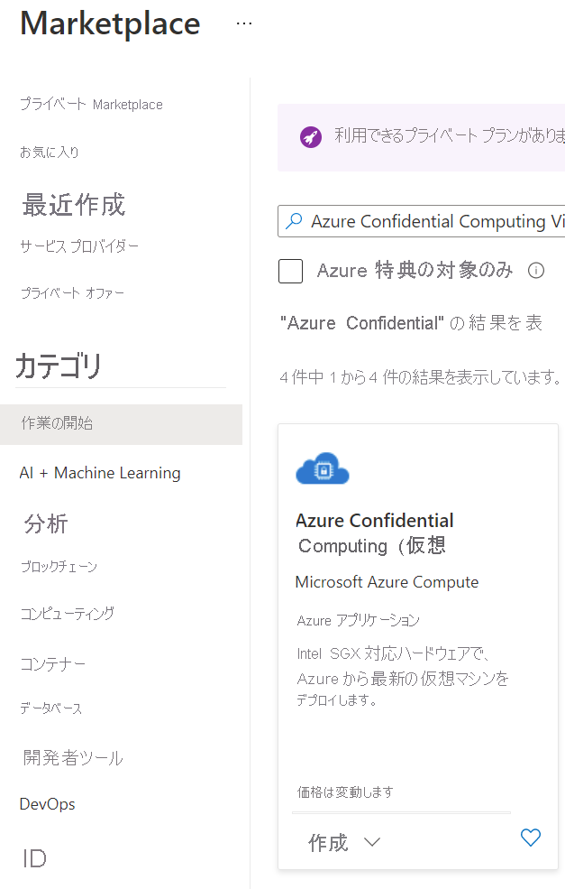
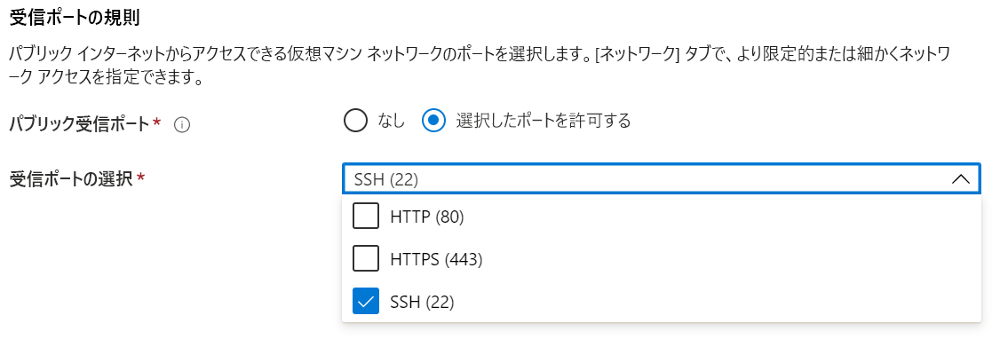

# <a name="quickstart-create-intel-sgx-vm-in-the-azure-marketplace"></a>クイック スタート: Azure Marketplace で Intel SGX VM を作成する

このチュートリアルでは、Azure Marketplace を使用して Intel SGX VM をデプロイするプロセスについて順を追って説明します。 それ以外の場合は、[ポータルまたは CLI を使用する](quick-create-portal.md) VM のデプロイ フローに従うことをお勧めします。

## <a name="prerequisites"></a>前提条件

Azure サブスクリプションをお持ちでない場合は、始める前に[アカウントを作成](https://azure.microsoft.com/pricing/purchase-options/pay-as-you-go/)してください。

> [!NOTE]
> 無料試用版アカウントでは、このチュートリアルで使用されている VM を利用できません。 従量課金制サブスクリプションにアップグレードしてください。


## <a name="sign-in-to-azure"></a>Azure へのサインイン

1. [Azure portal](https://portal.azure.com/) にサインインします。

1. 一番上にある **[+ リソースの作成]** を選択します。

1. **[Get Started]\(作業の開始\)** の既定のペインで、 **[Azure Confidential Computing (Virtual Machine)]\(Azure Confidential Computing (仮想マシン)\)** を検索します。

1. **[Azure Confidential Computing (Virtual Machine)]\(Azure Confidential Computing (仮想マシン)\)** テンプレートをクリックします。

    

1. 仮想マシンのランディング ページで、 **[作成]** を選択します。


## <a name="configure-an-intel-sgx-virtual-machine"></a>Intel SGX 仮想マシンを構成する

1. **[基本]** タブで、対象の **サブスクリプション** と **リソース グループ** を選択します (このテンプレートをデプロイするには、グループが空になっている必要があります)。

1. **[仮想マシン名]** に、新しい VM の名前を入力します。

1. 次の値を入力または選択します。

   * **[リージョン]** :適切な Azure リージョンを選択します。

        > [!NOTE]
        > Intel SGX VM は、特定のリージョンの特殊なハードウェア上で実行されます。 最新のリージョンの可用性については、[利用可能なリージョン](https://azure.microsoft.com/global-infrastructure/services/?products=virtual-machines)で DCsv2 シリーズまたは DCsv3/DCdsv3 シリーズを探してください。

1. 仮想マシンに使用するオペレーティング システム イメージを構成します。 この設定では、Gen 2 の VM とイメージのデプロイのみがサポートされます

    * **[イメージの選択]** : このチュートリアルでは、Ubuntu 20.04 LTS (第 2 世代) を選択します。 Windows Server Datacenter 2019、または Ubuntu 18.04 LTS を選択することもできます。 そのように選択した場合は、このチュートリアルの中で適宜、対応する指示に従ってください。
   
1. [基本] タブで、次の情報を入力します。

   * **[認証の種類]** : Linux VM を作成する場合は、 **[SSH 公開キー]** を選択します。 

        > [!NOTE]
        > 認証には、SSH 公開キーまたはパスワードを使用する選択肢があります。 安全性が高いのは SSH です。 SSH キーを生成する方法の手順については、[Azure の Linux VM と Mac for Linux VM に SSH キーを作成する方法](../virtual-machines/linux/mac-create-ssh-keys.md)に関するページを参照してください。

    * **[ユーザー名]** : VM の管理者名を入力します。

    * **[SSH 公開キー]** : 該当する場合は、RSA 公開キーを入力します。
    
    * **パスワード**:該当する場合は、認証のパスワードを入力します。
    
1. [Virtual Machine Settings]\(仮想マシンの設定\) タブで、次の情報を入力します。

   * VM の SKU サイズを選択します
   * **DCsv2-series** は **Standard SSD** をサポートし、**Premium SSD** は DC1、DC2、DC4 でサポートされます。 
   * **DCsv3 シリーズと DCdsv3 シリーズ** は、**Standard SSD**、**Premium SSD**、**Ultra Disk** をサポートします
   
   * **[パブリック受信ポート]** : **[選択したポートを許可する]** を選択し、 **[パブリック受信ポートを選択]** ボックスの一覧で **[SSH (22)]** と **[HTTP (80)]** を選択します。 Windows VM をデプロイしている場合は、 **[HTTP (80)]** と **[RDP (3389)]** を選択してください。 このクイックスタートでは、VM に接続するためにこの手順が必要です。
   
    >[!Note]
    > 運用環境のデプロイでは、RDP または SSH ポートの許可は推奨されません。  

     


1. 必要に応じて、 **[監視]** オプションを選択します

1. **[Review + create]\(レビュー + 作成\)** を選択します。

1. **[確認および作成]** ウィンドウで、 **[作成]** を選択します。

> [!NOTE]
> Linux VM をデプロイした方は、次のセクションに進んで、引き続きこのチュートリアルの作業を行ってください。 Windows VM をデプロイした方は、[こちらの手順に従って対象の Windows VM に接続](../virtual-machines/windows/connect-logon.md)してください


## <a name="connect-to-the-linux-vm"></a>Linux VM に接続する

BASH シェルを既に使用している場合、**ssh** コマンドを使用して Azure VM に接続します。 次のコマンドの VM ユーザー名と IP アドレスを置き換えて、Linux VM に接続します。

```bash
ssh azureadmin@40.55.55.555
```

ご利用の VM のパブリック IP アドレスは、Azure portal から、仮想マシンの [概要] セクションにアクセスして確認できます。

:::image type="content" source="media/quick-create-portal/public-ip-virtual-machine.png" alt-text="Azure portal での IP アドレス":::

Windows を使用していて BASH シェルがない場合は PuTTY などの SSH クライアントをインストールします。

1. [PuTTY をダウンロードしてインストールします](https://www.chiark.greenend.org.uk/~sgtatham/putty/download.html)。

1. PuTTY を実行します。

1. PuTTY の構成画面で、VM のパブリック IP アドレスを入力します。

1. **[Open]\(開く\)** を選択し、プロンプトでユーザー名とパスワードを入力します。

Linux VM への接続の詳細については、[ポータルを使用して Azure に Linux VM を作成する方法](../virtual-machines/linux/quick-create-portal.md)に関するページを参照してください。

> [!NOTE]
> サーバーのホストキーがレジストリにキャッシュされていないことを示す PuTTY のセキュリティ アラートが表示された場合は、次のオプションから選択します。 このホストを信頼する場合は、 **[Yes]\(はい\)** を選択して PuTTy のキャッシュにキーを追加し、接続を続行します。 キーをキャッシュに追加せずに接続を 1 回だけ実行する場合は、 **[No]\(いいえ\)** を選択します。 このホストを信頼しない場合は、 **[Cancel]\(キャンセル\)** を選択して接続を破棄します。

## <a name="intel-sgx-drivers"></a>Intel SGX ドライバー

> [!NOTE]
> Intel SGX ドライバーは、既に Ubuntu & Windows ギャラリー イメージの一部として含まれています。 最新のドライバーを使用していることを確認するには、[Intel SGX DCAP ドライバーの一覧](https://01.org/intel-software-guard-extensions/downloads)をご覧ください。

## <a name="clean-up-resources"></a>リソースをクリーンアップする

必要がなくなったら、リソース グループ、仮想マシン、およびすべての関連リソースを削除できます。 

仮想マシンのリソース グループを選択し、 **[削除]** をクリックします。 リソース グループの名前を確認してリソースの削除を終了します。

## <a name="next-steps"></a>次のステップ

このクイックスタートでは、Intel SGX VM をデプロイしてこれに接続しました。 詳細については、「[仮想マシン上のソリューション](virtual-machine-solutions-sgx.md)」を参照してください。 

コンフィデンシャル コンピューティング アプリケーションを作成する方法については、引き続き GitHub の Open Enclave SDK サンプルをご覧ください。 

> [!div class="nextstepaction"]
> [Open Enclave SDK サンプルを作成する](https://github.com/openenclave/openenclave/blob/master/samples/README.md)
