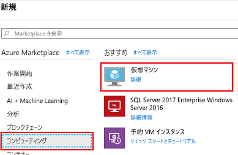
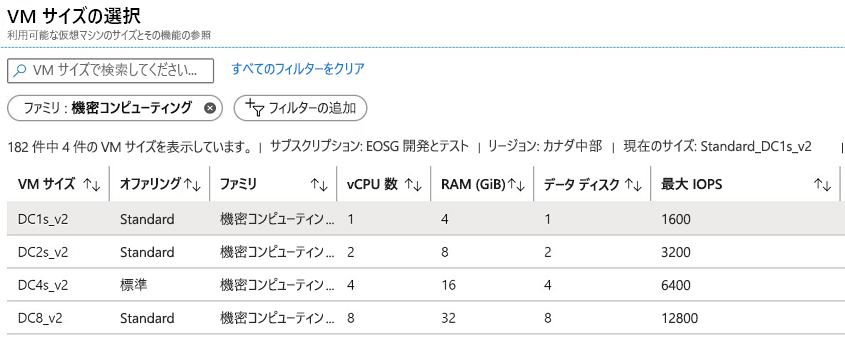

# <a name="quickstart-create-intel-sgx-vm-in-the-azure-portal"></a>クイック スタート - Azure portal で Intel SGX VM を作成する

このチュートリアルでは、Azure portal を使用して Intel SGX VM をデプロイするプロセスについて手順を追って説明します。 それ以外の場合は、次の [Azure Marketplace](quick-create-marketplace.md) テンプレートをお勧めします。

## <a name="prerequisites"></a>前提条件

Azure サブスクリプションをお持ちでない場合は、始める前に[アカウントを作成](https://azure.microsoft.com/pricing/purchase-options/pay-as-you-go/)してください。

> [!NOTE]
> 無料試用版アカウントでは、このチュートリアルで使用されている VM を利用できません。 従量課金制サブスクリプションにアップグレードしてください。


## <a name="sign-in-to-azure"></a>Azure へのサインイン

1. [Azure Portal](https://portal.azure.com/) にサインインします。

1. 一番上にある **[+ リソースの作成]** を選択します。

1. 左側のウィンドウで、 **[コンピューティング]** を選択します。

1. **[仮想マシンの作成]** を選択します。

    

## <a name="configure-an-intel-sgx-virtual-machine"></a>Intel SGX 仮想マシンを構成する

1. **[基本]** タブで、**サブスクリプション** と **リソース グループ** を選択します。

1. **[仮想マシン名]** に、新しい VM の名前を入力します。

1. 次の値を入力または選択します。

   * **[リージョン]** :適切な Azure リージョンを選択します。

        > [!NOTE]
        > Intel SGX VM は、特定のリージョンの特殊なハードウェア上で実行されます。 最新のリージョンの可用性については、[利用可能なリージョン](https://azure.microsoft.com/global-infrastructure/services/?products=virtual-machines)で DCsv2 シリーズまたは DCsv3/DCdsv3 シリーズを探してください。

1. 仮想マシンに使用するオペレーティング システム イメージを構成します。

    * **[イメージの選択]** : このチュートリアルでは、Ubuntu 20.04 LTS - Gen2 を選択します。 Ubuntu 18.04 LTS - Gen2 または Windows Server 2019 も選択できます。
    
    * **第 2 世代に更新する**: [イメージ] の下にある **[Configure VM generation]\(VM の世代の構成\)** を選択し、そのフライアウトで **[第 2 世代]** を選択します。
    
        


1. サイズ セレクターで **[サイズの変更]** を選択して、Intel SGX 機能を備えた仮想マシンを選択します。 仮想マシン サイズ セレクターで、 **[すべてのフィルターをクリア]** をクリックします。 **[フィルターの追加]** を選択し、フィルターの種類で **[ファミリー]** を選択して、 **[Confidential compute]\(コンフィデンシャル コンピューティング\)** のみを選択します。

    

    > [!TIP]
    > サイズ **DC(number)s_v2**、**DC(number)s_v3**、**DC(number)ds_v3** が表示されるはずです。 [詳細については、こちらを参照してください](virtual-machine-solutions-sgx.md)。

1. 次の情報を入力します。

   * **[認証の種類]** : Linux VM を作成する場合は、 **[SSH 公開キー]** を選択します。 

        > [!NOTE]
        > 認証には、SSH 公開キーまたはパスワードを使用する選択肢があります。 安全性が高いのは SSH です。 SSH キーを生成する方法の手順については、[Azure の Linux VM と Mac for Linux VM に SSH キーを作成する方法](../virtual-machines/linux/mac-create-ssh-keys.md)に関するページを参照してください。

    * **[ユーザー名]** : VM の管理者名を入力します。

    * **[SSH 公開キー]** : 該当する場合は、RSA 公開キーを入力します。
    
    * **パスワード**:該当する場合は、認証のパスワードを入力します。

    * **[パブリック受信ポート]** : **[選択したポートを許可する]** を選択し、 **[パブリック受信ポートを選択]** ボックスの一覧で **[SSH (22)]** と **[HTTP (80)]** を選択します。 Windows VM をデプロイしている場合は、 **[HTTP (80)]** と **[RDP (3389)]** を選択してください。  

    >[!Note]
    > 運用環境のデプロイでは、RDP または SSH ポートの許可は推奨されません。  

     


1. **[ディスク]** タブで変更を加えます。

   * **DCsv2-series** は **Standard SSD** をサポートし、**Premium SSD** は DC1、DC2、DC4 全体でサポートされます。 
   * **DCsv3 シリーズと DCdsv3 シリーズ** は、**Standard SSD**、**Premium SSD**、**Ultra Disk** をサポートします

1. 次のタブで、設定を変更するか、既定の設定をそのまま使用します。

    * **ネットワーク**
    * **管理**
    * **ゲストの構成**
    * **タグ**

1. **[Review + create]\(レビュー + 作成\)** を選択します。

1. **[確認および作成]** ウィンドウで、 **[作成]** を選択します。

> [!NOTE]
> Linux VM をデプロイした方は、次のセクションに進んで、引き続きこのチュートリアルの作業を行ってください。 Windows VM をデプロイした方は、[こちらの手順に従って Windows VM に接続](../virtual-machines/windows/connect-logon.md)し、[Windows に OE SDK をインストール](https://github.com/openenclave/openenclave/blob/master/docs/GettingStartedDocs/install_oe_sdk-Windows.md)してください。


## <a name="connect-to-the-linux-vm"></a>Linux VM に接続する

BASH シェルを既に使用している場合、**ssh** コマンドを使用して Azure VM に接続します。 次のコマンドの VM ユーザー名と IP アドレスを置き換えて、Linux VM に接続します。

```bash
ssh azureadmin@40.55.55.555
```

ご利用の VM のパブリック IP アドレスは、Azure portal から、仮想マシンの [概要] セクションにアクセスして確認できます。

:::image type="content" source="media/quick-create-portal/public-ip-virtual-machine.png" alt-text="Azure portal での IP アドレス":::

Windows を使用していて BASH シェルがない場合は PuTTY などの SSH クライアントをインストールします。

1. [PuTTY をダウンロードしてインストールします](https://www.chiark.greenend.org.uk/~sgtatham/putty/latest.html)。

1. PuTTY を実行します。

1. PuTTY の構成画面で、VM のパブリック IP アドレスを入力します。

1. **[Open]\(開く\)** を選択し、プロンプトでユーザー名とパスワードを入力します。

Linux VM への接続の詳細については、[ポータルを使用して Azure に Linux VM を作成する方法](../virtual-machines/linux/quick-create-portal.md)に関するページを参照してください。

> [!NOTE]
> サーバーのホストキーがレジストリにキャッシュされていないことを示す PuTTY のセキュリティ アラートが表示された場合は、次のオプションから選択します。 このホストを信頼する場合は、 **[Yes]\(はい\)** を選択して PuTTy のキャッシュにキーを追加し、接続を続行します。 キーをキャッシュに追加せずに接続を 1 回だけ実行する場合は、 **[No]\(いいえ\)** を選択します。 このホストを信頼しない場合は、 **[Cancel]\(キャンセル\)** を選択して接続を破棄します。

## <a name="install-azure-dcap-client"></a>Azure DCAP クライアントをインストールする

> [!NOTE]
> Trusted Hardware Identity Management (THIM) は、さまざまな高信頼実行環境 (TEE) のハードウェア ID を管理するのに役立つ無料の Azure サービスです。 Intel Provisioning Certification Service (PCS) から関連情報をフェッチし、キャッシュします。 このサービスは、構成証明のために、Azure セキュリティ ベースラインとして最小の信頼されたコンピューティング ベース (TCB) レベルを適用します。 DCsv3 シリーズと DCdsv3 シリーズの Azure VM の場合、Intel 証明書は THIM からのみフェッチできます。VM から Intel サービスを直接呼び出せないためです。 

Intel® Xeon スケーラブル プロセッサのリリースによって、リモート構成証明サポートが変わります。 DCsv3 と DCdsv3 では [ECDSA ベースの構成証明](https://www.intel.com/content/www/us/en/developer/tools/software-guard-extensions/attestation-services.html)のみがサポートされ、ユーザーは、THIM とやりとりし、TEE コラテラルをフェッチして構成証明プロセスの間にクォートを生成するには [Azure DCAP](https://github.com/Microsoft/Azure-DCAP-Client) クライアントをインストールする必要があります。 DCsv2 では引き続き、[EPID ベースの構成証明](https://www.intel.com/content/www/us/en/developer/tools/software-guard-extensions/attestation-services.html)がサポートされます。 

## <a name="clean-up-resources"></a>リソースをクリーンアップする

必要がなくなったら、リソース グループ、仮想マシン、およびすべての関連リソースを削除できます。 

仮想マシンのリソース グループを選択し、 **[削除]** をクリックします。 リソース グループの名前を確認してリソースの削除を終了します。

## <a name="next-steps"></a>次のステップ

このクイックスタートでは、Intel SGX VM をデプロイしてこれに接続しました。 詳細については、「[仮想マシン上のソリューション](virtual-machine-solutions-sgx.md)」を参照してください。 

コンフィデンシャル コンピューティング アプリケーションを作成する方法については、引き続き GitHub の Open Enclave SDK サンプルをご覧ください。 

> [!div class="nextstepaction"]
> [Open Enclave SDK サンプルを作成する](https://github.com/openenclave/openenclave/blob/master/samples/README.md)

Microsoft Azure Attestation は無料であり、ECDSA ベースの構成証明フレームワークです。複数の TEE の信頼性とその中で実行されるバイナリの整合性をリモートで検証します。 [詳細情報](../attestation/overview.md)